# Amazon CloudWatch - Alarm Mute Rules

**リリース日**: 2026 年 2 月 10 日
**サービス**: Amazon CloudWatch
**機能**: Alarm Mute Rules

📊 [このアップデートのインフォグラフィックを見る](https://takech9203.github.io/aws-news-summary/20260210-amazon-cloudwatch-alarm-muting-rules.html)

## 概要

Amazon CloudWatch に Alarm Mute Rules が追加されました。この新機能により、計画的なデプロイメント、メンテナンスウィンドウ、業務時間外など、事前に把握しているイベント中にアラーム通知を一時的にミュートできるようになりました。モニタリングの可視性を維持しながら、アラート疲れを解消する機能です。

Alarm Mute Rules は、1 回限りまたは繰り返しのルールを作成でき、最大 100 個のアラームに対して OK、ALARM、INSUFFICIENT_DATA の各状態のアクションをミュートできます。ミュートルールが期限切れになった際、ミュートされていたアラームが依然として同じ状態にある場合は、アクションが自動的に再トリガーされるため、重要な問題を見逃すことがありません。

**アップデート前の課題**

- 計画メンテナンス中にアラーム通知を抑制するには、カスタムスクリプトや手動でのアラーム無効化が必要だった
- スクリプトベースの回避策を使用する場合、メンテナンス後にアラームの再有効化を忘れるリスクがあった
- デプロイメント中やオフピーク時間帯の非重要アラートにより、運用チームにアラート疲れが発生していた
- 定期的なメンテナンスウィンドウに対するアラーム制御の自動化手段がなかった

**アップデート後の改善**

- cron 式または at 式を使用して、1 回限りまたは繰り返しのミュートルールを宣言的に定義可能
- ミュート期間終了後、アラーム状態が継続している場合はアクションが自動再トリガーされるため、重要な問題を見逃さない
- 最大 100 個のアラームを 1 つのミュートルールで一括管理可能
- CloudWatch コンソール、CLI、SDK からミュートルールを管理可能

## アーキテクチャ図

```mermaid
flowchart TD
    subgraph CW["☁️ Amazon CloudWatch"]
        subgraph MuteRules["🔕 Alarm Mute Rules"]
            direction LR
            Cron["⏰ Cron 式<br/>繰り返しスケジュール"]
            At["📅 At 式<br/>1 回限りのスケジュール"]
            Cron ~~~ At
        end
        subgraph Alarms["🔔 CloudWatch Alarms"]
            direction LR
            A1["📊 Metric Alarm 1"]
            A2["📊 Metric Alarm 2"]
            A3["📊 Composite Alarm"]
            A1 ~~~ A2 ~~~ A3
        end
        subgraph Actions["⚡ アクション"]
            direction LR
            SNS["📧 SNS 通知"]
            ASG["📈 Auto Scaling"]
            EC2["🖥️ EC2 アクション"]
            SNS ~~~ ASG ~~~ EC2
        end
    end

    MuteRules -->|"ミュート期間中<br/>アクションを抑制"| Alarms
    Alarms -->|"ミュート解除後<br/>自動再トリガー"| Actions

    classDef cloud fill:none,stroke:#CCCCCC,stroke-width:2px,color:#666666
    classDef layer fill:none,stroke:#E1BEE7,stroke-width:2px,color:#666666
    classDef process fill:#FFFFFF,stroke:#4A90E2,stroke-width:2px,color:#333333
    classDef alarm fill:#FFF3E0,stroke:#FF9800,stroke-width:2px,color:#5D4037
    classDef action fill:#E8F1FF,stroke:#4A90E2,stroke-width:2px,color:#333333

    class CW cloud
    class MuteRules,Alarms,Actions layer
    class Cron,At process
    class A1,A2,A3 alarm
    class SNS,ASG,EC2 action
```



Alarm Mute Rules がアラームの評価を継続しながら、定義された時間ウィンドウ中にアクション実行のみを抑制する仕組みを示しています。ミュート期間終了後、アラームが依然として同じ状態であれば、アクションが自動的に再トリガーされます。

## サービスアップデートの詳細

### 主要機能

1. **ミュートルール定義**
   - cron 式による繰り返しスケジュール (例: 毎週日曜 2:00 AM から 4 時間)
   - at 式による 1 回限りのスケジュール (例: 特定日時から指定期間)
   - ISO-8601 形式で最小 1 分 (PT1M) から最大 15 日 (P15D) の期間指定
   - タイムゾーン指定に対応 (例: `America/Los_Angeles`、`Asia/Tokyo`)

2. **ターゲットアラーム管理**
   - 1 つのミュートルールで最大 100 個のアラームをターゲット指定
   - メトリクスアラームとコンポジットアラームの両方に対応
   - 同一 AWS アカウント・同一リージョン内のアラームが対象

3. **自動再トリガー機能**
   - ミュート期間終了時にアラームが依然として同じ状態 (OK、ALARM、INSUFFICIENT_DATA) であれば、ミュートされていたアクションが自動的に実行
   - アラームの評価はミュート期間中も継続的に実行
   - アラーム履歴にすべての状態変更が記録される

4. **ミュートルールステータス管理**
   - SCHEDULED: 将来アクティブになる予定のルール
   - ACTIVE: 現在アクティブでアクションをミュート中のルール
   - EXPIRED: 有効期限切れのルール (1 回限りのルールまたは終了日を過ぎた繰り返しルール)

## 技術仕様

### ミュートルールの属性

| 項目 | 詳細 |
|------|------|
| 式タイプ | cron 式 (繰り返し)、at 式 (1 回限り) |
| 最小期間 | 1 分 (PT1M) |
| 最大期間 | 15 日 (P15D) |
| 最大ターゲットアラーム数 | 100 個 / ルール |
| 対象アラームタイプ | MetricAlarm、CompositeAlarm |
| ミュート対象のアクション状態 | OK、ALARM、INSUFFICIENT_DATA すべて |
| タイムゾーン | 標準タイムゾーン識別子 (IANA) |

### API 変更履歴

| 日付 | サービス | 変更内容 |
|------|----------|----------|
| 2026/02/13 | [monitoring](https://awsapichanges.com/archive/changes/986db6-monitoring.html) | 2 updated api methods - `DescribeAlarms`、`DescribeAlarmsForMetric` に `EVALUATION_ERROR` と `EVALUATION_FAILURE` の新しい EvaluationState を追加 |

### 主要 API

| API | 用途 |
|-----|------|
| `PutAlarmMuteRule` | ミュートルールの作成・更新 |
| `DescribeAlarmMuteRules` | ミュートルールの一覧取得 |
| `DeleteAlarmMuteRule` | ミュートルールの削除 |

## 設定方法

### 前提条件

1. AWS アカウントと CloudWatch へのアクセス権限
2. ミュート対象のアラームが同一アカウント・同一リージョンに存在すること
3. AWS CLI v2 の最新バージョン (API 利用の場合)

### 手順

#### ステップ 1: ミュートルールの作成 (コンソール)

CloudWatch コンソールにアクセスし、左側のナビゲーションペインから「Alarms」>「Alarm Mute Rules」タブを選択します。「Create mute rule」をクリックして、ミュートルールの名前、スケジュール式、期間、ターゲットアラームを設定します。

#### ステップ 2: cron 式によるスケジュール定義

```bash
# 例: 毎週日曜 2:00 AM UTC から 4 時間ミュート
# cron 式: 0 2 * * SUN
# 期間: PT4H
# タイムゾーン: Asia/Tokyo
```

cron 式は標準的な 5 フィールド形式 (分 時 日 月 曜日) で指定します。繰り返しのメンテナンスウィンドウに適しています。

#### ステップ 3: at 式による 1 回限りのスケジュール定義

```bash
# 例: 2026 年 3 月 1 日 14:00 から 6 時間ミュート
# at 式: at(2026-03-01T14:00)
# 期間: PT6H
# タイムゾーン: Asia/Tokyo
```

at 式は計画されたメンテナンスやデプロイメントなど、1 回限りのイベントに適しています。

#### ステップ 4: AWS CLI でのミュートルール作成

```bash
aws cloudwatch put-alarm-mute-rule \
  --mute-rule-name "weekly-maintenance-mute" \
  --expression "0 2 * * SUN" \
  --duration "PT4H" \
  --timezone "Asia/Tokyo" \
  --target-alarm-names "alarm-1" "alarm-2" "alarm-3"
```

`put-alarm-mute-rule` API を使用して、指定したアラームに対するミュートルールをプログラム的に作成します。

## メリット

### ビジネス面

- **運用効率の向上**: アラート疲れを解消し、エンジニアリングチームが本来のビジネスイニシアチブに集中できる
- **運用リスクの低減**: カスタムスクリプトの作成・管理が不要になり、人的ミスによるアラーム再有効化忘れのリスクを排除
- **チーム生産性の改善**: 計画メンテナンス中の不要な通知を排除し、オンコールチームの負担を軽減

### 技術面

- **宣言的な設定**: cron 式と at 式により、Infrastructure as Code (IaC) との親和性が高い
- **自動再トリガー**: ミュート期間終了後もアラーム状態が継続している場合、自動的にアクションが実行されるため安全
- **監視の継続性**: ミュート期間中もアラームの評価は継続され、状態変更はアラーム履歴に記録される
- **粒度の細かい制御**: アラーム単位でのターゲット指定により、必要なアラームのみをミュート可能

## デメリット・制約事項

### 制限事項

- 1 つのミュートルールでターゲットできるアラームは最大 100 個
- ターゲットアラームは同一 AWS アカウント・同一リージョン内に限定
- ミュート期間の最大値は 15 日 (P15D)
- ミュートはアラーム全体のすべてのアクションに適用され、特定のアクションのみを選択的にミュートすることは不可

### 考慮すべき点

- ミュート中はすべてのアクション (OK、ALARM、INSUFFICIENT_DATA) がミュートされるため、重要なアラームのミュートは慎重に検討が必要
- クロスアカウントやクロスリージョンのアラームに対するミュートルールは個別に作成する必要がある

## ユースケース

### ユースケース 1: 定期メンテナンスウィンドウ

**シナリオ**: 毎週日曜日の深夜 2:00 から 4 時間のシステムメンテナンスウィンドウで、データベースのパッチ適用やサーバーの再起動を実施。メンテナンス中に CPU 使用率やレスポンスタイムのアラームが発報し、オンコールエンジニアに不要な通知が届いていた。

**実装例**:
```bash
aws cloudwatch put-alarm-mute-rule \
  --mute-rule-name "sunday-maintenance" \
  --expression "0 2 * * SUN" \
  --duration "PT4H" \
  --timezone "Asia/Tokyo" \
  --target-alarm-names \
    "prod-db-cpu-alarm" \
    "prod-app-response-time-alarm" \
    "prod-disk-io-alarm"
```

**効果**: メンテナンス中の不要な通知が完全に排除され、メンテナンス完了後にアラーム状態が継続していれば自動的にアクションが再トリガーされる。

### ユースケース 2: デプロイメント時のアラートミュート

**シナリオ**: 本番環境へのアプリケーションデプロイメントを特定日時に実施。デプロイ中に一時的なエラーレートの上昇やレイテンシの増加が予想されるため、デプロイ期間中のアラームアクションをミュートしたい。

**実装例**:
```bash
aws cloudwatch put-alarm-mute-rule \
  --mute-rule-name "deploy-20260301" \
  --expression "at(2026-03-01T10:00)" \
  --duration "PT2H" \
  --timezone "Asia/Tokyo" \
  --target-alarm-names \
    "prod-error-rate-alarm" \
    "prod-latency-alarm" \
    "prod-5xx-alarm"
```

**効果**: デプロイメント中の予想されるアラートによるインシデント対応の混乱を防止し、デプロイ完了後 2 時間で自動的に通常の監視状態に復帰する。

### ユースケース 3: 非業務時間帯のアラート削減

**シナリオ**: 開発・ステージング環境では、週末や夜間は即時対応が不要な非重要アラームが多数発報。オンコールチームへの週末の不要な通知を削減したい。

**実装例**:
```bash
aws cloudwatch put-alarm-mute-rule \
  --mute-rule-name "weekend-non-critical" \
  --expression "0 18 * * FRI" \
  --duration "P2DT12H" \
  --timezone "Asia/Tokyo" \
  --target-alarm-names \
    "staging-cpu-alarm" \
    "staging-memory-alarm" \
    "dev-disk-usage-alarm"
```

**効果**: 毎週金曜 18:00 から月曜 06:00 まで非重要アラームの通知をミュートし、週末のアラート疲れを解消。月曜朝にアラーム状態が継続していれば自動で通知される。

## 料金

CloudWatch Alarm Mute Rules 自体の追加料金は発生しません。既存の CloudWatch アラームの料金体系に含まれます。

### 料金例

| 項目 | 月額料金 (概算) |
|------|-----------------|
| Alarm Mute Rules | 追加料金なし |
| 標準メトリクスアラーム | $0.10 / アラーム / 月 |
| 高解像度メトリクスアラーム | $0.30 / アラーム / 月 |
| コンポジットアラーム | $0.50 / アラーム / 月 |

## 利用可能リージョン

CloudWatch Alarm Mute Rules は、アラームレベルのミュートをサポートするすべての AWS リージョンで利用可能です。

## 関連サービス・機能

- **Amazon CloudWatch Alarms**: Alarm Mute Rules の対象となるメトリクスアラームとコンポジットアラーム。アラームの評価はミュート中も継続される
- **Amazon SNS**: アラームアクションとして最も一般的に使用される通知サービス。ミュート期間中は SNS への通知送信が抑制される
- **Amazon EC2 Auto Scaling**: アラームに基づくスケーリングアクション。メンテナンスウィンドウ中の不要なスケーリングを防止可能
- **AWS Systems Manager Maintenance Windows**: 既存のメンテナンスウィンドウと Alarm Mute Rules を組み合わせて使用することで、メンテナンス作業と監視制御を統合的に管理可能

## 参考リンク

- 📊 [インフォグラフィック](https://takech9203.github.io/aws-news-summary/20260210-amazon-cloudwatch-alarm-muting-rules.html)
- [公式発表 (What's New)](https://aws.amazon.com/about-aws/whats-new/2026/02/amazon-cloudwatch-alarm-muting-rules)
- [ドキュメント - Alarm Mute Rules](https://docs.aws.amazon.com/AmazonCloudWatch/latest/monitoring/alarm-mute-rules.html)
- [CloudWatch コンソール](https://console.aws.amazon.com/cloudwatch/)

## まとめ

CloudWatch Alarm Mute Rules は、運用チームのアラート疲れを解消するために待望されていた機能です。cron 式や at 式による柔軟なスケジューリングと、ミュート期間終了後の自動再トリガー機能により、安全かつ確実にメンテナンスウィンドウ中の不要通知を制御できます。追加料金なしで利用できるため、定期メンテナンスやデプロイメントを実施しているすべての環境で早期導入を推奨します。
