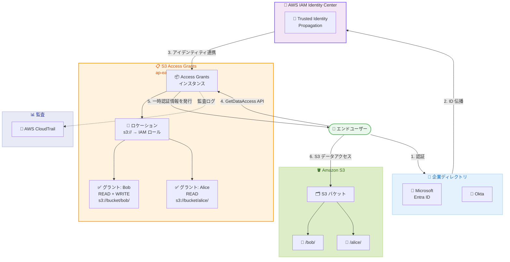

# Amazon S3 Access Grants - アジアパシフィック (台北) リージョンで利用可能に

**リリース日**: 2026 年 02 月 12 日
**サービス**: Amazon S3
**機能**: S3 Access Grants のリージョン拡大

📊 [このアップデートのインフォグラフィックを見る](https://takech9203.github.io/aws-news-summary/20260212-amazon-s3-access-grants-are-available-in-taipei.html)

## 概要

Amazon S3 Access Grants が、AWS アジアパシフィック (台北) リージョン (ap-east-2) で利用可能になりました。S3 Access Grants は、Microsoft Entra ID などのディレクトリや AWS Identity and Access Management (IAM) プリンシパルのアイデンティティを S3 のデータセットにマッピングする機能です。企業のアイデンティティに基づいて S3 へのアクセスを自動的に付与し、大規模なデータ権限管理を実現します。

S3 Access Grants を使用することで、バケットポリシーや IAM ポリシーだけでは管理が困難な複雑なアクセス制御要件に対応できます。リージョンごとにアカウントあたり最大 100,000 件のグラントを定義でき、ユーザーやアプリケーションに必要最小限の S3 データアクセスのみを付与できます。

**アップデート前の課題**

- 台北リージョンでは S3 Access Grants が利用できず、企業ディレクトリのアイデンティティに基づく S3 アクセス制御を実装できなかった
- 台北リージョンで大規模な S3 データ権限管理を行うには、バケットポリシーや IAM ポリシーを手動で管理する必要があった
- 台北リージョンのデータに対して、エンドユーザーのアイデンティティレベルでの監査証跡を取得することが困難だった

**アップデート後の改善**

- 台北リージョンで S3 Access Grants を使用してディレクトリユーザーやグループに S3 アクセスを付与可能になった
- 最大 100,000 件のグラントにより、大規模なデータ権限管理をスケーラブルに実現
- AWS CloudTrail との連携により、エンドユーザーのアイデンティティレベルでの監査が可能になった

## アーキテクチャ図



この図は、企業ディレクトリのアイデンティティが AWS IAM Identity Center を経由して S3 Access Grants に連携され、エンドユーザーが一時認証情報を取得して S3 データにアクセスする流れを示しています。

## サービスアップデートの詳細

### 主要機能

1. **ディレクトリアイデンティティのマッピング**
   - Microsoft Entra ID、Okta、Ping、OneLogin などの企業ディレクトリのユーザーやグループを S3 データセットにマッピング
   - AWS IAM Identity Center の Trusted Identity Propagation 機能と連携
   - IAM プリンシパル (ユーザーやロール) への直接的なアクセス付与にも対応

2. **スケーラブルな権限管理**
   - リージョンごとにアカウントあたり最大 100,000 件のグラントを作成可能
   - バケット、プレフィックス、オブジェクト単位の粒度でアクセスレベル (READ、WRITE、READWRITE) を指定
   - ロケーション登録により、IAM ロールと S3 データの関連付けを柔軟に管理

3. **一時認証情報の発行**
   - GetDataAccess API を通じてジャストインタイムの一時認証情報を取得
   - デフォルトの有効期限は 1 時間 (15 分から 12 時間の範囲で設定可能)
   - 最小権限の原則に基づき、グラントのスコープに限定された認証情報を発行

4. **エンドユーザーレベルの監査**
   - AWS CloudTrail と連携し、エンドユーザーのディレクトリアイデンティティレベルでアクセスを監査
   - アクセスに使用されたアプリケーションも記録

## 技術仕様

### S3 Access Grants の制限

| 項目 | 上限値 |
|------|------|
| Access Grants インスタンス | リージョンあたりアカウントごとに 1 つ |
| ロケーション | インスタンスあたり 1,000 件 |
| グラント | インスタンスあたり 100,000 件 |
| 一時認証情報の有効期限 | 15 分 ~ 12 時間 (デフォルト: 1 時間) |

### サポートされるアイデンティティプロバイダー

| プロバイダー | 連携方式 |
|------|------|
| Microsoft Entra ID | AWS IAM Identity Center 経由 |
| Okta | AWS IAM Identity Center 経由 |
| Ping | AWS IAM Identity Center 経由 |
| OneLogin | AWS IAM Identity Center 経由 |
| IAM プリンシパル | 直接指定 |

### API 変更履歴

今回のリージョン拡大に伴う API の変更はありません。既存の S3 Access Grants API がそのまま台北リージョンで利用可能です。

## 設定方法

### 前提条件

1. AWS アカウントで台北リージョン (ap-east-2) が有効化されていること
2. S3 バケットが台北リージョンに作成されていること
3. 企業ディレクトリとの連携を行う場合、AWS IAM Identity Center が設定されていること

### 手順

#### ステップ 1: S3 Access Grants インスタンスを作成

```bash
# 台北リージョンに S3 Access Grants インスタンスを作成
aws s3control create-access-grants-instance \
  --account-id 123456789012 \
  --region ap-east-2
```

このコマンドは、台北リージョンに S3 Access Grants インスタンスを作成します。リージョンごとにアカウントあたり 1 つのインスタンスのみ作成可能です。

#### ステップ 2: ロケーションを登録

```bash
# デフォルトの S3 ロケーションを登録
aws s3control create-access-grants-location \
  --account-id 123456789012 \
  --access-grants-location-configuration S3SubPrefix="s3://" \
  --iam-role-arn arn:aws:iam::123456789012:role/s3-access-grants-location-role \
  --region ap-east-2
```

このコマンドは、デフォルトの S3 パス (s3://) をロケーションとして登録し、IAM ロールをマッピングします。このロールを通じて一時認証情報が発行されます。

#### ステップ 3: グラントを作成

```bash
# IAM ユーザーに特定のプレフィックスへの READ アクセスを付与
aws s3control create-access-grant \
  --account-id 123456789012 \
  --access-grants-location-id "default" \
  --access-grants-location-configuration S3SubPrefix="my-bucket/data/" \
  --grantee GranteeType=IAM,GranteeIdentifier="arn:aws:iam::123456789012:user/analyst" \
  --permission READ \
  --region ap-east-2
```

このコマンドは、指定した IAM ユーザーに対して、特定の S3 プレフィックスへの READ アクセスを付与するグラントを作成します。

#### ステップ 4: 一時認証情報を取得してデータにアクセス

```bash
# 一時認証情報を取得
aws s3control get-data-access \
  --account-id 123456789012 \
  --target "s3://my-bucket/data/*" \
  --permission READ \
  --region ap-east-2
```

このコマンドは、GetDataAccess API を使用して一時認証情報を取得します。返却された認証情報を使用して S3 データにアクセスできます。

## メリット

### ビジネス面

- **台北リージョンでのデータガバナンス強化**: 台湾に存在するデータに対して、企業ディレクトリのアイデンティティに基づくきめ細かなアクセス制御が可能に
- **コンプライアンス対応**: エンドユーザーレベルの監査証跡により、規制要件への対応が容易に
- **運用コストの削減**: 手動でのポリシー管理が不要になり、大規模なデータ権限管理を自動化

### 技術面

- **スケーラブルなアクセス制御**: バケットポリシーの 20 KB サイズ制限を超える複雑な権限管理に対応
- **最小権限の原則**: グラントのスコープに限定された一時認証情報により、セキュリティを強化
- **サードパーティ統合**: Immuta や Informatica との連携により、データレイクのアクセス制御を一元管理

## デメリット・制約事項

### 制限事項

- リージョンあたりアカウントごとに 1 つの Access Grants インスタンスのみ作成可能
- グラント数の上限は 100,000 件 (上限の引き上げは AWS サポートに連絡が必要)
- 企業ディレクトリとの連携には AWS IAM Identity Center の設定が必要

### 考慮すべき点

- 既存のバケットポリシーや IAM ポリシーとの整合性を確認する必要がある
- 一時認証情報の有効期限管理を適切に設計する必要がある
- CloudTrail のログ量が増加するため、ログの保存コストを考慮する

## ユースケース

### ユースケース 1: 台湾拠点のデータレイクアクセス管理

**シナリオ**: 台湾に拠点を持つ企業が、台北リージョンのデータレイクに対して Microsoft Entra ID のユーザーやグループに基づくアクセス制御を実装したい場合。

**実装例**:
```bash
# 企業ディレクトリのグループに対してデータレイクの特定プレフィックスへのアクセスを付与
aws s3control create-access-grant \
  --account-id 123456789012 \
  --access-grants-location-id "default" \
  --access-grants-location-configuration S3SubPrefix="data-lake/finance/" \
  --grantee GranteeType=DIRECTORY_GROUP,GranteeIdentifier="finance-team-group-id" \
  --permission READWRITE \
  --region ap-east-2
```

**効果**: 財務チームのメンバーが企業アイデンティティで認証するだけで、必要なデータに自動的にアクセスできるようになります。

### ユースケース 2: クロスアカウントアクセスの管理

**シナリオ**: 複数の AWS アカウントを使用する組織が、台北リージョンの S3 データに対してアカウントをまたいだアクセス制御を実装したい場合。

**実装例**:
```bash
# 別アカウントの IAM ロールに対して S3 データへのアクセスを付与
aws s3control create-access-grant \
  --account-id 123456789012 \
  --access-grants-location-id "default" \
  --access-grants-location-configuration S3SubPrefix="shared-data/" \
  --grantee GranteeType=IAM,GranteeIdentifier="arn:aws:iam::987654321098:role/analytics-role" \
  --permission READ \
  --region ap-east-2
```

**効果**: IAM ポリシーの頻繁な更新なしに、クロスアカウントの S3 データアクセスを管理できます。

### ユースケース 3: 分析ワークロードのデータアクセス

**シナリオ**: Amazon EMR や Apache Spark を使用する分析ワークロードで、台北リージョンの S3 データに対するジョブベースのアクセス制御を実装したい場合。

**実装例**:
```bash
# EMR ジョブ用の IAM ロールに分析対象データへのアクセスを付与
aws s3control create-access-grant \
  --account-id 123456789012 \
  --access-grants-location-id "default" \
  --access-grants-location-configuration S3SubPrefix="analytics/raw-data/" \
  --grantee GranteeType=IAM,GranteeIdentifier="arn:aws:iam::123456789012:role/emr-spark-role" \
  --permission READ \
  --region ap-east-2
```

**効果**: 分析ジョブが必要なデータのみにアクセスでき、セキュリティを維持しながら分析ワークロードを実行できます。

## 料金

S3 Access Grants の使用に追加料金はかかりません。S3 Access Grants を通じて発行された一時認証情報でアクセスした S3 リクエストやデータ転送には、標準の S3 料金が適用されます。

## 利用可能リージョン

今回のアップデートにより、S3 Access Grants はアジアパシフィック (台北) リージョン (ap-east-2) を含む 34 のリージョンで利用可能になりました。以下は利用可能なリージョンの一覧です。

| リージョンコード | リージョン名 |
|------|------|
| us-east-1 | 米国東部 (バージニア北部) |
| us-east-2 | 米国東部 (オハイオ) |
| us-west-1 | 米国西部 (北カリフォルニア) |
| us-west-2 | 米国西部 (オレゴン) |
| af-south-1 | アフリカ (ケープタウン) |
| ap-east-1 | アジアパシフィック (香港) |
| **ap-east-2** | **アジアパシフィック (台北)** |
| ap-northeast-1 | アジアパシフィック (東京) |
| ap-northeast-2 | アジアパシフィック (ソウル) |
| ap-northeast-3 | アジアパシフィック (大阪) |
| ap-south-1 | アジアパシフィック (ムンバイ) |
| ap-south-2 | アジアパシフィック (ハイデラバード) |
| ap-southeast-1 | アジアパシフィック (シンガポール) |
| ap-southeast-2 | アジアパシフィック (シドニー) |
| ap-southeast-3 | アジアパシフィック (ジャカルタ) |
| ap-southeast-4 | アジアパシフィック (メルボルン) |
| ap-southeast-7 | アジアパシフィック (タイ) |
| ca-central-1 | カナダ (中部) |
| ca-west-1 | カナダ西部 (カルガリー) |
| eu-central-1 | ヨーロッパ (フランクフルト) |
| eu-central-2 | ヨーロッパ (チューリッヒ) |
| eu-north-1 | ヨーロッパ (ストックホルム) |
| eu-south-1 | ヨーロッパ (ミラノ) |
| eu-south-2 | ヨーロッパ (スペイン) |
| eu-west-1 | ヨーロッパ (アイルランド) |
| eu-west-2 | ヨーロッパ (ロンドン) |
| eu-west-3 | ヨーロッパ (パリ) |
| il-central-1 | イスラエル (テルアビブ) |
| me-central-1 | 中東 (UAE) |
| me-south-1 | 中東 (バーレーン) |
| mx-central-1 | メキシコ (中部) |
| sa-east-1 | 南米 (サンパウロ) |
| us-gov-east-1 | AWS GovCloud (米国東部) |
| us-gov-west-1 | AWS GovCloud (米国西部) |

## 関連サービス・機能

- **AWS IAM Identity Center**: 企業ディレクトリと AWS サービス間のシングルサインオンとアイデンティティ管理を提供
- **AWS CloudTrail**: S3 Access Grants を通じたアクセスのエンドユーザーレベルの監査ログを記録
- **Amazon EMR**: S3 Access Grants と統合し、Apache Spark ジョブのスケーラブルな S3 アクセス制御を実現
- **Amazon S3 Access Points**: S3 バケットへのアクセスを管理するための名前付きネットワークエンドポイント

## 参考リンク

- 📊 [インフォグラフィック](https://takech9203.github.io/aws-news-summary/20260212-amazon-s3-access-grants-are-available-in-taipei.html)
- [公式発表 (What's New)](https://aws.amazon.com/about-aws/whats-new/2026/02/amazon-s3-access-grants-are-available-in-taipei)
- [S3 Access Grants 製品ページ](https://aws.amazon.com/s3/features/access-grants/)
- [S3 Access Grants ユーザーガイド](https://docs.aws.amazon.com/AmazonS3/latest/userguide/access-grants.html)
- [S3 Access Grants リージョン情報](https://docs.aws.amazon.com/AmazonS3/latest/userguide/access-grants-limitations.html#access-grants-limitations-regions)
- [S3 料金ページ](https://aws.amazon.com/s3/pricing/)

## まとめ

Amazon S3 Access Grants がアジアパシフィック (台北) リージョンで利用可能になったことで、台湾に存在するデータに対して企業ディレクトリのアイデンティティに基づくきめ細かな S3 アクセス制御を実装できるようになりました。台北リージョンでデータレイクや分析ワークロードを運用している組織は、S3 Access Grants を活用してデータ権限管理のスケーラビリティとセキュリティを向上させることをお勧めします。
