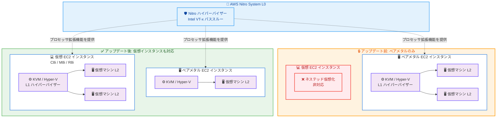

# Amazon EC2 - 仮想インスタンスでのネステッド仮想化のサポート

**リリース日**: 2026年02月16日
**サービス**: Amazon EC2
**機能**: 仮想 EC2 インスタンスでのネステッド仮想化

📊 [このアップデートのインフォグラフィックを見る](https://takech9203.github.io/aws-news-summary/20260216-amazon-ec2-nested-virtualization-on-virtual.html)

## 概要

AWS は 2026 年 2 月 16 日、仮想 Amazon EC2 インスタンス上でネステッド仮想化が利用可能になったことを発表しました。これまでネステッド仮想化はベアメタル EC2 インスタンスでのみサポートされていましたが、今回のアップデートにより、仮想 EC2 インスタンス上で KVM や Hyper-V などのハイパーバイザーを実行し、ネストされた仮想マシンを作成・管理できるようになりました。

この機能は、Nitro System がプロセッサ拡張機能 (Intel VT-x) を仮想インスタンスに渡すことで実現されています。物理 AWS インフラストラクチャおよび Nitro ハイパーバイザー (L0)、ハイパーバイザーを実行する EC2 インスタンス (L1)、そのインスタンス内で作成される仮想マシン (L2) の 3 層アーキテクチャで構成されます。モバイルアプリケーションのエミュレータ実行、自動車の車載ハードウェアシミュレーション、Windows ワークステーション上での Windows Subsystem for Linux (WSL2) の実行など、幅広いユースケースに対応します。

この機能はすべての商用リージョンで C8i、M8i、R8i インスタンスにて利用可能であり、追加料金は発生しません。

**アップデート前の課題**

- ネステッド仮想化を利用するにはベアメタル EC2 インスタンスが必要であり、コストが高くサイズの柔軟性に欠けていた
- ベアメタルインスタンスは一般的に大型のインスタンスサイズのみが提供されるため、小規模な開発やテスト用途には過剰なリソースとなっていた
- Docker Desktop、WSL2、Android Studio エミュレータなどの開発ツールをクラウド上で実行する際に、ハードウェア仮想化拡張機能を利用できる選択肢が限られていた

**アップデート後の改善**

- 仮想 EC2 インスタンス上で KVM や Hyper-V を実行し、ネストされた仮想マシンを作成できるようになった
- ベアメタルインスタンスを使用せずに、幅広いインスタンスサイズから要件に合ったものを選択できるようになった
- 開発ワークフローで Docker Desktop、WSL2、Android Studio エミュレータ、QEMU を柔軟に利用できるようになった
- 追加料金なしで利用可能なため、コスト効率が大幅に改善された

## アーキテクチャ図



アップデート前はベアメタル EC2 インスタンスでのみネステッド仮想化が可能でしたが、アップデート後は仮想 EC2 インスタンス (C8i、M8i、R8i) でも Nitro System による Intel VT-x パススルーにより、L1 ハイパーバイザー上で L2 仮想マシンを作成できるようになりました。

## サービスアップデートの詳細

### 主要機能

1. **仮想インスタンスでのネステッド仮想化**
   - 仮想 (非ベアメタル) EC2 インスタンス上で KVM および Hyper-V ハイパーバイザーを実行可能
   - Nitro System がプロセッサ拡張機能 (Intel VT-x) を仮想インスタンスにパススルー
   - L0 (Nitro ハイパーバイザー) → L1 (EC2 インスタンス上のハイパーバイザー) → L2 (ネストされた仮想マシン) の 3 層構成

2. **新規インスタンス起動時の有効化**
   - インスタンス起動ウィザードの「Advanced details」で「Nested virtualization」を「Enable」に設定
   - AWS CLI では `--cpu-options "NestedVirtualization=enabled"` オプションを指定して `run-instances` コマンドを実行

3. **既存インスタンスへの適用**
   - 停止状態のインスタンスに対して、コンソールまたは `modify-instance-cpu-options` コマンドでネステッド仮想化を有効化可能
   - 既存のワークロードを新しいインスタンスに移行せずに機能を追加可能

## 技術仕様

### 対応インスタンスタイプとハイパーバイザー

| 項目 | 詳細 |
|------|------|
| 対応インスタンスタイプ | C8i、M8i、R8i |
| 対応 L1 ハイパーバイザー | KVM、Hyper-V |
| アーキテクチャ | 3 層構成 (L0: Nitro、L1: EC2 インスタンス、L2: ネスト VM) |
| プロセッサ拡張機能 | Intel VT-x パススルー |
| 追加料金 | なし |
| 利用可能リージョン | すべての商用リージョン |

### 制約事項

| 項目 | 詳細 |
|------|------|
| Windows インスタンスの制限 | 192 CPU を超える Windows インスタンスでは非対応 (例: m8i.96xl) |
| Virtual Secure Mode | ネステッド仮想化を有効化すると VSM は自動的に無効化 |
| Credential Guard | VSM の無効化に伴い Credential Guard も無効化 |
| ハイバネーション | ネステッド仮想化が有効なインスタンスでは非対応 |

### API 変更履歴

| 日付 | サービス | 変更内容 |
|------|----------|----------|
| 2026/02/12 | [Amazon Elastic Compute Cloud](https://awsapichanges.com/archive/changes/504b9a-ec2.html) | 8 updated api methods - ネステッド仮想化の起動。仮想 EC2 インスタンス内でネスト VM を実行可能に |

### 有効化の設定

新規インスタンス起動時:

```bash
aws ec2 run-instances \
    --image-id ami-0abcdef1234567890 \
    --instance-type r8i.4xlarge \
    --cpu-options "NestedVirtualization=enabled" \
    --key-name my-key-pair \
    --placement "Tenancy=host"
```

既存インスタンスへの適用:

```bash
aws ec2 modify-instance-cpu-options \
    --instance-id i-1234567890abcdef0 \
    --core-count 4 \
    --threads-per-core 2 \
    --nested-virtualization enabled
```

## 設定方法

### 前提条件

1. AWS アカウントと EC2 インスタンスを起動するための適切な IAM 権限
2. C8i、M8i、または R8i インスタンスタイプが利用可能なリージョン
3. 既存インスタンスに適用する場合は、インスタンスが停止状態であること

### 手順

#### ステップ 1: 新規インスタンスの起動時にネステッド仮想化を有効化

```bash
# C8i インスタンスでネステッド仮想化を有効にして起動
aws ec2 run-instances \
    --image-id ami-0abcdef1234567890 \
    --instance-type c8i.4xlarge \
    --cpu-options "NestedVirtualization=enabled" \
    --key-name my-key-pair
```

このコマンドは、ネステッド仮想化を有効にした C8i.4xlarge インスタンスを起動します。`--cpu-options` パラメータで `NestedVirtualization=enabled` を指定することで、インスタンス内でハイパーバイザーを実行できるようになります。

#### ステップ 2: 既存インスタンスでネステッド仮想化を有効化

```bash
# まずインスタンスを停止
aws ec2 stop-instances --instance-id i-1234567890abcdef0

# 停止を確認後、ネステッド仮想化を有効化
aws ec2 modify-instance-cpu-options \
    --instance-id i-1234567890abcdef0 \
    --core-count 4 \
    --threads-per-core 2 \
    --nested-virtualization enabled

# インスタンスを再起動
aws ec2 start-instances --instance-id i-1234567890abcdef0
```

このコマンドは、既存の EC2 インスタンスを停止した後、CPU オプションを変更してネステッド仮想化を有効化し、インスタンスを再起動します。既存インスタンスでは停止状態でのみ設定変更が可能です。

#### ステップ 3: コンソールからの設定

AWS マネジメントコンソールを使用する場合は以下の手順で設定します。

- **新規インスタンス**: インスタンス起動ウィザードで「Advanced details」を展開し、「Nested virtualization」で「Enable」を選択
- **既存インスタンス**: インスタンスを選択 → 「Actions」→「Instance settings」→「Change CPU options」→「Nested virtualization」で「Enable」を選択

## メリット

### ビジネス面

- **コスト削減**: ベアメタルインスタンスではなく、より小型で安価な仮想インスタンスを使用してネステッド仮想化を実現できるため、大幅なコスト削減が可能
- **柔軟なリソース選択**: C8i、M8i、R8i の幅広いインスタンスサイズから、ワークロードに最適なリソースを選択可能
- **開発効率の向上**: クラウド上で Docker Desktop、WSL2、エミュレータなどの開発ツールを手軽に利用でき、開発サイクルが短縮される

### 技術面

- **幅広いインスタンスサイズ**: ベアメタルに限定されず、さまざまなサイズの仮想インスタンスでネステッド仮想化を利用可能
- **追加料金なし**: ネステッド仮想化の利用に追加コストが発生しないため、既存のインスタンス料金のみで機能を活用可能
- **Nitro System による高いセキュリティ**: AWS Nitro System により、EC2 インスタンス間の強力な分離境界を維持しながらネステッド仮想化を提供
- **既存インスタンスへの適用**: 新規インスタンスだけでなく、既存のインスタンスにも設定変更でネステッド仮想化を有効化可能

## デメリット・制約事項

### 制限事項

- 対応インスタンスタイプは C8i、M8i、R8i のみで、他のインスタンスファミリーでは利用不可
- L1 ハイパーバイザーとして KVM と Hyper-V のみがサポートされている
- 192 CPU を超える Windows インスタンス (例: m8i.96xl) ではネステッド仮想化は非対応
- ネステッド仮想化を有効にした Windows インスタンスでは Virtual Secure Mode (VSM) が自動的に無効化され、Credential Guard が利用不可
- ネステッド仮想化が有効なインスタンスではハイバネーション (休止) が非対応

### 考慮すべき点

- パフォーマンスに敏感なワークロードや厳格なレイテンシ要件がある場合は、引き続きベアメタルインスタンスの利用を検討すべき
- ネステッド仮想化を使用する場合、インスタンス内のハイパーバイザー、ネスト仮想マシン、ゲスト OS、アプリケーション、データのセキュリティはユーザーの責任 (共有責任モデル)
- 既存インスタンスで有効化する場合は、インスタンスの停止が必要

## ユースケース

### ユースケース 1: モバイルアプリケーション開発とテスト

**シナリオ**: モバイルアプリ開発チームが、Android Studio のエミュレータを使用してクラウド上で自動テストパイプラインを構築したい

**実装例**:
```bash
# M8i インスタンスでネステッド仮想化を有効にして開発環境を起動
aws ec2 run-instances \
    --image-id ami-0abcdef1234567890 \
    --instance-type m8i.2xlarge \
    --cpu-options "NestedVirtualization=enabled" \
    --key-name dev-key-pair \
    --tag-specifications 'ResourceType=instance,Tags=[{Key=Purpose,Value=android-emulator}]'
```

**効果**: ベアメタルインスタンスと比較してコストを大幅に削減しつつ、Android エミュレータをハードウェアアクセラレーション付きで実行でき、テストの速度と効率が向上

### ユースケース 2: 自動車の車載ハードウェアシミュレーション

**シナリオ**: 自動車メーカーが、車載 ECU (Electronic Control Unit) のソフトウェアをクラウド上でシミュレーションしてテストしたい

**実装例**:
```bash
# C8i インスタンスでコンピューティング最適化環境を構築
aws ec2 run-instances \
    --image-id ami-0abcdef1234567890 \
    --instance-type c8i.8xlarge \
    --cpu-options "NestedVirtualization=enabled" \
    --key-name simulation-key \
    --tag-specifications 'ResourceType=instance,Tags=[{Key=Purpose,Value=vehicle-simulation}]'
```

**効果**: 専用の物理ハードウェアを用意することなく、クラウド上で車載環境をシミュレーションでき、開発サイクルの短縮とインフラコストの削減を実現

### ユースケース 3: Windows ワークステーションでの WSL2 利用

**シナリオ**: 開発チームが、クラウド上の Windows ワークステーションで WSL2 を使用して Linux 開発環境と Windows 開発環境を同時に利用したい

**実装例**:
```bash
# R8i インスタンスでメモリ最適化 Windows ワークステーションを起動
aws ec2 run-instances \
    --image-id ami-windows-server-2022 \
    --instance-type r8i.4xlarge \
    --cpu-options "NestedVirtualization=enabled" \
    --key-name windows-key \
    --tag-specifications 'ResourceType=instance,Tags=[{Key=Purpose,Value=wsl2-workstation}]'
```

**効果**: 1 つの Windows インスタンス上で WSL2 を通じて Linux 環境を利用でき、クロスプラットフォーム開発の生産性が向上。メモリ最適化の R8i インスタンスにより、複数の開発環境を同時に快適に実行可能

## 料金

ネステッド仮想化の利用に追加料金は発生しません。通常の EC2 インスタンス料金のみが適用されます。コストは選択するインスタンスタイプ、リージョン、購入オプションによって異なります。

### 料金例

米国東部 (バージニア北部) でのオンデマンド料金の参考値。

| インスタンスタイプ | vCPU | メモリ (GiB) | 用途 |
|-------------------|------|-------------|------|
| c8i.4xlarge | 16 | 32 | コンピューティング最適化ワークロード |
| m8i.4xlarge | 16 | 64 | 汎用ワークロード |
| r8i.4xlarge | 16 | 128 | メモリ最適化ワークロード |

**注**: ベアメタルインスタンスと比較して、同等の vCPU 数で仮想インスタンスを使用することにより、より細かい粒度でリソースを選択でき、コスト最適化が可能です。最新の料金については [Amazon EC2 料金ページ](https://aws.amazon.com/ec2/pricing/) をご確認ください。

## 利用可能リージョン

ネステッド仮想化は、C8i、M8i、R8i インスタンスが利用可能なすべての商用リージョンで提供されています。

## 関連サービス・機能

- **Amazon EC2 ベアメタルインスタンス**: パフォーマンスに敏感なワークロードでは引き続きベアメタルインスタンスでのネステッド仮想化も利用可能
- **AWS Nitro System**: ネステッド仮想化を実現する基盤技術。プロセッサ拡張機能のパススルーとインスタンス間の強力な分離を提供
- **Amazon WorkSpaces**: Windows ワークステーション環境が必要な場合の代替サービス
- **AWS Systems Manager**: ネステッド仮想化が有効なインスタンスの設定と管理の自動化に活用可能

## 参考リンク

- 📊 [インフォグラフィック](https://takech9203.github.io/aws-news-summary/20260216-amazon-ec2-nested-virtualization-on-virtual.html)
- [公式発表 (What's New)](https://aws.amazon.com/about-aws/whats-new/2026/02/amazon-ec2-nested-virtualization-on-virtual)
- [ドキュメント](https://docs.aws.amazon.com/AWSEC2/latest/UserGuide/amazon-ec2-nested-virtualization.html)
- [料金ページ](https://aws.amazon.com/ec2/pricing/)

## まとめ

Amazon EC2 が仮想インスタンスでのネステッド仮想化をサポートしたことにより、ベアメタルインスタンスに限定されていた制約が解消され、より柔軟でコスト効率の高い仮想化環境を構築できるようになりました。C8i、M8i、R8i インスタンスの幅広いサイズから最適なリソースを選択し、追加料金なしでモバイルエミュレータ、車載シミュレーション、WSL2 環境などを実行できます。開発・テスト環境でネステッド仮想化を必要とするワークロードがある場合は、まず仮想インスタンスでの利用を検討し、パフォーマンス要件に応じてベアメタルインスタンスとの使い分けを判断してください。
