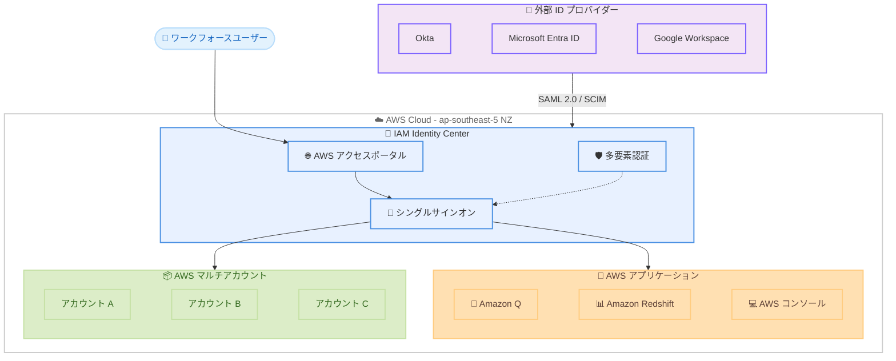

# AWS IAM Identity Center - アジアパシフィック (ニュージーランド) リージョンで利用可能に

**リリース日**: 2026 年 2 月 19 日
**サービス**: AWS IAM Identity Center
**機能**: Asia Pacific (New Zealand) リージョンでの提供開始

📊 [このアップデートのインフォグラフィックを見る](https://takech9203.github.io/aws-news-summary/20260219-aws-iam-identity-center-asia-pacific-new-zealand-region.html)

## 概要

AWS IAM Identity Center が、Asia Pacific (New Zealand) リージョンを含む 38 の AWS リージョンでデプロイ可能になりました。IAM Identity Center は、AWS アプリケーションへのワークフォースアクセスを管理するための推奨サービスです。既存の ID ソースを AWS に接続してシングルサインオンを提供し、Amazon Q や Amazon Redshift などの AWS サービスにおけるパーソナライズされたユーザー体験やユーザー認識型のデータアクセスを実現します。

このリージョン拡張により、ニュージーランドおよびオセアニア地域のお客様は、ローカルリージョンで IAM Identity Center を利用し、データレジデンシー要件への対応やレイテンシーの改善が可能になります。IAM Identity Center は追加料金なしで利用できます。

**アップデート前の課題**

- ニュージーランドのお客様が IAM Identity Center を利用するには、他のリージョン (シドニーなど) を使用する必要があった
- ニュージーランド国内のデータレジデンシー要件への対応が困難だった
- オセアニア地域からのアクセスでレイテンシーが発生していた

**アップデート後の改善**

- IAM Identity Center を 38 リージョンでデプロイ可能になり、Asia Pacific (New Zealand) が新たに追加
- ニュージーランド国内でのデータ保持が可能になり、データレジデンシー要件を充足
- ローカルリージョンからのアクセスにより、低レイテンシーでの ID 管理を実現

## アーキテクチャ図



外部 ID プロバイダーから IAM Identity Center へ SAML 2.0 / SCIM で連携し、シングルサインオンを通じて AWS アプリケーションやマルチアカウント環境にアクセスします。

## サービスアップデートの詳細

### 主要機能

1. **ワークフォースアクセス管理**
   - 既存の ID ソース (Okta、Microsoft Entra ID、Google Workspace など) を AWS に接続
   - シングルサインオンでの AWS アプリケーションおよびアカウントへのアクセス
   - マルチアカウント環境の一元的なアクセス管理

2. **パーソナライズされたユーザー体験**
   - Amazon Q でのパーソナライズされた AI アシスタント体験
   - AWS アプリケーション全体で統一されたユーザー ID の提供
   - AWS アクセスポータルによる一元的なアクセスポイント

3. **ユーザー認識型データアクセス**
   - Trusted Identity Propagation による信頼された ID 伝播
   - Amazon Redshift などでのユーザー単位のデータアクセス制御と監査
   - CloudTrail によるユーザーベースのアクティビティログ

4. **マルチアカウントアクセス管理**
   - 複数の AWS アカウントへのアクセスを一元管理
   - ジョブ機能ベースまたはカスタム権限セットの作成
   - AWS CLI、SDK、コンソールモバイルアプリからのシングルサインオン

### 対応する ID プロバイダー

| ID プロバイダー | 連携方式 |
|------|------|
| Okta | SAML 2.0 + SCIM |
| Microsoft Entra ID | SAML 2.0 + SCIM |
| Google Workspace | SAML 2.0 |
| Microsoft Active Directory | AD Connector / AWS Managed Microsoft AD |
| IAM Identity Center ディレクトリ | ビルトイン |

## 技術仕様

### リージョン情報

| 項目 | 詳細 |
|------|------|
| リージョン名 | Asia Pacific (New Zealand) |
| リージョンコード | ap-southeast-5 |
| 対応リージョン合計 | 38 リージョン |
| 追加料金 | なし |

### IAM Identity Center の主要コンポーネント

| コンポーネント | 説明 |
|------|------|
| AWS アクセスポータル | ユーザーが割り当てられたアカウントとアプリケーションにアクセスする Web ポータル |
| 権限セット | AWS アカウントへのアクセスレベルを定義するポリシーコレクション |
| アプリケーション割り当て | AWS マネージドアプリケーションへのユーザー/グループのアクセス制御 |
| Trusted Identity Propagation | アプリケーション間のユーザー ID コンテキストの伝播 |

## 設定方法

### 前提条件

1. AWS Organizations が有効な AWS アカウント
2. 管理アカウントまたは委任管理者権限
3. ID ソース (外部 IdP またはビルトインディレクトリ)

### 手順

#### ステップ 1: IAM Identity Center の有効化

AWS マネジメントコンソールで IAM Identity Center にアクセスし、Asia Pacific (New Zealand) リージョン (ap-southeast-5) で有効化します。

```bash
# AWS CLI でリージョンの IAM Identity Center インスタンスを確認
aws sso-admin list-instances --region ap-southeast-5
```

IAM Identity Center のインスタンスがリージョンで利用可能であることを確認します。

#### ステップ 2: ID ソースの接続

外部 ID プロバイダーを使用する場合、SAML 2.0 設定を行います。

```bash
# SAML メタデータの取得例
aws sso-admin describe-instance-access-control-attribute-configuration \
    --instance-arn <instance-arn> \
    --region ap-southeast-5
```

外部 IdP との SAML 2.0 連携を設定し、ユーザーとグループの同期を構成します。

#### ステップ 3: 権限セットの作成とアカウント割り当て

```bash
# 権限セットの作成
aws sso-admin create-permission-set \
    --instance-arn <instance-arn> \
    --name "ReadOnlyAccess" \
    --description "Read-only access to AWS resources" \
    --session-duration "PT8H" \
    --region ap-southeast-5
```

権限セットを作成し、ユーザーまたはグループに AWS アカウントへのアクセスを割り当てます。

## メリット

### ビジネス面

- **データレジデンシーの充足**: ニュージーランド国内でのデータ保持要件に対応可能
- **コンプライアンス対応**: ニュージーランドの Privacy Act 2020 やオーストラリアの APPs に準拠したデータ管理
- **オセアニア地域への展開支援**: 地域内のお客様へ低レイテンシーなアクセス管理を提供
- **追加コスト不要**: IAM Identity Center は無料で利用可能

### 技術面

- **低レイテンシー**: ローカルリージョンからのアクセスにより応答時間が改善
- **統一された ID 管理**: 既存の IdP を一度接続するだけで AWS 全体のアクセスを管理
- **マルチリージョン対応**: 他のリージョンと組み合わせた高可用性構成が可能

## デメリット・制約事項

### 制限事項

- 組織インスタンスは AWS Organizations の管理アカウントでのみ作成可能
- 外部 IdP との連携には SAML 2.0 対応が必要
- 一部の AWS マネージドアプリケーションはリージョンによって利用可能状況が異なる場合がある

### 考慮すべき点

- マルチリージョン構成を利用する場合、カスタマー管理の KMS キーが必要
- 既存のリージョンから移行する場合、権限セットやアプリケーション割り当ての再設定が必要になる場合がある
- 外部 IdP 側の設定変更 (ACS URL の追加など) が必要

## ユースケース

### ユースケース 1: ニュージーランド企業のワークフォースアクセス管理

**シナリオ**: ニュージーランドの企業が、社内ユーザーの AWS アカウントおよびアプリケーションへのアクセスをローカルリージョンで管理したい。

**実装例**:
```
リージョン: ap-southeast-5 (ニュージーランド)
ID ソース: Microsoft Entra ID (SAML 2.0)
対象: 開発チーム、運用チーム、データ分析チーム
```

**効果**: データレジデンシー要件を満たしながら、低レイテンシーでシングルサインオンを提供

### ユースケース 2: オセアニア地域のマルチアカウント管理

**シナリオ**: オーストラリアとニュージーランドに拠点を持つ企業が、リージョンごとに最適なアクセス管理を実現したい。

**実装例**:
```
プライマリリージョン: ap-southeast-2 (シドニー)
追加リージョン: ap-southeast-5 (ニュージーランド)
ID ソース: Okta (SAML 2.0 + SCIM)
```

**効果**: オセアニア地域全体でのレジリエントなアクセス管理と低レイテンシーを両立

### ユースケース 3: Amazon Q のパーソナライズ体験

**シナリオ**: ニュージーランドの開発チームが Amazon Q Developer を活用し、パーソナライズされた AI アシスタント体験を得たい。

**実装例**:
```
リージョン: ap-southeast-5 (ニュージーランド)
ID ソース: IAM Identity Center ディレクトリ
対象アプリケーション: Amazon Q Developer
```

**効果**: IAM Identity Center との統合により、ユーザーごとにパーソナライズされた Amazon Q 体験をローカルリージョンで提供

## 料金

IAM Identity Center は追加料金なしで利用可能です。

### 関連する料金

| 項目 | 料金 |
|------|------|
| IAM Identity Center | 無料 |
| AWS KMS (マルチリージョン構成の場合) | $1.00 / 月 / キー |
| AWS Organizations | 無料 |

マルチリージョン構成を利用する場合、KMS キーの料金が発生します。詳細は [AWS KMS 料金ページ](https://aws.amazon.com/kms/pricing/) を参照してください。

## 利用可能リージョン

IAM Identity Center は現在 38 の AWS リージョンで利用可能です。今回追加された Asia Pacific (New Zealand) を含む最新のリージョン一覧は [AWS リージョン表](https://aws.amazon.com/about-aws/global-infrastructure/regional-product-services/) を参照してください。

## 関連サービス・機能

- **AWS Organizations**: マルチアカウント環境の管理と IAM Identity Center の基盤
- **AWS IAM**: IAM Identity Center と併用するロールおよびポリシー管理
- **Amazon Q**: IAM Identity Center と統合されたパーソナライズ AI 体験
- **Amazon Redshift**: Trusted Identity Propagation によるユーザー認識型データアクセス
- **AWS CloudTrail**: ユーザーアクティビティの監査ログ

## 参考リンク

- 📊 [インフォグラフィック](https://takech9203.github.io/aws-news-summary/20260219-aws-iam-identity-center-asia-pacific-new-zealand-region.html)
- [公式発表 (What's New)](https://aws.amazon.com/about-aws/whats-new/2026/02/aws-iam-identity-center-asia-pacific-new-zealand-region/)
- [IAM Identity Center 製品ページ](https://aws.amazon.com/iam/identity-center/)
- [IAM Identity Center ユーザーガイド](https://docs.aws.amazon.com/singlesignon/latest/userguide/what-is.html)
- [AWS リージョン表](https://aws.amazon.com/about-aws/global-infrastructure/regional-product-services/)

## まとめ

AWS IAM Identity Center が Asia Pacific (New Zealand) リージョンで利用可能になり、対応リージョンが 38 に拡大しました。ニュージーランドおよびオセアニア地域のお客様は、ローカルリージョンでワークフォースの ID 管理とシングルサインオンを実現できます。データレジデンシー要件への対応、低レイテンシーでのアクセス、Amazon Q などの AWS アプリケーションとの統合を、追加料金なしで利用可能です。ニュージーランドに拠点を持つ組織は、既存の ID プロバイダーを接続して IAM Identity Center の利用開始を検討してください。
