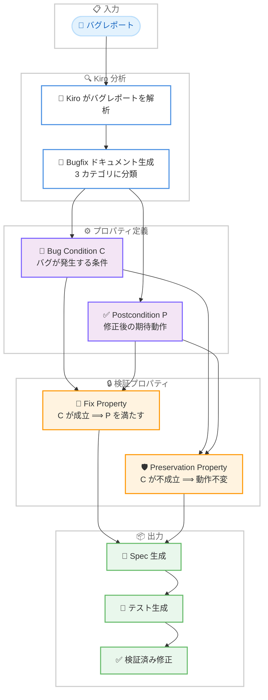

# Kiro - Property-Aware Code Evolution: バグ修正ワークフロー

**リリース日**: 2026 年 2 月 19 日
**サービス**: Kiro
**機能**: Property-Aware Code Evolution - Bug Fix Workflow

📊 [このアップデートのインフォグラフィックを見る](https://takech9203.github.io/aws-news-summary/20260219-kiro-bug-fix-paradox.html)

## 概要

Kiro が Property-Aware Code Evolution と呼ばれるバグ修正手法に関する技術ブログを公開した。AI エージェントによるバグ修正には「ハンマー問題 (Sledgehammer Problem)」と呼ばれる根本的な課題がある。AI エージェントは人間と比較してガード句や防御的エラーハンドリングを追加する傾向が約 2 倍高く、動作中のコードをリファクタリングしたり、不要な変更を加えたりすることが多い。さらに、エージェントとの対話が長くなるほど、元の意図からのドリフトが拡大する。

Property-Aware Code Evolution は、すべてのバグ修正には二重の意図があるという洞察に基づく。バグのある動作を修正することと、それ以外のすべてを保全することである。この手法では、修正すべき範囲と保全すべき範囲の境界を形式的に明示することで、AI エージェントが正確かつ安全なバグ修正を実行できるようにする。

**アップデート前の課題**

- AI エージェントがバグ修正時に不要なガード句やエラーハンドリングを過剰に追加していた
- 修正すべき範囲と保全すべき範囲の境界が暗黙的であり、エージェントが境界を逸脱していた
- バグレポートが曖昧な場合、エージェントが独自に境界を発明してしまっていた
- エージェント自身が境界を遵守できたかどうかを検証する手段がなかった

**アップデート後の改善**

- Bug Condition と Postcondition で修正範囲を形式的に定義
- Fix Property と Preservation Property で修正と保全の境界を明示
- Bugfix ドキュメントにより構造化された根本原因分析と修正が可能
- エージェントが自動生成した Spec とテストに基づいて修正の正確性を検証

## アーキテクチャ図

バグレポートから始まり、Kiro が分析して Bug Condition と Postcondition を定義し、Fix Property と Preservation Property による検証を経て、Spec、テスト、検証済みの修正を出力するワークフローを示している。

## サービスアップデートの詳細

### ハンマー問題

AI エージェントによるバグ修正には、以下の根本的な課題がある。

- **過剰な防御的コーディング**: AI エージェントは人間と比較して約 2 倍の頻度でガード句や防御的エラーハンドリングを追加する
- **不要なリファクタリング**: 動作中のコードに対して不要な変更を加える傾向がある
- **意図からのドリフト**: エージェントとの対話が増えるほど、元の意図からの逸脱が拡大する

これらの問題は、バグ修正における「修正すべき範囲」と「保全すべき範囲」の境界が暗黙的であることに起因する。

### Property-Aware Code Evolution

この手法の核心は、すべてのバグ修正には二重の意図があるという認識である。

1. **Bug Condition C**: バグが発生する条件を特定し、入力空間を分割する述語。この条件が成立するとき、バグが発生する
2. **Postcondition P**: バグのある入力に対して「修正された」とはどういう状態かを定義する。修正後のコードが満たすべき期待動作
3. **Fix Property (C ⟹ P)**: Bug Condition C が成立する場合、修正後のコードは Postcondition P を満たす。これがバグ修正の正確性を保証する
4. **Preservation Property (not C ⟹ unchanged)**: Bug Condition C が成立しない場合、コードの動作は元のコードと同一である。これが既存動作の保全を保証する

### Bug Condition が暗黙的な場合の 3 つの問題

Bug Condition C を明示しない場合、以下の問題が発生する。

1. **エージェントのドリフト**: 複数のステップにわたる修正作業で、エージェントが境界から逸脱する。修正すべき範囲を超えて変更が拡大し、意図しない副作用が発生する
2. **境界の発明**: バグレポートが曖昧な場合、エージェントが独自に境界を推測して作成する。この推測された境界は実際のバグ条件と一致しない場合がある
3. **検証の不可能性**: 境界が明示されていないため、エージェント自身が修正の正確性を検証できない。修正がバグを解決したか、既存動作を壊していないかを確認する手段がない

### Kiro のバグ修正ワークフロー

Kiro の Bug Fix Workflow は以下の手順で実行される。

1. **バグレポートの分析**: Kiro がバグレポートを読み取り、問題の内容を理解する
2. **Bugfix ドキュメントの生成**: 以下の 3 つのカテゴリに分類した Bugfix ドキュメントを自動生成する
   - **Defective Behavior**: 現在のコードがどのように誤動作しているか
   - **Expected Fix**: バグのある入力に対してコードがどのように動作すべきか
   - **Unchanged Behavior**: バグのない入力に対して現在の動作を維持すべき範囲
3. **パーティションの形式化**: Bug Condition C と Postcondition P を形式的に定義し、入力空間を分割する
4. **根本原因の調査**: 形式化されたプロパティに基づいてコードベースを調査し、根本原因を特定する
5. **Spec とテストの生成**: Fix Property と Preservation Property に基づいて Spec とテストケースを自動生成する
6. **検証済み修正の適用**: 生成されたテストに合格する修正を適用し、バグの解決と既存動作の保全を検証する

## 技術仕様

### 形式的検証アプローチ

Property-Aware Code Evolution は、形式手法の概念をバグ修正に応用している。

| プロパティ | 定義 | 目的 |
|-----------|------|------|
| Bug Condition C | バグが発生する入力条件を特定する述語 | 入力空間の分割 |
| Postcondition P | 修正後の期待動作を定義 | 修正の正確性の基準 |
| Fix Property | C ⟹ P | バグのある入力が正しく処理されることを保証 |
| Preservation Property | not C ⟹ unchanged | バグのない入力の動作が不変であることを保証 |

### Bugfix ドキュメントの 3 カテゴリ

| カテゴリ | 説明 | 対応するプロパティ |
|---------|------|------------------|
| Defective Behavior | 現在の誤動作の記述 | Bug Condition C の特定 |
| Expected Fix | 修正後の期待動作 | Postcondition P の定義 |
| Unchanged Behavior | 保全すべき既存動作 | Preservation Property の根拠 |

### 従来のアプローチとの比較

| 観点 | 従来の AI バグ修正 | Property-Aware Code Evolution |
|------|-------------------|-------------------------------|
| 修正範囲の定義 | 暗黙的 | Bug Condition で明示的に定義 |
| 既存動作の保証 | なし | Preservation Property で保証 |
| 修正の検証 | 手動テスト | 自動生成テストで検証 |
| ドリフトの防止 | なし | 形式化された境界で防止 |
| 過剰な変更 | 頻発 | プロパティにより抑制 |

## メリット

### ビジネス面

- **修正品質の向上**: 形式的なプロパティ定義により、バグ修正の正確性が保証される
- **リグレッションの防止**: Preservation Property により既存動作が保全され、新たなバグの混入を防止
- **レビューコストの削減**: Bugfix ドキュメントが修正の意図と範囲を明確にするため、コードレビューが効率化

### 技術面

- **不要な変更の排除**: Bug Condition による入力空間の分割で、修正対象外のコードパスへの変更を防止
- **検証可能な修正**: Fix Property と Preservation Property に基づく自動テスト生成により、修正の正確性を機械的に検証可能
- **エージェントドリフトの防止**: 明示的な境界定義により、複数ステップにわたる修正作業でもエージェントが意図から逸脱しない
- **構造化された根本原因分析**: Bugfix ドキュメントの 3 カテゴリ分類により、問題の理解と修正方針が体系化される

## ユースケース

### ユースケース 1: 複雑な条件分岐のバグ修正

**シナリオ**: 注文処理システムで、特定の割引コードと会員ランクの組み合わせにおいて価格計算が誤っているバグが報告された

**Property-Aware アプローチ**:
- **Bug Condition C**: 割引コードが「VIP20」かつ会員ランクがゴールド以上の場合
- **Postcondition P**: 割引率が 20% として正しく計算される
- **Fix Property**: 上記条件の組み合わせで割引率が正しく適用される
- **Preservation Property**: 上記条件以外のすべての割引コードと会員ランクの組み合わせで計算結果が変わらない

**効果**: 修正が特定の条件分岐のみに限定され、他の価格計算ロジックへの影響がないことが形式的に保証される

### ユースケース 2: データ構造のバグ修正

**シナリオ**: ツリー構造のデータを扱うアプリケーションで、特定の深さを超えるノードの削除処理が親ノードの参照を壊すバグが発見された

**Property-Aware アプローチ**:
- **Bug Condition C**: ノードの深さが 5 以上かつ子ノードを持つ場合の削除操作
- **Postcondition P**: 削除後に親ノードの子参照リストが正しく更新され、ツリーの整合性が保たれる
- **Fix Property**: 深さ 5 以上のノード削除時にツリーの整合性が維持される
- **Preservation Property**: 深さ 4 以下のノード操作、および深さ 5 以上でも子ノードを持たないノードの削除動作が変わらない

**効果**: ツリー操作全体の動作保証を維持しながら、特定の条件でのみ修正が適用される

### ユースケース 3: API 連携のバグ修正

**シナリオ**: 外部 API との連携で、レスポンスの pagination トークンが空文字列の場合にループが終了せず、無限ループが発生するバグがある

**Property-Aware アプローチ**:
- **Bug Condition C**: API レスポンスの pagination トークンが空文字列の場合
- **Postcondition P**: 空文字列のトークンを終了条件として扱い、ループが正常に終了する
- **Fix Property**: 空文字列トークン受信時にループが終了する
- **Preservation Property**: null トークン、有効なトークン、トークンフィールド自体が存在しない場合の動作が変わらない

**効果**: 無限ループのバグを修正しつつ、正常な pagination 処理や他の終了条件の動作に影響を与えない

## 利用可能リージョン

グローバル

## 関連サービス・機能

- **Kiro IDE**: AI 搭載統合開発環境。Property-Aware Code Evolution を実装する基盤
- **Kiro Specs**: 構造化された開発ワークフロー。Bugfix Spec が本手法の実装に使用される
- **Kiro Powers**: MCP サーバーとステアリングファイルのレジストリ

## 参考リンク

- 📊 [インフォグラフィック](https://takech9203.github.io/aws-news-summary/20260219-kiro-bug-fix-paradox.html)
- [Kiro Blog - The Bug Fix Paradox](https://kiro.dev/blog/bug-fix-paradox/)
- [Kiro](https://kiro.dev/)
- [Kiro ドキュメント](https://kiro.dev/docs/)

## まとめ

Kiro の Property-Aware Code Evolution は、AI エージェントによるバグ修正の根本的な課題であるハンマー問題に対する体系的な解決策である。Bug Condition と Postcondition による入力空間の分割、Fix Property と Preservation Property による修正と保全の形式的定義により、エージェントは「修正すべき範囲」と「触れてはいけない範囲」を明確に区別できるようになる。この手法により、AI エージェントが過剰な防御的コーディングや不要なリファクタリングを行うことなく、正確かつ安全なバグ修正を実行できる。バグ修正における品質向上とリグレッション防止を重視するチームに対して、本ワークフローの活用を推奨する。
