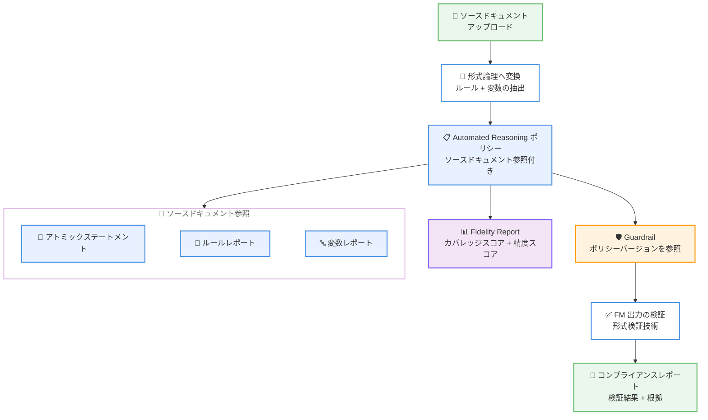

# Amazon Bedrock - Automated Reasoning ポリシーのソースドキュメント参照機能

**リリース日**: 2026 年 2 月 23 日
**サービス**: Amazon Bedrock
**機能**: Automated Reasoning policies with source document references

📊 [このアップデートのインフォグラフィックを見る](https://takech9203.github.io/aws-news-summary/20260223-automated-reasoning-policies-include-references.html)

## 概要

Amazon Bedrock の Automated Reasoning ポリシーにソースドキュメント参照機能が追加されました。この機能により、Automated Reasoning ポリシーの確認と改善が大幅に簡素化されます。Automated Reasoning チェックは形式検証技術を使用して、基盤モデル (FM) が生成したコンテンツのポリシー準拠を検証し、正しい LLM レスポンスの検出で最大 99% の精度を提供します。AI ハルシネーションの検出と曖昧性の検出において、数学的に証明可能な保証を実現します。

ユーザーは知識ドメインのルールを記述したドキュメント (人事ポリシー、財務ガイドラインなど) をアップロードし、これらのドキュメントは形式論理のルールと変数に変換されます。今回のソースドキュメント参照機能の追加により、生成されたポリシールールを元のドキュメント内容への参照を使用して確認できるようになりました。これにより、ポリシーの忠実度レポート (Fidelity Report) を通じて、抽出されたルールと変数がソースドキュメントのどの記述に基づいているかを正確に追跡できます。

**アップデート前の課題**

- ソースドキュメントから変換されたポリシールールが、元のドキュメントのどの記述に基づいているか確認が困難だった
- ポリシーの正確性を検証するには、形式論理の知識が必要で、非技術者にとって敷居が高かった
- ルールや変数の修正・改善にあたり、元のドキュメントとの対応関係を手動で確認する必要があった
- ポリシーのカバレッジと精度を定量的に評価する手段が限定的だった

**アップデート後の改善**

- 各ルールと変数がソースドキュメントの具体的な記述にリンクされ、根拠を即座に確認可能
- Fidelity Report により、カバレッジスコアと精度スコアでポリシーの品質を定量的に評価可能
- 非技術者のドメインエキスパートが形式論理を理解せずにポリシーを検証・改善可能
- ドキュメントのアトミックステートメント単位で、どのルール・変数に対応しているかを可視化

## アーキテクチャ図



ソースドキュメントをアップロードすると、Automated Reasoning が形式論理に変換し、ソースドキュメント参照付きのポリシーを生成します。Fidelity Report でポリシーの品質を評価し、Guardrail を通じて FM 出力の検証を行います。

## サービスアップデートの詳細

### 主要機能

1. **Fidelity Report の自動生成**
   - ソースドキュメントからポリシーを作成する際に自動的に生成される
   - カバレッジスコア (0.0 - 1.0): ソースドキュメントの記述がポリシーにどの程度反映されているかを示す
   - 精度スコア (0.0 - 1.0): ポリシールールがソースドキュメントの意図をどの程度正確に表現しているかを示す

2. **ルールレポート**
   - 各ルールに対して、根拠となるソースドキュメントの具体的な記述 (グラウンディングステートメント) を特定
   - 各記述がルールをどのように正当化するかの説明 (グラウンディングジャスティフィケーション) を提供
   - 個別の精度スコアと根拠を含む

3. **変数レポート**
   - 各変数の定義を裏付けるソースドキュメントの記述を特定
   - 根拠の説明と個別の精度スコアを提供

4. **ドキュメントソース**
   - ソースドキュメントをアトミックステートメント (個別の不可分な事実) に分解
   - 行番号でアノテーションし、元のドキュメントの正確な位置を追跡可能

## 技術仕様

### API 変更履歴

| 日付 | サービス | 変更内容 |
|------|----------|----------|
| 2026/02/23 | [Amazon Bedrock](https://awsapichanges.com/archive/changes/59176e-bedrock.html) | 4 updated methods - Fidelity Report 生成サポート、ポリシーカバレッジ評価用の新ワークフロータイプ、GetAutomatedReasoningPolicyBuildWorkflowResultAssets API に 3 つの新アセットタイプ追加 |

### 主要 API データ構造

| データ構造 | 説明 |
|-----------|------|
| AutomatedReasoningPolicyFidelityReport | ポリシーの精度とカバレッジを測定する包括的な分析レポート |
| AutomatedReasoningPolicyReportSourceDocument | 分析されたソースファイルのメタデータとアトミックステートメントを含む構造体 |
| AutomatedReasoningPolicyRuleReport | 各ルールのグラウンディング情報と精度スコアを含むレポート |

### Fidelity Report のフィールド

| フィールド | 型 | 説明 |
|-----------|------|------|
| accuracyScore | Double (0.0 - 1.0) | ポリシールールのソースドキュメントに対する精度 |
| coverageScore | Double (0.0 - 1.0) | ソースドキュメントの記述に対するポリシーのカバレッジ |
| documentSources | Array | ソースドキュメントのアトミックステートメントとアノテーション |
| ruleReports | Map | ルール識別子ごとの詳細な忠実度レポート |
| variableReports | Map | 変数名ごとの詳細な忠実度レポート |

### 検証結果の種類

| 結果 | 説明 |
|------|------|
| VALID | レスポンスがポリシールールに準拠 |
| INVALID | レスポンスがポリシールールに違反 |
| SATISFIABLE | レスポンスがルールと矛盾しないが、完全な検証ではない |
| IMPOSSIBLE | 入力条件がポリシーの公理と矛盾 |
| TRANSLATION_AMBIGUOUS | 自然言語から形式論理への変換が曖昧 |
| TOO_COMPLEX | 検証の複雑性が上限を超過 |

## 設定方法

### 前提条件

1. AWS アカウントと Amazon Bedrock へのアクセス権限
2. Automated Reasoning ポリシーを作成するための IAM 権限
3. ルールを記述したソースドキュメント (人事ポリシー、財務ガイドラインなど)

### 手順

#### ステップ 1: ソースドキュメントの準備

ソースドキュメントは以下の条件を満たすように準備します。

- 明確な構造 (見出し、箇条書きなど) を持つドキュメント
- 曖昧なルールを排除し、具体的な条件と結果を記述
- サイズ制限内に収める

#### ステップ 2: Automated Reasoning ポリシーの作成

```bash
# Amazon Bedrock コンソールで作成:
# 1. Bedrock コンソール → Guardrails → Automated Reasoning policies
# 2. "Create policy" を選択
# 3. ソースドキュメントをアップロード
# 4. オプションで処理指示を追加
# 5. ポリシーの作成を実行
```

ソースドキュメントをアップロードすると、Automated Reasoning がドキュメントの内容を形式論理のルールと変数に自動変換します。

#### ステップ 3: Fidelity Report の確認

```bash
# コンソールでの確認:
# 1. 作成されたポリシーの "Source Document" タブを開く
# 2. カバレッジスコアと精度スコアを確認
# 3. 各ルール・変数のグラウンディング情報を確認
# 4. 特定のルールや変数でフィルタリングして詳細を確認
```

Fidelity Report のカバレッジスコアと精度スコアを確認し、低スコアのルールや変数を特定して改善します。

#### ステップ 4: ポリシーの改善と Guardrail への適用

```python
import boto3

bedrock = boto3.client('bedrock', region_name='us-east-1')

# ポリシーバージョンを作成してデプロイ
response = bedrock.create_guardrail(
    name='my-guardrail',
    automatedReasoningPolicyConfig={
        'policyArn': 'arn:aws:bedrock:us-east-1:123456789012:automated-reasoning-policy/my-policy',
        'policyVersion': '1'
    }
)
```

改善が完了したポリシーのバージョンを作成し、Guardrail に適用します。

## メリット

### ビジネス面

- **ポリシー品質の可視化**: カバレッジスコアと精度スコアにより、ポリシーの品質を定量的に把握可能
- **ドメインエキスパートの活用**: 形式論理の知識がなくても、ソースドキュメント参照を通じてポリシーを検証・改善可能
- **コンプライアンスの強化**: FM が生成するコンテンツが最大 99% の精度でポリシーに準拠していることを検証可能
- **AI ハルシネーション対策**: 数学的に証明可能な保証により、AI の誤った回答を高精度で検出

### 技術面

- **トレーサビリティ**: 各ルールと変数をソースドキュメントの具体的な記述まで追跡可能
- **アトミックステートメント分解**: ドキュメントを不可分な事実に分解し、行番号でアノテーション
- **反復的改善**: Fidelity Report のフィードバックに基づいてポリシーを段階的に改善可能
- **形式検証**: SMT-LIB 構文による数学的に厳密なルール検証

## デメリット・制約事項

### 制限事項

- テスト生成は限定されたリージョンでのみ利用可能
- ソースドキュメントにはサイズ制限がある
- 各ポリシーは特定のドメインに焦点を当てるべきであり、複数の無関係な領域をカバーするポリシーは推奨されない
- 自然言語から形式論理への変換には変換エラーが含まれる可能性がある

### 考慮すべき点

- 変数の説明文が変換精度に最も大きく影響するため、適切な説明を記述することが重要
- ベアアサーション (if-then 構造を持たないルール) は公理を作成するため、意図しない IMPOSSIBLE 結果を引き起こす可能性がある
- 複雑なドメインでは反復的なポリシー構築が推奨される

## ユースケース

### ユースケース 1: 人事ポリシーのコンプライアンス検証

**シナリオ**: 企業の人事部門が、社員向け AI チャットボットの回答が人事ポリシー (休暇制度、福利厚生、就業規則など) に準拠しているかを検証する。

**実装例**:
```python
# 人事ポリシードキュメントから Automated Reasoning ポリシーを作成
# Fidelity Report で以下を確認:
# - カバレッジスコア: 休暇制度や福利厚生の全ルールがカバーされているか
# - 精度スコア: 変換されたルールが元のポリシーの意図を正確に表現しているか
# - ルールレポート: 各ルールのグラウンディングステートメントを確認
```

**効果**: 人事担当者が形式論理を理解せずに、ソースドキュメント参照を通じてポリシーの正確性を検証できる。AI チャットボットの回答が人事ポリシーに準拠していることを数学的に保証。

### ユースケース 2: 金融規制ガイドラインの準拠検証

**シナリオ**: 金融機関が、ローン審査や投資アドバイスを行う AI アシスタントの回答が金融規制ガイドラインに準拠しているかを検証する。

**実装例**:
```python
# 金融規制ガイドラインドキュメントをアップロード
# ルール例: ローン金額が 500,000 を超える場合、連帯保証人が必要
# (=> (> loanAmount 500000) requiresCosigner)

# Fidelity Report でルールのグラウンディングを確認
# - 元のガイドラインのどの条項に基づくルールかを参照
# - 精度スコアで変換の正確性を評価
```

**効果**: 規制対応チームがポリシーの忠実度を定量的に評価し、コンプライアンスリスクを低減。監査時にルールの根拠をソースドキュメントまで追跡可能。

### ユースケース 3: 製品仕様に基づく顧客サポート

**シナリオ**: 製品の仕様書や返品ポリシーをソースドキュメントとして使用し、顧客サポート AI の回答が正確な製品情報に基づいているかを検証する。

**実装例**:
```python
# 製品仕様書と返品ポリシーからポリシーを作成
# Fidelity Report の Source Document タブで:
# - アトミックステートメントの一覧を確認
# - 各ステートメントがどのルール・変数に対応しているかを確認
# - カバレッジスコアで仕様書の網羅性を評価
```

**効果**: 製品仕様の変更時に、ポリシーの更新箇所をソースドキュメント参照から特定できる。AI ハルシネーションによる誤った製品情報の提供を防止。

## 料金

Amazon Bedrock の Automated Reasoning チェックは、Guardrail の利用料金の一部として課金されます。Automated Reasoning ポリシーの作成と Fidelity Report の生成に追加料金は発生しません。検証リクエストごとに Guardrail の標準料金が適用されます。

詳細は [Amazon Bedrock 料金ページ](https://aws.amazon.com/bedrock/pricing/) を参照してください。

## 利用可能リージョン

テスト生成は以下のリージョンで利用可能です。

- US East (N. Virginia)
- US East (Ohio)
- US West (Oregon)
- Europe (Frankfurt)
- Europe (Ireland)
- Europe (Paris)

## 関連サービス・機能

- **Amazon Bedrock Guardrails**: Automated Reasoning ポリシーを適用して FM 出力を検証するためのフレームワーク
- **Amazon Bedrock Automated Reasoning チェック**: 形式検証技術を使用した FM コンテンツの準拠性検証機能
- **AWS Glue Data Catalog**: ポリシーが参照するナレッジベースのメタデータ管理に活用可能

## 参考リンク

- 📊 [インフォグラフィック](https://takech9203.github.io/aws-news-summary/20260223-automated-reasoning-policies-include-references.html)
- [公式発表 (What's New)](https://aws.amazon.com/about-aws/whats-new/2026/02/automated-reasoning-policies-include-references/)
- [ドキュメント - Fidelity Report](https://docs.aws.amazon.com/bedrock/latest/userguide/automated-reasoning-checks-concepts.html#ar-concept-fidelity-report)
- [Blog チュートリアル - Build reliable AI systems with Automated Reasoning on Amazon Bedrock](https://aws.amazon.com/blogs/machine-learning/build-reliable-ai-systems-with-automated-reasoning-on-amazon-bedrock-part-1/)
- [Amazon Bedrock Guardrails](https://aws.amazon.com/bedrock/guardrails/)
- [API 変更履歴](https://awsapichanges.com/archive/changes/59176e-bedrock.html)

## まとめ

Amazon Bedrock の Automated Reasoning ポリシーにソースドキュメント参照機能が追加されたことで、ポリシーの確認と改善のワークフローが大幅に改善されました。Fidelity Report のカバレッジスコアと精度スコアによりポリシーの品質を定量的に評価でき、各ルールと変数をソースドキュメントの具体的な記述まで追跡できます。形式論理の知識がない非技術者のドメインエキスパートでもポリシーを検証・改善できるようになり、AI ハルシネーション対策としての Automated Reasoning チェックの導入障壁が大きく低下しました。人事ポリシー、金融規制ガイドライン、製品仕様など、正確性が求められるドメインで FM を活用する組織にとって重要なアップデートです。
