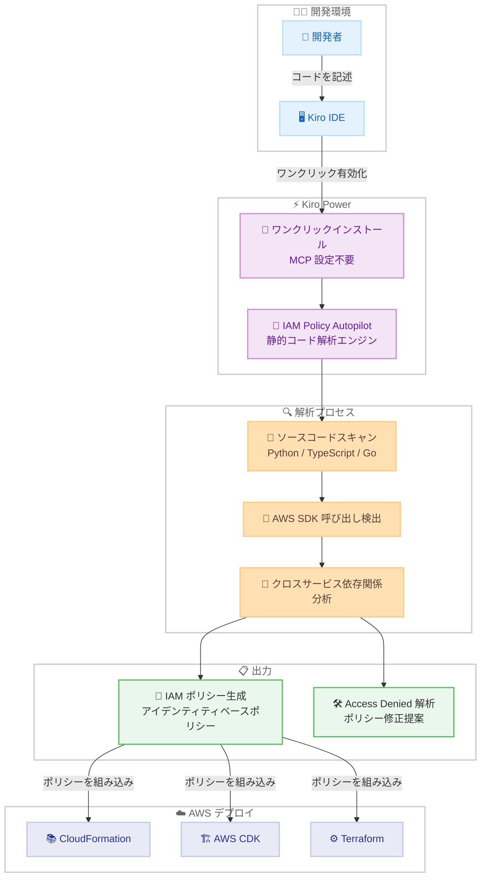

# AWS IAM Policy Autopilot - Kiro Power として利用可能に

**リリース日**: 2026 年 2 月 23 日
**サービス**: AWS IAM / Kiro
**機能**: IAM Policy Autopilot as Kiro Power

📊 [このアップデートのインフォグラフィックを見る](https://takech9203.github.io/aws-news-summary/20260223-aws-iam-policy-autopilot-kiro-power.html)

## 概要

re:Invent 2025 で発表されたオープンソースの静的コード解析ツール「AWS IAM Policy Autopilot」が、Kiro Power として利用可能になりました。Kiro IDE および Web インターフェースからワンクリックでインストールでき、手動での MCP サーバー設定が不要になります。これにより、開発者はアプリケーションコードから AWS IAM ポリシーのベースラインを迅速に作成し、アプリケーションの進化に合わせてポリシーを改善していくことができます。

IAM Policy Autopilot は、アプリケーションコードの AWS SDK 呼び出しを決定論的に解析し、アイデンティティベースの IAM ポリシーを生成するツールです。従来は MCP サーバーとして手動で設定する必要がありましたが、Kiro Power としての統合により、IDE 内でシームレスにポリシー生成が可能になりました。Python、TypeScript、Go のアプリケーションをサポートしています。

**アップデート前の課題**

- IAM Policy Autopilot を使用するには、MCP サーバーの手動設定が必要だった
- MCP クライアントの設定ファイルを編集し、コマンドや引数を正しく指定する必要があった
- セットアップの手間が、ツール導入の障壁となっていた

**アップデート後の改善**

- Kiro IDE および Web インターフェースからワンクリックでインストール可能に
- MCP サーバーの手動設定が不要になり、導入の障壁が大幅に低下
- AI アシスタント開発環境にシームレスに統合され、開発者の生産性が向上

## アーキテクチャ図



開発者が Kiro IDE で IAM Policy Autopilot Power をワンクリックで有効化すると、ソースコードの AWS SDK 呼び出しが自動的に解析され、必要な IAM ポリシーが生成されます。生成されたポリシーは CloudFormation、AWS CDK、Terraform などのインフラストラクチャコードに組み込むことができます。

## サービスアップデートの詳細

### 主要機能

1. **ワンクリックインストール**
   - Kiro IDE および Web インターフェースから直接インストール可能
   - MCP サーバーの手動設定が不要
   - 設定ファイルの編集やコマンドパスの指定が不要

2. **静的コード解析によるポリシー生成**
   - アプリケーションコードの AWS SDK 呼び出しを決定論的に解析
   - クロスサービス依存関係を自動検出 (例: S3 PutObject と KMS GenerateDataKey)
   - 構文的に正しく有効な IAM ポリシーを生成

3. **Access Denied トラブルシューティング**
   - テスト中の Access Denied エラーを検出
   - エラーの原因を分析し、ポリシー修正を提案
   - 開発者の承認後にポリシーを更新

4. **マルチ言語サポート**
   - Python アプリケーション
   - TypeScript アプリケーション
   - Go アプリケーション

### Kiro Power と従来の MCP サーバー設定の比較

| 項目 | Kiro Power | 従来の MCP サーバー設定 |
|------|-----------|----------------------|
| インストール方法 | ワンクリック | 手動設定ファイル編集 |
| MCP 設定 | 自動 | 手動で JSON 設定が必要 |
| 依存関係管理 | 自動 | uv または pip で手動インストール |
| アップデート | 自動 | 手動で更新 |
| 対象 IDE | Kiro IDE | Kiro, Claude Code, Cursor, Cline |

## 技術仕様

### IAM Policy Autopilot の解析フロー

| ステップ | 説明 |
|---------|------|
| 1. コードスキャン | アプリケーションのソースコードをローカルで解析 |
| 2. SDK 呼び出し検出 | AWS SDK の API 呼び出しを特定 |
| 3. IAM アクションマッピング | SDK 呼び出しを対応する IAM アクションにマッピング |
| 4. 依存関係解決 | クロスサービス依存関係を自動的に追加 |
| 5. ポリシー生成 | アイデンティティベースの IAM ポリシーを JSON 形式で出力 |

### 生成されるポリシーの例

```json
{
  "Version": "2012-10-17",
  "Statement": [
    {
      "Effect": "Allow",
      "Action": [
        "s3:PutObject",
        "s3:GetObject"
      ],
      "Resource": "arn:aws:s3:::*/*"
    },
    {
      "Effect": "Allow",
      "Action": [
        "kms:GenerateDataKey",
        "kms:Decrypt"
      ],
      "Resource": "*"
    }
  ]
}
```

### 解析スコープと制限事項

| 項目 | 対応状況 |
|------|---------|
| 直接的な AWS SDK 呼び出し | 対応 |
| クロスサービス依存関係 | 対応 |
| アイデンティティベースポリシー | 対応 |
| リソースベースポリシー | 非対応 |
| Permission Boundaries | 非対応 |
| SCP / RCP | 非対応 |
| ランタイム動的値の解決 | 非対応 |
| サードパーティライブラリ内の SDK 呼び出し | 非対応 |

## 設定方法

### 前提条件

1. Kiro IDE がインストールされていること
2. AWS アカウントと適切な IAM 権限があること

### 手順

#### ステップ 1: Kiro Power のインストール

Kiro IDE または [Kiro Powers ページ](https://kiro.dev/powers/) からワンクリックで IAM Policy Autopilot Power をインストールします。MCP サーバーの手動設定は不要です。

#### ステップ 2: ポリシー生成の実行

Kiro IDE でチャットセッションを開始し、IAM ポリシーの生成を依頼します。

```
「このアプリケーションに必要な IAM ポリシーを生成してください」
```

IAM Policy Autopilot がバックグラウンドでソースコードを解析し、必要な IAM ポリシーを生成します。

#### ステップ 3: ポリシーの確認と改善

生成されたポリシーを確認し、セキュリティ要件に合わせて改善します。IAM Policy Autopilot は機能性を優先したポリシーを生成するため、最小権限の原則に基づいてスコープダウンすることを推奨します。

```
「生成された IAM ポリシーを確認して、最小権限に調整してください」
```

#### 参考: 従来の MCP サーバー設定方法

Kiro 以外の IDE (Claude Code、Cursor、Cline) で使用する場合は、従来の MCP サーバー設定が必要です。

```json
{
  "mcpServers": {
    "iam-policy-autopilot": {
      "command": "uvx",
      "args": ["iam-policy-autopilot", "mcp-server"],
      "env": {
        "AWS_PROFILE": "your-profile-name",
        "AWS_REGION": "us-east-1"
      },
      "disabled": false,
      "autoApprove": []
    }
  }
}
```

## メリット

### ビジネス面

- **開発速度の向上**: IAM ポリシーの手動作成が不要になり、アプリケーション開発に集中可能
- **導入障壁の低下**: ワンクリックインストールにより、チーム全体での迅速な導入が可能
- **トラブルシューティング時間の短縮**: Access Denied エラーの原因を自動分析し、修正を提案

### 技術面

- **正確なポリシー生成**: 決定論的な静的解析により、AI の幻覚による不正確なポリシーを防止
- **最新の AWS サービス対応**: AWS サービスカタログの更新に追従し、最新の IAM アクションに対応
- **クロスサービス依存関係の自動検出**: S3 と KMS など、サービス間の複雑な権限関係を自動的に解決

## デメリット・制約事項

### 制限事項

- 生成されるポリシーはアイデンティティベースポリシーのみ。リソースベースポリシー、Permission Boundaries、SCP、RCP は非対応
- 機能性を優先したポリシーを生成するため、最小権限の原則に完全に準拠しているわけではない
- ランタイムで決定される動的な値 (バケット名など) の解決は非対応
- サードパーティライブラリ内の AWS SDK 呼び出しの検出は非対応

### 考慮すべき点

- 生成されたポリシーはベースラインであり、本番環境にデプロイする前にセキュリティ要件に合わせてスコープダウンする必要がある
- IAM Access Analyzer などの既存ツールと組み合わせて、継続的に最小権限に改善していくことが推奨される
- Kiro Power としてのインストールは Kiro IDE に限定される。その他の IDE では従来の MCP サーバー設定が必要

## ユースケース

### ユースケース 1: 新規 AWS プロジェクトの迅速な立ち上げ

**シナリオ**: 新しい Lambda ベースのアプリケーションを開発する際に、S3、DynamoDB、SQS などの複数の AWS サービスを使用する IAM ポリシーを迅速に作成する。

**実装例**:
```
「この Lambda 関数に必要な IAM ポリシーを生成して、CloudFormation テンプレートに組み込んでください」
```

**効果**: 手動で IAM ドキュメントを調査してポリシーを作成する時間を削減し、数分でベースラインポリシーを取得できます。

### ユースケース 2: プロトタイプの迅速なデプロイ

**シナリオ**: ハッカソンや PoC 開発で、IAM ポリシーの作成に時間をかけずにアプリケーションを迅速にデプロイする。

**実装例**:
```
「このアプリケーションをデプロイするために必要な IAM 権限をすべて生成してください」
```

**効果**: IAM の詳細な知識がなくても、動作するポリシーを迅速に生成し、プロトタイプのデプロイまでの時間を短縮できます。

### ユースケース 3: Access Denied エラーのトラブルシューティング

**シナリオ**: デプロイ後に Access Denied エラーが発生し、不足している権限を特定して修正する必要がある。

**実装例**:
```
「Access Denied エラーが発生しました。エラーメッセージを分析して、必要な IAM ポリシーの修正を提案してください」
```

**効果**: IAM Policy Autopilot がエラーを分析し、不足している権限を特定して修正案を提示します。手動でのエラー調査時間を大幅に短縮できます。

## 料金

IAM Policy Autopilot はオープンソースツールであり、追加料金はかかりません。Kiro Power としてのインストールおよび使用も無料です。開発者のローカルマシン上で動作するため、AWS リソースの使用料金も発生しません。

## 利用可能リージョン

IAM Policy Autopilot はローカルで動作する静的コード解析ツールのため、リージョンの制約はありません。生成されたポリシーはすべての AWS リージョンで使用可能です。

## 関連サービス・機能

- **AWS IAM Access Analyzer**: 未使用の権限を特定し、最小権限への改善を支援するサービス。IAM Policy Autopilot で生成したベースラインポリシーの継続的な改善に活用可能
- **AWS IAM**: ユーザー、グループ、ロールのアクセス制御を管理するサービス
- **Kiro IDE**: AI アシスタントを内蔵した AWS の開発環境。Kiro Power エコシステムにより、ツールの拡張が容易
- **AWS MCP Server**: MCP 互換 IDE から AWS サービスを操作するためのサーバー

## 参考リンク

- 📊 [インフォグラフィック](https://takech9203.github.io/aws-news-summary/20260223-aws-iam-policy-autopilot-kiro-power.html)
- [公式発表 (What's New)](https://aws.amazon.com/about-aws/whats-new/2026/02/aws-iam-policy-autopilot-kiro-power/)
- [GitHub リポジトリ](https://github.com/awslabs/iam-policy-autopilot)
- [Kiro Powers ページ](https://kiro.dev/powers/)
- [AWS News Blog - Simplify IAM policy creation with IAM Policy Autopilot](https://aws.amazon.com/blogs/aws/simplify-iam-policy-creation-with-iam-policy-autopilot-a-new-open-source-mcp-server-for-builders/)
- [AWS Security Blog - IAM Policy Autopilot: An open-source tool that brings IAM policy expertise to builders](https://aws.amazon.com/blogs/security/iam-policy-autopilot-an-open-source-tool-that-brings-iam-policy-expertise-to-builders-and-ai-coding-assistants/)

## まとめ

AWS IAM Policy Autopilot が Kiro Power として利用可能になったことで、開発者は MCP サーバーの手動設定を行うことなく、ワンクリックで IAM ポリシー生成機能を IDE に統合できるようになりました。re:Invent 2025 で発表されたこのオープンソースツールは、アプリケーションコードの AWS SDK 呼び出しを静的に解析し、正確で有効な IAM ポリシーのベースラインを生成します。生成されたポリシーは機能性を優先しているため、IAM Access Analyzer などのツールと組み合わせて最小権限に改善していくことが推奨されます。AWS 上でアプリケーションを開発するすべての開発者にとって、IAM ポリシー作成の負担を軽減する有用なツールです。
