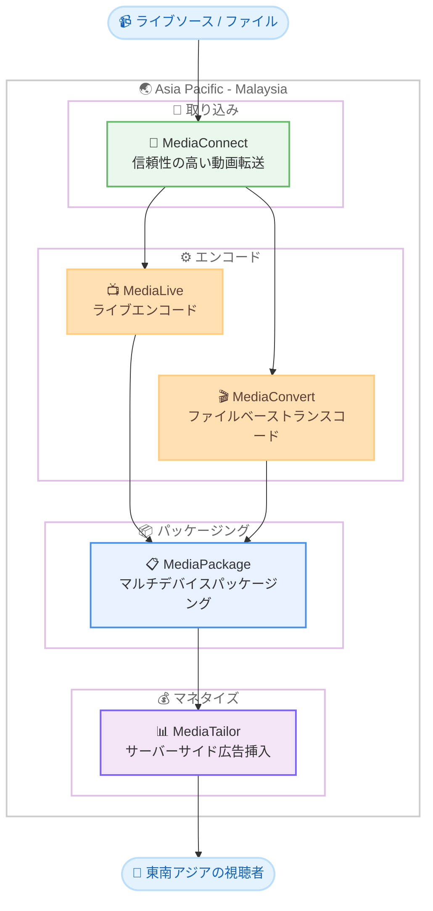

# AWS Elemental Media Services - Asia Pacific (Malaysia) リージョンで利用可能に

**リリース日**: 2026 年 2 月 23 日
**サービス**: AWS Elemental Media Services
**機能**: Asia Pacific (Malaysia) リージョン展開

📊 [このアップデートのインフォグラフィックを見る](https://takech9203.github.io/aws-news-summary/20260223-elemental-Malaysia.html)

## 概要

AWS Elemental Media Services が Asia Pacific (Malaysia) リージョンで利用可能になった。対象サービスは AWS Elemental MediaConnect、MediaLive、MediaPackage、MediaConvert、MediaTailor の 5 つであり、放送事業者、コンテンツプロバイダー、ストリーミングプラットフォームが東南アジアのエッジに近い場所で動画ワークロードを処理できるようになる。

これにより、東南アジアの視聴者に対するレイテンシーの削減と動画品質の向上が実現される。例えば、MediaLive や MediaConvert でエンコード、MediaPackage でパッケージング、MediaTailor でサーバーサイド広告挿入を行うエンドツーエンドのワークフローを、すべてマレーシアリージョン内で完結できるようになった。

**アップデート前の課題**

- 東南アジアの放送事業者やストリーミングプラットフォームは、動画処理のために Singapore や Tokyo など他のリージョンを使用する必要があった
- リージョン間のデータ転送によるレイテンシー増加と、エンドユーザー体験の低下が発生していた
- 東南アジア向けのライブ配信やリアルタイムストリーミングにおいて、エッジまでの距離が品質に影響していた

**アップデート後の改善**

- マレーシアリージョンで 5 つの Elemental Media Services を利用し、動画ワークロードをローカルに処理可能になった
- 東南アジアの視聴者に対するレイテンシーが削減され、ストリーミング品質が向上する
- エンコードからパッケージング、広告挿入までの完全なワークフローをマレーシアリージョン内で構築できるようになった

## アーキテクチャ図

マレーシアリージョン内で完結するエンドツーエンドの動画処理パイプラインを示す。MediaConnect で動画ソースを取り込み、MediaLive または MediaConvert でエンコード、MediaPackage でマルチデバイス向けにパッケージングし、MediaTailor でサーバーサイド広告挿入を行った上で、東南アジアの視聴者に配信する。

## サービスアップデートの詳細

### 主要機能

1. **AWS Elemental MediaConnect**
   - 信頼性の高いライブ動画転送サービス
   - ライブ動画ソースをマレーシアリージョンに取り込むための入口として機能
   - 衛星やファイバーからのフィードを受信し、クラウドベースのワークフローに接続

2. **AWS Elemental MediaLive**
   - リアルタイムのライブ動画エンコードサービス
   - ライブイベントやチャンネルの 24/7 配信向けエンコーディング
   - ABR (Adaptive Bitrate) エンコーディングにより多様なネットワーク環境に対応

3. **AWS Elemental MediaConvert**
   - ファイルベースの動画トランスコードサービス
   - VOD コンテンツの大規模一括トランスコード処理
   - 多様な入力フォーマットから配信用フォーマットへの変換

4. **AWS Elemental MediaPackage**
   - 動画のジャストインタイムパッケージングと配信準備
   - HLS、DASH、CMAF など複数のストリーミングフォーマットに対応
   - DRM 暗号化とコンテンツ保護機能を提供

5. **AWS Elemental MediaTailor**
   - サーバーサイド広告挿入 (SSAI) サービス
   - パーソナライズされた広告体験を視聴者に提供
   - 広告ブロッカーの影響を受けない広告配信を実現

## 技術仕様

### マレーシアリージョンで利用可能な Elemental Media Services

| サービス | 主な機能 | 主なユースケース |
|----------|----------|------------------|
| MediaConnect | ライブ動画転送 | 放送フィードの取り込み、ポイントツーポイント転送 |
| MediaLive | ライブエンコード | ライブイベント配信、24/7 チャンネル |
| MediaConvert | ファイルトランスコード | VOD コンテンツ変換、大規模一括処理 |
| MediaPackage | パッケージングと配信 | マルチデバイス対応、DRM 暗号化 |
| MediaTailor | サーバーサイド広告挿入 | パーソナライズド広告、チャンネルアセンブリ |

### ワークフローパターン

| パターン | 構成 | 説明 |
|----------|------|------|
| ライブ配信 | MediaConnect → MediaLive → MediaPackage → MediaTailor | ライブイベントのエンドツーエンド配信 |
| VOD 処理 | MediaConvert → MediaPackage → MediaTailor | ファイルベースコンテンツの変換と配信 |
| ハイブリッド | 上記の組み合わせ | ライブと VOD の両方に対応する統合ワークフロー |

## 設定方法

### 前提条件

1. AWS アカウントを保有していること
2. Asia Pacific (Malaysia) リージョン (ap-southeast-5) へのアクセスが有効であること
3. 各 Media Services の利用に必要な IAM 権限が設定されていること

### 手順

#### ステップ 1: マレーシアリージョンでの MediaLive チャンネル作成

AWS マネジメントコンソールでリージョンを Asia Pacific (Malaysia) に切り替え、MediaLive コンソールからチャンネルを作成する。入力ソースとして MediaConnect フローまたは直接入力を設定し、出力グループに MediaPackage を指定する。

#### ステップ 2: MediaPackage チャンネルの設定

MediaPackage コンソールでチャンネルを作成し、HLS や DASH などのエンドポイントを構成する。MediaLive の出力先として MediaPackage チャンネルの入力 URL を指定する。

#### ステップ 3: MediaTailor による広告挿入の設定

MediaTailor コンソールでプレイバック設定を作成し、MediaPackage のエンドポイント URL をコンテンツソースとして指定する。広告決定サーバー (ADS) の URL を設定し、パーソナライズされた広告挿入を有効にする。

## メリット

### ビジネス面

- **レイテンシーの削減**: 東南アジアの視聴者に対して、より近い場所から動画コンテンツを処理・配信することで、再生開始時間やバッファリングを改善
- **東南アジア市場への対応強化**: マレーシア、シンガポール、タイ、インドネシア、ベトナムなど東南アジア圏の視聴者に対する動画体験を向上
- **コスト最適化**: リージョン間のデータ転送を削減し、ネットワークコストを低減
- **広告収益の最大化**: MediaTailor をローカルリージョンで利用することで、地域に最適化された広告配信が可能

### 技術面

- **エッジ処理**: 動画ワークロードを東南アジアのエッジに近い場所で処理し、品質を向上
- **完全なパイプライン構築**: エンコードからパッケージング、広告挿入までをマレーシアリージョン内で完結
- **高可用性**: AWS のリージョナルインフラストラクチャにより、高い可用性と耐障害性を実現
- **スケーラビリティ**: 大規模イベントや視聴者数の急増に対して自動的にスケーリング

## デメリット・制約事項

### 制限事項

- マレーシアリージョンで利用可能な Elemental Media Services は 5 つに限定されており、MediaStore など一部サービスは対象外
- 新しいリージョンであるため、初期段階ではサービスクォータがデフォルト値に設定されている可能性がある

### 考慮すべき点

- 既存の他リージョンで構築済みのワークフローからの移行には、入力ソースや CDN の設定変更が必要
- マルチリージョン構成で冗長化する場合は、MediaConnect のフェイルオーバー設計を検討する
- 東南アジアの各国における放送規制やコンテンツ規制への対応が別途必要

## ユースケース

### ユースケース 1: 東南アジア向けライブスポーツ配信

**シナリオ**: 東南アジアで人気の高いサッカーリーグや格闘技イベントをリアルタイムで配信する。マレーシアリージョンで MediaConnect により放送フィードを取り込み、MediaLive でエンコード、MediaPackage でパッケージング、MediaTailor で地域ごとにパーソナライズされた広告を挿入する。

**効果**: 東南アジアの視聴者に対するライブ配信のレイテンシーを大幅に削減し、リアルタイム性の高いスポーツ中継体験を提供できる。ローカルリージョンでの広告挿入により、地域に最適化された広告収益を確保可能。

### ユースケース 2: 東南アジアの OTT プラットフォーム

**シナリオ**: 東南アジア市場をターゲットとする OTT ストリーミングプラットフォームが、マレーシアリージョンで VOD コンテンツライブラリを処理する。MediaConvert で多言語字幕付きのコンテンツをトランスコードし、MediaPackage で各デバイス向けにパッケージングする。

**効果**: コンテンツ処理パイプライン全体をマレーシアリージョンに配置することで、東南アジア 6 億人以上の潜在的視聴者に対して低レイテンシーで高品質な VOD 体験を提供。リージョン間データ転送コストも削減される。

### ユースケース 3: 24/7 ニュースチャンネルの地域配信

**シナリオ**: 東南アジアの複数の国に向けて 24 時間ニュースチャンネルを配信する放送事業者が、マレーシアリージョンにプライマリワークフローを構築する。MediaLive で常時エンコードを実行し、MediaTailor で各国向けにローカライズされた広告を挿入する。

**効果**: マレーシアリージョンをハブとして東南アジア全域への 24/7 配信を低レイテンシーで実現。サーバーサイド広告挿入により、国ごとに異なる広告を配信し、広告収益を最大化。

## 料金

各 Elemental Media Services の料金はリージョンにより異なる。マレーシアリージョンの具体的な料金は各サービスの料金ページを参照。

| サービス | 課金モデル |
|----------|------------|
| MediaConnect | フロー時間とデータ転送量 |
| MediaLive | チャンネル時間と入出力設定 |
| MediaConvert | 出力時間とコーデック |
| MediaPackage | データ転送量とパッケージング処理量 |
| MediaTailor | 広告挿入リクエスト数 |

## 利用可能リージョン

AWS Elemental Media Services は複数の AWS リージョンで利用可能。今回、Asia Pacific (Malaysia) が追加された。最新のリージョン情報は [AWS Region Table](https://aws.amazon.com/about-aws/global-infrastructure/regional-product-services/) を参照。

## 関連サービス・機能

- **Amazon CloudFront**: マレーシアリージョンで処理した動画コンテンツをグローバルに配信する CDN
- **Amazon S3**: 動画ソースファイルの保存および MediaConvert の出力先として利用
- **AWS Elemental MediaStore**: 低レイテンシーのメディアストレージ (リージョン対応状況を別途確認)
- **Amazon CloudWatch**: Media Services の各メトリクスをモニタリングし、ワークフローの健全性を監視

## 参考リンク

- 📊 [インフォグラフィック](https://takech9203.github.io/aws-news-summary/20260223-elemental-Malaysia.html)
- [公式発表 (What's New)](https://aws.amazon.com/about-aws/whats-new/2026/02/elemental-Malaysia/)
- [AWS リージョン別サービス一覧](https://aws.amazon.com/about-aws/global-infrastructure/regional-product-services/)
- [AWS Elemental MediaLive](https://aws.amazon.com/medialive/)
- [AWS Elemental MediaConvert](https://aws.amazon.com/mediaconvert/)
- [AWS Elemental MediaPackage](https://aws.amazon.com/mediapackage/)
- [AWS Elemental MediaTailor](https://aws.amazon.com/mediatailor/)
- [AWS Elemental MediaConnect](https://aws.amazon.com/mediaconnect/)

## まとめ

AWS Elemental Media Services (MediaConnect、MediaLive、MediaPackage、MediaConvert、MediaTailor) が Asia Pacific (Malaysia) リージョンで利用可能になった。東南アジアの放送事業者、コンテンツプロバイダー、ストリーミングプラットフォームは、マレーシアリージョンでエンコードからパッケージング、広告挿入までの完全な動画処理パイプラインを構築できるようになる。これにより、東南アジアの視聴者に対するレイテンシーの削減と動画品質の向上が期待される。東南アジア市場向けの動画配信ワークフローを運用している組織は、マレーシアリージョンへのワークロード移行を検討することを推奨する。
