# Amazon Q Developer - 生成 AI ベースのアーティファクトによるリソース・コストデータの可視化

**リリース日**: 2026 年 2 月 23 日
**サービス**: Amazon Q Developer
**機能**: 生成 AI ベースのアーティファクト (リソースおよびコストデータの可視化)

📊 [このアップデートのインフォグラフィックを見る](https://takech9203.github.io/aws-news-summary/20260223-generative-ai-based-Amazon-Q-artifacts.html)

## 概要

AWS Management Console における Amazon Q Developer アーティファクト機能が一般提供 (GA) となりました。この機能は、生成 AI を活用した新しいユーザーエクスペリエンスであり、AWS リソースデータをテーブル形式で、コストデータをチャート形式で可視化できます。

今回のリリースでは、Q アイコンがナビゲーションバーに移動し、チャットパネルが左側に配置されるなど、AWS Management Console 全体での Amazon Q へのアクセス性が大幅に向上しています。ユーザーは自然言語で AWS リソースやコストに関する質問を行い、アーティファクトパネルでテーブルやチャートとして結果を確認できます。

**アップデート前の課題**

- AWS リソースの状態やコスト情報を確認するには、各サービスのコンソールを個別に開く必要があった
- リソース情報の一覧表示やコストの推移を確認するために、複数のダッシュボードやツールを切り替える必要があった
- コストデータのチャートによる可視化には AWS Cost Explorer や外部ツールを使う必要があった

**アップデート後の改善**

- 自然言語の質問だけでリソースデータをテーブル形式で即座に可視化
- コストデータを棒グラフ、折れ線グラフ、円グラフ、エリアチャートなどで自動描画
- ナビゲーションバーからワンクリックで Amazon Q にアクセスし、フルスクリーンモードで集中して作業可能

## アーキテクチャ図

```mermaid
flowchart LR
    subgraph User["👤 ユーザー"]
        Question["💬 自然言語で質問"]
    end

    subgraph Console["☁️ AWS Management Console"]
        direction TB
        QIcon["🔍 Q アイコン<br/>ナビゲーションバー"]
        ChatPanel["💬 チャットパネル<br/>左側に配置"]
        PromptLib["📚 プロンプトライブラリ<br/>サンプルプロンプト"]
    end

    subgraph AI["🧠 AI 処理"]
        NLP["📝 自然言語解析"]
        DataQuery["🔎 リソース・コスト<br/>データ取得"]
        Render["🎨 可視化レンダリング"]
    end

    subgraph Artifacts["📊 アーティファクトパネル"]
        direction LR
        Tables["📋 テーブル表示<br/>リソース一覧・ハイパーリンク"]
        Charts["📈 チャート表示<br/>棒グラフ・折れ線・円・エリア"]
        Tables ~~~ Charts
    end

    subgraph Details["🔗 リソース詳細"]
        ServiceConsole["🖥️ サービスコンソール<br/>リソース詳細ページ"]
    end

    Question --> QIcon
    QIcon --> ChatPanel
    PromptLib -.-> ChatPanel
    ChatPanel --> NLP
    NLP --> DataQuery
    DataQuery --> Render
    Render --> Artifacts
    Tables -->|"ハイパーリンク"| ServiceConsole

    classDef user fill:#E3F2FD,stroke:#BBDEFB,stroke-width:2px,color:#1565C0
    classDef console fill:none,stroke:#FF9900,stroke-width:2px,color:#232F3E
    classDef ai fill:#F3E5F5,stroke:#E1BEE7,stroke-width:2px,color:#4A148C
    classDef artifacts fill:none,stroke:#66BB6A,stroke-width:2px,color:#333333
    classDef detail fill:#DCEDC8,stroke:#C5E1A5,stroke-width:2px,color:#33691E
    classDef component fill:#FFE0B2,stroke:#FFCC80,stroke-width:2px,color:#5D4037
    classDef aicomponent fill:#E8EAF6,stroke:#C5CAE9,stroke-width:2px,color:#283593
    classDef artifactcomponent fill:#E9F7EC,stroke:#66BB6A,stroke-width:2px,color:#333333

    class User user
    class Console console
    class AI ai
    class Artifacts artifacts
    class Details detail
    class Question user
    class QIcon,ChatPanel,PromptLib component
    class NLP,DataQuery,Render aicomponent
    class Tables,Charts artifactcomponent
    class ServiceConsole detail
```



ユーザーが自然言語で質問すると、Amazon Q Developer がリソースやコストのデータを取得し、アーティファクトパネルにテーブルやチャートとして可視化します。テーブル内のハイパーリンクからリソースの詳細ページに直接遷移できます。

## サービスアップデートの詳細

### 主要機能

1. **リソースデータのテーブル可視化**
   - 自然言語の質問に基づき、AWS リソース情報をテーブル形式で表示
   - リソース名にハイパーリンクが付与され、サービスコンソールの詳細ページに直接遷移可能
   - 指定したプロパティに基づくカテゴリ別のリソース分類

2. **コストデータのチャート可視化**
   - コストおよび請求情報を棒グラフ、折れ線グラフ、円グラフ、エリアチャートで表示
   - 期間指定やインスタンスタイプ別、リージョン別などの分析が可能
   - コスト予測やフォーキャストの可視化にも対応

3. **改善されたコンソール体験**
   - Q アイコンがナビゲーションバーに移動し、コンソール内のどこからでもアクセス可能
   - チャットパネルが左側に配置され、アーティファクトパネルがその右側に表示
   - フルスクリーンのフォーカスモードで集中した作業体験を提供

4. **プロンプトライブラリ**
   - サンプルプロンプトを提供し、初めてのユーザーでもすぐに利用開始可能
   - テーブルまたはチャートの応答タイプでフィルタリング可能
   - リソース情報、請求推奨、セキュリティコンプライアンスなどのカテゴリ別に整理

## 技術仕様

### UI 構成

| 要素 | 配置 | 説明 |
|------|------|------|
| Q アイコン | ナビゲーションバー (検索の横) | Amazon Q チャットへのエントリーポイント |
| チャットパネル | 左側 | 自然言語での質問入力と応答表示 |
| アーティファクトパネル | チャットパネルの右側 | テーブル・チャートの可視化表示 |
| プロンプトライブラリ | チャットパネル右上のアイコン | サンプルプロンプトの一覧 |

### サポートされる可視化タイプ

| タイプ | 用途 | 例 |
|--------|------|------|
| テーブル | リソース情報の一覧表示 | EC2 インスタンス一覧、S3 バケット一覧 |
| 棒グラフ | コストの比較 | インスタンスタイプ別コスト |
| 折れ線グラフ | コストの推移 | 月別コスト推移 |
| 円グラフ | コストの内訳 | サービス別コスト割合 |
| エリアチャート | コストの累積推移 | リージョン別コスト推移 |

### データ保存

| 項目 | 詳細 |
|------|------|
| データ保存先 | us-east-1 |
| 保存対象 | Amazon Q の可視化に関連するすべてのデータ |

## 設定方法

### 前提条件

1. AWS アカウントへのアクセス権限
2. Amazon Q Developer チャットの利用に必要な IAM 権限 ([Allow users to chat with Amazon Q](https://docs.aws.amazon.com/amazonq/latest/qdeveloper-ug/id-based-policy-examples-users.html#id-based-policy-examples-allow-chat) を参照)
3. コストに関する質問を行う場合は、コストチャットの権限設定 ([Chatting about your costs](https://docs.aws.amazon.com/amazonq/latest/qdeveloper-ug/chat-costs.html#cost-chat-getting-started) を参照)

### 手順

#### ステップ 1: Amazon Q にアクセス

1. AWS Management Console にサインイン
2. ナビゲーションバー (統合ナビゲーションバー) の Q アイコンを選択
3. チャットパネルが左側に表示される

#### ステップ 2: 自然言語で質問を入力

チャットパネルに自然言語で質問を入力します。以下はサンプルプロンプトの例です。

**リソース情報の確認:**
```
List my running EC2 instances
```

**コスト情報の可視化:**
```
Show me RDS costs by instance type over the last 6 months
```

Amazon Q が可視化が有効と判断した場合、チャットパネルの右側にアーティファクトパネルが自動的に表示されます。

#### ステップ 3: アーティファクトの活用

1. テーブル表示の場合、リソース名のハイパーリンクをクリックしてサービスコンソールの詳細ページに遷移
2. チャート表示の場合、棒グラフ、折れ線グラフ、円グラフ、エリアチャートでコストデータを確認
3. 必要に応じてフルスクリーンモードに拡大し、集中して分析

## メリット

### ビジネス面

- **意思決定の迅速化**: リソースの状態やコストの傾向を自然言語の質問だけで即座に把握でき、迅速な意思決定を支援
- **運用効率の向上**: 複数のコンソールやダッシュボードを切り替える必要がなくなり、日常的なリソース確認作業の効率が向上
- **コスト最適化の促進**: コストデータのチャート可視化により、コスト削減の機会を直感的に発見可能

### 技術面

- **シームレスなアクセス**: ナビゲーションバーからワンクリックでアクセスでき、コンソール内のどのページからでも利用可能
- **ディープリンク連携**: テーブル内のリソースからサービスコンソールの詳細ページに直接遷移可能
- **フルスクリーンモード**: 大量のリソースやチャートを分析する際に、集中した作業環境を提供

## デメリット・制約事項

### 制限事項

- 可視化に関連するすべてのデータが us-east-1 に保存されるため、データレジデンシー要件がある場合は考慮が必要
- 生成 AI ベースの機能であるため、応答内容が常に正確であるとは限らない
- Amazon Q Developer が利用可能なリージョンでのみ提供

### 考慮すべき点

- コストに関する質問を行う場合は、別途コストチャットの権限設定が必要
- 複雑なクエリや大量のリソースを対象とする場合、応答に時間がかかる可能性がある
- チャートの種類は Amazon Q が自動的に選択するため、特定のチャートタイプを強制的に指定できない場合がある

## ユースケース

### ユースケース 1: タグベースのリソース棚卸し

**シナリオ**: 運用チームが本番環境のリソースを一括で確認し、タグ付けの漏れを特定したい

**手順**:
1. Amazon Q チャットパネルを開く
2. 「List S3 buckets with tag value production」と入力
3. アーティファクトパネルに本番タグが付いた S3 バケットの一覧がテーブル形式で表示される
4. 各バケット名のハイパーリンクをクリックして S3 コンソールで詳細を確認

**効果**: 複数のサービスコンソールを個別に確認する手間が省け、タグベースのリソース棚卸しを効率的に実施可能

### ユースケース 2: インスタンスタイプ別コスト分析

**シナリオ**: 財務担当者が RDS のインスタンスタイプ別コストを可視化し、コスト最適化の機会を特定したい

**手順**:
1. Amazon Q チャットパネルを開く
2. 「Show me RDS costs by instance type over the last 6 months」と入力
3. アーティファクトパネルに棒グラフまたは折れ線グラフでインスタンスタイプ別のコスト推移が表示される
4. コストの高いインスタンスタイプを特定し、リザーブドインスタンスの購入や Right Sizing を検討

**効果**: AWS Cost Explorer を開くことなく、チャットベースの自然な対話でコスト分析が可能。チャート表示により傾向を直感的に把握

### ユースケース 3: セキュリティコンプライアンスの確認

**シナリオ**: セキュリティエンジニアが EC2 インスタンスのインターネットアクセス状況を確認し、不要な公開設定を特定したい

**手順**:
1. Amazon Q チャットパネルを開く
2. 「Check traffic and internet accessibility to EC2 resources」と入力
3. アーティファクトパネルにインターネットアクセス可能な EC2 インスタンスの一覧がテーブル形式で表示される
4. 各インスタンスのハイパーリンクからセキュリティグループやネットワーク設定を確認

**効果**: セキュリティ監査のための情報収集を迅速化し、意図しないインターネット公開の早期発見に貢献

### ユースケース 4: コスト予測の可視化

**シナリオ**: 経営層に向けて今後のクラウドコスト予測を可視化したレポートを準備したい

**手順**:
1. Amazon Q チャットパネルを開く
2. 「Show me a line chart of my forecasted costs for the next 6 months」と入力
3. アーティファクトパネルに折れ線グラフでコスト予測が表示される
4. フルスクリーンモードに拡大して詳細を確認し、スクリーンショットをレポートに活用

**効果**: 専用のコスト分析ツールを使わずに、自然言語の質問だけでコスト予測チャートを即座に生成可能

## 料金

Amazon Q Developer アーティファクト機能は、Amazon Q Developer の利用料金に含まれます。詳細は [Amazon Q Developer 料金ページ](https://aws.amazon.com/q/developer/pricing/) を参照してください。

## 利用可能リージョン

Amazon Q Developer アーティファクトは、Amazon Q Developer が利用可能なすべての AWS リージョンで提供されます。

利用可能なリージョンの一覧は [Amazon Q Developer リージョン](https://docs.aws.amazon.com/amazonq/latest/qdeveloper-ug/regions.html) を参照してください。

**注意**: 可視化に関連するすべてのデータは us-east-1 に保存されます。

## 関連サービス・機能

- **Amazon Q Developer**: AWS Management Console に統合された生成 AI アシスタント
- **AWS Cost Explorer**: コストと使用状況の詳細な分析・可視化ツール
- **AWS Resource Explorer**: AWS リソースの検索・発見サービス
- **Amazon Q Developer コスト分析**: コストに関する質問への AI ベースの応答機能

## 参考リンク

- 📊 [インフォグラフィック](https://takech9203.github.io/aws-news-summary/20260223-generative-ai-based-Amazon-Q-artifacts.html)
- [公式発表 (What's New)](https://aws.amazon.com/about-aws/whats-new/2026/02/generative-ai-based-Amazon-Q-artifacts/)
- [ドキュメント - Amazon Q Developer Artifacts](https://docs.aws.amazon.com/amazonq/latest/qdeveloper-ug/chat-artifacts.html)
- [Amazon Q Developer リージョン](https://docs.aws.amazon.com/amazonq/latest/qdeveloper-ug/regions.html)

## まとめ

Amazon Q Developer アーティファクトの一般提供により、AWS Management Console 上で自然言語の質問だけで AWS リソースやコストデータを可視化できるようになりました。リソース情報はテーブル形式でハイパーリンク付きで表示され、コストデータは棒グラフ、折れ線グラフ、円グラフ、エリアチャートで描画されます。Q アイコンのナビゲーションバーへの移動やフルスクリーンモードなど、コンソール体験全体の改善も含まれています。プロンプトライブラリにより初めてのユーザーでもすぐに利用を開始でき、日常的なリソース管理やコスト分析の効率化に大きく貢献する機能です。AWS リソースの運用管理やコスト最適化に携わるチームは、この機能の活用を積極的に検討することを推奨します。
