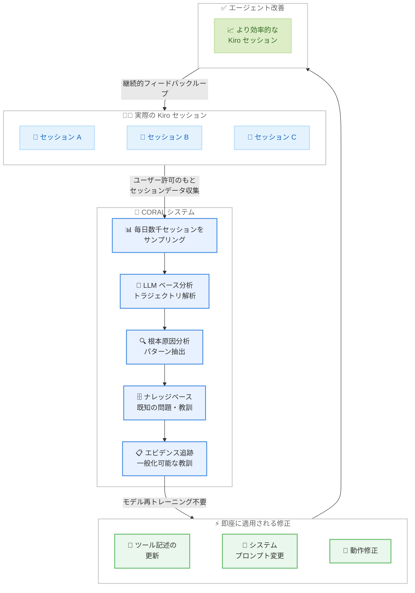

# Kiro - CORAL による AI コーディングエージェントの隠れた非効率性の発見と改善

**リリース日**: 2026 年 2 月 23 日
**サービス**: Kiro
**機能**: CORAL - Continual Optimization via Reasoning and Adaptive Learning

📊 [このアップデートのインフォグラフィックを見る](https://takech9203.github.io/aws-news-summary/20260223-kiro-hidden-inefficiencies-ai-coding.html)

## 概要

Kiro が CORAL (Continual Optimization via Reasoning and Adaptive Learning) に関する技術ブログを公開しました。CORAL は、AI コーディングエージェントの隠れた非効率性を発見し修正するための内部システムです。従来のベンチマークでは「合格/不合格」のバイナリ評価しかできず、タスクが合格しても背後でエージェントが無駄なターンを繰り返している問題を検出できませんでした。

CORAL はトラジェクトリベース学習というアプローチを採用しています。コードがコンパイルできたかどうかだけでなく、エージェントが取ったすべてのアクション (ツール呼び出し、判断ポイント、リカバリー試行) の完全なシーケンスを分析します。同じタスクでも 5 つのクリーンなステップで完了するケースと 17 の無駄なステップを経るケースでは、品質が大きく異なります。

**アップデート前の課題**

- ベンチマークは合格/不合格のバイナリ評価のみで、エージェントの非効率性を検出できなかった
- エージェントが壊れたパターンで無駄なターンを消費しても、最終的にタスクが完了すれば問題として認識されなかった
- ツール記述の微細な不整合がエージェントの動作に与える影響を体系的に把握する手段がなかった
- 改善にはモデルの再トレーニングが必要と考えられており、迅速な修正が困難だった

**アップデート後の改善**

- 毎日数千の実際の Kiro セッションをサンプリングし、LLM ベースの分析で根本原因を特定
- トラジェクトリベースの評価により、タスク完了だけでなくプロセスの効率性も計測可能に
- ツール記述の更新、システムプロンプトの変更、動作修正など、モデル再トレーニング不要で即座に修正を適用
- grep 検索パターンの不正率を 26.1% から 0.3% に改善するなど、具体的な成果を達成

## アーキテクチャ図

CORAL は継続的なフィードバックループとして機能します。実際の Kiro セッションからデータを収集し、LLM ベースの分析で非効率性の根本原因を特定し、ナレッジベースと照合した上で、ツール記述やシステムプロンプトの修正を即座に適用します。修正されたエージェントがより効率的なセッションを生み出し、そのデータが再び CORAL に入力されるという循環的な改善プロセスです。

## サービスアップデートの詳細

### CORAL システムの概要

CORAL (Continual Optimization via Reasoning and Adaptive Learning) は、Kiro の AI コーディングエージェントを本番環境レベルで継続的に最適化するための内部システムです。

### ベンチマークの限界

従来の AI コーディングエージェント評価は、合格/不合格のバイナリメトリクスに依存していました。しかし、この評価方法には根本的な限界があります。

- タスクが「合格」しても、エージェントが壊れたパターンで無駄なターンを消費している可能性がある
- 最終結果が正しければプロセスの非効率性が見逃される
- エージェントの実際のユーザー体験を正確に反映しない

### トラジェクトリベース学習

CORAL の核心は、コードがコンパイルできたかどうかだけでなく、エージェントが取ったアクションの完全なシーケンス (トラジェクトリ) を分析することです。

- すべてのツール呼び出しを記録・分析
- すべての判断ポイントを評価
- すべてのリカバリー試行を追跡
- 5 つのクリーンなステップで完了するタスクと、17 の無駄なステップを経るタスクを区別

### CORAL の動作プロセス

1. **セッションサンプリング**: ユーザーの許可のもと、毎日数千の実際の Kiro セッションをサンプリング
2. **LLM ベース分析**: サンプリングしたセッションを LLM を使用して分析し、非効率性のパターンを特定
3. **根本原因分析**: 個別の問題から一般化可能な教訓を抽出
4. **ナレッジベース照合**: 既知の問題・教訓のナレッジベースと照合し、新しい知見かどうかを判定
5. **エビデンス追跡**: 証拠を蓄積し、修正の優先順位を決定
6. **修正の即時適用**: ツール記述の更新、システムプロンプトの変更、動作修正を即座に適用。モデルの再トレーニングは不要

### 発見事例 1: サイレント検索失敗

CORAL が発見した最も具体的な問題は、grep 検索のサイレント失敗です。

- **問題**: 26.1% の grep 検索がサイレントに失敗していた
- **原因**: LLM は `*.py` パターンを生成する傾向があるが (ripgrep のデフォルト)、Kiro の検索 API は `**/*.py` パターンを必要とする
- **影響**: 検索失敗ごとにエージェントが約 5 回の追加ターンを消費
- **修正**: ツール記述の 1 行を変更
- **結果**: 不正パターン率が 26.1% から 0.3% に低下

### 発見事例 2: 体系的な問題の発見と修正

CORAL は、上記の検索パターン問題以外にも、体系的な非効率性を発見し修正しています。個別のエッジケースではなく、多くのセッションに共通するパターンを特定することで、広範囲に影響する改善を実現しています。

## 技術仕様

### CORAL のメトリクス改善実績

| メトリクス | 改善前 | 改善後 |
|-----------|--------|--------|
| grep 検索の不正パターン率 | 26.1% | 0.3% |
| 検索失敗時の追加ターン数 | 約 5 ターン/失敗 | ほぼ 0 |

### CORAL システムの特徴

| 項目 | 詳細 |
|------|------|
| データ収集方式 | ユーザー許可のもと毎日数千セッションをサンプリング |
| 分析手法 | LLM ベースの根本原因分析 |
| 評価方式 | トラジェクトリベース (アクションの完全シーケンスを分析) |
| 修正方法 | ツール記述更新、システムプロンプト変更、動作修正 |
| モデル再トレーニング | 不要 |
| 修正適用速度 | 即時 |
| ナレッジベース | 既知の問題・教訓を蓄積し重複を排除 |

## メリット

### ビジネス面

- **継続的改善**: 本番環境のデータに基づく継続的な最適化により、Kiro ユーザーのコーディング体験が日々向上する
- **迅速な問題解決**: モデルの再トレーニングなしに修正を即座に適用できるため、問題発見から解決までのサイクルが短い
- **データ駆動の品質管理**: 推測ではなく、実際のセッションデータに基づいて改善の優先順位を決定

### 技術面

- **トラジェクトリベース評価**: 合格/不合格のバイナリ評価を超えて、エージェントのプロセス効率を定量的に計測
- **モデル再トレーニング不要**: ツール記述やシステムプロンプトの変更で対応するため、再トレーニングのコストと時間を節約
- **一般化可能な教訓の抽出**: 個別の問題から広範囲に適用可能なパターンを特定し、体系的に改善
- **エビデンスベースの改善**: ナレッジベースとエビデンス追跡により、修正の根拠と効果を明確に管理

## ユースケース

### ユースケース 1: ファイル検索の効率化

**シナリオ**: 開発者が Kiro を使用してプロジェクト内のファイルを検索する際、エージェントが正しい検索パターンを最初から使用することで、無駄なリトライが発生しない。

**効果**: CORAL による修正前は、grep 検索の 26.1% がサイレントに失敗し、1 回の失敗あたり約 5 回の追加ターンを消費していた。修正後は不正パターン率が 0.3% に低下し、検索タスクの完了が大幅に高速化。

### ユースケース 2: コーディングタスクの高速完了

**シナリオ**: 開発者が Kiro にコード生成やリファクタリングを依頼する際、エージェントが効率的なステップでタスクを完了する。

**効果**: CORAL が非効率なパターンを継続的に検出・修正することで、同じタスクに対するエージェントのアクション数が削減され、タスク完了までの時間が短縮。ユーザーの待機時間が減少し、生産性が向上。

### ユースケース 3: 信頼性の高いツール使用

**シナリオ**: 開発者が Kiro の各種ツール (検索、ファイル操作、コード実行など) を使用する際、ツールが期待どおりに動作する。

**効果**: CORAL がツール記述の微細な不整合を検出・修正することで、エージェントがツールを正しく使用する割合が向上。サイレント失敗が減少し、ユーザーが予期しない動作に遭遇する頻度が低下。

## 利用可能リージョン

Kiro はグローバルに利用可能です。

## 関連サービス・機能

- **Kiro**: AI 搭載のソフトウェア開発環境。CORAL はその品質改善を支える内部システム
- **Amazon Bedrock**: AWS が提供する基盤モデルサービス。AI エージェントの構築基盤として関連
- **AI コーディングエージェント**: GitHub Copilot、Cursor、Claude Code など、AI を活用したコーディング支援ツール全般。CORAL のアプローチは業界全体の品質改善手法として参考になる

## 参考リンク

- 📊 [インフォグラフィック](https://takech9203.github.io/aws-news-summary/20260223-kiro-hidden-inefficiencies-ai-coding.html)
- [Kiro Blog - Hidden inefficiencies in AI coding](https://kiro.dev/blog/hidden-inefficiencies-ai-coding/)

## まとめ

Kiro の CORAL (Continual Optimization via Reasoning and Adaptive Learning) は、AI コーディングエージェントの品質改善に対する革新的なアプローチです。従来のベンチマークでは見逃されていた非効率性を、トラジェクトリベースの分析で検出し、モデルの再トレーニングなしに即座に修正を適用します。grep 検索パターンの不正率を 26.1% から 0.3% に改善した事例は、ツール記述の 1 行の変更がエージェント全体の効率に大きな影響を与えることを示しています。CORAL の継続的フィードバックループにより、Kiro ユーザーは日々改善されるコーディング体験を享受できます。
