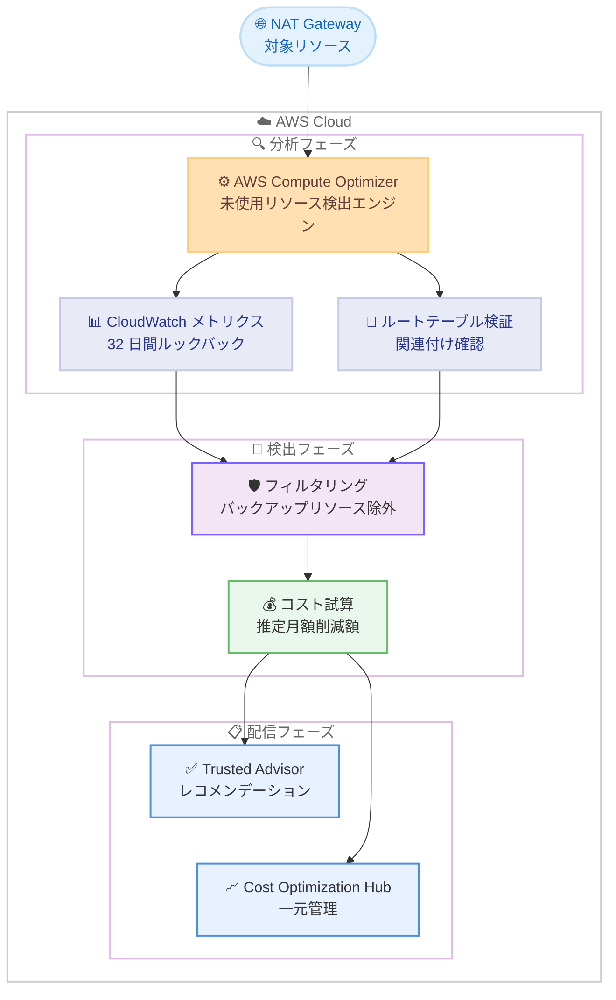

# AWS Trusted Advisor - Compute Optimizer を活用した未使用 NAT Gateway チェックの強化

**リリース日**: 2026 年 2 月 23 日
**サービス**: AWS Trusted Advisor
**機能**: Enhanced unused NAT Gateway checks powered by Compute Optimizer

📊 [このアップデートのインフォグラフィックを見る](https://takech9203.github.io/aws-news-summary/20260223-trusted-advisor-unused-nat-gateway-check.html)

## 概要

AWS Trusted Advisor が、AWS Compute Optimizer を活用した未使用 NAT Gateway の検出機能を強化しました。新しい検出方法では、32 日間のルックバック期間にわたって追加の CloudWatch メトリクスを分析し、NAT Gateway がルートテーブルに関連付けられているかを検証します。これにより、重要なバックアップリソースを誤ってフラグ付けすることを回避し、誤検知を大幅に削減します。各レコメンデーションには推定月額コスト削減額が含まれており、対応の優先順位付けが容易になります。

この機能は、2025 年 11 月にリリースされた AWS Compute Optimizer の未使用 NAT Gateway レコメンデーション機能を基盤としています。Compute Optimizer は、アクティブ接続数、VPC からの受信パケット数、宛先からの受信パケット数などの CloudWatch メトリクスを分析し、NAT Gateway が本当に未使用であるかを判定します。さらに、ルートテーブルとの関連付けを確認することで、ディザスタリカバリや高可用性のためのバックアップコンポーネントとして機能している NAT Gateway を保護します。これらのレコメンデーションは AWS Cost Optimization Hub と統合されており、組織全体の最適化機会を一元的に把握できます。

**アップデート前の課題**

- 従来の Trusted Advisor チェック (Inactive NAT Gateways) は、30 日間のデータ処理量のみで判定しており、検出精度が限定的だった
- ルートテーブルとの関連付けを確認しないため、バックアップ用途の NAT Gateway も未使用として誤検知される可能性があった
- コスト削減額の見積もりが提供されておらず、対応の優先順位付けが困難だった

**アップデート後の改善**

- Compute Optimizer が 32 日間にわたって複数の CloudWatch メトリクスを包括的に分析
- ルートテーブルとの関連付けを検証し、バックアップリソースの誤検知を回避
- 各レコメンデーションに推定月額コスト削減額が含まれ、優先順位付けが容易に
- Cost Optimization Hub との統合により、組織全体の最適化状況を一元管理

## アーキテクチャ図



AWS Compute Optimizer が CloudWatch メトリクスの分析とルートテーブルの検証を行い、バックアップリソースを除外したうえで、推定コスト削減額を含むレコメンデーションを Trusted Advisor および Cost Optimization Hub に配信します。

## サービスアップデートの詳細

### 主要機能

1. **Compute Optimizer を活用した高精度な検出**
   - 32 日間のルックバック期間で CloudWatch メトリクスを分析
   - アクティブ接続数、VPC からの受信パケット数、宛先からの受信パケット数を評価
   - 従来の 30 日間のデータ処理量のみの判定から大幅に精度が向上

2. **ルートテーブル関連付けの検証**
   - NAT Gateway が AWS ルートテーブルに関連付けられているかを確認
   - ディザスタリカバリや高可用性のためのバックアップリソースを保護
   - 誤検知を大幅に削減

3. **コスト削減額の見積もり**
   - 各レコメンデーションに推定月額コスト削減額を表示
   - 対応の優先順位付けが金額ベースで可能
   - Cost Optimization Hub で組織全体の重複排除された削減額を確認可能

4. **Trusted Advisor との統合**
   - Trusted Advisor コンソールで直接レコメンデーションを確認可能
   - Trusted Advisor API を通じたプログラマティックなアクセスも対応
   - 新しい statusReason 属性による詳細な理由の提供

## 技術仕様

### チェックの比較

| 項目 | Idle NAT gateways (新) | Inactive NAT Gateways (従来) |
|------|------------------------|------------------------------|
| Check ID | `c1z7kmr18n` | `c2vlfg022t` |
| ソース | AWS Cost Optimization Hub | Trusted Advisor 内部 |
| 分析エンジン | AWS Compute Optimizer | Trusted Advisor 独自 |
| ルックバック期間 | 32 日間 | 30 日間 |
| 分析メトリクス | アクティブ接続数、受信パケット数など複数 | データ処理量のみ |
| ルートテーブル検証 | あり | なし |
| コスト試算 | 推定月額削減額を表示 | なし |
| 前提条件 | Cost Optimization Hub + Compute Optimizer へのオプトイン | なし |

### 未使用判定の条件

NAT Gateway が未使用と判定されるには、32 日間のルックバック期間中に以下のすべての条件を満たす必要があります。

| 条件 | 確認内容 |
|------|----------|
| アクティブ接続なし | ActiveConnectionCount が 0 |
| VPC からの受信パケットなし | PacketsInFromSource が 0 |
| 宛先からの受信パケットなし | PacketsInFromDestination が 0 |
| ルートテーブル関連付けなし | いずれのルートテーブルにも関連付けられていない |

### レポートカラム

| カラム名 | 説明 |
|----------|------|
| Status | チェックステータス |
| Region | リソースのリージョン |
| Resource ID | NAT Gateway の ID |
| Recommended Action | 推奨アクション |
| Current Resource Summary | 現在のリソース概要 |
| Recommended Resource Summary | 推奨リソース概要 |
| Estimated Monthly Cost | 推定月額コスト |
| Estimated Monthly Savings | 推定月額削減額 |
| Last Refresh Timestamp | 最終更新日時 |

### API 変更履歴

| 日付 | サービス | 変更内容 |
|------|----------|----------|
| 2026/02/20 | [TrustedAdvisor Public API](https://awsapichanges.com/archive/changes/b4cc47-trustedadvisor.html) | 6 updated api methods - API レスポンスに新しい statusReason 属性を追加 |

statusReason 属性の追加により、レコメンデーションのステータスに関する詳細な理由をプログラマティックに取得可能になりました。

## 設定方法

### 前提条件

1. AWS Business Support、AWS Enterprise Support、または AWS Unified Operations プランに加入していること
2. Cost Optimization Hub へのオプトインが完了していること
3. AWS Compute Optimizer へのオプトインが完了していること
4. 適切な IAM 権限が設定されていること

### 手順

#### ステップ 1: AWS Compute Optimizer へのオプトイン

```bash
# Compute Optimizer へのオプトイン
aws compute-optimizer update-enrollment-status \
  --status Active
```

Compute Optimizer に未登録の場合、このコマンドでオプトインします。オプトイン後、24 時間以内に未使用 NAT Gateway のレコメンデーションが生成されます。

#### ステップ 2: Cost Optimization Hub へのオプトイン

```bash
# Cost Optimization Hub の有効化
# AWS Billing and Cost Management コンソールから以下を実施:
# 1. Cost Optimization Hub を選択
# 2. "Opt in" を選択して有効化
```

Cost Optimization Hub は AWS Billing and Cost Management コンソールからオプトインします。

#### ステップ 3: Trusted Advisor でのレコメンデーション確認

```bash
# Trusted Advisor でコスト最適化チェックの結果を取得
aws trustedadvisor list-recommendations \
  --pillar CostOptimizing \
  --source CostOptimizationHub
```

Trusted Advisor コンソールまたは API でレコメンデーションを確認します。Idle NAT gateways チェックの結果が表示されます。

#### ステップ 4: 個別リソースの詳細確認

```bash
# Compute Optimizer で未使用 NAT Gateway の詳細を確認
aws compute-optimizer get-idle-recommendations \
  --resource-type NatGateway
```

Compute Optimizer コンソールの「Idle resources」ページ、または API を使用して、未使用 NAT Gateway の詳細情報、推定削減額、使用率メトリクスを確認できます。

#### ステップ 5: 未使用 NAT Gateway の削除

```bash
# 未使用と確認された NAT Gateway を削除
aws ec2 delete-nat-gateway \
  --nat-gateway-id nat-xxxxxxxxxxxxxxxxx
```

レコメンデーションを確認し、ディザスタリカバリや高可用性の要件を考慮したうえで、本当に不要な NAT Gateway を削除します。削除前に、関連する Elastic IP アドレスの解放も検討してください。

## メリット

### ビジネス面

- **コスト最適化の精度向上**: Compute Optimizer の高度な分析により、本当に不要なリソースのみを特定し、安全にコスト削減を実現
- **優先順位付けの容易化**: 推定月額コスト削減額が表示されるため、最もインパクトの大きいリソースから対応可能
- **組織全体の可視化**: Cost Optimization Hub との統合により、マルチアカウント環境全体のコスト最適化機会を一元的に把握

### 技術面

- **誤検知の削減**: ルートテーブル関連付けの検証により、バックアップ用途のリソースを誤って削除対象にするリスクを最小化
- **包括的なメトリクス分析**: 複数の CloudWatch メトリクスを 32 日間にわたって分析し、より正確な未使用判定を実現
- **プログラマティックなアクセス**: Trusted Advisor API および Compute Optimizer API を通じて自動化ワークフローに統合可能

## デメリット・制約事項

### 制限事項

- Cost Optimization Hub と Compute Optimizer の両方へのオプトインが必須
- AWS Business Support 以上のサポートプランが必要
- レコメンデーション生成まで最大 24 時間かかる
- AWS GovCloud (US) リージョンおよび中国リージョンでは Compute Optimizer の未使用 NAT Gateway レコメンデーションが利用不可

### 考慮すべき点

- バックアップリソースの自動除外は完全ではない可能性がある。高可用性やディザスタリカバリのアーキテクチャを手動で確認してから NAT Gateway を削除すること
- NAT Gateway を削除すると、関連するプライベートサブネットからインターネットへのアウトバウンド通信が遮断される。削除前に依存関係を十分に確認すること
- NAT Gateway に関連付けられた Elastic IP アドレスは自動的には解放されない。別途解放の対応が必要

## ユースケース

### ユースケース 1: ワークロード移行後のリソースクリーンアップ

**シナリオ**: オンプレミスから AWS への移行プロジェクトが完了し、移行期間中に使用していた一時的な VPC やサブネットに NAT Gateway が残存している。

**実装例**:
```bash
# Trusted Advisor で未使用 NAT Gateway を確認
aws trustedadvisor list-recommendations \
  --pillar CostOptimizing \
  --source CostOptimizationHub

# 確認後、不要な NAT Gateway を削除
aws ec2 delete-nat-gateway \
  --nat-gateway-id nat-xxxxxxxxxxxxxxxxx

# 関連する Elastic IP の解放
aws ec2 release-address \
  --allocation-id eipalloc-xxxxxxxxxxxxxxxxx
```

**効果**: 移行完了後に不要になった NAT Gateway を確実に特定し、月額コストを削減。ルートテーブル検証により、まだ使用中のリソースを誤って削除するリスクを回避。

### ユースケース 2: マルチアカウント環境での定期コスト監査

**シナリオ**: 大規模な AWS Organizations 環境で、複数のアカウントにまたがる NAT Gateway のコスト最適化を定期的に実施したい。

**実装例**:
```bash
# Cost Optimization Hub で組織全体の未使用 NAT Gateway を確認
# AWS Billing and Cost Management コンソール → Cost Optimization Hub
# フィルタ: Resource type = NAT Gateway

# Compute Optimizer API で詳細を取得
aws compute-optimizer get-idle-recommendations \
  --resource-type NatGateway \
  --max-results 50
```

**効果**: Cost Optimization Hub の重複排除機能により、組織全体の正確なコスト削減額を把握。定期的な監査プロセスに組み込むことで、未使用リソースの蓄積を防止。

### ユースケース 3: 開発・テスト環境のコスト管理

**シナリオ**: 開発・テスト環境で一時的に作成された VPC の NAT Gateway が、テスト完了後もそのまま残っている。

**実装例**:
```bash
# 開発環境アカウントで未使用 NAT Gateway を確認
aws trustedadvisor list-recommendations \
  --pillar CostOptimizing \
  --source CostOptimizationHub

# タグベースでフィルタリングし、開発環境のリソースを特定
# Compute Optimizer コンソールでタグ情報を確認してから削除
```

**効果**: 開発・テスト環境で放置されがちな NAT Gateway を自動検出し、不要なコストを排除。NAT Gateway 1 つあたり月額約 $32 (東京リージョン、データ処理なしの場合) のコスト削減が可能。

## 料金

この機能自体に追加料金はかかりません。ただし、以下の前提条件が必要です。

| 項目 | 説明 |
|------|------|
| AWS Support プラン | Business Support 以上が必要 |
| AWS Compute Optimizer | 無料 (オプトインが必要) |
| Cost Optimization Hub | 無料 (オプトインが必要) |

NAT Gateway の料金参考。

| 項目 | 料金 (東京リージョン) |
|------|----------------------|
| NAT Gateway 時間あたり | $0.045/時間 (約 $32.40/月) |
| データ処理 | $0.045/GB |

詳細な料金については、[Amazon VPC 料金ページ](https://aws.amazon.com/vpc/pricing/) を参照してください。

## 利用可能リージョン

Trusted Advisor がサポートされているすべての AWS リージョンで利用可能です。ただし、Compute Optimizer の未使用 NAT Gateway レコメンデーション機能は AWS GovCloud (US) リージョンおよび中国リージョンでは利用できません。

## 関連サービス・機能

- **AWS Compute Optimizer**: 未使用 NAT Gateway の検出エンジン。CloudWatch メトリクスの分析とルートテーブル検証を実行
- **AWS Cost Optimization Hub**: 組織全体の最適化機会を一元管理し、重複排除されたコスト削減額を提供
- **Amazon CloudWatch**: NAT Gateway の使用率メトリクス (ActiveConnectionCount、PacketsInFromSource、PacketsInFromDestination) を収集
- **Amazon VPC**: NAT Gateway およびルートテーブルの管理

## 参考リンク

- 📊 [インフォグラフィック](https://takech9203.github.io/aws-news-summary/20260223-trusted-advisor-unused-nat-gateway-check.html)
- [公式発表 (What's New)](https://aws.amazon.com/about-aws/whats-new/2026/02/trusted-advisor-unused-nat-gateway-check/)
- [ドキュメント - Cost optimization checks: Idle NAT gateways](https://docs.aws.amazon.com/awssupport/latest/user/cost-optimization-checks.html#idle-nat-gateways)
- [API 変更履歴 - TrustedAdvisor](https://awsapichanges.com/archive/changes/b4cc47-trustedadvisor.html)
- [AWS Blog - Announcing Unused NAT Gateway Recommendations in AWS Compute Optimizer](https://aws.amazon.com/blogs/aws-cloud-financial-management/announcing-unused-nat-gateway-recommendations-in-aws-compute-optimizer/)
- [Compute Optimizer - Viewing idle resource recommendations](https://docs.aws.amazon.com/compute-optimizer/latest/ug/view-idle-recommendations.html)
- [NAT Gateway 料金](https://aws.amazon.com/vpc/pricing/)

## まとめ

AWS Trusted Advisor が Compute Optimizer を活用して未使用 NAT Gateway の検出精度を大幅に強化しました。32 日間のルックバック期間で複数の CloudWatch メトリクスを分析し、ルートテーブルとの関連付けを検証することで、誤検知を削減しながら確実なコスト最適化レコメンデーションを提供します。Cost Optimization Hub および Compute Optimizer へのオプトインが必要ですが、追加コストなしで利用可能です。NAT Gateway のコスト最適化を検討している場合は、Compute Optimizer と Cost Optimization Hub を有効化し、Trusted Advisor のレコメンデーションを定期的に確認することを推奨します。
