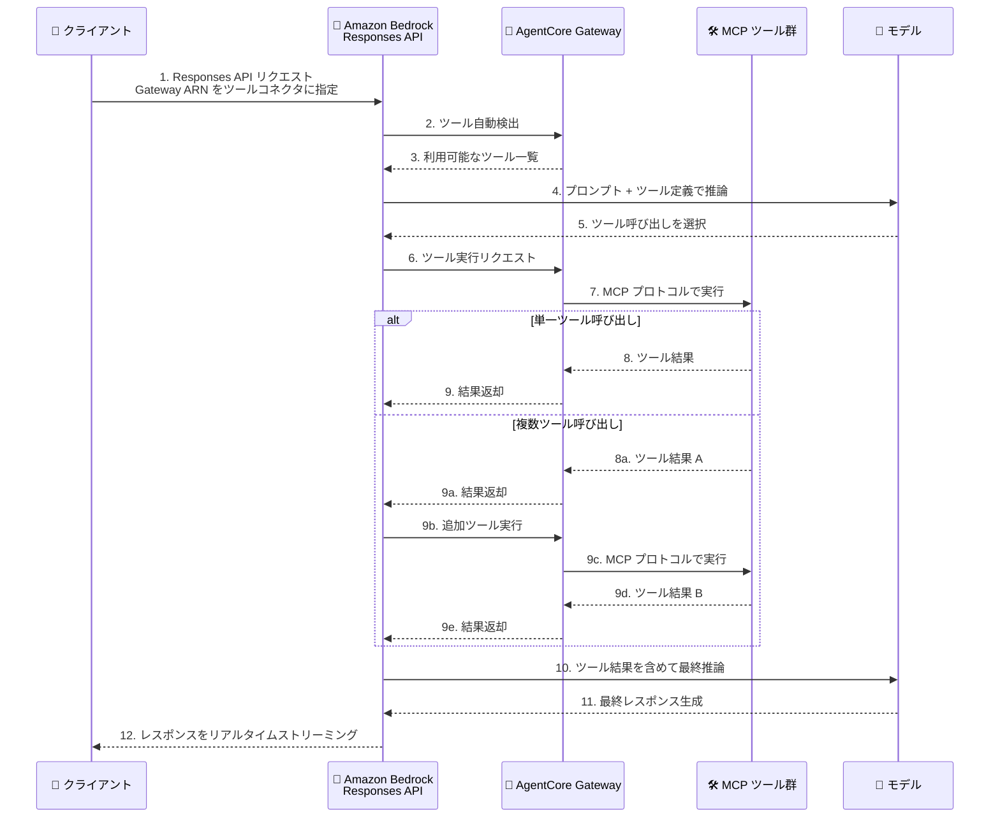

# Amazon Bedrock - AgentCore Gateway によるサーバーサイドツール実行

**リリース日**: 2026 年 2 月 24 日
**サービス**: Amazon Bedrock
**機能**: Server-side tool execution with AgentCore Gateway

📊 [このアップデートのインフォグラフィックを見る](https://takech9203.github.io/aws-news-summary/20260224-amazon-bedrock-server-side-tool-execution-agentcore-gateway.html)

## 概要

Amazon Bedrock が、Responses API において Amazon Bedrock AgentCore Gateway を統合したサーバーサイドツール実行をサポート開始しました。AgentCore Gateway の ARN をツールコネクタとして Responses API リクエストに指定することで、Amazon Bedrock がゲートウェイから利用可能なツールを自動的に検出し、推論中にモデルへ提示し、モデルが選択したツールをサーバーサイドで実行します。これらの処理はすべて単一の API コール内で完結します。

2026 年 1 月 29 日にリリースされたサーバーサイドカスタムツール (Lambda 関数ベース) に続く機能拡張であり、AgentCore Gateway の MCP サーバーコネクタタイプを活用することで、より高度なツール管理と検出機能を提供します。

**アップデート前の課題**

- クライアントサイドツールでは、開発者がツール呼び出しループを構築・維持する必要があった
- ツールの検出、選択、実行、結果注入をすべてクライアント側で実装する必要があり、アプリケーションの複雑性が増大していた
- 複数のツールソースを統合するために個別の接続管理が必要で、運用負荷が高かった
- クライアントとモデル間で複数回のラウンドトリップが発生し、レイテンシーが増加していた

**アップデート後の改善**

- AgentCore Gateway ARN を指定するだけで、Amazon Bedrock がツールの検出から実行まで自動処理
- クライアントサイドのツールオーケストレーションループが不要になり、アーキテクチャが大幅にシンプル化
- 単一の API コール内で複数のツール呼び出しが完結し、レイテンシーが削減
- ツール実行結果がリアルタイムでストリーミング返却
- 既存の AgentCore Gateway 設定と IAM 権限によるツールアクセス制御を維持

## アーキテクチャ図



この図は、クライアントが Responses API にリクエストを送信した後、Amazon Bedrock がサーバーサイドで AgentCore Gateway を通じてツールの検出、モデルによるツール選択、ツール実行、結果注入を自動的に処理するフローを示しています。すべての処理が単一の API コール内で完結し、結果はリアルタイムでストリーミングされます。

## サービスアップデートの詳細

### 主要機能

1. **自動ツール検出**
   - AgentCore Gateway ARN を指定するだけで、ゲートウェイに登録されたすべてのツールを自動検出
   - ツール定義をクライアント側で個別に管理する必要がない
   - セマンティック検索によるコンテキストに応じた最適なツール選択をサポート

2. **サーバーサイドツール実行**
   - Amazon Bedrock がモデルのツール選択に基づいてサーバーサイドでツールを実行
   - クライアントサイドのオーケストレーションループが不要
   - 単一の会話ターン内で複数のツール呼び出しをサポート

3. **MCP サーバーコネクタタイプ**
   - ツール定義に `type: "mcp"` を指定し、`connector_id` に Gateway ARN を設定
   - Model Context Protocol (MCP) 互換のツール接続を提供
   - Lambda 関数、API Gateway、OpenAPI スキーマ、MCP サーバーなど複数のターゲットタイプをサポート

4. **リアルタイムストリーミング**
   - ツール実行結果がリアルタイムでクライアントにストリーミング
   - `stream: true` を指定することでストリーミングレスポンスを受信可能
   - エージェント型ワークフローでの応答性を向上

## 技術仕様

### リクエスト構造

AgentCore Gateway をツールソースとして設定する場合、Responses API リクエストの `tools` 配列に以下の構造を使用します。

| パラメータ | 型 | 必須 | 説明 |
|-----------|------|------|------|
| `type` | string | Yes | `"mcp"` を指定 |
| `server_label` | string | Yes | リクエスト内でのツールコネクタの一意識別子 |
| `connector_id` | string | Yes | AgentCore Gateway の ARN |
| `server_description` | string | No | ゲートウェイが提供するツールの説明 |
| `require_approval` | string | Yes | `"never"` を指定 |

### 設定例

```json
{
  "model": "openai.gpt-oss-120b",
  "stream": true,
  "background": false,
  "store": false,
  "tools": [
    {
      "type": "mcp",
      "server_label": "agentcore_tools",
      "connector_id": "arn:aws:bedrock-agentcore:us-west-2:123456789012:gateway/my-gateway",
      "server_description": "AgentCore Gateway providing custom tools",
      "require_approval": "never"
    }
  ],
  "input": [
    {
      "type": "message",
      "role": "user",
      "content": [
        {
          "type": "input_text",
          "text": "Seattle の天気を教えてください"
        }
      ]
    }
  ]
}
```

### IAM 権限

Bedrock の実行ロールに AgentCore Gateway を呼び出す権限が必要です。

```json
{
  "Version": "2012-10-17",
  "Statement": [
    {
      "Effect": "Allow",
      "Action": [
        "bedrock-agentcore:InvokeGateway"
      ],
      "Resource": "arn:aws:bedrock-agentcore:us-west-2:123456789012:gateway/my-gateway"
    }
  ]
}
```

### Lambda 統合との比較

| 項目 | Lambda 統合 | AgentCore Gateway 統合 |
|------|------------|----------------------|
| ツール指定方法 | Lambda 関数 ARN | AgentCore Gateway ARN |
| ツール検出 | 手動定義 | 自動検出 |
| ツール管理 | 個別管理 | ゲートウェイで一元管理 |
| サポートするターゲット | Lambda 関数のみ | Lambda、API Gateway、OpenAPI、MCP サーバー |
| 認証 | IAM | IAM + OAuth フロー対応 |
| サードパーティ統合 | 個別実装 | Salesforce、Slack、Jira 等の 1 クリック統合 |

### サポートモデル

Responses API で利用可能なすべてのモデルがサポートされています。

## 設定方法

### 前提条件

1. AWS アカウントと Amazon Bedrock へのアクセス権限
2. AgentCore Gateway が作成・設定済みであること
3. Gateway に IAM 認証が設定されていること (Bedrock は IAM 認証のゲートウェイのみサポート)
4. Bedrock の実行ロールに `bedrock-agentcore:InvokeGateway` 権限が付与されていること

### 手順

#### ステップ 1: AgentCore Gateway の作成とツール設定

AgentCore Gateway を作成し、ツールターゲット (Lambda 関数、API Gateway ステージ、OpenAPI スキーマ、MCP サーバー) を設定します。

```bash
# AgentCore Gateway の作成例
aws bedrock-agentcore create-gateway \
  --gateway-name my-tools-gateway \
  --description "AI エージェント用ツールゲートウェイ" \
  --region us-west-2
```

Gateway には複数のツールソースを統合できます。Salesforce、Slack、Jira、Asana、Zendesk などのサードパーティツールは 1 クリックで統合可能です。

#### ステップ 2: IAM 権限の設定

Bedrock の実行ロールに AgentCore Gateway を呼び出す権限を付与します。

```json
{
  "Version": "2012-10-17",
  "Statement": [
    {
      "Effect": "Allow",
      "Action": [
        "bedrock-agentcore:InvokeGateway"
      ],
      "Resource": "arn:aws:bedrock-agentcore:us-west-2:123456789012:gateway/my-tools-gateway"
    }
  ]
}
```

#### ステップ 3: Responses API でツールコネクタを指定

Responses API リクエストで、AgentCore Gateway ARN を MCP サーバーコネクタとして指定します。

```python
from openai import OpenAI

client = OpenAI(
    base_url="https://bedrock-runtime.us-west-2.amazonaws.com/v1"
)

response = client.responses.create(
    model="openai.gpt-oss-120b",
    stream=True,
    tools=[
        {
            "type": "mcp",
            "server_label": "agentcore_tools",
            "connector_id": "arn:aws:bedrock-agentcore:us-west-2:123456789012:gateway/my-tools-gateway",
            "server_description": "AgentCore Gateway providing custom tools",
            "require_approval": "never"
        }
    ],
    input=[
        {
            "type": "message",
            "role": "user",
            "content": [
                {
                    "type": "input_text",
                    "text": "データベースから最新の売上レポートを取得してください"
                }
            ]
        }
    ]
)

for event in response:
    print(event)
```

Amazon Bedrock が自動的にゲートウェイからツールを検出し、モデルのツール選択に基づいてサーバーサイドで実行します。

## メリット

### ビジネス面

- **開発コストの削減**: クライアントサイドのツールオーケストレーションコードが不要になり、開発・保守コストを削減
- **市場投入の迅速化**: 数週間のカスタムコード開発が不要になり、エージェントアプリケーションの構築を加速
- **セキュリティの強化**: IAM 認証と Gateway ポリシーによる包括的なアクセス制御

### 技術面

- **レイテンシーの削減**: クライアントとモデル間のラウンドトリップが排除され、応答時間が短縮
- **アーキテクチャのシンプル化**: 単一の API コールでツール検出、選択、実行、結果注入が完結
- **一元的なツール管理**: AgentCore Gateway で複数のツールソースを統合し、単一エンドポイントで提供
- **フレームワーク互換性**: CrewAI、LangGraph、LlamaIndex、Strands Agents など主要フレームワークとの互換性
- **リアルタイムストリーミング**: ツール実行結果がストリーミングされ、ユーザーエクスペリエンスが向上

## デメリット・制約事項

### 制限事項

- AgentCore Gateway の事前セットアップが必要であり、ゲートウェイの作成、ターゲット設定、認証設定を行う必要がある
- Bedrock は IAM 認証が設定された AgentCore Gateway のみをサポート
- Responses API のみで利用可能であり、Converse API や Chat Completions API では利用不可
- `require_approval` パラメータは `"never"` のみサポート

### 考慮すべき点

- AgentCore Gateway のターゲット (Lambda 関数、API Gateway 等) の実行時間がツール実行のレイテンシーに影響する
- Gateway に登録するツール数が多い場合、ツール検出とモデルへの提示に影響する可能性がある
- AgentCore Gateway の料金が別途発生するため、コスト計画に含める必要がある
- 既存の Lambda ベースのサーバーサイドツールからの移行には、Gateway の設定と IAM 権限の更新が必要

## ユースケース

### ユースケース 1: マルチステップのエージェント型ワークフロー

**シナリオ**: AI エージェントがユーザーの質問に対して、データベースクエリ、外部 API 呼び出し、計算処理など複数のツールを組み合わせて回答を生成する。

**実装例**:
```python
response = client.responses.create(
    model="openai.gpt-oss-120b",
    stream=True,
    tools=[
        {
            "type": "mcp",
            "server_label": "enterprise_tools",
            "connector_id": "arn:aws:bedrock-agentcore:us-west-2:123456789012:gateway/enterprise-gateway",
            "server_description": "Enterprise tools including DB, CRM, and analytics",
            "require_approval": "never"
        }
    ],
    input=[
        {
            "type": "message",
            "role": "user",
            "content": [
                {
                    "type": "input_text",
                    "text": "過去 30 日間の売上トップ 10 の顧客と、各顧客の CRM ステータスを教えてください"
                }
            ]
        }
    ]
)
```

**効果**: Amazon Bedrock がデータベースクエリツールと CRM ツールを自動的に検出・実行し、単一の API コール内でマルチステップの処理を完結。クライアント側のオーケストレーションが不要になり、開発工数とレイテンシーを大幅に削減。

### ユースケース 2: 外部ツールを活用した RAG ワークフロー

**シナリオ**: ナレッジベース検索に加えて、外部の検索エンジンやドキュメント管理システムからリアルタイムで情報を取得し、回答の精度を向上させたい。

**実装例**:
```python
response = client.responses.create(
    model="openai.gpt-oss-120b",
    stream=True,
    tools=[
        {
            "type": "mcp",
            "server_label": "search_tools",
            "connector_id": "arn:aws:bedrock-agentcore:us-west-2:123456789012:gateway/search-gateway",
            "server_description": "Web search and document retrieval tools",
            "require_approval": "never"
        }
    ],
    input=[
        {
            "type": "message",
            "role": "user",
            "content": [
                {
                    "type": "input_text",
                    "text": "AWS の最新の AI サービスアップデートについて、技術ブログの情報を含めて教えてください"
                }
            ]
        }
    ]
)
```

**効果**: モデルが自動的に Web 検索ツールとドキュメント検索ツールを選択・実行し、最新の情報をリアルタイムで取得。クライアント側でのツール呼び出しと結果の注入が不要になり、シンプルなコードで高精度な RAG ワークフローを構築可能。

### ユースケース 3: SaaS ツール統合によるビジネス自動化

**シナリオ**: Salesforce、Slack、Jira などのビジネスツールを AI エージェントから統合的に操作し、業務プロセスを自動化したい。

**実装例**:
```python
response = client.responses.create(
    model="openai.gpt-oss-120b",
    stream=True,
    tools=[
        {
            "type": "mcp",
            "server_label": "business_tools",
            "connector_id": "arn:aws:bedrock-agentcore:us-west-2:123456789012:gateway/business-gateway",
            "server_description": "Salesforce, Slack, and Jira integration",
            "require_approval": "never"
        }
    ],
    input=[
        {
            "type": "message",
            "role": "user",
            "content": [
                {
                    "type": "input_text",
                    "text": "Salesforce から優先度の高い未対応案件を取得し、担当者に Slack で通知して、Jira にチケットを作成してください"
                }
            ]
        }
    ]
)
```

**効果**: AgentCore Gateway の 1 クリック統合機能を活用して Salesforce、Slack、Jira を統合し、単一の API コールでクロスプラットフォームの業務自動化を実現。カスタム統合コードの開発が不要になり、数週間の開発期間を短縮。

## 料金

Amazon Bedrock のサーバーサイドツール実行には、以下のサービスの料金がそれぞれ適用されます。

### Amazon Bedrock Responses API

- **モデル使用料**: トークン数に応じた従量課金 (使用モデルにより料金が異なる)

### Amazon Bedrock AgentCore Gateway

- **Gateway 使用料**: AgentCore Gateway のリクエスト数に応じた従量課金
- **ターゲット実行料**: Lambda 関数、API Gateway 等のターゲットサービスの料金が別途適用

### その他

- **データ転送料金**: リージョン間のデータ転送が発生する場合に適用
- **IAM**: 追加料金なし

詳細な料金については、[Amazon Bedrock 料金ページ](https://aws.amazon.com/bedrock/pricing/) および [Amazon Bedrock AgentCore 料金ページ](https://aws.amazon.com/bedrock/agentcore/pricing/) を参照してください。

## 利用可能リージョン

Amazon Bedrock Responses API と Amazon Bedrock AgentCore Gateway の両方が利用可能なすべての AWS リージョンで一般提供されています。

## 関連サービス・機能

- **Amazon Bedrock Responses API**: OpenAI API 互換のステートフル会話管理 API
- **Amazon Bedrock AgentCore Gateway**: MCP 互換のツール管理・検出・実行基盤
- **Amazon Bedrock サーバーサイドカスタムツール**: Lambda 関数ベースのサーバーサイドツール実行 (2026 年 1 月 29 日リリース)
- **Amazon Bedrock Converse API**: クライアントサイドツール使用をサポートする会話 API
- **AWS Lambda**: AgentCore Gateway のターゲットとして使用可能なサーバーレスコンピューティング基盤

## 参考リンク

- 📊 [インフォグラフィック](https://takech9203.github.io/aws-news-summary/20260224-amazon-bedrock-server-side-tool-execution-agentcore-gateway.html)
- [公式発表 (What's New)](https://aws.amazon.com/about-aws/whats-new/2026/02/amazon-bedrock-server-side-tool-execution-agentcore-gateway/)
- [Amazon Bedrock ドキュメント - ツール使用](https://docs.aws.amazon.com/bedrock/latest/userguide/tool-use.html)
- [AgentCore Gateway ドキュメント](https://docs.aws.amazon.com/bedrock-agentcore/latest/devguide/gateway.html)
- [関連発表 - サーバーサイドカスタムツール Responses API 対応](https://aws.amazon.com/about-aws/whats-new/2026/01/amazon-bedrock-server-side-custom-tools-responses-api/)
- [関連 API 変更](https://awsapichanges.com/archive/changes/59176e-bedrock.html)
- [Amazon Bedrock 料金ページ](https://aws.amazon.com/bedrock/pricing/)

## まとめ

Amazon Bedrock が AgentCore Gateway を統合したサーバーサイドツール実行をサポートしたことにより、エージェント型アプリケーションの開発がさらにシンプルになりました。Responses API リクエストに AgentCore Gateway ARN を MCP サーバーコネクタとして指定するだけで、Amazon Bedrock がツールの自動検出、モデルによるツール選択、サーバーサイド実行、結果のリアルタイムストリーミングを単一の API コール内で処理します。クライアントサイドのオーケストレーションループが不要になることで、アプリケーションの複雑性とレイテンシーが大幅に削減されます。AgentCore Gateway の一元的なツール管理、セマンティック検索によるツール検出、包括的な認証機能を活用することで、エンタープライズグレードのエージェントアプリケーションを効率的に構築できます。
