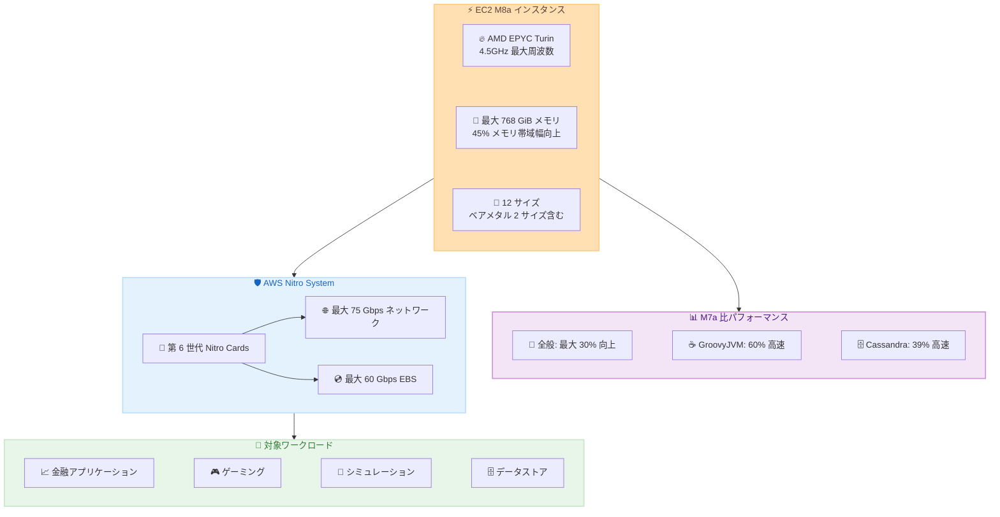

# Amazon EC2 - M8a インスタンスが Europe (Frankfurt) リージョンで利用可能に

**リリース日**: 2026 年 2 月 24 日
**サービス**: Amazon EC2
**機能**: M8a インスタンスの Europe (Frankfurt) リージョン展開

📊 [このアップデートのインフォグラフィックを見る](https://takech9203.github.io/aws-news-summary/20260224-amazon-ec2-m8a-instances-europe-frankfurt.html)

## 概要

Amazon EC2 M8a インスタンスが AWS Europe (Frankfurt) リージョンで利用可能になった。M8a インスタンスは第 5 世代 AMD EPYC プロセッサ (Turin) を搭載し、最大周波数 4.5GHz を実現する汎用インスタンスである。

M7a インスタンスと比較して最大 30% 高いパフォーマンスと最大 19% 優れたプライスパフォーマンスを提供する。メモリ帯域幅は M7a 比で 45% 向上しており、レイテンシに敏感なワークロードに最適である。GroovyJVM ベンチマークで最大 60% 高速、Cassandra ベンチマークで最大 39% 高速と、特定のワークロードでは大幅な性能向上を実現する。

M8a インスタンスは SAP 認定を取得しており、ベアメタル 2 サイズを含む 12 サイズで提供される。第 6 世代 AWS Nitro Cards 上に構築され、金融アプリケーション、ゲーミング、レンダリング、シミュレーション、中規模データストア、キャッシングフリートなどのワークロードに適している。

**アップデート前の課題**

- Europe (Frankfurt) リージョンでは M8a インスタンスが利用できなかった
- フランクフルトリージョンのお客様は M7a や他の汎用インスタンスタイプを使用する必要があった
- 欧州のお客様が AMD EPYC Turin プロセッサの性能を活用できるリージョンが限られていた

**アップデート後の改善**

- Europe (Frankfurt) で M8a インスタンスが利用可能になった
- M7a からの移行で最大 30% のパフォーマンス向上と 19% のプライスパフォーマンス改善を実現できる
- SAP 認定インスタンスがフランクフルトリージョンで利用可能になり、欧州のお客様の SAP ワークロードに対応

## アーキテクチャ図



M8a インスタンスは第 5 世代 AMD EPYC プロセッサ (Turin) と第 6 世代 AWS Nitro Cards を組み合わせ、金融アプリケーションやゲーミングなど多様なワークロードに対して高いパフォーマンスを提供します。

## サービスアップデートの詳細

### 主要機能

1. **第 5 世代 AMD EPYC プロセッサ (Turin)**
   - 最大周波数 4.5GHz
   - 各 vCPU は物理 CPU コア
   - AMD Secure Memory Encryption (SME) による AES-256 暗号化で常時メモリ暗号化

2. **パフォーマンス改善**
   - M7a 比で最大 30% 高いパフォーマンス
   - M7a 比で 45% 高いメモリ帯域幅
   - GroovyJVM: 最大 60% 高速
   - Cassandra: 最大 39% 高速
   - 最大 19% 優れたプライスパフォーマンス

3. **高性能インターフェース**
   - ネットワーク帯域幅: 最大 75 Gbps (M7a 比 50% 向上)
   - EBS 帯域幅: 最大 60 Gbps
   - インスタンスあたり最大 128 EBS ボリュームをサポート
   - Instance Bandwidth Configuration (IBC) 機能でネットワークまたは EBS 帯域幅を 25% ブースト可能

4. **SAP 認定**
   - SAP HANA ワークロードに対応
   - ミッションクリティカルなエンタープライズアプリケーションに適合

## 技術仕様

### インスタンスサイズ

| インスタンスサイズ | vCPU | メモリ (GiB) | ネットワーク帯域幅 (Gbps) | EBS 帯域幅 (Gbps) |
|-------------------|------|--------------|--------------------------|-------------------|
| m8a.medium | 1 | 4 | 最大 12.5 | 最大 10 |
| m8a.large | 2 | 8 | 最大 12.5 | 最大 10 |
| m8a.xlarge | 4 | 16 | 最大 12.5 | 最大 10 |
| m8a.2xlarge | 8 | 32 | 最大 15 | 最大 10 |
| m8a.4xlarge | 16 | 64 | 最大 15 | 最大 10 |
| m8a.8xlarge | 32 | 128 | 15 | 10 |
| m8a.12xlarge | 48 | 192 | 22.5 | 15 |
| m8a.16xlarge | 64 | 256 | 30 | 20 |
| m8a.24xlarge | 96 | 384 | 40 | 30 |
| m8a.48xlarge | 192 | 768 | 75 | 60 |
| m8a.metal-24xl | 96 | 384 | 40 | 30 |
| m8a.metal-48xl | 192 | 768 | 75 | 60 |

### パフォーマンス比較 (M7a 対比)

| 指標 | 改善率 |
|------|--------|
| 全般パフォーマンス | 最大 30% 向上 |
| プライスパフォーマンス | 最大 19% 向上 |
| メモリ帯域幅 | 45% 向上 |
| GroovyJVM ベンチマーク | 最大 60% 高速 |
| Cassandra ベンチマーク | 最大 39% 高速 |
| ネットワークスループット | 50% 向上 |

### 対応命令セット

M8a インスタンスは AVX-512、VNNI、bfloat16 命令セットをサポートしており、機械学習アルゴリズム、金融モデリング、高性能ビデオ処理、科学シミュレーションの効率的な実行が可能である。

## 設定方法

### 前提条件

1. Europe (Frankfurt) リージョンの AWS アカウントを保有していること
2. EC2 インスタンスの起動権限を持つ IAM ユーザーまたはロールがあること
3. 対象リージョンでの EC2 サービスクォータが確認済みであること

### 手順

#### ステップ 1: AWS CLI でインスタンスを起動

```bash
aws ec2 run-instances \
  --instance-type m8a.xlarge \
  --image-id ami-xxxxxxxxxxxxxxxxx \
  --key-name my-key-pair \
  --security-group-ids sg-xxxxxxxxxxxxxxxxx \
  --subnet-id subnet-xxxxxxxxxxxxxxxxx \
  --region eu-central-1
```

このコマンドは Europe (Frankfurt) リージョンで m8a.xlarge インスタンスを起動します。

#### ステップ 2: 利用可能なインスタンスサイズを確認

```bash
aws ec2 describe-instance-types \
  --filters "Name=instance-type,Values=m8a.*" \
  --region eu-central-1 \
  --query "InstanceTypes[].{Type:InstanceType,vCPU:VCpuInfo.DefaultVCpus,Memory:MemoryInfo.SizeInMiB}" \
  --output table
```

このコマンドは Europe (Frankfurt) リージョンで利用可能な M8a インスタンスタイプとスペックを表示します。

#### ステップ 3: 購入オプションを選択

M8a インスタンスは以下の購入オプションで利用可能です。

- **On-Demand**: 長期契約なしで時間単位の料金
- **Savings Plans**: 1 年または 3 年のコミットメントで割引
- **Spot インスタンス**: 未使用キャパシティを大幅な割引で利用

## メリット

### ビジネス面

- **コスト最適化**: M7a 比で最大 19% 優れたプライスパフォーマンスにより運用コストを削減
- **欧州リージョン対応**: フランクフルトリージョンでの提供により、GDPR 等の欧州データレジデンシー要件に対応しながら最新インスタンスを利用可能
- **SAP 認定**: SAP HANA などのミッションクリティカルなエンタープライズワークロードをフランクフルトリージョンで実行可能
- **柔軟なスケーリング**: 12 サイズ (1 vCPU から 192 vCPU) で多様なワークロードに対応

### 技術面

- **高い CPU 性能**: AMD EPYC Turin プロセッサで 4.5GHz の最大周波数を実現
- **メモリ帯域幅の向上**: M7a 比 45% のメモリ帯域幅向上により、データ集約型ワークロードが高速化
- **IBC 機能**: Instance Bandwidth Configuration でネットワークまたは EBS 帯域幅を 25% ブースト可能
- **常時暗号化**: AMD SME による AES-256 メモリ暗号化でセキュリティを強化

## デメリット・制約事項

### 制限事項

- M8a インスタンスはインスタンスストレージを持たない (EBS のみ)
- ローカル NVMe ストレージが必要な場合は他のインスタンスファミリーを検討する必要がある

### 考慮すべき点

- M7a からの移行時は、アプリケーションの互換性テストを実施することを推奨
- 既存の予約インスタンスや Savings Plans の適用状況を確認し、コスト最適化を図る
- 高周波数が特に重要なワークロードでは、5GHz の M8azn インスタンスも検討すべき (M8a 比で最大 24% 高い性能)

## ユースケース

### ユースケース 1: 金融アプリケーション

**シナリオ**: 欧州の金融機関が、リアルタイムのトランザクション処理システムをフランクフルトリージョンで稼働させたい

**実装例**:
```bash
aws ec2 run-instances \
  --instance-type m8a.24xlarge \
  --image-id ami-xxxxxxxxxxxxxxxxx \
  --region eu-central-1 \
  --placement AvailabilityZone=eu-central-1a \
  --network-interfaces "DeviceIndex=0,SubnetId=subnet-xxx,Groups=sg-xxx"
```

**効果**: M7a 比で最大 30% のパフォーマンス向上により、トランザクション処理速度が大幅に改善。Cassandra ベンチマークで 39% 高速化し、金融データベースの応答時間を短縮

### ユースケース 2: ゲームサーバー

**シナリオ**: ゲーム開発会社が欧州プレイヤー向けのゲームサーバーを運用

**実装例**:
```bash
aws ec2 run-instances \
  --instance-type m8a.8xlarge \
  --image-id ami-xxxxxxxxxxxxxxxxx \
  --region eu-central-1 \
  --instance-market-options MarketType=spot
```

**効果**: 4.5GHz の高周波数プロセッサにより、ゲームロジックの処理速度が向上。Spot インスタンスを活用することでコストを最適化しながら高い性能を実現

### ユースケース 3: SAP HANA ワークロード

**シナリオ**: 欧州の製造業企業が SAP HANA を M8a インスタンス上で稼働

**実装例**:
```bash
aws ec2 run-instances \
  --instance-type m8a.48xlarge \
  --image-id ami-sap-hana-xxxxxxxxx \
  --region eu-central-1 \
  --block-device-mappings "DeviceName=/dev/sda1,Ebs={VolumeSize=1000,VolumeType=gp3,Iops=16000}"
```

**効果**: SAP 認定の 192 vCPU、768 GiB メモリの大規模インスタンスで、SAP HANA データベースを高速に処理。45% 向上したメモリ帯域幅により、インメモリ処理のパフォーマンスが改善

## 料金

M8a インスタンスの料金はリージョンとインスタンスサイズにより異なる。On-Demand、Savings Plans、Spot インスタンスで購入可能。最大 19% のプライスパフォーマンス改善により、同等の処理をより低コストで実行できる。

詳細な料金については、[Amazon EC2 料金ページ](https://aws.amazon.com/ec2/pricing/) を参照。

## 利用可能リージョン

M8a インスタンスは以下の AWS リージョンで利用可能です。

- US East (Ohio) - us-east-2
- US East (N. Virginia) - us-east-1
- US West (Oregon) - us-west-2
- Asia Pacific (Tokyo) - ap-northeast-1
- Europe (Spain) - eu-south-2
- **Europe (Frankfurt) - eu-central-1** (今回追加)

## 関連サービス・機能

- **Amazon EC2 M7a**: M8a の前世代の AMD ベース汎用インスタンス
- **Amazon EC2 M8azn**: 同世代の最大 5GHz 高周波数インスタンス (M8a 比で最大 24% 高い性能)
- **Amazon EC2 M8i**: 同世代の Intel ベース汎用インスタンス
- **AWS Compute Optimizer**: 最適なインスタンスタイプの推奨
- **AWS Nitro System**: EC2 インスタンスの基盤となるセキュリティとパフォーマンスを提供するシステム

## 参考リンク

- 📊 [インフォグラフィック](https://takech9203.github.io/aws-news-summary/20260224-amazon-ec2-m8a-instances-europe-frankfurt.html)
- [公式発表 (What's New)](https://aws.amazon.com/about-aws/whats-new/2026/02/amazon-ec2-m8a-instances-europe-frankfurt/)
- [M8a インスタンスページ](https://aws.amazon.com/ec2/instance-types/m8a)
- [Amazon EC2 料金ページ](https://aws.amazon.com/ec2/pricing/)

## まとめ

Amazon EC2 M8a インスタンスが Europe (Frankfurt) リージョンで利用可能になり、欧州のお客様が第 5 世代 AMD EPYC プロセッサ (Turin) の性能を活用できるようになった。M7a 比で最大 30% のパフォーマンス向上、19% のプライスパフォーマンス改善、45% のメモリ帯域幅向上を提供する。SAP 認定を取得しており、12 サイズ (ベアメタル 2 サイズ含む) で多様なワークロードに対応する。フランクフルトリージョンで汎用インスタンスを運用しているお客様は、M8a への移行を検討し、パフォーマンスとコスト効率の向上を実現することを推奨する。
