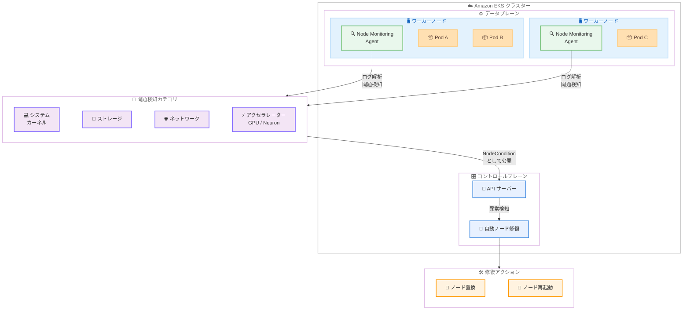

# Amazon EKS - Node Monitoring Agent のオープンソース化

**リリース日**: 2026 年 2 月 24 日
**サービス**: Amazon Elastic Kubernetes Service (Amazon EKS)
**機能**: Node Monitoring Agent オープンソース化

📊 [このアップデートのインフォグラフィックを見る](https://takech9203.github.io/aws-news-summary/20260224-amazon-eks-node-monitoring-agent-open-source.html)

## 概要

Amazon EKS Node Monitoring Agent がオープンソースとして公開されました。ソースコードは [GitHub](https://github.com/aws/eks-node-monitoring-agent) で公開されており、誰でもアクセス、カスタマイズ、開発への貢献が可能です。

Kubernetes クラスターでワークロードを安定的に運用するには、ノードの健全性を継続的に監視し、障害を迅速に検知・修復する必要があります。しかし、クラスター管理者は手動でノードの監視と修復を行わなければならないケースが多く、運用負荷が課題となっていました。Amazon EKS Node Monitoring Agent は、ノードレベルのシステム、ストレージ、ネットワーキング、アクセラレーターの問題を自動的に監視し、Kubernetes の NodeCondition として公開します。これらの情報は Amazon EKS の自動ノード修復機能で活用されます。

Node Monitoring Agent は Amazon EKS Auto Mode に含まれており、EKS アドオンとしても EKS が利用可能なすべての AWS リージョンで提供されています。

**アップデート前の課題**

- Node Monitoring Agent の内部実装がクローズドソースであり、エージェントの動作を詳細に理解できなかった
- 特定の環境やワークロードに合わせたカスタマイズができなかった
- コミュニティからの直接的な機能改善やバグ修正への貢献ができなかった

**アップデート後の改善**

- ソースコードが GitHub で公開され、エージェントの実装を完全に把握可能に
- 組織の要件に合わせたカスタマイズが可能に
- GitHub を通じてバグ報告、機能リクエスト、プルリクエストによる直接的な開発貢献が可能に

## アーキテクチャ図



この図は、EKS Node Monitoring Agent がワーカーノード上で DaemonSet として動作し、ノードログを解析して問題を検知する仕組みを示しています。検知された問題は NodeCondition として API サーバーに公開され、自動ノード修復機能がノードの置換または再起動を実行します。

## サービスアップデートの詳細

### 主要機能

1. **ノードヘルス監視**
   - ワーカーノード上のログを解析し、ノードレベルの健全性問題を自動検知
   - DaemonSet として全ワーカーノードにデプロイされ、継続的に監視を実施
   - 検知された問題は Kubernetes の NodeCondition および Event として公開

2. **監視対象カテゴリ**
   - **AcceleratedHardwareReady**: GPU (NVIDIA) や Neuron アクセラレーターのハードウェア障害を検知
   - **ContainerRuntimeReady**: コンテナランタイム (containerd) や kubelet の障害を検知
   - **KernelReady**: カーネルエラー、パニック、リソース枯渇を検知
   - **NetworkingReady**: ネットワークインターフェース、ルーティング、接続性の問題を検知
   - **StorageReady**: ディスク、ファイルシステム、I/O の問題を検知

3. **自動ノード修復との連携**
   - Node Monitoring Agent が検知した NodeCondition に基づいて EKS がノードを自動修復
   - 修復アクションには「ノード置換 (Replace)」と「ノード再起動 (Reboot)」がある
   - Pod Disruption Budget を尊重し、最大 15 分間のドレイン試行後に強制修復を実行

4. **オープンソース化のメリット**
   - ソースコードの完全な透明性により、エージェントの動作を詳細に把握可能
   - 組織のセキュリティポリシーやコンプライアンス要件に基づくコード監査が可能
   - カスタマイズや独自の監視ルールの追加が可能
   - GitHub を通じたコミュニティ貢献 (バグ報告、機能リクエスト、プルリクエスト) が可能

## 技術仕様

### 検知される NodeCondition 一覧

| NodeCondition | 説明 |
|---|---|
| AcceleratedHardwareReady | GPU や Neuron などのアクセラレーターハードウェアが正常に動作しているか |
| ContainerRuntimeReady | コンテナランタイムが正常に動作し、コンテナを実行可能か |
| KernelReady | カーネルが重大なエラーやパニックなしに正常に動作しているか |
| NetworkingReady | ネットワークスタックが正常に動作しているか |
| StorageReady | ストレージサブシステムが正常に動作しているか |

### 修復アクションとトリガー

| 修復対象の NodeCondition | 修復アクション |
|---|---|
| AcceleratedHardwareReady | ノード置換またはノード再起動 |
| ContainerRuntimeReady | ノード置換 |
| KernelReady | ノード置換 |
| NetworkingReady | ノード置換 |
| StorageReady | ノード置換 |

### デプロイメント構成

| 項目 | 詳細 |
|---|---|
| デプロイ方式 | DaemonSet |
| 対応 OS | Linux のみ (Windows は非対応) |
| EKS Auto Mode | Node Monitoring Agent と自動ノード修復が自動的に有効 |
| EKS アドオン | `eks-node-monitoring-agent` として追加可能 |
| Helm | Helm チャートによるインストールが可能 |
| 対応コンピュートタイプ | EKS Auto Mode、マネージドノードグループ、Karpenter (Fargate は非対応) |
| GitHub リポジトリ | [aws/eks-node-monitoring-agent](https://github.com/aws/eks-node-monitoring-agent) |

## 設定方法

### 前提条件

1. Amazon EKS クラスターが稼働中であること
2. `kubectl` が設定済みでクラスターに接続可能であること
3. AWS CLI がインストールされていること (EKS アドオンとしてデプロイする場合)

### 手順

#### ステップ 1: EKS アドオンとしてデプロイ

```bash
# EKS アドオンとして Node Monitoring Agent をインストール
aws eks create-addon \
  --cluster-name my-cluster \
  --addon-name eks-node-monitoring-agent \
  --region us-west-2
```

このコマンドにより、Node Monitoring Agent が DaemonSet としてクラスターの全ワーカーノードにデプロイされます。

#### ステップ 2: アドオンのバージョンとスキーマを確認

```bash
# 利用可能なアドオンバージョンを確認
aws eks describe-addon-versions \
  --addon-name eks-node-monitoring-agent \
  --kubernetes-version 1.35 \
  --query='addons[].addonVersions[].addonVersion'

# アドオンのスキーマを確認
aws eks describe-addon-configuration \
  --addon-name eks-node-monitoring-agent \
  --addon-version v1.5.1-eksbuild.1
```

Kubernetes バージョンに対応する最新のアドオンバージョンを確認し、設定スキーマを取得します。

#### ステップ 3: カスタム設定でのデプロイ

```bash
# カスタム設定を JSON で指定してインストール
aws eks create-addon \
  --cluster-name my-cluster \
  --addon-name eks-node-monitoring-agent \
  --configuration-values '{
    "monitoringAgent": {
      "resources": {
        "requests": {
          "cpu": "50m",
          "memory": "64Mi"
        },
        "limits": {
          "cpu": "200m",
          "memory": "256Mi"
        }
      }
    }
  }' \
  --region us-west-2
```

リソースリクエストやリミットをカスタマイズして Node Monitoring Agent をデプロイします。

#### ステップ 4: ノードの健全性を確認

```bash
# 全ノードの NodeCondition を確認
kubectl get nodes -o 'custom-columns=NAME:.metadata.name,CONDITIONS:.status.conditions[*].type,STATUS:.status.conditions[*].status'

# Node Monitoring Agent が報告したイベントを確認
kubectl get events --field-selector=reportingComponent=eks-node-monitoring-agent

# Pod が正常に稼働しているか確認
kubectl get pods -n kube-system -l app.kubernetes.io/name=eks-node-monitoring-agent
```

Node Monitoring Agent が正常にデプロイされ、ノードの健全性情報が公開されていることを確認します。

### 自動ノード修復の有効化

Node Monitoring Agent のデプロイ後、マネージドノードグループで自動ノード修復を有効にします。

```bash
# 新しいマネージドノードグループを自動ノード修復有効で作成
aws eks create-nodegroup \
  --cluster-name my-cluster \
  --nodegroup-name my-nodegroup \
  --node-role arn:aws:iam::123456789012:role/eks-node-role \
  --subnets subnet-12345 subnet-67890 \
  --node-repair-config enabled=true \
  --region us-west-2

# 既存のマネージドノードグループで自動ノード修復を有効化
aws eks update-nodegroup-config \
  --cluster-name my-cluster \
  --nodegroup-name my-nodegroup \
  --node-repair-config enabled=true \
  --region us-west-2
```

EKS Auto Mode を使用している場合は、Node Monitoring Agent と自動ノード修復が自動的に有効になるため、追加設定は不要です。

## オープンソースへの貢献方法

### コントリビューション手順

1. **リポジトリのフォーク**
   ```bash
   # GitHub でリポジトリをフォーク後、ローカルにクローン
   git clone https://github.com/<your-username>/eks-node-monitoring-agent.git
   cd eks-node-monitoring-agent
   ```

2. **ブランチの作成**
   ```bash
   git checkout -b feature/my-improvement
   ```

3. **変更の実装とテスト**
   - コードの変更を実装
   - テストを追加・実行
   - ローカルでビルドと動作確認を実施

4. **プルリクエストの作成**
   - 変更内容の説明を記載してプルリクエストを作成
   - メンテナーによるレビューを受ける

### 貢献の種類

- **バグ報告**: GitHub Issues でバグを報告
- **機能リクエスト**: 新しい機能や改善を提案
- **コード貢献**: プルリクエストによるバグ修正や機能追加
- **ドキュメント改善**: ドキュメントの修正や追加

## メリット

### ビジネス面

- **運用コスト削減**: ノードの健全性問題を自動検知・修復し、手動での監視・対応作業を削減
- **可用性向上**: 障害ノードの迅速な検知と自動修復により、ワークロードのダウンタイムを最小化
- **透明性の向上**: オープンソース化により、エージェントの動作を完全に把握でき、セキュリティ監査やコンプライアンス対応が容易に

### 技術面

- **カスタマイズ可能**: 組織固有の監視要件に合わせてエージェントを拡張・カスタマイズ可能
- **GPU 監視**: NVIDIA DCGM との統合により、GPU ハードウェアの詳細な障害検知を実現
- **コミュニティ駆動の改善**: オープンソースコミュニティの貢献により、継続的な機能改善とバグ修正が期待できる
- **Helm チャート対応**: Helm チャートによる柔軟なデプロイメントとカスタム設定が可能

## デメリット・制約事項

### 制限事項

- Linux のみ対応であり、Windows ノードでは利用不可
- AWS Fargate では利用不可
- 自動ノード修復は `DiskPressure`、`MemoryPressure`、`PIDPressure` の標準 Kubernetes NodeCondition には反応しない (これらはアプリケーション側の問題を示すことが多いため)
- 既存の NVIDIA DCGM インストールとの共存は現時点でサポートされていない

### 考慮すべき点

- Node Monitoring Agent と自動ノード修復を最大限に活用するには、両方を組み合わせて使用することを推奨
- 自動ノード修復は Pod Disruption Budget を尊重するが、最大 15 分間のドレイン試行後に強制修復を実行するため、アプリケーション側での適切な PDB 設定が重要
- オープンソース版をカスタマイズして使用する場合、アップストリームの更新との同期を自己管理する必要がある

## ユースケース

### ユースケース 1: GPU ワークロードの安定運用

**シナリオ**: 機械学習のトレーニングジョブを NVIDIA GPU インスタンス上で実行しており、GPU ハードウェア障害によるジョブ失敗を最小化したい。

**実装例**:
```bash
# Node Monitoring Agent をアドオンとしてインストール
aws eks create-addon \
  --cluster-name ml-cluster \
  --addon-name eks-node-monitoring-agent

# GPU ノードの健全性を確認
kubectl get nodes -o custom-columns='NAME:.metadata.name,ACCELERATOR_READY:.status.conditions[?(@.type=="AcceleratedHardwareReady")].status,REASON:.status.conditions[?(@.type=="AcceleratedHardwareReady")].reason'
```

**効果**: NVIDIA XID エラーや DCGM ヘルスチェックの失敗を自動検知し、障害のある GPU ノードを自動的に置換またはリブートすることで、トレーニングジョブの中断を最小化。

### ユースケース 2: 大規模クラスターの運用効率化

**シナリオ**: 数百台のワーカーノードを運用する大規模 EKS クラスターで、ノード障害の手動検知と対応に多大な運用工数が発生している。

**実装例**:
```bash
# EKS Auto Mode で自動管理 (Node Monitoring Agent と自動修復が自動的に有効)
eksctl create cluster \
  --name production-cluster \
  --auto-mode

# または既存クラスターにアドオンを追加
aws eks create-addon \
  --cluster-name production-cluster \
  --addon-name eks-node-monitoring-agent
```

**効果**: ノードレベルの問題を自動検知・修復し、クラスター管理者の運用負荷を大幅に削減。手動でのノード監視・SSH 接続によるログ確認作業が不要に。

### ユースケース 3: エージェントのカスタマイズと拡張

**シナリオ**: 組織固有のセキュリティ要件やコンプライアンスポリシーに基づき、Node Monitoring Agent の動作を検証し、必要に応じてカスタム監視ルールを追加したい。

**実装例**:
```bash
# リポジトリをクローンしてカスタマイズ
git clone https://github.com/aws/eks-node-monitoring-agent.git
cd eks-node-monitoring-agent

# Helm チャートの値ファイルを確認
cat charts/eks-node-monitoring-agent/values.yaml

# カスタムビルドとデプロイ
# (組織のコンテナレジストリにプッシュして使用)
```

**効果**: オープンソースのコードを監査してセキュリティ要件を満たしていることを確認。組織固有の監視要件に合わせたカスタマイズが可能になり、標準のエージェントでは対応できないユースケースにも対応可能。

## 料金

EKS Node Monitoring Agent の使用に追加料金はかかりません。標準の Amazon EKS 料金が適用されます。

- **EKS コントロールプレーン**: クラスターあたり $0.10/時間
- **ワーカーノード**: EC2 インスタンス料金が適用
- **EKS Auto Mode**: Auto Mode 固有の料金体系が適用

詳細な料金情報については、[Amazon EKS 料金ページ](https://aws.amazon.com/eks/pricing/)を参照してください。

## 利用可能リージョン

Amazon EKS Node Monitoring Agent は、EKS が利用可能なすべての AWS リージョンで EKS アドオンとして利用可能です。EKS Auto Mode を使用している場合は自動的に含まれます。

## 関連サービス・機能

- **Amazon EKS Auto Mode**: Node Monitoring Agent と自動ノード修復が自動的に含まれるフルマネージドコンピュートオプション
- **EKS 自動ノード修復**: Node Monitoring Agent が検知した問題に基づいてノードを自動修復する機能
- **Karpenter**: オープンソースの Kubernetes ノードオートスケーラー。v1.10 以降で自動ノード修復との連携が可能
- **Amazon EKS マネージドノードグループ**: ノードグループレベルで自動ノード修復を有効化可能
- **NVIDIA DCGM**: Node Monitoring Agent に含まれる GPU 監視コンポーネント

## 参考リンク

- 📊 [インフォグラフィック](https://takech9203.github.io/aws-news-summary/20260224-amazon-eks-node-monitoring-agent-open-source.html)
- [公式発表 (What's New)](https://aws.amazon.com/about-aws/whats-new/2026/02/amazon-eks-node-monitoring-agent-open-source/)
- [GitHub リポジトリ](https://github.com/aws/eks-node-monitoring-agent)
- [ドキュメント - ノードヘルスの検知と自動修復](https://docs.aws.amazon.com/eks/latest/userguide/node-health.html)
- [ドキュメント - Node Monitoring Agent の詳細](https://docs.aws.amazon.com/eks/latest/userguide/node-health-nma.html)
- [ブログ - Amazon EKS introduces node monitoring and auto repair capabilities](https://aws.amazon.com/blogs/containers/amazon-eks-introduces-node-monitoring-and-auto-repair-capabilities/)

## まとめ

Amazon EKS Node Monitoring Agent のオープンソース化により、エージェントのソースコードが GitHub で公開され、実装の透明性が大幅に向上しました。Node Monitoring Agent は、ノードレベルのシステム、ストレージ、ネットワーキング、アクセラレーターの問題を自動的に検知し、Kubernetes の NodeCondition として公開することで、EKS の自動ノード修復機能と連携してクラスターの信頼性を向上させます。EKS Auto Mode では自動的に含まれ、その他のコンピュートタイプでは EKS アドオンとして簡単にデプロイ可能です。オープンソースコミュニティへの参加を通じて、エージェントの改善に直接貢献できるようになったことは、EKS ユーザーにとって大きなメリットとなります。
