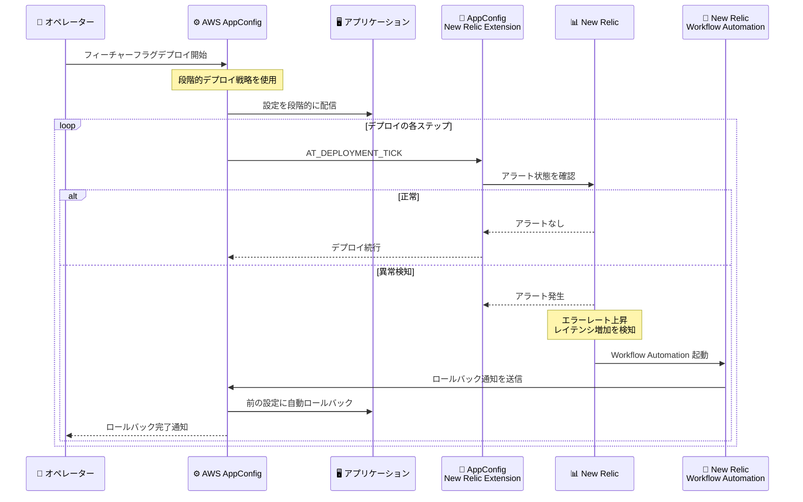

# AWS AppConfig - New Relic 統合による自動ロールバック

**リリース日**: 2026 年 2 月 24 日
**サービス**: AWS AppConfig
**機能**: New Relic integration for automated rollbacks

📊 [このアップデートのインフォグラフィックを見る](https://takech9203.github.io/aws-news-summary/20260224-aws-appconfig-new-relic-for-automated-rollback.html)

## 概要

AWS AppConfig が New Relic Workflow Automation との統合をリリースし、フィーチャーフラグおよび動的設定のデプロイ中に自動でインテリジェントなロールバックを実行できるようになりました。AWS AppConfig のサードパーティアラート機能を基盤として、New Relic がアプリケーションの健全性低下を自動検知し、数秒でロールバックをトリガーすることで、手動介入を排除します。

**アップデート前の課題**

- サードパーティ APM ツールでの監視結果に基づくロールバックは手動対応が必要で、検知から修復まで数分以上を要した
- フィーチャーフラグのデプロイ中に問題が発生した場合、オペレーターが監視ダッシュボードを確認して手動で判断する必要があった
- New Relic を使用するチームが AWS AppConfig のロールバック機能を統合するためのネイティブソリューションが存在しなかった

**アップデート後の改善**

- New Relic Workflow Automation と連携し、デプロイ中のアプリケーション健全性を自動監視
- 問題検知から数秒でロールバックが自動実行され、検知から修復までの時間を大幅に短縮
- クローズドループの自動化により、手動介入なしで障害時のカスタマー影響を最小化

## アーキテクチャ図



AWS AppConfig の段階的デプロイ中、New Relic Extension が `AT_DEPLOYMENT_TICK` アクションポイントで継続的にアラート状態を確認し、異常検知時に Workflow Automation を通じて即座にロールバックを実行します。

## サービスアップデートの詳細

### 主要機能

1. **AT_DEPLOYMENT_TICK アクションポイントの活用**
   - AWS AppConfig の段階的デプロイ中に同期的に呼び出されるアクションポイント
   - デプロイの各ステップで New Relic のアラート状態をチェック
   - エラー発生時にデプロイワークフローを停止してロールバックを実行

2. **New Relic Workflow Automation 連携**
   - New Relic のアラート条件に基づく自動トリガー
   - エラーレート、レイテンシなどのメトリクスを継続監視
   - アラート検知時にロールバック通知を自動送信

3. **クローズドループの自動化**
   - 検知から修復までのプロセスが完全に自動化
   - 手動介入なしで数秒以内にロールバックを完了
   - フィーチャーフラグを前の状態に自動で戻す

4. **段階的デプロイ戦略との統合**
   - AWS AppConfig のデプロイ戦略と組み合わせて使用
   - デプロイの各段階でヘルスチェックを実施
   - 部分的なロールアウト中に問題を早期発見

### 仕組み

AWS AppConfig New Relic Extension は AWS Lambda 関数として実装され、`AT_DEPLOYMENT_TICK` アクションポイントに関連付けられます。このアクションポイントは AWS AppConfig のデプロイ処理オーケストレーション中に同期的に呼び出されます。

Extension は各デプロイステップで New Relic API を呼び出してアラート条件を確認します。`AT_*` アクションポイントはデプロイワークフローと並行して同期的に実行されるため、エラーが発生した場合にはデプロイワークフローが停止され、自動的にロールバックが開始されます。

## 技術仕様

| 項目 | 詳細 |
|------|------|
| Extension タイプ | カスタム AWS AppConfig Extension |
| 実行基盤 | AWS Lambda |
| アクションポイント | `AT_DEPLOYMENT_TICK` |
| アクションポイント種別 | 同期実行、デプロイワークフローと並行 |
| 監視対象 | New Relic アラート条件 |
| ロールバック方式 | New Relic Workflow Automation 経由の通知 |
| ロールバック速度 | 検知から数秒以内 |
| デプロイ戦略 | 段階的デプロイ戦略と併用 |

### AT_DEPLOYMENT_TICK アクションポイントの動作

| アクションポイント種別 | 実行方式 | エラー時の動作 |
|----------------------|---------|-------------|
| `PRE_*` | 同期、リクエスト検証後 | 設定内容を変更可能、エラーでアクションを阻止 |
| `ON_*` | 非同期 | エラーを無視してワークフロー継続 |
| `AT_*` | 同期、ワークフローと並行 | ワークフローを停止しロールバックを実行 |

## 設定方法

### 前提条件

1. AWS アカウントと AWS AppConfig の設定
2. New Relic アカウントとアラート条件の設定
3. New Relic Workflow Automation の有効化
4. AWS Lambda 関数の作成権限
5. IAM ロールの設定権限

### 手順

#### ステップ 1: New Relic でアラート条件を設定

アプリケーションの健全性を監視するためのアラート条件を New Relic で設定します。エラーレート、レイテンシ、スループットなど、デプロイの影響を検知するためのメトリクスを定義します。

#### ステップ 2: Lambda 関数をデプロイ

GitHub リポジトリから AWS AppConfig New Relic Extension の Lambda 関数をデプロイします。

```bash
# リポジトリをクローン
git clone https://github.com/aws-samples/sample-aws-appconfig-tick-extn-for-newrelic.git

# Lambda 関数をデプロイ (SAM または CloudFormation を使用)
cd sample-aws-appconfig-tick-extn-for-newrelic
sam build
sam deploy --guided
```

#### ステップ 3: AWS AppConfig Extension を作成

Lambda 関数を `AT_DEPLOYMENT_TICK` アクションポイントに関連付ける Extension を作成します。

```json
{
    "Name": "NewRelicMonitoringExtension",
    "Description": "New Relic monitoring integration for automatic rollback",
    "Actions": {
        "AT_DEPLOYMENT_TICK": [
            {
                "Name": "CheckNewRelicAlarms",
                "Uri": "arn:aws:lambda:us-east-1:123456789012:function:appconfig-newrelic-extension",
                "RoleArn": "arn:aws:iam::123456789012:role/AppConfigExtensionRole"
            }
        ]
    }
}
```

#### ステップ 4: Extension Association を作成

Extension を AWS AppConfig のアプリケーション、環境、または設定プロファイルに関連付けます。

```bash
aws appconfig create-extension-association \
    --extension-identifier NewRelicMonitoringExtension \
    --resource-identifier "arn:aws:appconfig:us-east-1:123456789012:application/MyApp/environment/Production"
```

#### ステップ 5: New Relic Workflow Automation を設定

New Relic Workflow Automation でアラート検知時にロールバック通知を送信するワークフローを設定します。

#### ステップ 6: デプロイをテスト

段階的デプロイ戦略を使用してフィーチャーフラグをデプロイし、New Relic との連携が正常に機能することを確認します。

```bash
aws appconfig start-deployment \
    --application-id MyApp \
    --environment-id Production \
    --deployment-strategy-id MyGradualStrategy \
    --configuration-profile-id MyFeatureFlags \
    --configuration-version 2
```

## メリット

### 技術面

- **検知から修復の高速化**: 手動対応では数分かかっていた問題修復を数秒以内に完了
- **クローズドループ自動化**: 監視、検知、ロールバックの一連のプロセスが完全自動化
- **段階的デプロイとの統合**: デプロイの各段階で継続的にヘルスチェックを実行し、早期発見が可能

### ビジネス面

- **カスタマー影響の最小化**: 障害発生時の影響範囲と時間を大幅に削減
- **運用コストの削減**: 手動監視とオペレーター介入の必要性を排除
- **デプロイ頻度の向上**: 安全なロールバック機構により、頻繁なデプロイへの信頼性が向上

### 運用面

- **既存ツールチェーンとの統合**: New Relic を既に使用しているチームはワークフローを変更せずに導入可能
- **オペレーター負荷の軽減**: 24 時間 365 日の手動監視が不要
- **インシデント対応の標準化**: ロールバック判断と実行が自動化され、ヒューマンエラーを排除

## デメリット・制約事項

### 技術的な制約

- New Relic アカウントとライセンスが別途必要
- Lambda 関数の実行時間がデプロイステップのレイテンシに影響する可能性がある
- `AT_DEPLOYMENT_TICK` でのエラーは無条件でロールバックをトリガーするため、ネットワーク一時障害による誤検知に注意が必要

### 運用上の制約

- New Relic のアラート条件設定が適切でない場合、不要なロールバックが発生する可能性がある
- Extension のセットアップには AWS Lambda、IAM、AppConfig Extensions の知識が必要
- New Relic Workflow Automation の設定と管理が別途必要

### コスト面の考慮

- AWS Lambda の実行コストが追加で発生
- New Relic のサブスクリプション費用が別途必要
- AWS AppConfig の設定リクエストおよび設定受信に対する従量課金

## ユースケース

### ユースケース 1: EC サイトのフィーチャーフラグリリース

**シナリオ**: EC サイトで新しいチェックアウトフローをフィーチャーフラグで段階的にリリースする際、エラーレートの上昇やレスポンスタイムの悪化を即座に検知して自動ロールバックしたい。

**実装**: AWS AppConfig の段階的デプロイ戦略 (例: 10% → 25% → 50% → 100%) で新しいチェックアウトフラグをデプロイし、New Relic Extension でトランザクションエラーレートとレスポンスタイムを監視

**効果**: 10% のユーザーへのロールアウト段階でエラーレート上昇を検知した場合、残り 90% のユーザーに影響が及ぶ前に数秒でロールバックを完了し、カスタマー影響を最小化

### ユースケース 2: マイクロサービスの動的設定変更

**シナリオ**: マイクロサービスアーキテクチャで、スロットリングリミットやログレベルなどの動的設定を変更する際、サービス間の依存関係により予期しないパフォーマンス低下が発生するリスクがある。

**実装**: AWS AppConfig のフリーフォーム設定プロファイルで動的設定を管理し、New Relic APM でサービス間のレイテンシとエラーレートを監視。異常検知時に自動ロールバックを実行

**効果**: スロットリングリミットの変更が下流サービスのレイテンシ増加を引き起こした場合、Workflow Automation が即座にロールバックをトリガーし、カスケード障害を防止

### ユースケース 3: SaaS プラットフォームのテナント別フィーチャーリリース

**シナリオ**: SaaS プラットフォームで、特定のテナントグループに対して新機能を先行リリースし、テナント固有のメトリクスに基づいて安全性を確認したい。

**実装**: AWS AppConfig のフィーチャーフラグターゲティング機能でテナントグループを指定し、New Relic のカスタムアラート条件でテナント別のエラーレートとパフォーマンスメトリクスを監視

**効果**: 先行リリース対象テナントで問題が検出された場合、自動ロールバックにより全テナントへの影響拡大を防止し、安全なリリース管理を実現

## 料金

AWS AppConfig New Relic Extension 自体に追加料金はありません。以下のサービスの料金が個別に適用されます。

### AWS AppConfig

| 項目 | 料金 |
|------|------|
| 設定リクエスト (API コール) | $0.0000002 / リクエスト |
| 設定受信 | $0.0008 / 受信 |

### 関連コスト

- **AWS Lambda**: Extension 用 Lambda 関数の実行料金 (リクエスト数と実行時間に基づく従量課金)
- **New Relic**: New Relic のサブスクリプション費用 (New Relic の料金体系に準拠)
- **AWS IAM**: 追加料金なし

詳細は [AWS Systems Manager 料金ページ](https://aws.amazon.com/systems-manager/pricing/) を参照してください。

## 利用可能リージョン

AWS GovCloud (US) リージョンを含む、すべての AWS リージョンで利用可能です。

## 関連サービス・機能

- **AWS AppConfig**: フィーチャーフラグと動的設定の管理・デプロイ
- **AWS AppConfig Extensions**: デプロイワークフローにカスタムアクションを追加する拡張機能
- **AWS Lambda**: Extension のロジックを実行するサーバーレスコンピューティング基盤
- **New Relic APM**: アプリケーションパフォーマンス監視
- **New Relic Workflow Automation**: アラートに基づく自動ワークフロー実行
- **Amazon CloudWatch**: AWS ネイティブの監視・ロールバック統合 (代替手段)

## 参考リンク

- 📊 [インフォグラフィック](https://takech9203.github.io/aws-news-summary/20260224-aws-appconfig-new-relic-for-automated-rollback.html)
- [公式発表 (What's New)](https://aws.amazon.com/about-aws/whats-new/2026/02/aws-appconfig-new-relic-for-automated-rollback/)
- [AWS AppConfig New Relic Extension GitHub リポジトリ](https://github.com/aws-samples/sample-aws-appconfig-tick-extn-for-newrelic)
- [AWS AppConfig ユーザーガイド](https://docs.aws.amazon.com/appconfig/latest/userguide/getting-started-with-appconfig.html)
- [デプロイの監視と自動ロールバック](https://docs.aws.amazon.com/appconfig/latest/userguide/monitoring-deployments.html)
- [AWS AppConfig Extensions ドキュメント](https://docs.aws.amazon.com/appconfig/latest/userguide/working-with-appconfig-extensions-about.html)
- [AWS Systems Manager 料金](https://aws.amazon.com/systems-manager/pricing/)

## まとめ

AWS AppConfig と New Relic Workflow Automation の統合により、フィーチャーフラグおよび動的設定のデプロイ中に発生する問題を自動的に検知し、数秒以内にロールバックを実行するクローズドループの自動化が実現しました。`AT_DEPLOYMENT_TICK` アクションポイントを活用した Extension が段階的デプロイの各ステップで New Relic のアラート状態を監視し、エラーレートやレイテンシの上昇を検知した場合に即座にロールバックをトリガーします。New Relic を既に使用しているチームにとって、既存の監視ワークフローを活かしながらデプロイの安全性を大幅に向上させる機能です。
