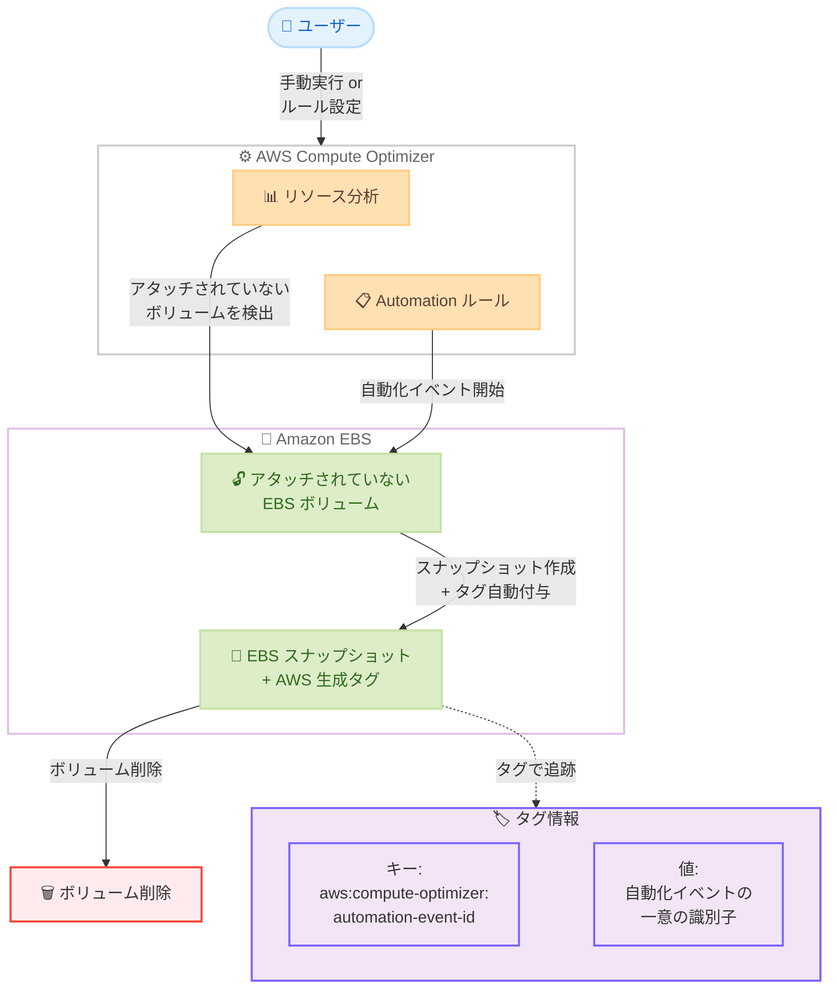

# AWS Compute Optimizer - EBS スナップショットへの AWS 生成タグの自動適用

**リリース日**: 2026 年 2 月 24 日
**サービス**: AWS Compute Optimizer
**機能**: AWS-generated tags for EBS snapshots during automation

📊 [このアップデートのインフォグラフィックを見る](https://takech9203.github.io/aws-news-summary/20260224-aws-compute-optimizer-applies-tags-ebs-snapshots.html)

## 概要

AWS Compute Optimizer が、Automation 機能によるアタッチされていない Amazon EBS ボリュームのスナップショット作成および削除時に、AWS 生成タグを自動的に適用するようになりました。スナップショット作成時にタグ `aws:compute-optimizer:automation-event-id` が付与され、スナップショットを作成した自動化イベントの一意の識別子にリンクされます。

この機能強化により、Compute Optimizer Automation を通じて作成された EBS スナップショットの可視性とトラッキングが向上します。自動最適化プロセスで作成されたスナップショットを容易に特定、追跡、管理できるようになり、バックアップリソースのガバナンス強化と環境内のスナップショットの発生元の把握に役立ちます。

**アップデート前の課題**

- Compute Optimizer Automation で作成されたスナップショットを他のスナップショットと区別する方法がなかった
- 自動化イベントとスナップショットの関連付けを手動で追跡する必要があった
- 大量のスナップショットが存在する環境で、Compute Optimizer が作成したスナップショットの管理が困難だった

**アップデート後の改善**

- スナップショット作成時に AWS 生成タグが自動付与され、発生元を即座に特定可能
- タグ値を通じて自動化イベントの一意の識別子と直接リンクできるため、追跡が容易
- タグベースのフィルタリングにより、Compute Optimizer が作成したスナップショットの一括管理が可能
- 追加の設定変更は不要で、自動的に有効化される

## アーキテクチャ図



Compute Optimizer がアタッチされていない EBS ボリュームを検出すると、手動操作または自動化ルールに基づいてスナップショットを作成し、AWS 生成タグを自動付与した上でボリュームを削除します。タグにより、スナップショットと自動化イベントの関連付けが可能になります。

## サービスアップデートの詳細

### 主要機能

1. **AWS 生成タグの自動付与**
   - アタッチされていない EBS ボリュームのスナップショット作成時にタグが自動的に適用される
   - 手動アクションおよび自動化ルールの両方で適用される
   - 追加の設定変更は不要

2. **自動化イベントとの関連付け**
   - タグ値にはスナップショットを作成した自動化イベントの一意の識別子が設定される
   - Automation events ダッシュボードでイベントの詳細を確認可能
   - ステップ履歴の追跡や月間推定コスト削減額の確認も可能

3. **Compute Optimizer Automation の仕組み**
   - 32 日以上アタッチされていない EBS ボリュームに対してスナップショット作成と削除を推奨
   - 自動化ルールにより、日次、週次、月次のスケジュールで推奨アクションを自動実行
   - 削除前にスナップショットが作成されるため、データは完全に復元可能

### 仕組み

Compute Optimizer Automation がアタッチされていない EBS ボリュームのスナップショットを作成して削除する際、スナップショットにタグ `aws:compute-optimizer:automation-event-id` が自動的に付与されます。このタグの値は自動化イベントの一意の識別子であり、Compute Optimizer コンソールの Automation events ページで該当イベントの詳細を確認できます。

ロールバックが必要な場合、Compute Optimizer は作成されたスナップショットから新しい EBS ボリュームを復元できます。その際、元のボリュームに設定されていたユーザー作成タグも復元されます。

## 技術仕様

### タグ情報

| 項目 | 詳細 |
|------|------|
| タグキー | `aws:compute-optimizer:automation-event-id` |
| タグ値 | 自動化イベントの一意の識別子 |
| タグタイプ | AWS 生成タグ |
| 適用タイミング | スナップショット作成時に自動付与 |
| 適用対象 | Compute Optimizer Automation で作成されたすべての EBS スナップショット |
| 対象操作 | 手動アクションおよび自動化ルールによるスナップショット作成と削除 |

### Automation イベントステータス

| ステータス | 説明 |
|-----------|------|
| Ready | 自動化が開始されていない |
| In-Progress | 自動化が実行中 |
| Complete | 自動化が正常に完了 |
| Failed | 自動化が正常に完了しなかった |
| Rollback Ready | ロールバックが開始されていない |
| Rollback In-Progress | ロールバックが実行中 |
| Rollback Complete | ロールバックが正常に完了 |
| Rollback Failed | ロールバックが正常に完了しなかった |

## 設定方法

### 前提条件

1. AWS Compute Optimizer が有効化されている
2. Compute Optimizer Automation が有効化されている
3. サービスリンクロール `AWSServiceRoleForComputeOptimizerAutomation` が作成されている

### 手順

#### ステップ 1: Compute Optimizer Automation を有効化

AWS Compute Optimizer コンソールの「Automation」セクションに移動し、自動化機能を有効化します。有効化すると、必要なサービスリンクロールが自動的に作成されます。

#### ステップ 2: 推奨アクションの確認

「Recommended actions」ページで、アタッチされていない EBS ボリュームの最適化推奨を確認します。32 日以上アタッチされていないボリュームに対してスナップショット作成と削除が推奨されます。

#### ステップ 3: 手動実行または自動化ルールの作成

**手動実行の場合:**

推奨アクションを選択し、確認画面で実行を開始します。スナップショット作成時にタグが自動的に付与されます。

**自動化ルールの場合:**

```bash
# AWS CLI で自動化ルールの一覧を確認
aws compute-optimizer get-recommendation-preferences \
    --resource-type EbsVolume
```

コンソールから自動化ルールを作成し、以下の条件を設定します。

- **対象リージョン**: 最適化を適用するリージョンを指定
- **リソースタグ**: 対象ボリュームをフィルタリングするタグを指定
- **スケジュール**: 日次、週次、または月次の実行頻度を設定

#### ステップ 4: タグの確認

スナップショット作成後、AWS コンソールまたは AWS CLI でタグが付与されていることを確認します。

```bash
# スナップショットのタグを確認
aws ec2 describe-snapshots \
    --filters "Name=tag-key,Values=aws:compute-optimizer:automation-event-id" \
    --query "Snapshots[*].{ID:SnapshotId,Tags:Tags,StartTime:StartTime}" \
    --output table
```

#### ステップ 5: Automation events の監視

Compute Optimizer コンソールの「Automation events」ページで、自動化イベントの進行状況と詳細を確認します。タグ値に含まれるイベント ID を使用して、特定のイベントにドリルダウンできます。

## メリット

### ビジネス面

- **ガバナンスの強化**: スナップショットの発生元を自動的に追跡でき、リソース管理の透明性が向上
- **コンプライアンス対応**: タグベースのリソース管理により、監査要件への対応が容易
- **コスト可視性の向上**: 自動化プロセスで作成されたスナップショットのコストを正確に把握可能

### 技術面

- **スナップショットの自動識別**: タグによりフィルタリングやクエリが可能で、大量のスナップショットから Compute Optimizer が作成したものを即座に特定
- **イベントトレーサビリティ**: タグ値から自動化イベントの詳細に直接アクセスでき、問題調査が迅速化
- **設定不要の自動化**: 追加の設定変更なしで自動的に有効化されるため、運用負荷がない

### 運用面

- **スナップショットライフサイクル管理の効率化**: タグベースの Amazon Data Lifecycle Manager ポリシーと組み合わせることで、自動化スナップショットの管理を効率化
- **ロールバック操作の信頼性向上**: スナップショットと自動化イベントの関連付けが明確なため、必要時のロールバック操作が確実

## デメリット・制約事項

### 制限事項

- タグキーは `aws:compute-optimizer:automation-event-id` に固定されており、カスタマイズ不可
- AWS 生成タグであるため、ユーザーによる変更や削除はできない
- Compute Optimizer Automation が利用可能なリージョンでのみ機能する
- ロールバック操作にはスナップショットが必要であり、スナップショットを手動で削除するとロールバックが失敗する

### 考慮すべき点

- スナップショットの保持にはストレージコストが発生する
- ロールバックで復元されたボリュームは新しいボリューム ID が付与される (元のボリューム ID とは異なる)
- ボリュームタイプのアップグレード後のロールバックには、最低 6 時間の待機が必要
- ロールバックが成功するには、ボリューム構成が自動化イベント完了時点の構成と一致している必要がある

## ユースケース

### ユースケース 1: 大規模環境でのスナップショット管理

**シナリオ**: 数百のアカウントと数千の EBS ボリュームを管理するエンタープライズ環境で、Compute Optimizer Automation により自動的に作成されたスナップショットを効率的に管理したい。

**実装**: 自動化ルールを組織全体に適用し、タグ `aws:compute-optimizer:automation-event-id` を使用してスナップショットをフィルタリング

```bash
# Compute Optimizer が作成したスナップショットの一覧を取得
aws ec2 describe-snapshots \
    --filters "Name=tag-key,Values=aws:compute-optimizer:automation-event-id" \
    --query "Snapshots[*].{ID:SnapshotId,Size:VolumeSize,StartTime:StartTime}" \
    --output table
```

**効果**: タグベースのフィルタリングにより、Compute Optimizer が作成したスナップショットを即座に特定し、ライフサイクル管理やコスト分析に活用

### ユースケース 2: コスト最適化とスナップショットの追跡

**シナリオ**: FinOps チームが Compute Optimizer Automation によるコスト削減効果を定量的に把握し、自動化で作成されたスナップショットのコストを管理したい。

**実装**: AWS Cost Explorer や AWS Billing でタグベースのコスト分析を実施し、Automation events ダッシュボードで推定月間削減額を確認

**効果**: 自動化イベントごとの削減額とスナップショットの保持コストを比較分析し、コスト最適化戦略を継続的に改善

### ユースケース 3: インシデント発生時の迅速なロールバック

**シナリオ**: Compute Optimizer Automation により削除された EBS ボリュームのデータが後から必要になり、迅速にロールバックしたい。

**実装**: タグを使用して該当するスナップショットを特定し、Compute Optimizer コンソールからロールバックを実行

```bash
# 特定の自動化イベント ID に関連するスナップショットを検索
aws ec2 describe-snapshots \
    --filters "Name=tag:aws:compute-optimizer:automation-event-id,Values=<event-id>" \
    --output json
```

**効果**: タグ値から自動化イベントを迅速に特定し、Compute Optimizer コンソールからワンクリックでロールバックを実行できるため、復旧時間を大幅に短縮

## 料金

AWS 生成タグの付与自体に追加料金はかかりません。以下のサービスの料金が個別に適用されます。

### 関連コスト

| 項目 | 料金 |
|------|------|
| AWS Compute Optimizer | 無料 (デフォルトの推奨) |
| EBS スナップショットストレージ | リージョンにより異なる (例: us-east-1 で $0.05/GB-月) |
| EBS ボリューム | ボリュームタイプとサイズに基づく従量課金 |

Compute Optimizer Automation でスナップショットを作成して EBS ボリュームを削除した場合、ボリュームの料金は発生しなくなりますが、スナップショットの保持にはストレージ料金が発生します。

詳細は [Amazon EBS 料金ページ](https://aws.amazon.com/ebs/pricing/) を参照してください。

## 利用可能リージョン

AWS Compute Optimizer Automation が利用可能なすべての AWS リージョンで利用できます。Compute Optimizer は以下のリージョンでサービスエンドポイントが提供されています。

- **米国**: us-east-1、us-east-2、us-west-1、us-west-2
- **アジアパシフィック**: ap-east-1、ap-south-1、ap-south-2、ap-southeast-1、ap-southeast-2、ap-southeast-3、ap-southeast-4、ap-northeast-1、ap-northeast-2、ap-northeast-3
- **ヨーロッパ**: eu-central-1、eu-central-2、eu-west-1、eu-west-2、eu-west-3、eu-north-1、eu-south-1、eu-south-2
- **中東・アフリカ**: me-south-1、me-central-1、af-south-1
- **南米**: sa-east-1
- **カナダ**: ca-central-1
- **イスラエル**: il-central-1
- **AWS GovCloud**: us-gov-east-1、us-gov-west-1

## 参考リンク

- 📊 [インフォグラフィック](https://takech9203.github.io/aws-news-summary/20260224-aws-compute-optimizer-applies-tags-ebs-snapshots.html)
- [公式発表 (What's New)](https://aws.amazon.com/about-aws/whats-new/2026/02/aws-compute-optimizer-applies-tags-ebs-snapshots/)
- [AWS Compute Optimizer Automation ユーザーガイド](https://docs.aws.amazon.com/compute-optimizer/latest/ug/automation.html)
- [Automation events ドキュメント](https://docs.aws.amazon.com/compute-optimizer/latest/ug/automation-events.html)
- [Automated Amazon EBS Volume Optimization ブログ記事](https://aws.amazon.com/blogs/aws-cloud-financial-management/introducing-automated-amazon-ebs-volume-optimization-in-aws-compute-optimizer/)
- [Amazon EBS 料金ページ](https://aws.amazon.com/ebs/pricing/)

## まとめ

AWS Compute Optimizer が、Automation 機能によるアタッチされていない EBS ボリュームのスナップショット作成時に、AWS 生成タグ `aws:compute-optimizer:automation-event-id` を自動的に適用するようになりました。このタグにより、自動最適化プロセスで作成されたスナップショットの発生元を即座に特定し、自動化イベントとの関連付けを通じた追跡と管理が容易になります。追加の設定変更は不要で、Compute Optimizer Automation が利用可能なすべてのリージョンで自動的に有効化されます。大規模環境でのスナップショットガバナンス強化やコスト最適化の追跡、インシデント発生時の迅速なロールバックに活用できる実用的なアップデートです。
