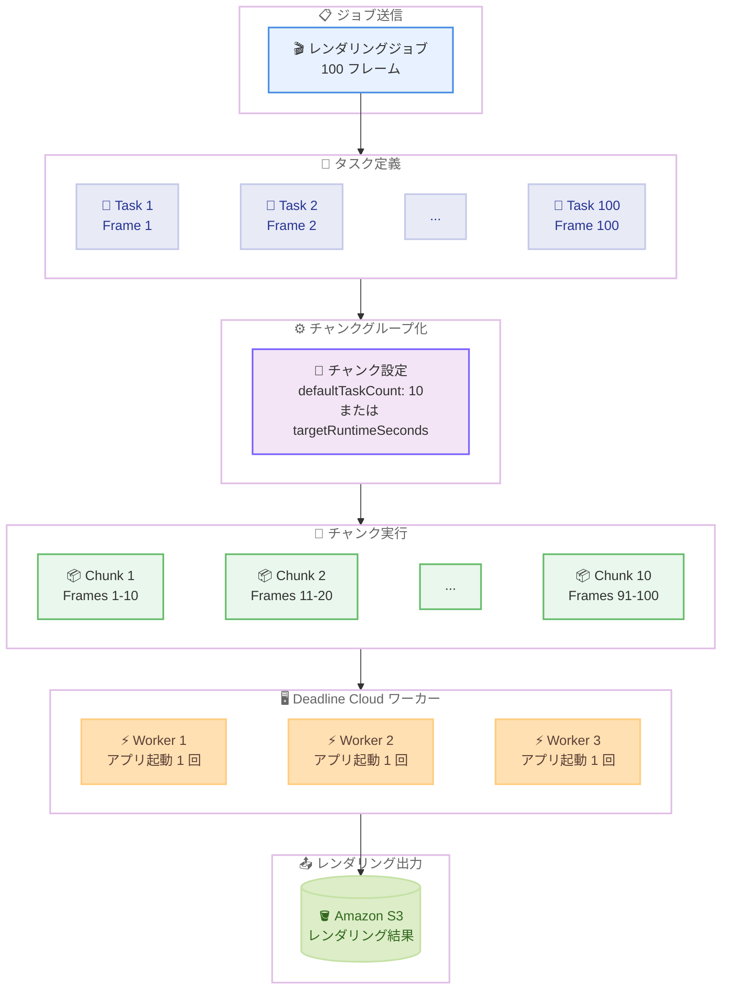

# AWS Deadline Cloud - タスクのチャンクグループ化実行のサポート

**リリース日**: 2026 年 2 月 24 日
**サービス**: AWS Deadline Cloud
**機能**: Task chunking for grouped execution

📊 [このアップデートのインフォグラフィックを見る](https://takech9203.github.io/aws-news-summary/20260224-aws-deadline-cloud-running-tasks-together-in.html)

## 概要

AWS Deadline Cloud がタスクをチャンク単位にグループ化して効率的に複数タスクを同時実行する機能をサポートしました。AWS Deadline Cloud は、映画、テレビ番組、コマーシャル、ゲーム、産業デザインなどの CG 2D/3D グラフィックスおよびビジュアルエフェクト (VFX) のレンダリング管理を簡素化するフルマネージドサービスです。

タスクチャンキングを使用すると、複数のタスクを「チャンク」と呼ばれる 1 つの作業単位にまとめることができます。レンダリングジョブにおいて、Deadline Cloud は 1 回のコマンド呼び出しで 1 フレームずつではなく、複数のフレームをまとめてディスパッチできます。これにより、タスクごとのアプリケーション起動オーバーヘッドが削減され、ジョブ全体の実行時間が短縮されます。

**アップデート前の課題**

- 短いタスクやアプリケーション起動に長い時間がかかるタスクでは、タスクごとに起動オーバーヘッドが発生し、時間とコストが増大していた
- 各タスクが個別に実行されるため、フレームごとにレンダリングアプリケーションの起動・終了が繰り返されていた
- ジョブ全体の実行効率を最適化する手段が限られていた

**アップデート後の改善**

- 複数タスクをチャンクとしてグループ化し、1 回の起動で複数タスクを実行可能
- 手動でチャンクサイズを指定するか、ターゲットランタイムを指定して動的にチャンクサイズを調整可能
- アプリケーション起動オーバーヘッドの削減により、ジョブの実行時間とコストを大幅に削減

## アーキテクチャ図



100 フレームのレンダリングジョブを例にした図です。ジョブ送信後、各フレームがタスクとして定義されます。チャンクグループ化の設定に基づき、10 タスクずつ 10 個のチャンクにグループ化されます。各チャンクはワーカーにディスパッチされ、アプリケーションの起動は各ワーカーで 1 回のみ行われ、複数フレームがまとめてレンダリングされます。

## サービスアップデートの詳細

### 主要機能

1. **手動チャンクサイズ指定**
   - `defaultTaskCount` パラメータでチャンクに含めるタスク数を明示的に指定
   - 最大 150 タスクまでグループ化可能
   - タスクの実行時間が予測可能な場合に最適

2. **ターゲットランタイム指定**
   - `targetRuntimeSeconds` パラメータでチャンクの目標実行時間を秒単位で指定
   - ジョブの進行に伴い、Deadline Cloud が動的にチャンクサイズを調整
   - 完了済みチャンクの実行時間を学習し、目標実行時間に近づくようタスク数を自動最適化

3. **範囲制約の指定**
   - `rangeConstraint` パラメータで `CONTIGUOUS` または `NONCONTIGUOUS` を指定
   - `CONTIGUOUS`: チャンクは常に連続した範囲 (例: `1-10`) となる
   - `NONCONTIGUOUS`: チャンクは任意のセット (例: `1,3,7-10`) を含むことが可能

4. **OpenJD 拡張機能**
   - OpenJD ジョブテンプレートの `TASK_CHUNKING` 拡張機能として実装
   - `CHUNK[INT]` タスクパラメータタイプを使用してチャンキングを有効化
   - 既存の `deadline bundle submit` コマンドでそのままジョブを送信可能

## 技術仕様

### チャンキング設定パラメータ

| パラメータ | 必須 | 説明 |
|-----------|------|------|
| `defaultTaskCount` | 必須 | 1 つのチャンクにまとめるタスク数 (最大 150) |
| `rangeConstraint` | 必須 | `CONTIGUOUS` または `NONCONTIGUOUS` |
| `targetRuntimeSeconds` | 任意 | チャンクの目標実行時間 (秒) |

### サービスクォータ

| クォータ | デフォルト値 | 調整可否 |
|---------|------------|---------|
| チャンクあたりの最大タスク数 | 150 | 不可 |
| ジョブあたりの最大タスク数 | 10,000 | 可能 |
| ステップあたりの最大タスク数 | 10,000 | 可能 |
| ジョブあたりの最大ステップ数 | 200 | 可能 |

### ジョブテンプレートの構造

```yaml
specificationVersion: 'jobtemplate-2023-09'
extensions:
  - TASK_CHUNKING
name: Blender Render with Contiguous Chunking
parameterDefinitions:
  - name: BlenderSceneFile
    type: PATH
    objectType: FILE
    dataFlow: IN
  - name: Frames
    type: STRING
    default: "1-100"
  - name: OutputDir
    type: PATH
    objectType: DIRECTORY
    dataFlow: OUT
    default: "./output"
steps:
  - name: RenderBlender
    parameterSpace:
      taskParameterDefinitions:
        - name: Frame
          type: CHUNK[INT]
          range: "{{Param.Frames}}"
          chunks:
            defaultTaskCount: 10
            rangeConstraint: CONTIGUOUS
    script:
      actions:
        onRun:
          command: bash
          args: ["{{Task.File.Run}}"]
      embeddedFiles:
        - name: Run
          type: TEXT
          data: |
            set -xeuo pipefail
            mkdir -p '{{Param.OutputDir}}'
            START_FRAME="$(echo '{{Task.Param.Frame}}' | cut -d- -f1)"
            END_FRAME="$(echo '{{Task.Param.Frame}}' | cut -d- -f2)"
            blender --background '{{Param.BlenderSceneFile}}' \
                    --render-output '{{Param.OutputDir}}/output_####' \
                    --render-format PNG \
                    --use-extension 1 \
                    -s "$START_FRAME" \
                    -e "$END_FRAME" \
                    --render-anim
```

### ワーカーエージェントの要件

- **サービスマネージドフリート**: 常に互換性のあるワーカーエージェントバージョンを使用するため、追加対応は不要
- **カスタマーマネージドフリート**: チャンキングジョブを送信する前に、ワーカーエージェントを互換バージョンに更新する必要がある
- **出力ダウンロード**: チャンクジョブの単一タスクの出力をダウンロードすると、チャンク全体の出力がダウンロードされる (`deadline-cloud` バージョン 0.53.3 以降が必要)

## 設定方法

### 前提条件

1. AWS Deadline Cloud ファームが作成済みであること
2. フリート (サービスマネージドまたはカスタマーマネージド) が設定済みであること
3. `deadline-cloud` CLI がインストールされていること
4. カスタマーマネージドフリートの場合、互換性のあるワーカーエージェントに更新済みであること

### 手順

#### ステップ 1: ジョブテンプレートの作成

```yaml
# job_template.yaml
specificationVersion: 'jobtemplate-2023-09'
extensions:
  - TASK_CHUNKING
name: My Chunked Render Job
parameterDefinitions:
  - name: SceneFile
    type: PATH
    objectType: FILE
    dataFlow: IN
  - name: Frames
    type: STRING
    default: "1-100"
steps:
  - name: Render
    parameterSpace:
      taskParameterDefinitions:
        - name: Frame
          type: CHUNK[INT]
          range: "{{Param.Frames}}"
          chunks:
            defaultTaskCount: 10
            rangeConstraint: CONTIGUOUS
    script:
      actions:
        onRun:
          command: bash
          args: ["{{Task.File.Run}}"]
      embeddedFiles:
        - name: Run
          type: TEXT
          data: |
            set -xeuo pipefail
            echo "Rendering frames: {{Task.Param.Frame}}"
```

`extensions` に `TASK_CHUNKING` を追加し、タスクパラメータのタイプを `CHUNK[INT]` に設定します。`chunks` セクションでチャンクサイズと範囲制約を定義します。

#### ステップ 2: ターゲットランタイムを使用する場合

```yaml
chunks:
  defaultTaskCount: 10
  rangeConstraint: CONTIGUOUS
  targetRuntimeSeconds: 600
```

`targetRuntimeSeconds` を追加すると、Deadline Cloud がジョブの実行中に動的にチャンクサイズを調整し、各チャンクの実行時間が目標の 600 秒 (10 分) に近づくよう最適化します。

#### ステップ 3: ジョブバンドルの送信

```bash
# ジョブバンドルを送信
deadline bundle submit ./my-job-bundle \
  --farm-id farm-xxxxxxxxxxxx \
  --queue-id queue-xxxxxxxxxxxx
```

既存の `deadline bundle submit` コマンドでチャンキングが有効なジョブを送信します。

#### ステップ 4: ジョブの確認

```bash
# ジョブの状態を確認
deadline job get \
  --farm-id farm-xxxxxxxxxxxx \
  --queue-id queue-xxxxxxxxxxxx \
  --job-id job-xxxxxxxxxxxx
```

送信されたジョブの状態を確認し、チャンクが正しくグループ化されて実行されていることを確認します。

## メリット

### ビジネス面

- **コスト削減**: アプリケーション起動オーバーヘッドの削減により、レンダリングにかかるコンピュート時間とコストを削減
- **ジョブ完了時間の短縮**: 複数タスクのバッチ実行により、ジョブ全体の完了時間を大幅に短縮
- **柔軟なコスト最適化**: ターゲットランタイムによる動的調整で、実行効率を自動的に最適化

### 技術面

- **起動オーバーヘッドの削減**: レンダリングアプリケーションの起動・初期化コストをチャンク内の全タスクで共有
- **動的最適化**: `targetRuntimeSeconds` によりジョブの進行に伴って自動的にチャンクサイズを最適化
- **OpenJD 標準対応**: 業界標準の OpenJD ジョブテンプレートの拡張機能として実装されており、互換性が高い
- **既存ワークフローとの統合**: 既存の `deadline bundle submit` コマンドをそのまま使用可能

## デメリット・制約事項

### 制限事項

- チャンクあたりの最大タスク数は 150 に制限されており、調整不可
- カスタマーマネージドフリートでは、互換性のあるワーカーエージェントへの更新が必要
- チャンクジョブの単一タスクの出力をダウンロードすると、チャンク全体の出力がダウンロードされるため、個別タスクの出力のみを取得することはできない

### 考慮すべき点

- `targetRuntimeSeconds` を使用する場合、最初の数チャンクは最適化前のデフォルトサイズで実行されるため、初期段階では目標実行時間と乖離する可能性がある
- `CONTIGUOUS` 制約を使用する場合、チャンクは常に連続した範囲となるため、特定のフレームのみをスキップしたい場合は `NONCONTIGUOUS` の使用を検討する
- 出力ダウンロードの動作変更に対応するため、`deadline-cloud` バージョン 0.53.3 以降への更新が推奨される

## ユースケース

### ユースケース 1: VFX レンダリングパイプライン

**シナリオ**: 映画の VFX 制作で、数千フレームのレンダリングジョブを効率的に処理したい。各フレームのレンダリング時間は短いが、Blender や Maya などのアプリケーション起動に数分かかる。

**実装例**:
```yaml
steps:
  - name: VFXRender
    parameterSpace:
      taskParameterDefinitions:
        - name: Frame
          type: CHUNK[INT]
          range: "1-5000"
          chunks:
            defaultTaskCount: 50
            rangeConstraint: CONTIGUOUS
            targetRuntimeSeconds: 1800
```

**効果**: 5,000 フレームを 50 フレームずつのチャンクにグループ化し、アプリケーション起動回数を 5,000 回から 100 回に削減できます。`targetRuntimeSeconds` により、各チャンクが約 30 分で完了するよう動的に調整されます。

### ユースケース 2: ゲームアセットのバッチレンダリング

**シナリオ**: ゲーム開発において、キャラクターモデルの各アニメーションフレームをレンダリングする。タスク数は多いが各タスクの処理時間が非常に短いため、起動オーバーヘッドが支配的になる。

**実装例**:
```yaml
steps:
  - name: GameAssetRender
    parameterSpace:
      taskParameterDefinitions:
        - name: Frame
          type: CHUNK[INT]
          range: "1-1000"
          chunks:
            defaultTaskCount: 100
            rangeConstraint: CONTIGUOUS
```

**効果**: 1,000 フレームを 100 フレームずつの 10 チャンクにまとめることで、アプリケーションの起動時間を大幅に削減し、短時間タスクの実行効率を最大化できます。

### ユースケース 3: 産業デザインの大規模レンダリング

**シナリオ**: 自動車や建築のデザインレビュー用に、異なるアングルやライティング条件で大量のレンダリングを実行する。フレーム間でレンダリング時間にばらつきがある。

**実装例**:
```yaml
steps:
  - name: DesignRender
    parameterSpace:
      taskParameterDefinitions:
        - name: Frame
          type: CHUNK[INT]
          range: "1-500"
          chunks:
            defaultTaskCount: 20
            rangeConstraint: NONCONTIGUOUS
            targetRuntimeSeconds: 900
```

**効果**: `targetRuntimeSeconds` の動的調整により、レンダリング時間のばらつきがあっても各チャンクの実行時間が約 15 分に最適化されます。`NONCONTIGUOUS` 制約により、柔軟なタスクのグループ化が可能です。

## 料金

タスクチャンキング機能自体に追加料金は発生しません。AWS Deadline Cloud の既存の料金体系が適用されます。

| 料金コンポーネント | 課金基準 |
|------------------|---------|
| サービスマネージドフリート | 使用する EC2 インスタンスタイプと実行時間に基づく |
| カスタマーマネージドフリート | ワーカーの接続時間あたり $0.015/時間 |
| EBS ストレージ | gp3 ボリュームの使用量に基づく |
| Usage-Based Licensing | ソフトウェアライセンスの使用時間に基づく |
| データ転送 | 標準の EC2 データ転送料金 |

チャンキングにより起動オーバーヘッドが削減されるため、同じジョブをチャンキングなしで実行する場合と比較して、コンピュート時間とコストの削減が期待できます。

詳細な料金情報については、[AWS Deadline Cloud 料金ページ](https://aws.amazon.com/deadline-cloud/pricing/)を参照してください。

## 利用可能リージョン

タスクチャンキングは、AWS Deadline Cloud がサポートされているすべてのリージョンで利用可能です。

| リージョン名 | リージョンコード |
|-------------|----------------|
| 米国東部 (バージニア北部) | us-east-1 |
| 米国東部 (オハイオ) | us-east-2 |
| 米国西部 (オレゴン) | us-west-2 |
| アジアパシフィック (ソウル) | ap-northeast-2 |
| アジアパシフィック (シンガポール) | ap-southeast-1 |
| アジアパシフィック (シドニー) | ap-southeast-2 |
| アジアパシフィック (東京) | ap-northeast-1 |
| 欧州 (フランクフルト) | eu-central-1 |
| 欧州 (アイルランド) | eu-west-1 |
| 欧州 (ロンドン) | eu-west-2 |

## 参考リンク

- 📊 [インフォグラフィック](https://takech9203.github.io/aws-news-summary/20260224-aws-deadline-cloud-running-tasks-together-in.html)
- [公式発表 (What's New)](https://aws.amazon.com/about-aws/whats-new/2026/02/aws-deadline-cloud-running-tasks-together-in/)
- [開発者ガイド - タスクチャンキング](https://docs.aws.amazon.com/deadline-cloud/latest/developerguide/build-job-bundle-chunking.html)
- [Deadline Cloud サンプルリポジトリ - タスクチャンキング](https://github.com/aws-deadline/deadline-cloud-samples/tree/mainline/job_bundles/task_chunking)
- [AWS Deadline Cloud 料金ページ](https://aws.amazon.com/deadline-cloud/pricing/)
- [AWS Deadline Cloud エンドポイントとクォータ](https://docs.aws.amazon.com/general/latest/gr/deadlinecloud.html)

## まとめ

AWS Deadline Cloud のタスクチャンキング機能により、複数のタスクをチャンクとしてグループ化して効率的に実行できるようになりました。手動でチャンクサイズを指定する方法と、ターゲットランタイムを指定して動的にチャンクサイズを調整する方法の 2 つのアプローチが提供されています。特に、短いタスクやアプリケーション起動に長い時間がかかるワークロードでは、起動オーバーヘッドの削減により、ジョブの実行時間とコストを大幅に削減できます。VFX レンダリング、ゲームアセット制作、産業デザインなど、大量のフレームを処理するレンダリングワークフローに活用することを推奨します。
