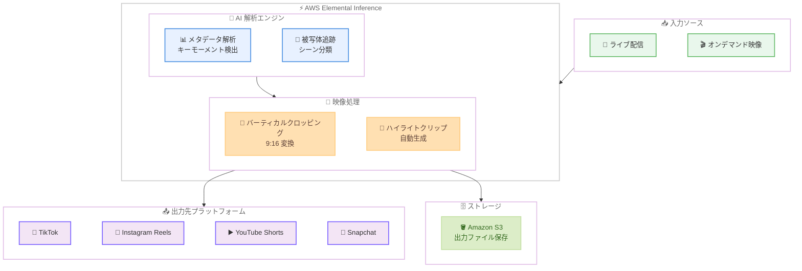

# AWS Elemental Inference - ライブ映像のモバイル最適化 AI サービス

**リリース日**: 2026 年 2 月 24 日
**サービス**: AWS Elemental Inference
**機能**: ライブ映像のバーティカル動画変換およびハイライトクリップ自動生成

📊 [このアップデートのインフォグラフィックを見る](https://takech9203.github.io/aws-news-summary/20260224-aws-elemental-inference-generally-avail.html)

## 概要

AWS Elemental Inference が一般提供 (GA) されました。AWS Elemental Inference は、放送事業者やストリーミング事業者がライブおよびオンデマンドの横向き映像を、モバイルやソーシャルプラットフォーム向けに最適化された縦型コンテンツやハイライトクリップへリアルタイムに自動変換できるフルマネージド AI サービスです。

本サービスはエージェント型 AI アプリケーションとして設計されており、プロンプトや人手による介入を必要とせずに映像を解析し、最適なクロッピングポイントやハイライトシーンを自動的に判定します。TikTok、Instagram Reels、YouTube Shorts、Snapchat といった主要なモバイルプラットフォーム向けのコンテンツを、1 つの映像ソースから一括で生成する「1 回処理、全プラットフォーム最適化」のアプローチを採用しています。

ベータテスト期間中の実績では、複数のポイントソリューションを組み合わせた場合と比較して、AI を活用したライブ映像ワークフロー全体で 34% 以上のコスト削減が確認されています。

**アップデート前の課題**

- 横向きのライブ映像をモバイル向け縦型フォーマットに変換するには、手動での編集作業や複数のポイントソリューションの組み合わせが必要だった
- ライブコンテンツからハイライトクリップを生成するには、人手による視聴・選定・編集が必要で、リアルタイム配信に間に合わないケースが多かった
- TikTok、Instagram Reels、YouTube Shorts など各プラットフォームに合わせたフォーマット変換を個別に行う必要があり、運用コストと工数が増大していた
- AI を活用した映像処理ワークフローを構築するには、複数のサービスやツールを組み合わせる必要があり、統合的なソリューションが存在しなかった

**アップデート後の改善**

- フルマネージドサービスとして、映像のアップロードからプラットフォーム最適化までをワンストップで実現
- エージェント型 AI により、プロンプトや人手を介さずに自動で最適な縦型クロッピングとハイライト抽出が可能に
- 1 回の映像処理で複数プラットフォーム向けの出力を同時生成し、運用工数を大幅に削減
- 複数のポイントソリューションと比較して 34% 以上のコスト削減を実現

## アーキテクチャ図



ライブ配信またはオンデマンド映像を AWS Elemental Inference に入力すると、AI 解析エンジンがメタデータ解析と被写体追跡を自動的に実行します。解析結果に基づき、バーティカルクロッピングとハイライトクリップ生成を行い、各ソーシャルプラットフォーム向けに最適化されたコンテンツを出力します。

## サービスアップデートの詳細

### 主要機能

1. **バーティカル動画クロッピング**
   - 横向き (16:9) のライブおよびオンデマンド映像を、モバイル最適化された縦型 (9:16) フォーマットに自動変換
   - TikTok、Instagram Reels、YouTube Shorts、Snapchat の各プラットフォームに対応
   - 被写体追跡 AI により、重要な被写体が常にフレーム内に収まるようクロッピングポイントを動的に調整

2. **高度なメタデータ解析によるハイライトクリップ生成**
   - ライブコンテンツからキーモーメント (ゴールシーン、決定的瞬間、盛り上がりのピークなど) を自動検出
   - 検出されたシーンに基づいてハイライトクリップを自動生成
   - リアルタイムでの処理により、ライブイベント中にもハイライトを配信可能

3. **エージェント型 AI アプリケーション**
   - プロンプトや人手による介入 (Human-in-the-Loop) が不要
   - AI が映像コンテンツを自律的に解析し、最適な出力を生成
   - コンテンツのジャンルや特性に応じて自動的に処理パラメータを調整

4. **1 回処理、全プラットフォーム最適化**
   - 単一の入力映像から複数プラットフォーム向けの出力を同時生成
   - プラットフォームごとの個別処理が不要
   - 統一的なワークフローで運用効率を最大化

## 技術仕様

### 対応フォーマット

| 項目 | 詳細 |
|------|------|
| 入力フォーマット | 横向き映像 16:9 |
| 出力フォーマット | 縦型映像 9:16 |
| 対応コンテンツタイプ | ライブ配信、オンデマンド映像 |
| 処理方式 | リアルタイム処理 |

### 対応出力プラットフォーム

| プラットフォーム | フォーマット |
|-----------------|-------------|
| TikTok | 縦型 9:16 |
| Instagram Reels | 縦型 9:16 |
| YouTube Shorts | 縦型 9:16 |
| Snapchat | 縦型 9:16 |

### AI 機能

| 機能 | 説明 |
|------|------|
| バーティカルクロッピング | 被写体追跡に基づく動的フレーム調整 |
| キーモーメント検出 | メタデータ解析によるハイライトシーン自動特定 |
| ハイライトクリップ生成 | 検出されたシーンからのクリップ自動生成 |
| エージェント型 AI | プロンプト不要の自律的映像処理 |

### パフォーマンス

| 項目 | 詳細 |
|------|------|
| コスト削減効果 | 複数ポイントソリューション比で 34% 以上削減 |
| 処理モード | リアルタイム / バッチ |
| スケーリング | フルマネージドで自動スケーリング |

## 設定方法

### 前提条件

1. AWS アカウントが有効化されている
2. 適切な IAM 権限が設定されている
3. 利用可能なリージョン (us-east-1, us-west-2, ap-south-1, eu-west-1) でリソースを作成する
4. 入力映像ソースが準備されている (ライブストリームまたは Amazon S3 上のオンデマンド映像)

### 手順

#### ステップ 1: Elemental Inference チャネルの作成

```bash
# AWS CLI で Elemental Inference チャネルを作成
aws elemental-inference create-channel \
  --channel-name "my-live-channel" \
  --input-type LIVE \
  --input-source "rtmp://example.com/live/stream" \
  --output-formats "VERTICAL_9_16" \
  --ai-features "VERTICAL_CROP,HIGHLIGHT_CLIP" \
  --destination-bucket "s3://my-output-bucket/clips/"
```

このコマンドは、ライブ入力ソースに対して縦型クロッピングとハイライトクリップ生成を有効にしたチャネルを作成します。

#### ステップ 2: オンデマンド映像の処理ジョブを作成

```bash
# オンデマンド映像の処理ジョブを作成
aws elemental-inference create-job \
  --job-name "vod-vertical-conversion" \
  --input-source "s3://my-input-bucket/source-video.mp4" \
  --output-formats "VERTICAL_9_16" \
  --ai-features "VERTICAL_CROP,HIGHLIGHT_CLIP" \
  --output-destination "s3://my-output-bucket/processed/" \
  --platform-targets "TIKTOK,INSTAGRAM_REELS,YOUTUBE_SHORTS,SNAPCHAT"
```

このコマンドは、S3 上のオンデマンド映像を全プラットフォーム向けに処理するジョブを作成します。

#### ステップ 3: 処理状況のモニタリング

```bash
# ジョブの状況を確認
aws elemental-inference describe-job \
  --job-id "job-xxxxxxxxx"

# チャネルの状態を確認
aws elemental-inference describe-channel \
  --channel-name "my-live-channel"
```

これらのコマンドで処理ジョブやチャネルの実行状況を確認できます。ジョブのステータスが `COMPLETE` になると、指定した出力先に変換済みファイルが保存されます。

## メリット

### ビジネス面

- **運用コストの大幅削減**: 複数のポイントソリューションを統合することで、AI ベースのライブ映像ワークフロー全体で 34% 以上のコスト削減を実現
- **コンテンツ配信のスピード向上**: リアルタイム処理により、ライブイベント中にモバイル向けハイライトクリップを即座に配信でき、視聴者エンゲージメントを最大化
- **リーチの拡大**: 1 つの映像ソースから TikTok、Instagram Reels、YouTube Shorts、Snapchat 向けコンテンツを同時生成し、モバイルオーディエンスへのリーチを拡大
- **人件費の削減**: エージェント型 AI が人手を介さずに映像処理を自動化するため、編集スタッフの負担を軽減

### 技術面

- **フルマネージド**: インフラ管理が不要で、映像処理に集中できる
- **自動スケーリング**: ライブイベント時のトラフィック増加に自動的に対応
- **エージェント型 AI**: プロンプト設計やモデルチューニングが不要で、即座に利用開始可能
- **統合ワークフロー**: 入力から複数プラットフォーム向け出力まで、単一サービスで完結

## デメリット・制約事項

### 制限事項

- 一般提供開始時点で利用可能なリージョンは 4 つ (us-east-1, us-west-2, ap-south-1, eu-west-1) に限定されている。東京リージョンは未対応
- 出力フォーマットは縦型 9:16 が中心で、その他のアスペクト比への対応状況は限定的な可能性がある
- エージェント型 AI のため、クロッピングポイントやハイライト選定の判断基準をユーザーが細かくカスタマイズすることは困難な場合がある

### 考慮すべき点

- 新規サービスのため、他の AWS Elemental サービス (MediaLive、MediaConvert など) との統合パターンやベストプラクティスは今後拡充されていく見込み
- AI による自動判定のため、特定のジャンルやコンテンツタイプによっては期待通りの結果が得られない可能性がある。本番運用前に十分なテストを推奨
- ライブ処理のレイテンシーやスループットの上限について、ドキュメントで最新の制限値を確認する必要がある

## ユースケース

### ユースケース 1: スポーツライブ配信のモバイル向けリアルタイム変換

**シナリオ**: スポーツ放送事業者が、サッカーや野球のライブ中継映像をリアルタイムで縦型フォーマットに変換し、TikTok や Instagram Reels で同時配信する。また、ゴールシーンやファインプレーなどのハイライトクリップを自動生成して即座に公開する。

**実装例**:
```bash
# スポーツライブ配信チャネルの作成
aws elemental-inference create-channel \
  --channel-name "soccer-match-live" \
  --input-type LIVE \
  --input-source "rtmp://broadcast.example.com/live/soccer" \
  --output-formats "VERTICAL_9_16" \
  --ai-features "VERTICAL_CROP,HIGHLIGHT_CLIP" \
  --highlight-settings '{"minClipDuration": 15, "maxClipDuration": 60}' \
  --platform-targets "TIKTOK,INSTAGRAM_REELS,YOUTUBE_SHORTS" \
  --destination-bucket "s3://sports-clips/soccer/"
```

**効果**: 従来は試合後に手動で編集していたハイライトクリップをリアルタイムで自動生成し、試合中にソーシャルメディアで配信可能。モバイル視聴者のエンゲージメント率の大幅向上と、編集チームの工数削減を同時に実現。

### ユースケース 2: ニュース番組のショート動画自動生成

**シナリオ**: ニュース配信事業者が、24 時間放送のニュース番組から重要なニュースセグメントを自動検出し、各ソーシャルプラットフォーム向けの縦型ショート動画として自動生成する。

**実装例**:
```bash
# ニュース番組のライブ入力設定
aws elemental-inference create-channel \
  --channel-name "news-24h-vertical" \
  --input-type LIVE \
  --input-source "rtmp://news.example.com/live/main" \
  --output-formats "VERTICAL_9_16" \
  --ai-features "VERTICAL_CROP,HIGHLIGHT_CLIP" \
  --highlight-settings '{"minClipDuration": 30, "maxClipDuration": 120}' \
  --platform-targets "TIKTOK,INSTAGRAM_REELS,YOUTUBE_SHORTS,SNAPCHAT" \
  --destination-bucket "s3://news-clips/shorts/"
```

**効果**: 24 時間のニュース番組から重要なセグメントを AI が自動抽出し、モバイル向けショート動画として継続的に生成。ソーシャルメディア向けコンテンツ制作の自動化により、少人数のチームでも大量のモバイルコンテンツを配信可能。

### ユースケース 3: 音楽ライブイベントのマルチプラットフォーム配信

**シナリオ**: 音楽フェスティバルやコンサートのライブ映像を、演奏中のアーティストにフォーカスした縦型映像としてリアルタイム配信し、名場面のハイライトクリップを自動生成してファンコミュニティに即座に届ける。

**実装例**:
```bash
# 音楽ライブイベントの処理設定
aws elemental-inference create-channel \
  --channel-name "music-festival-2026" \
  --input-type LIVE \
  --input-source "rtmp://event.example.com/live/main-stage" \
  --output-formats "VERTICAL_9_16" \
  --ai-features "VERTICAL_CROP,HIGHLIGHT_CLIP" \
  --highlight-settings '{"minClipDuration": 20, "maxClipDuration": 90}' \
  --platform-targets "TIKTOK,INSTAGRAM_REELS,YOUTUBE_SHORTS,SNAPCHAT" \
  --destination-bucket "s3://music-event/vertical-clips/"

# イベント終了後のアーカイブ映像もバッチ処理
aws elemental-inference create-job \
  --job-name "festival-day1-highlights" \
  --input-source "s3://music-event/archive/day1-full.mp4" \
  --output-formats "VERTICAL_9_16" \
  --ai-features "VERTICAL_CROP,HIGHLIGHT_CLIP" \
  --output-destination "s3://music-event/highlights/day1/" \
  --platform-targets "TIKTOK,INSTAGRAM_REELS,YOUTUBE_SHORTS,SNAPCHAT"
```

**効果**: ライブイベント中にリアルタイムで縦型映像を配信し、ソーシャルメディア上でのバイラル拡散を促進。イベント終了後にはアーカイブ映像からベストモーメントを自動抽出し、継続的なコンテンツ配信が可能。複数のポイントソリューションを使用する場合と比較して 34% 以上のコスト削減を実現。

## 料金

AWS Elemental Inference はフルマネージドサービスとして、処理した映像の量に基づいて課金されます。

### 料金体系

| 課金項目 | 説明 |
|---------|------|
| ライブ映像処理 | 入力映像の処理時間に基づく時間課金 |
| オンデマンド映像処理 | 処理した映像の分数に基づく従量課金 |
| ハイライトクリップ生成 | 生成されたクリップ数および長さに基づく従量課金 |
| 出力プラットフォーム数 | 出力先プラットフォーム数に応じた追加料金 |

### コスト削減効果

ベータテスト期間中の実績として、複数のポイントソリューション (映像変換ツール、AI 解析サービス、クリッピングツールなど) を個別に組み合わせた場合と比較して、34% 以上のコスト削減が確認されています。

※ 料金の詳細は AWS Elemental Inference 料金ページを参照してください。GA 直後のため、最新の料金情報はドキュメントで確認することを推奨します。

## 利用可能リージョン

- 米国東部 (バージニア北部) - us-east-1
- 米国西部 (オレゴン) - us-west-2
- アジアパシフィック (ムンバイ) - ap-south-1
- ヨーロッパ (アイルランド) - eu-west-1

## 関連サービス・機能

- **AWS Elemental MediaLive**: ライブ映像のエンコードおよびトランスコードサービス。Elemental Inference の入力ソースとして連携可能
- **AWS Elemental MediaConvert**: ファイルベースの映像トランスコードサービス。オンデマンドコンテンツの前処理に活用可能
- **AWS Elemental MediaPackage**: 映像コンテンツのパッケージングおよび配信サービス。Elemental Inference の出力を配信する際に連携可能
- **Amazon S3**: 入力映像および出力クリップの保存に使用
- **Amazon CloudWatch**: Elemental Inference のジョブおよびチャネルのモニタリングに活用

## 参考リンク

- 📊 [インフォグラフィック](https://takech9203.github.io/aws-news-summary/20260224-aws-elemental-inference-generally-avail.html)
- [公式発表 (What's New)](https://aws.amazon.com/about-aws/whats-new/2026/02/aws-elemental-inference-generally-avail/)
- [AWS Blog - Transform live video for mobile audiences with AWS Elemental Inference](https://aws.amazon.com/blogs/aws/transform-live-video-for-mobile-audiences-with-aws-elemental-inference/)
- [ドキュメント](https://docs.aws.amazon.com/elemental-inference/)

## まとめ

AWS Elemental Inference は、放送事業者やストリーミング事業者がライブおよびオンデマンドの横向き映像を、モバイルやソーシャルプラットフォーム向けの縦型コンテンツやハイライトクリップにリアルタイムで自動変換できる、初のフルマネージド AI サービスです。エージェント型 AI アプリケーションとして、プロンプトや人手を介さずに映像コンテンツを自律的に解析・最適化し、TikTok、Instagram Reels、YouTube Shorts、Snapchat の各プラットフォーム向けコンテンツを 1 回の処理で同時生成します。複数のポイントソリューションと比較して 34% 以上のコスト削減が見込め、スポーツ中継、ニュース配信、音楽ライブイベントなど、ライブ映像をモバイルオーディエンスに届けたいあらゆるユースケースに活用できます。現在は 4 つのリージョンで利用可能で、今後のリージョン拡大が期待されます。
