# AWS Elemental MediaConvert - Video Probe API and UI

**リリース日**: 2026 年 2 月 24 日
**サービス**: AWS Elemental MediaConvert
**機能**: Video Probe API and UI

📊 [このアップデートのインフォグラフィックを見る](https://takech9203.github.io/aws-news-summary/20260224-aws-mediaconvert-introduces-video-probe.html)

## 概要

AWS Elemental MediaConvert に、新しい無料のメタデータ分析ツール「Probe API」が導入されました。Probe API はメディアファイルのヘッダーメタデータを読み取り、コーデック仕様、ピクセルフォーマット、カラースペースの詳細、コンテナ情報などの重要な情報を迅速に返します。実際の動画コンテンツを処理せず、ヘッダーのみを読み取るため、高速に動作します。

この機能は、ファイルの検証、ワークフローの自動化、ソースマテリアルの特性に基づくエンコーディング判断に活用できます。AWS Step Functions と組み合わせることで、メタデータに基づいた自動エンコーディングワークフローを構築することも可能です。Probe API は追加料金なしで利用でき、AWS Elemental MediaConvert が利用可能なすべてのリージョンで提供されます。

**アップデート前の課題**

- メディアファイルのメタデータを確認するために、外部ツールや手動分析が必要だった
- ソースファイルの特性を把握するために実際のエンコーディングジョブを実行する必要がある場合があった
- メタデータに基づくエンコーディング判断の自動化が困難だった
- ワークフロー内でのファイル検証プロセスが複雑で時間がかかっていた

**アップデート後の改善**

- MediaConvert 内でメディアファイルのメタデータを無料で即座に分析可能
- ヘッダーのみを読み取るため、高速にメタデータを取得
- Step Functions と連携した自動エンコーディングワークフローの構築が容易に
- コーデック、解像度、カラースペースなどの詳細情報に基づく判断の自動化が可能

## アーキテクチャ図

```mermaid
flowchart TD
    subgraph AWS["☁️ AWS Cloud"]
        subgraph Storage["🗄️ ストレージ"]
            S3[("🪣 Amazon S3<br/>ソースメディアファイル")]
        end

        subgraph ProbePhase["🔍 メタデータ分析"]
            Probe["⚡ Probe API<br/>ヘッダーメタデータ読み取り<br/>無料"]
        end

        subgraph MetadataResult["📋 分析結果"]
            direction LR
            Codec["🎬 コーデック仕様"]
            Color["🎨 カラースペース"]
            Container["📦 コンテナ情報"]
            Codec ~~~ Color ~~~ Container
        end

        subgraph Orchestration["⚙️ ワークフローオーケストレーション"]
            StepFunctions["🔄 AWS Step Functions<br/>判断ロジック"]
        end

        subgraph Encoding["🎞️ エンコーディング"]
            direction LR
            Job4K["📺 4K HDR ジョブ"]
            JobHD["📺 HD SDR ジョブ"]
            JobSD["📺 SD ジョブ"]
            Job4K ~~~ JobHD ~~~ JobSD
        end

        MC["⚡ MediaConvert<br/>トランスコーディング実行"]

        subgraph Output["📤 出力"]
            S3Out[("🪣 Amazon S3<br/>出力先")]
        end
    end

    S3 --> Probe
    Probe --> MetadataResult
    MetadataResult --> StepFunctions
    StepFunctions -->|"メタデータに基づく<br/>エンコーディング判断"| Encoding
    Job4K --> MC
    JobHD --> MC
    JobSD --> MC
    MC --> S3Out

    classDef cloud fill:none,stroke:#CCCCCC,stroke-width:2px,color:#666666
    classDef layer fill:none,stroke:#E1BEE7,stroke-width:2px,color:#666666
    classDef storage fill:#DCEDC8,stroke:#C5E1A5,stroke-width:2px,color:#33691E
    classDef probe fill:#E9F7EC,stroke:#66BB6A,stroke-width:2px,color:#333333
    classDef metadata fill:#E8EAF6,stroke:#C5CAE9,stroke-width:2px,color:#283593
    classDef orchestration fill:#F3E5F5,stroke:#7B61FF,stroke-width:2px,color:#333333
    classDef encoding fill:#FFE0B2,stroke:#FFCC80,stroke-width:2px,color:#5D4037
    classDef compute fill:#E8F1FF,stroke:#4A90E2,stroke-width:2px,color:#333333

    class AWS cloud
    class Storage,ProbePhase,MetadataResult,Orchestration,Encoding,Output layer
    class S3,S3Out storage
    class Probe probe
    class Codec,Color,Container metadata
    class StepFunctions orchestration
    class Job4K,JobHD,JobSD encoding
    class MC compute
```



S3 に保存されたソースメディアファイルに対して Probe API を呼び出すと、ヘッダーメタデータを読み取り、コーデック仕様、カラースペース、コンテナ情報などの分析結果を返します。この結果を AWS Step Functions に渡して判断ロジックを実行し、ソースの特性に最適なエンコーディングジョブを自動的に選択して MediaConvert でトランスコーディングを実行します。

## サービスアップデートの詳細

### 主要機能

1. **メタデータ分析 - Probe API**
   - メディアファイルのヘッダーメタデータを読み取り、詳細情報を JSON で返却
   - コーデック、フレームレート、解像度、トラック数、オーディオレイアウト、字幕情報などを取得
   - 実際の動画コンテンツを処理しないため、高速に動作
   - **完全無料**で利用可能

2. **Probe UI**
   - MediaConvert コンソールから GUI でメタデータ分析を実行可能
   - API を直接呼び出さずに、視覚的にメディアファイルの情報を確認
   - 開発者でなくても簡単に利用可能

3. **ワークフロー自動化との連携**
   - AWS Step Functions と組み合わせて、メタデータに基づく自動エンコーディング判断が可能
   - ソースファイルの特性に応じて最適なエンコーディング設定を動的に選択
   - 大量のメディアファイルを効率的に処理するパイプラインの構築が容易

4. **包括的なメタデータ取得**
   - コンテナ情報: フォーマット (MP4、MOV、MKV、WebM、MXF)、再生時間、トラック構成
   - ビデオプロパティ: 解像度、フレームレート、ビット深度、カラープライマリ、マトリクス係数
   - オーディオプロパティ: サンプルレート、チャンネル数、ビット深度、言語コード
   - コーデックメタデータ: プロファイル、レベル、クロマサブサンプリング、スキャンタイプ

## 技術仕様

### API エンドポイント

| 項目 | 詳細 |
|------|------|
| URI | `/2017-08-29/probe` |
| HTTP メソッド | POST |
| リクエスト形式 | JSON |
| レスポンス形式 | JSON |

### リクエスト形式

```json
{
  "inputFiles": [
    {
      "fileUrl": "s3://my-bucket/my-video.mp4"
    }
  ]
}
```

### レスポンスに含まれる情報

| カテゴリ | 含まれる情報 |
|---------|------------|
| メタデータ | ファイルサイズ、eTag、最終更新日時、MIME タイプ |
| コンテナ | フォーマット、再生時間、トラック構成 |
| ビデオトラック | コーデック、解像度、フレームレート、ビット深度、カラースペース |
| オーディオトラック | コーデック、サンプルレート、チャンネル数、ビット深度、言語コード |
| データトラック | 言語コード |
| トラックマッピング | ビデオ・オーディオ・データトラックのインデックス |

### サポートされるコンテナフォーマット

| フォーマット | 拡張子 |
|-------------|--------|
| MP4 | .mp4 |
| QuickTime | .mov |
| Matroska | .mkv |
| WebM | .webm |
| MXF | .mxf |

### カラースペース情報

Probe API は以下のカラープライマリを識別できます。

- ITU_709 (Rec. 709 / sRGB)
- ITU_2020 (Rec. 2020 / HDR)
- SMPTE_170M (NTSC)
- SMPTE_240M
- SMPTE_431_2 (DCI-P3)
- SMPTE_EG_432_1 (Display P3)
- その他多数

## 設定方法

### 前提条件

1. AWS アカウントと MediaConvert へのアクセス権限があること
2. 分析対象のメディアファイルが Amazon S3 に保存されていること
3. AWS CLI または SDK がインストールされていること (API 経由で利用する場合)

### 手順

#### ステップ 1: Probe API を使用してメタデータを取得

```bash
# AWS CLI を使用して Probe API を呼び出す
aws mediaconvert probe \
  --region us-east-1 \
  --input-files '[{"fileUrl": "s3://my-media-bucket/source-video.mp4"}]'
```

このコマンドは、S3 に保存されたメディアファイルのヘッダーメタデータを読み取り、JSON 形式で返します。

#### ステップ 2: レスポンスの確認

```json
{
  "probeResults": [
    {
      "metadata": {
        "fileSize": 1073741824,
        "mimeType": "video/mp4"
      },
      "container": {
        "format": "mp4",
        "duration": 3600.0,
        "tracks": [
          {
            "index": 0,
            "codec": "H_265",
            "trackType": "VIDEO",
            "videoProperties": {
              "frameRate": {
                "numerator": 24000,
                "denominator": 1001
              },
              "width": 3840,
              "height": 2160,
              "bitDepth": 10,
              "colorPrimaries": "ITU_2020"
            }
          }
        ]
      }
    }
  ]
}
```

レスポンスから、ソースファイルが 4K HDR (Rec. 2020) の H.265 コンテンツであることが分かります。

#### ステップ 3: Step Functions と連携した自動ワークフローの構築

```json
{
  "Comment": "Probe API を使用した自動エンコーディングワークフロー",
  "StartAt": "ProbeMediaFile",
  "States": {
    "ProbeMediaFile": {
      "Type": "Task",
      "Resource": "arn:aws:lambda:us-east-1:123456789012:function:ProbeMediaFile",
      "Next": "EvaluateMetadata"
    },
    "EvaluateMetadata": {
      "Type": "Choice",
      "Choices": [
        {
          "Variable": "$.videoProperties.width",
          "NumericGreaterThanEquals": 3840,
          "Next": "Encode4KHDR"
        },
        {
          "Variable": "$.videoProperties.width",
          "NumericGreaterThanEquals": 1920,
          "Next": "EncodeHD"
        }
      ],
      "Default": "EncodeSD"
    },
    "Encode4KHDR": {
      "Type": "Task",
      "Resource": "arn:aws:lambda:us-east-1:123456789012:function:CreateMediaConvertJob",
      "Parameters": {
        "preset": "4K-HDR-HEVC"
      },
      "End": true
    },
    "EncodeHD": {
      "Type": "Task",
      "Resource": "arn:aws:lambda:us-east-1:123456789012:function:CreateMediaConvertJob",
      "Parameters": {
        "preset": "HD-SDR-H264"
      },
      "End": true
    },
    "EncodeSD": {
      "Type": "Task",
      "Resource": "arn:aws:lambda:us-east-1:123456789012:function:CreateMediaConvertJob",
      "Parameters": {
        "preset": "SD-H264"
      },
      "End": true
    }
  }
}
```

Step Functions ステートマシンを使用して、Probe API のレスポンスに基づいてエンコーディングプリセットを自動的に選択します。

## メリット

### ビジネス面

- **完全無料**: Probe API の利用に追加料金は一切不要。コストを気にせずメタデータ分析を実行可能
- **ワークフロー効率化**: メディアファイルの特性に基づく自動判断により、手動作業を大幅に削減
- **品質向上**: ソースマテリアルの正確な特性把握により、最適なエンコーディング設定を選択可能

### 技術面

- **高速分析**: ヘッダーメタデータのみを読み取るため、ファイルサイズに関係なく高速に動作
- **包括的な情報取得**: コーデック、解像度、フレームレート、カラースペースなど、エンコーディング判断に必要な全ての情報を一度に取得
- **自動化対応**: REST API として提供されるため、Step Functions や Lambda と容易に統合可能

## デメリット・制約事項

### 制限事項

- ヘッダーメタデータのみを読み取るため、実際の映像コンテンツの品質分析は行わない
- 対応コンテナフォーマットは MP4、MOV、MKV、WebM、MXF に限定
- 認識できないフォーマットの場合、コンテナ情報が空で返される場合がある

### 考慮すべき点

- Probe API は映像の視覚的な品質を評価するものではない。品質評価が必要な場合は、MediaConvert のフレームごとのメトリクスレポート機能を使用する
- 大量のファイルを一度に Probe する場合は、API のスロットリング制限に注意する

## ユースケース

### ユースケース 1: 大量メディアファイルの自動分類と処理

**シナリオ**: メディア企業が数千本の動画ファイルをアーカイブから取り込み、それぞれの特性に応じた最適なエンコーディングを自動的に適用したい。

**実装例**:
```bash
# Lambda 関数内で Probe API を呼び出し、結果に基づいてジョブを作成
aws mediaconvert probe \
  --input-files '[{"fileUrl": "s3://archive-bucket/video-001.mxf"}]'
```

**効果**: Probe API でソースファイルの特性を自動判別し、Step Functions で適切なエンコーディングプリセットを動的に選択することで、手動分析なしに大量ファイルを効率的に処理できる。

### ユースケース 2: 入稿ファイルの自動バリデーション

**シナリオ**: 放送局が外部の制作会社から納品されるメディアファイルが、規定のフォーマット仕様を満たしているかを自動的に検証したい。

**実装例**:
```python
# Python SDK を使用したバリデーション例
import boto3

client = boto3.client('mediaconvert', endpoint_url='<MediaConvert Endpoint>')

response = client.probe(
    InputFiles=[{'FileUrl': 's3://incoming-bucket/delivery.mxf'}]
)

result = response['ProbeResults'][0]
video = result['Container']['Tracks'][0]['VideoProperties']

# バリデーションチェック
assert video['Width'] >= 1920, "解像度が不足しています"
assert video['BitDepth'] >= 10, "ビット深度が不足しています"
assert video['ColorPrimaries'] == 'ITU_709', "カラースペースが規定外です"
```

**効果**: 納品ファイルの仕様準拠を自動的に検証し、規定外のファイルを早期に検出することで、ワークフローの品質と効率を向上できる。

### ユースケース 3: HDR / SDR の自動判別とアダプティブエンコーディング

**シナリオ**: OTT プラットフォームが、アップロードされた動画の HDR / SDR を自動判別し、それぞれに最適なエンコーディングラダーを適用したい。

**実装例**:
```bash
# Probe API でカラースペースを確認
# colorPrimaries が ITU_2020 の場合は HDR ワークフロー
# colorPrimaries が ITU_709 の場合は SDR ワークフロー
aws mediaconvert probe \
  --input-files '[{"fileUrl": "s3://upload-bucket/user-content.mp4"}]' \
  --query 'probeResults[0].container.tracks[0].videoProperties.colorPrimaries'
```

**効果**: Probe API のカラースペース情報に基づいて HDR / SDR を自動判別し、それぞれに最適化されたエンコーディング設定を適用することで、視聴品質を最大化できる。

## 料金

Probe API は**完全無料**で提供されます。メディアファイルのメタデータ分析に追加料金は一切かかりません。

| 機能 | 料金 |
|------|------|
| Probe API | 無料 |
| Probe UI | 無料 |
| MediaConvert トランスコーディング | 標準の MediaConvert 料金が適用 |

詳細な MediaConvert の料金情報については、[AWS Elemental MediaConvert 料金ページ](https://aws.amazon.com/mediaconvert/pricing/)を参照してください。

## 利用可能リージョン

Probe API は、AWS Elemental MediaConvert が利用可能なすべてのリージョンで提供されます。

## 関連サービス・機能

- **Amazon S3**: メディアファイルの保存元および出力先ストレージ
- **AWS Step Functions**: Probe API の結果に基づくワークフローオーケストレーション
- **AWS Lambda**: Probe API の呼び出しとエンコーディングジョブの作成を実行する関数
- **MediaConvert フレームごとのメトリクスレポート**: 映像品質の詳細分析 (PSNR、SSIM、VMAF など)

## 参考リンク

- 📊 [インフォグラフィック](https://takech9203.github.io/aws-news-summary/20260224-aws-mediaconvert-introduces-video-probe.html)
- [公式発表 (What's New)](https://aws.amazon.com/about-aws/whats-new/2026/02/aws-mediaconvert-introduces-video-probe/)
- [Probe API リファレンス](https://docs.aws.amazon.com/mediaconvert/latest/apireference/probe.html)
- [MediaConvert ユーザーガイド](https://docs.aws.amazon.com/mediaconvert/latest/ug/getting-started.html)

## まとめ

AWS Elemental MediaConvert の Probe API は、メディアファイルのヘッダーメタデータを高速かつ無料で分析できる強力なツールです。コーデック仕様、カラースペース、コンテナ情報などの詳細なメタデータを取得し、ファイルの検証やエンコーディング判断の自動化に活用できます。特に AWS Step Functions と組み合わせることで、ソースファイルの特性に基づいた自動エンコーディングワークフローを構築でき、大量のメディアファイルを効率的に処理するパイプラインの実現が可能です。無料で利用できるため、メディアワークフローの効率化を検討している場合は積極的に活用を推奨します。
