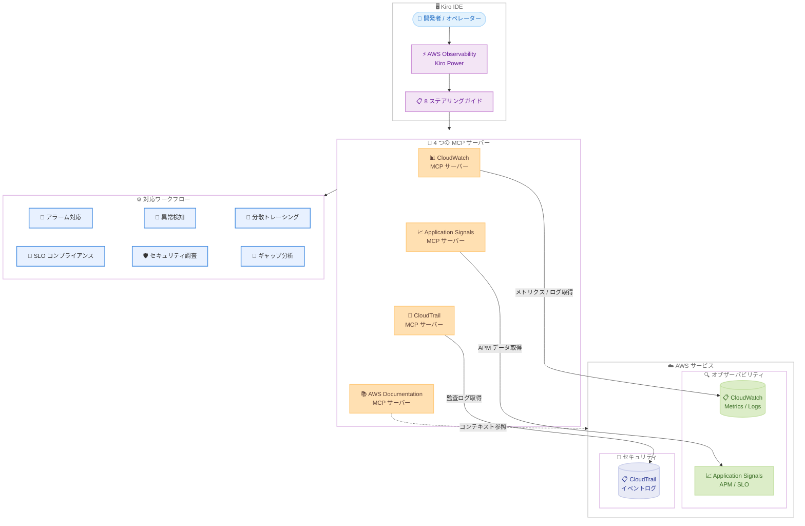

# AWS Observability - Kiro Power として利用可能に

**リリース日**: 2026 年 2 月 24 日
**サービス**: Amazon CloudWatch, AWS CloudTrail, Application Signals
**機能**: AWS Observability Kiro Power

📊 [このアップデートのインフォグラフィックを見る](https://takech9203.github.io/aws-news-summary/20260224-aws-observability-kiro-power.html)

## 概要

AWS Observability が Kiro Power として利用可能になりました。Kiro Powers は、厳選されたプリパッケージの MCP サーバー、ステアリングファイル、フックで構成されるパッケージです。本アップデートにより、AI エージェント支援によるオブザーバビリティデータの分析とトラブルシューティングが Kiro IDE 上でワンクリックで利用可能になります。

この Power には、CloudWatch MCP サーバー、Application Signals MCP サーバー、CloudTrail MCP サーバー、AWS Documentation MCP サーバーの 4 つの専門 MCP サーバーが含まれており、8 つの包括的なステアリングガイドがインシデント対応からギャップ分析まで幅広いワークフローをカバーします。

**アップデート前の課題**

- オブザーバビリティデータの分析に複数の AWS コンソールやツールを切り替える必要があった
- インシデント発生時の MTTR (平均修復時間) が長く、手動でのログ調査やメトリクス確認に時間がかかっていた
- オブザーバビリティスタックの計装ギャップを特定するには専門知識と手動のレビューが必要だった
- 分散トレーシングや SLO コンプライアンスの監視を IDE 上から直接実行できなかった

**アップデート後の改善**

- Kiro IDE 上でワンクリックインストールにより、4 つの MCP サーバーとステアリングガイドを一括導入可能に
- AI エージェントがオブザーバビリティデータを横断的に分析し、インシデントの根本原因を迅速に特定
- 自動ギャップ分析により、計装が不足している箇所を自動検出し改善を提案
- アラーム対応、異常検知、分散トレーシング、SLO コンプライアンス監視、セキュリティ調査のワークフローを IDE 内で完結

## アーキテクチャ図



この図は、Kiro IDE 上の AWS Observability Power が 4 つの MCP サーバーを通じて AWS のオブザーバビリティサービスおよびセキュリティサービスに接続し、各種ワークフローを実現する全体像を示しています。

## サービスアップデートの詳細

### 4 つの専門 MCP サーバー

1. **CloudWatch MCP サーバー**
   - CloudWatch メトリクス、ログ、アラームなどのオブザーバビリティデータへのアクセスを提供
   - メトリクスのクエリ、ログの検索、アラーム状態の確認を AI エージェント経由で実行可能
   - ダッシュボードの参照やメトリクスの異常検知をサポート

2. **Application Signals MCP サーバー**
   - アプリケーションパフォーマンス監視 (APM) データへのアクセスを提供
   - サービスレベル目標 (SLO) のコンプライアンス状況をリアルタイムで確認可能
   - 分散トレーシングによるリクエストフローの追跡とボトルネックの特定

3. **CloudTrail MCP サーバー**
   - AWS API コールの監査ログへのアクセスを提供
   - セキュリティ分析とコンプライアンス検証をサポート
   - 不正アクセスや設定変更の調査を AI エージェントが支援

4. **AWS Documentation MCP サーバー**
   - AWS 公式ドキュメントへのコンテキスト参照を提供
   - トラブルシューティング時に関連するベストプラクティスや設定ガイドを自動取得
   - 他の 3 つの MCP サーバーの出力結果に対して、ドキュメントベースの補足情報を付加

### 8 つの包括的ステアリングガイド

ステアリングガイドは、AI エージェントの動作を導く構造化された指示です。以下の領域をカバーします。

| カテゴリ | 説明 |
|---------|------|
| インシデント対応 | アラーム発火時の初動対応手順と根本原因分析の実行 |
| アラート管理 | アラームルールの評価、最適化、ミュートルール設定の支援 |
| パフォーマンス監視 | アプリケーションのレイテンシ、エラー率、スループットの分析 |
| SLO コンプライアンス | サービスレベル目標の達成状況の監視と違反時の対応 |
| 分散トレーシング | マイクロサービス間のリクエストフロー追跡と遅延箇所の特定 |
| 異常検知 | メトリクスの異常パターン検出と影響範囲の評価 |
| セキュリティ監査 | CloudTrail ログに基づくセキュリティイベントの調査と分析 |
| ギャップ分析 | 計装が不足している箇所の自動検出と改善提案 |

### 自動ギャップ分析

自動ギャップ分析機能は、オブザーバビリティスタックの計装状況を自動的に評価し、以下の観点で改善点を提案します。

- メトリクスカバレッジの不足箇所の特定
- ログ収集が設定されていないサービスの検出
- トレーシングが有効化されていないサービスの特定
- アラームが設定されていない重要メトリクスの検出

## 技術仕様

### MCP サーバー詳細

| MCP サーバー | 主な機能 | データソース |
|---|---|---|
| CloudWatch MCP サーバー | メトリクスクエリ、ログ検索、アラーム管理 | CloudWatch Metrics, Logs, Alarms |
| Application Signals MCP サーバー | APM データ分析、SLO 監視、分散トレーシング | Application Signals |
| CloudTrail MCP サーバー | 監査ログ分析、セキュリティ調査 | CloudTrail Events |
| AWS Documentation MCP サーバー | コンテキスト参照、ベストプラクティス取得 | AWS 公式ドキュメント |

### サポートされるワークフロー

| ワークフロー | 説明 | 使用 MCP サーバー |
|---|---|---|
| アラーム対応 | CloudWatch アラーム発火時の調査と対応 | CloudWatch, Documentation |
| 異常検知 | メトリクスの異常値検出と影響分析 | CloudWatch, Application Signals |
| 分散トレーシング | サービス間のリクエストフロー追跡 | Application Signals |
| SLO コンプライアンス監視 | SLO 達成状況の監視と違反対応 | Application Signals, CloudWatch |
| セキュリティ調査 | API コールの監査とセキュリティイベント分析 | CloudTrail, Documentation |
| ギャップ分析 | 計装不足箇所の自動検出と改善提案 | CloudWatch, Application Signals, Documentation |

### API 変更履歴

| 日付 | サービス | 変更内容 |
|------|----------|----------|
| 2026/02/24 | [CloudWatch Observability Admin Service](https://awsapichanges.com/archive/changes/b6a65c-observabilityadmin.html) | 5 updated methods - CreateCentralizationRuleForOrganization 等、オブザーバビリティの組織一元管理メソッドの更新 |
| 2026/02/24 | [Amazon CloudWatch](https://awsapichanges.com/archive/changes/b6a65c-monitoring.html) | 4 new methods - AlarmMuteRules 関連の新規メソッド追加、アラームミュートルールの作成・管理機能 |

## 設定方法

### 前提条件

1. Kiro IDE がインストールされていること
2. AWS アカウントと適切な IAM 権限 (CloudWatch、CloudTrail、Application Signals へのアクセス権限)
3. 監視対象の AWS リソースがデプロイ済みであること

### 手順

#### ステップ 1: ワンクリックインストール

Kiro IDE から AWS Observability Power をワンクリックでインストールします。

1. [Kiro Powers ページ](https://kiro.dev/powers/) にアクセス
2. AWS Observability Power を選択
3. [ワンクリックインストール](https://kiro.dev/launch/powers/aws-observability) をクリック

または、Kiro IDE 内の Powers メニューから直接インストールすることも可能です。

#### ステップ 2: AWS 認証情報の設定

Kiro IDE で AWS 認証情報を設定し、MCP サーバーが AWS サービスにアクセスできるようにします。

```bash
# AWS CLI プロファイルが設定済みであることを確認
aws sts get-caller-identity
```

#### ステップ 3: Power の動作確認

インストール後、Kiro IDE のチャットインターフェースから以下のようなプロンプトでオブザーバビリティデータにアクセスできることを確認します。

```
「現在アラーム状態の CloudWatch アラームを一覧表示してください」
「Application Signals で SLO 違反が発生しているサービスを確認してください」
「直近 1 時間の CloudTrail ログで IAM 関連のイベントを調査してください」
```

## メリット

### ビジネス面

- **MTTR の短縮**: AI エージェントがオブザーバビリティデータを横断的に分析し、インシデントの根本原因を迅速に特定することで、平均修復時間を大幅に短縮
- **プロアクティブな改善**: 自動ギャップ分析により、問題が発生する前にオブザーバビリティスタックの計装不足を検出し改善
- **運用効率の向上**: 複数のコンソールやツールを切り替える必要がなくなり、IDE 内でトラブルシューティングが完結

### 技術面

- **統合トラブルシューティング**: 4 つの MCP サーバーが連携し、メトリクス、ログ、トレース、セキュリティログを横断的に分析
- **IDE 統合**: Kiro IDE 上で開発とオペレーションのワークフローがシームレスに統合
- **ステアリングガイド**: 8 つの包括的なガイドにより、AI エージェントが体系的にトラブルシューティングを実行
- **ワンクリックセットアップ**: 複雑な MCP サーバーの個別設定が不要で、即座に利用開始可能

## デメリット・制約事項

### 制限事項

- Kiro IDE が必須であり、他の IDE からは直接利用できない
- 各 MCP サーバーの利用可能リージョンは、対応する AWS サービスのリージョン展開状況に依存する
- AI エージェントによる分析結果は参考情報であり、重要な判断には人間による検証が必要

### 考慮すべき点

- MCP サーバーを通じた AWS サービスへのアクセスには、適切な IAM 権限の設定が必要
- 大量のオブザーバビリティデータをクエリする場合、レスポンス時間が長くなる可能性がある
- ステアリングガイドのカスタマイズ機能は現時点では限定的
- 組織のセキュリティポリシーに基づき、MCP サーバー経由でのデータアクセス範囲を適切に制御する必要がある

## ユースケース

### ユースケース 1: インシデント対応と MTTR 短縮

**シナリオ**: CloudWatch アラームが発火し、本番環境のサービスでレイテンシが急増している。迅速に根本原因を特定し、復旧する必要がある。

**実装例**:
```
「ALARM 状態の CloudWatch アラームを確認し、関連するメトリクスとログから根本原因を分析してください」
```

**効果**: AI エージェントが CloudWatch のメトリクスとログ、Application Signals の分散トレースを横断的に分析し、根本原因を特定。手動での複数コンソール調査と比較して MTTR を大幅に短縮。

### ユースケース 2: SLO コンプライアンス監視

**シナリオ**: マイクロサービスアーキテクチャで複数のサービスに SLO を設定しており、SLO 違反の早期検出と対応を行いたい。

**実装例**:
```
「Application Signals で設定済みの全 SLO のコンプライアンス状況を確認し、違反リスクのあるサービスを特定してください」
```

**効果**: Application Signals MCP サーバーを通じて SLO の達成状況をリアルタイムで確認し、違反が発生する前にプロアクティブに対応可能。

### ユースケース 3: セキュリティ調査

**シナリオ**: セキュリティチームから不正アクセスの疑いが報告され、CloudTrail ログを調査して影響範囲を特定する必要がある。

**実装例**:
```
「直近 24 時間の CloudTrail ログで、特定の IAM ユーザーによる API コールを調査し、不審なアクティビティを特定してください」
```

**効果**: CloudTrail MCP サーバーが監査ログを分析し、不審な API コールパターンや権限昇格の試行を自動的に検出。Documentation MCP サーバーが関連するセキュリティベストプラクティスを参照し、対応策を提案。

## 料金

AWS Observability Kiro Power 自体の利用に追加料金はかかりません。以下の料金が適用されます。

- **Kiro IDE**: Kiro の料金プランに準拠 (詳細は [Kiro 公式サイト](https://kiro.dev/) を参照)
- **Amazon CloudWatch**: メトリクス、ログ、アラームの標準料金が適用
- **Application Signals**: Application Signals の標準料金が適用
- **AWS CloudTrail**: イベントログの標準料金が適用

MCP サーバーを通じた API コールは、通常の AWS サービス利用と同様に課金されます。

## 利用可能リージョン

AWS Observability Kiro Power は、Kiro IDE を通じてすべての AWS リージョンで利用可能です。ただし、各 MCP サーバーがアクセスする AWS サービスの利用可能リージョンは以下のとおりです。

- **CloudWatch MCP サーバー**: Amazon CloudWatch が利用可能なすべてのリージョン
- **Application Signals MCP サーバー**: Application Signals が利用可能なリージョンに依存
- **CloudTrail MCP サーバー**: AWS CloudTrail が利用可能なすべてのリージョン
- **AWS Documentation MCP サーバー**: リージョンに依存しない (グローバルサービス)

## 関連サービス・機能

- **Amazon CloudWatch**: メトリクス、ログ、アラームを提供するフルマネージドモニタリングサービス
- **Application Signals**: アプリケーションパフォーマンス監視と SLO 管理を提供
- **AWS CloudTrail**: AWS API コールの監査ログを記録するサービス
- **Kiro IDE**: AI エージェント支援の統合開発環境
- **Kiro Powers**: MCP サーバー、ステアリングファイル、フックをプリパッケージした拡張機能

## 参考リンク

- 📊 [インフォグラフィック](https://takech9203.github.io/aws-news-summary/20260224-aws-observability-kiro-power.html)
- [公式発表 (What's New)](https://aws.amazon.com/about-aws/whats-new/2026/02/aws-observability-kiro-power/)
- [Kiro Powers](https://kiro.dev/powers/)
- [ワンクリックインストール](https://kiro.dev/launch/powers/aws-observability)
- [AWS MCP ドキュメント](https://awslabs.github.io/mcp/)
- [API 変更履歴 - CloudWatch Observability Admin Service](https://awsapichanges.com/archive/changes/b6a65c-observabilityadmin.html)
- [API 変更履歴 - Amazon CloudWatch](https://awsapichanges.com/archive/changes/b6a65c-monitoring.html)

## まとめ

AWS Observability が Kiro Power として利用可能になり、AI エージェント支援によるトラブルシューティングが Kiro IDE 上で実現しました。CloudWatch、Application Signals、CloudTrail、AWS Documentation の 4 つの専門 MCP サーバーが統合され、アラーム対応、異常検知、分散トレーシング、SLO コンプライアンス監視、セキュリティ調査、ギャップ分析の各ワークフローを IDE 内で完結できます。8 つのステアリングガイドが AI エージェントの動作を体系的に導き、アクティブなインシデントの MTTR 短縮とプロアクティブなオブザーバビリティスタックの改善という 2 つの重要なニーズに対応します。ワンクリックインストールで即座に利用開始可能であり、オブザーバビリティワークフローの効率化を目指すチームにとって有用な拡張機能です。
