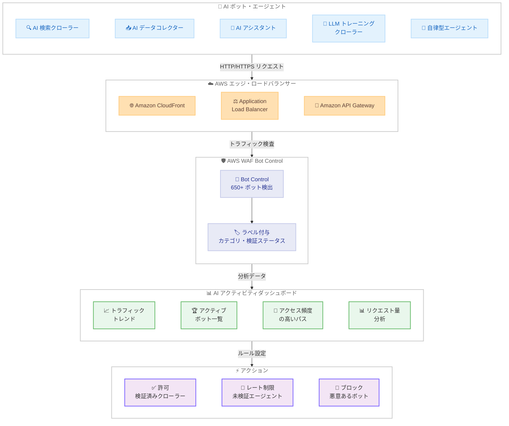

# AWS WAF - AI アクティビティダッシュボードで AI ボット・エージェントトラフィックを可視化

**リリース日**: 2026 年 2 月 24 日
**サービス**: AWS WAF
**機能**: AI activity dashboard

📊 [このアップデートのインフォグラフィックを見る](https://takech9203.github.io/aws-news-summary/20260224-aws-waf-ai-activity-dashboard.html)

## 概要

AWS WAF は、AI ボットおよび AI エージェントのトラフィックを一元的に可視化する新しい AI アクティビティダッシュボードを発表しました。このリリースにあわせて、AWS WAF Bot Control の検出カバレッジが 650 以上のユニークなボットおよびエージェントに拡大され、業界でも最も包括的な AI ボット検出カタログの 1 つとなりました。

AI を活用したボットや自律型エージェントは、Web トラフィックのパターンを急速に変化させています。AI 検索クローラーはコンテンツをインデックスし、RAG (Retrieval-Augmented Generation) システムはリアルタイムでデータを取得し、自律型エージェントは API や Web アプリケーション全体で複数ステップのタスクを実行します。これらのトラフィックを可視化できない場合、インフラストラクチャコストの増加、アプリケーションパフォーマンスへの影響、セキュリティやビジネスポリシーに反するコンテンツへのアクセスが発生する可能性があります。

**アップデート前の課題**

- AI ボットやエージェントがアプリケーションにどの程度アクセスしているか一元的に把握する手段がなかった
- AI ボットのカテゴリや検証ステータスごとのリクエスト量を分析することが困難だった
- AI トラフィックのトレンドを時系列で可視化する標準的な方法が提供されていなかった
- 新しく出現する AI ボットを迅速に検知してカタログに反映する仕組みが限定的だった

**アップデート後の改善**

- AI アクティビティダッシュボードで AI ボット・エージェントのトラフィックを一元的に可視化可能になった
- 650 以上のボット・エージェントを検出する包括的なカタログが提供され、継続的に更新される
- ボットカテゴリや検証ステータスごとのリクエスト量分析、アクセス頻度の高いパスの特定が可能になった
- ダッシュボードから直接 Bot Control ルールでアクション (許可、レート制限、ブロック) を実行可能になった

## アーキテクチャ図



この図は、AI ボットやエージェントからのトラフィックが CloudFront、ALB、API Gateway を経由して AWS WAF Bot Control で検査され、AI アクティビティダッシュボードで可視化される流れを示しています。ダッシュボードの分析結果に基づいて、検証済みクローラーの許可、未検証エージェントのレート制限、悪意あるボットのブロックといったアクションを実行できます。

## サービスアップデートの詳細

### 主要機能

1. **AI アクティビティダッシュボード**
   - AI ボットおよびエージェントのトラフィックを一元的に可視化する集中ビューを提供
   - AI トラフィックのトレンドを時系列で表示
   - 最もアクティブなボットとアクセス頻度の高いパスを特定
   - ボットカテゴリおよび検証ステータスごとのリクエスト量を分析
   - ダッシュボードから直接 Bot Control ルールを使用してアクションを実行可能

2. **拡張された検出カタログ**
   - 650 以上のユニークなボットおよびエージェントを検出
   - AI 検索エンジンクローラー、AI データコレクター、AI アシスタント、LLM トレーニングクローラーの 4 カテゴリをカバー
   - カタログは継続的に更新され、新しく出現する AI ボットにも対応

3. **Bot Control ルールとの統合**
   - 検証済みの AI 検索クローラーを許可
   - 未検証のエージェントをレート制限またはブロック
   - Common Inspection レベルと Targeted Inspection レベルの 2 つの保護レベルを提供
   - ラベルベースのカスタムルールで柔軟な制御が可能

## 技術仕様

### AI ボットカテゴリ

| カテゴリ | 説明 | 例 |
|---------|------|-----|
| AI Search Engine Crawlers | AI 検索エンジン向けにコンテンツをインデックスするクローラー | AI 検索プロバイダーのクローラー |
| AI Data Collectors | RAG システムなどでリアルタイムにデータを取得するコレクター | RAG データ取得ボット |
| AI Assistants | AI アシスタントサービスから送信されるリクエスト | AI チャットボット、コーディングアシスタント |
| LLM Training Crawlers | 大規模言語モデルのトレーニングデータ収集用クローラー | LLM トレーニングデータスクレイパー |

### 検出機能

| 項目 | 詳細 |
|------|------|
| 検出ボット数 | 650 以上のユニークなボット・エージェント |
| 検出レベル | Common Inspection、Targeted Inspection |
| 検証方法 | シグネチャ検証、ブラウザインテロゲーション、フィンガープリンティング、行動ヒューリスティクス |
| Web Bot Authentication | 暗号的検証方式による正当な AI クローラー・エージェントの識別 (Version 4.0 以降) |
| ラベル付与 | ボットカテゴリ、ボット名、検証ステータスのラベルを自動付与 |
| カタログ更新 | 継続的に更新され、新しい AI ボットに対応 |
| メトリクス | Amazon CloudWatch メトリクスおよび Web ACL ログに含まれる |

### Bot Control インスペクションレベル

| レベル | 機能 |
|--------|------|
| Common | 自己識別ボットのシグネチャ検証、CategoryAI ルールによる AI ボット検出 |
| Targeted | 高度なボット検出 (ブラウザインテロゲーション、フィンガープリンティング、行動分析、機械学習) |

## 設定方法

### 前提条件

1. AWS WAF が有効な AWS アカウント
2. 保護対象のリソース (Amazon CloudFront、ALB、Amazon API Gateway など) に Web ACL が関連付けられていること
3. 適切な IAM 権限

### 手順

#### ステップ 1: Bot Control マネージドルールグループの追加

AWS WAF コンソールで Web ACL に Bot Control マネージドルールグループを追加します。

```bash
aws wafv2 update-web-acl \
  --name my-web-acl \
  --scope REGIONAL \
  --id <web-acl-id> \
  --lock-token <lock-token> \
  --default-action '{"Allow": {}}' \
  --rules '[
    {
      "Name": "AWS-AWSManagedRulesBotControlRuleSet",
      "Priority": 0,
      "Statement": {
        "ManagedRuleGroupStatement": {
          "VendorName": "AWS",
          "Name": "AWSManagedRulesBotControlRuleSet",
          "ManagedRuleGroupConfigs": [
            {
              "AWSManagedRulesBotControlRuleSet": {
                "InspectionLevel": "COMMON"
              }
            }
          ]
        }
      },
      "OverrideAction": {"Count": {}},
      "VisibilityConfig": {
        "SampledRequestsEnabled": true,
        "CloudWatchMetricsEnabled": true,
        "MetricName": "BotControlMetric"
      }
    }
  ]' \
  --visibility-config '{"SampledRequestsEnabled": true, "CloudWatchMetricsEnabled": true, "MetricName": "myWebACL"}'
```

最初は Count モードで実行し、本番トラフィックへの影響を確認してからルールを有効化することを推奨します。

#### ステップ 2: AI アクティビティダッシュボードの確認

1. [AWS WAF コンソール](https://console.aws.amazon.com/wafv2/) にアクセス
2. 保護対象のリソースまたは Web ACL を選択
3. ダッシュボードを表示し、**Bots** セクションに移動
4. AI トラフィックのトレンド、アクティブなボット一覧、リクエスト量の分析を確認

#### ステップ 3: Bot Control ルールでアクションを設定

ダッシュボードの分析結果に基づいて、ボットカテゴリごとにアクションを設定します。

```json
{
  "Name": "BlockUnverifiedAIBots",
  "Priority": 1,
  "Statement": {
    "AndStatement": {
      "Statements": [
        {
          "LabelMatchStatement": {
            "Scope": "LABEL",
            "Key": "awswaf:managed:aws:bot-control:bot:category:ai"
          }
        },
        {
          "NotStatement": {
            "Statement": {
              "LabelMatchStatement": {
                "Scope": "LABEL",
                "Key": "awswaf:managed:aws:bot-control:bot:verified"
              }
            }
          }
        }
      ]
    }
  },
  "Action": {"Block": {}},
  "VisibilityConfig": {
    "SampledRequestsEnabled": true,
    "CloudWatchMetricsEnabled": true,
    "MetricName": "BlockUnverifiedAIBots"
  }
}
```

この例では、検証済みでない AI ボットをブロックするカスタムルールを作成しています。

## メリット

### ビジネス面

- **コスト管理**: AI ボットによる不要なトラフィックを可視化・制御し、インフラストラクチャコストとデータ転送料金の増加を抑制
- **コンテンツ保護**: 知的財産やプロプライエタリコンテンツが無断で AI モデルのトレーニングに使用されることを防止
- **ビジネスポリシーの適用**: 検証済みの AI 検索クローラーは許可しつつ、未検証のエージェントを制限するなど、組織のポリシーに沿った制御が可能
- **追加コストなし**: WAF のお客様は AI アクティビティダッシュボードを追加コストなしで利用可能

### 技術面

- **一元的な可視化**: AI ボット・エージェントのトラフィックを 1 つのダッシュボードで集中管理
- **包括的な検出**: 650 以上のボット・エージェントを検出する業界最大級のカタログ
- **リアルタイム分析**: トラフィックトレンド、アクティブボット、アクセスパスをリアルタイムで分析
- **柔軟な制御**: ラベルベースのカスタムルールにより、ボットカテゴリや検証ステータスに応じた細かい制御が可能
- **継続的な更新**: 新しく出現する AI ボットにも継続的に対応

## デメリット・制約事項

### 制限事項

- Bot Control の全機能を利用するには、Bot Control マネージドルールグループのサブスクリプション (追加料金) が必要
- Targeted Inspection レベルは Common Inspection レベルよりも高い料金が発生する
- robots.txt を尊重しない悪意あるボットに対しては AWS WAF での制御が必須

### 考慮すべき点

- Bot Control ルールグループを最初に Count モードで追加し、正当なトラフィックへの影響を確認してからブロックアクションに切り替えることを推奨
- 検証済みボットであっても大量のトラフィックを送信する場合があるため、レート制限ルールの併用を検討
- Web Bot Authentication (WBA) 機能を利用するには、AWSManagedRulesBotControlRuleSet Version 4.0 以降を明示的に選択する必要がある
- AI ボットのトラフィックパターンは急速に変化するため、ダッシュボードを定期的に確認してルールを調整することが重要

## ユースケース

### ユースケース 1: AI スクレイピングからのコンテンツ保護

**シナリオ**: メディア企業が独自のコンテンツを AI モデルのトレーニングに無断で使用されることを防止したい。

**実装例**:
1. Bot Control マネージドルールグループを Common Inspection レベルで追加
2. AI アクティビティダッシュボードで LLM Training Crawlers カテゴリのトラフィックを確認
3. 未検証の LLM トレーニングクローラーをブロックするカスタムルールを作成

**効果**: 知的財産を保護しながら、検証済みの AI 検索クローラーによるインデックスは維持し、検索エンジンでの露出を確保します。

### ユースケース 2: AI 検索クローラーの管理

**シナリオ**: EC サイトが AI 検索クローラーによるインデックスは許可しつつ、過度なクローリングによるパフォーマンス低下を防止したい。

**実装例**:
1. AI アクティビティダッシュボードでクローラーごとのリクエスト量を分析
2. 検証済みの AI 検索クローラーを許可
3. リクエスト量が過度なクローラーにレート制限ルールを適用

**効果**: AI 検索エンジンからの流入を維持しながら、インフラストラクチャへの負荷を適切に管理します。

### ユースケース 3: 自律型 AI エージェントのレート制限

**シナリオ**: SaaS プロバイダーが API を通じてサービスを提供しており、自律型 AI エージェントによる大量の API リクエストを制御したい。

**実装例**:
1. Bot Control マネージドルールグループを Targeted Inspection レベルで追加
2. AI アクティビティダッシュボードで AI エージェントのアクセスパターンを分析
3. 未検証のエージェントにレート制限を設定し、認証済みの API クライアントのみフルアクセスを許可

**効果**: 正当な API 利用を維持しながら、自律型エージェントによるリソースの過剰消費を防止します。

## 料金

AI アクティビティダッシュボードの利用料金は以下のとおりです。

| プラン | ダッシュボード料金 |
|--------|-------------------|
| CloudFront フラットレート料金プラン (有料プラン) | 追加コストなし (プランに含まれる) |
| AWS WAF のお客様 (フラットレート以外) | 追加コストなし |

Bot Control マネージドルールグループの利用には別途料金が発生します。詳細は [AWS WAF 料金ページ](https://aws.amazon.com/waf/pricing/) を参照してください。

## 利用可能リージョン

AI アクティビティダッシュボードおよび拡張された検出機能は、AWS WAF が利用可能なすべての AWS リージョンで提供されています。

## 参考リンク

- 📊 [インフォグラフィック](https://takech9203.github.io/aws-news-summary/20260224-aws-waf-ai-activity-dashboard.html)
- [公式発表 (What's New)](https://aws.amazon.com/about-aws/whats-new/2026/02/aws-waf-ai-activity-dashboard/)
- [ブログ - How to manage AI Bots with AWS WAF and enhance security](https://aws.amazon.com/blogs/networking-and-content-delivery/how-to-manage-ai-bots-with-aws-waf-and-enhance-security/)
- [AWS WAF コンソール](https://console.aws.amazon.com/wafv2/)
- [Bot Control ドキュメント](https://docs.aws.amazon.com/waf/latest/developerguide/waf-bot-control.html)
- [AWS WAF 料金ページ](https://aws.amazon.com/waf/pricing/)

## まとめ

AWS WAF の AI アクティビティダッシュボードにより、AI ボットおよびエージェントのトラフィックを一元的に可視化できるようになりました。650 以上のボット・エージェントを検出する包括的なカタログと組み合わせることで、AI トラフィックのトレンド分析、アクティブなボットの特定、ボットカテゴリごとのリクエスト量分析が可能です。ダッシュボードから直接 Bot Control ルールを使用して、検証済みクローラーの許可、未検証エージェントのレート制限、悪意あるボットのブロックといったアクションを実行できます。AI ボットの影響を管理する必要がある場合は、AI アクティビティダッシュボードを活用してトラフィックの可視化と制御を強化することをお勧めします。
