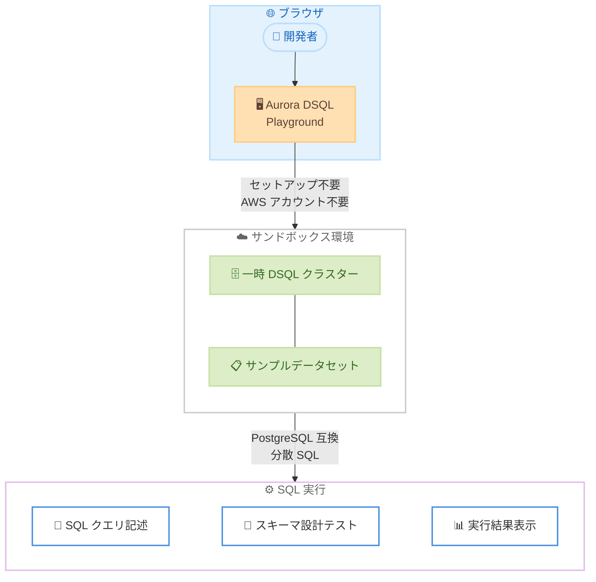

# Amazon Aurora DSQL - Playground で対話的データベース探索

**リリース日**: 2026 年 2 月 25 日
**サービス**: Amazon Aurora DSQL
**機能**: Aurora DSQL Playground

📊 [このアップデートのインフォグラフィックを見る](https://takech9203.github.io/aws-news-summary/20260225-amazon-aurora-dsql-launches-playground.html)

## 概要

AWS は Amazon Aurora DSQL Playground を発表した。Aurora DSQL Playground は、ブラウザベースの対話的な環境であり、AWS アカウントを必要とせずに Aurora DSQL を探索・実験できる。開発者は SQL クエリの記述と実行、スキーマ設計のテスト、Aurora DSQL の PostgreSQL 互換の分散 SQL 機能をブラウザ上で直接体験できる。セットアップや設定は一切不要である。

Aurora DSQL Playground は一時的なクラスターを備えたサンドボックス環境を提供し、Aurora DSQL の概念の学習、アプリケーションスキーマのプロトタイプ作成、本番環境へのデプロイ前のクエリパターンの検証を可能にする。サンプルデータセットも含まれており、一般的なデータベース操作や分散ワークロードに対するスキーマ最適化を素早く理解できる。

**アップデート前の課題**

- Aurora DSQL を試すには AWS アカウントの作成とクラスターのセットアップが必要だった
- 分散 SQL データベースの概念や Aurora DSQL 固有の機能を手軽に学ぶ方法がなかった
- スキーマ設計やクエリパターンの検証に本番環境またはテスト環境の構築が前提となっていた

**アップデート後の改善**

- AWS アカウント不要でブラウザから即座に Aurora DSQL を体験できるようになった
- サンプルデータセット付きのサンドボックス環境で分散 SQL の概念を対話的に学習可能に
- スキーマ設計やクエリパターンを本番デプロイ前に手軽に検証できるようになった

## アーキテクチャ図



この図は、開発者がブラウザから Aurora DSQL Playground にアクセスし、一時的な DSQL クラスターとサンプルデータセットを含むサンドボックス環境で SQL クエリの記述やスキーマ設計のテストを行い、結果を確認するまでの流れを示しています。

## サービスアップデートの詳細

### 主要機能

1. **ブラウザベースの対話環境**
   - AWS アカウント不要でブラウザからアクセス可能
   - セットアップや設定が一切不要
   - SQL クエリの記述、実行、結果の確認をブラウザ上で完結

2. **サンプルデータセット**
   - あらかじめ用意されたサンプルデータセットを利用可能
   - 一般的なデータベース操作パターンを実際に試せる
   - 分散ワークロードに対するスキーマ最適化を学習可能

3. **一時クラスター**
   - サンドボックス環境として一時的な Aurora DSQL クラスターが提供される
   - 本番環境に影響を与えずに実験が可能
   - Aurora DSQL の分散 SQL 機能をリスクなく体験できる

## 技術仕様

### Aurora DSQL の基盤技術

| 項目 | 詳細 |
|------|------|
| データベースエンジン | PostgreSQL 互換 |
| アーキテクチャ | 分散 SQL (Distributed SQL) |
| プロトコル | PostgreSQL v3 ワイヤープロトコル |
| トランザクション | ACID 準拠 |
| 分離レベル | Repeatable Read |
| 同時実行制御 | 楽観的同時実行制御 (OCC) |
| スキーマ変更 | 非同期 DDL (読み書きを中断しない) |
| 可用性 | マルチ AZ、マルチリージョン対応 |
| コンピュートとストレージ | 分離アーキテクチャ |

### Playground の特徴

| 項目 | 詳細 |
|------|------|
| AWS アカウント | 不要 |
| セットアップ | 不要 |
| クラスター | 一時的なサンドボックスクラスター |
| データ永続性 | なし (一時的な環境) |
| サンプルデータ | 付属 |
| PostgreSQL 互換構文 | サポート |

## 設定方法

### 前提条件

Aurora DSQL Playground の利用には特別な前提条件はありません。

- AWS アカウント不要
- ソフトウェアのインストール不要
- モダンな Web ブラウザのみ必要

### 手順

#### ステップ 1: Playground にアクセス

ブラウザで以下の URL にアクセスします。

```
https://playground.dsql.demo.aws/workspaces/pet_clinic/edit
```

AWS アカウントの認証やサインアップは不要で、即座に対話環境が利用可能です。

#### ステップ 2: サンプルデータセットを確認

Playground にアクセスすると、サンプルデータセットがあらかじめ用意されています。テーブル構造やデータ内容を確認し、Aurora DSQL の動作を理解します。

#### ステップ 3: SQL クエリを実行

SQL エディタにクエリを入力して実行します。

```sql
-- テーブル一覧を確認
SELECT table_name FROM information_schema.tables
WHERE table_schema = 'public';

-- サンプルデータを検索
SELECT * FROM pets LIMIT 10;

-- スキーマ設計をテスト
CREATE TABLE my_test_table (
    id UUID DEFAULT gen_random_uuid() PRIMARY KEY,
    name TEXT NOT NULL,
    created_at TIMESTAMP DEFAULT now()
);
```

PostgreSQL 互換の SQL 構文を使用して、クエリの記述、スキーマ設計のテスト、データ操作を体験できます。

#### ステップ 4: 本番環境への移行

Playground で検証したスキーマやクエリパターンを本番環境で使用する場合は、AWS アカウントを作成して Aurora DSQL クラスターをセットアップします。

```bash
# Aurora DSQL クラスターを作成
aws dsql create-cluster \
  --deletion-protection-enabled \
  --tags Key=Environment,Value=production
```

## メリット

### ビジネス面

- **導入障壁の低減**: AWS アカウント不要で即座に Aurora DSQL を体験でき、評価検討のハードルが大幅に低下
- **学習コストの削減**: サンプルデータセット付きの対話環境により、分散 SQL データベースの概念を効率的に学習可能
- **意思決定の迅速化**: 本番環境を構築する前にスキーマ設計やクエリパターンを検証でき、技術選定の判断を加速
- **チーム間のコラボレーション**: URL を共有するだけで、チームメンバーが同じ環境で Aurora DSQL を試すことが可能

### 技術面

- **PostgreSQL 互換性の検証**: 既存の PostgreSQL クエリやスキーマが Aurora DSQL で動作するかを手軽に確認可能
- **分散 SQL の特性を体験**: 楽観的同時実行制御 (OCC) や非同期 DDL などの分散 SQL 固有の特性を実際に試せる
- **プロトタイプの迅速化**: アプリケーション開発の初期段階でデータベーススキーマのプロトタイプを素早く作成可能
- **ゼロ設定**: インフラストラクチャの設定なしにデータベース機能のテストに集中できる

## デメリット・制約事項

### 制限事項

- Playground は一時的な環境であり、データは永続化されない
- 本番ワークロードの実行には適さない
- パフォーマンステストや負荷テストの用途には対応していない
- 一時クラスターのリソースに制限がある可能性がある

### 考慮すべき点

- Playground で作成したスキーマやクエリは、別途保存しておく必要がある
- 本番環境では AWS アカウントの作成と Aurora DSQL クラスターのセットアップが必要
- Playground 環境と本番環境の間で、利用可能な機能や設定に差異がある可能性がある
- マルチリージョン構成など、Aurora DSQL の高度な機能は Playground では体験できない場合がある

## ユースケース

### ユースケース 1: 分散 SQL データベースの学習

**シナリオ**: 開発チームが Aurora DSQL の採用を検討しており、分散 SQL データベースの基本概念と Aurora DSQL の特性を学びたい。

**実装例**:
```sql
-- Playground でトランザクションの動作を確認
BEGIN;
INSERT INTO pets (name, type) VALUES ('Buddy', 'dog');
INSERT INTO visits (pet_id, visit_date) VALUES (currval('pets_id_seq'), now());
COMMIT;

-- 楽観的同時実行制御の理解
SELECT * FROM pets WHERE type = 'dog' FOR UPDATE;
```

**効果**: AWS アカウントの作成やインフラストラクチャのセットアップなしに、Aurora DSQL の PostgreSQL 互換性、トランザクション処理、分散 SQL の特性を対話的に学習できる。

### ユースケース 2: アプリケーションスキーマのプロトタイプ

**シナリオ**: 新しいアプリケーションのデータベーススキーマを設計しており、Aurora DSQL でのスキーマ設計パターンを検証したい。

**実装例**:
```sql
-- 分散環境に適したスキーマ設計をテスト
CREATE TABLE users (
    id UUID DEFAULT gen_random_uuid() PRIMARY KEY,
    email TEXT UNIQUE NOT NULL,
    name TEXT NOT NULL,
    created_at TIMESTAMP DEFAULT now()
);

CREATE TABLE orders (
    id UUID DEFAULT gen_random_uuid() PRIMARY KEY,
    user_id UUID REFERENCES users(id),
    total_amount DECIMAL(10, 2),
    status TEXT DEFAULT 'pending',
    created_at TIMESTAMP DEFAULT now()
);

-- インデックス戦略の検証
CREATE INDEX idx_orders_user_id ON orders(user_id);
CREATE INDEX idx_orders_status ON orders(status);
```

**効果**: 本番環境を構築する前にスキーマ設計の妥当性を検証でき、設計ミスによる手戻りを防止できる。

### ユースケース 3: クエリパターンの検証

**シナリオ**: 既存のアプリケーションを Aurora DSQL に移行する前に、既存の PostgreSQL クエリが正しく動作するかを検証したい。

**実装例**:
```sql
-- 既存の PostgreSQL クエリの互換性を検証
SELECT p.name, COUNT(v.id) as visit_count
FROM pets p
LEFT JOIN visits v ON p.id = v.pet_id
GROUP BY p.name
ORDER BY visit_count DESC;

-- ウィンドウ関数の動作確認
SELECT name, type,
    ROW_NUMBER() OVER (PARTITION BY type ORDER BY name) as row_num
FROM pets;
```

**効果**: 移行前にクエリの互換性を検証でき、移行リスクを低減。問題が見つかった場合は事前にクエリの修正を計画できる。

## 料金

Aurora DSQL Playground は無料で利用できる。AWS アカウントも不要である。

本番環境で Aurora DSQL を使用する場合は、以下の料金体系が適用される。

- **AWS Free Tier**: Aurora DSQL は AWS Free Tier の対象であり、無料利用枠内で開始可能
- **本番利用**: コンピュート、ストレージ、I/O に基づく従量課金制

詳細な料金については、[Amazon Aurora DSQL 製品ページ](https://aws.amazon.com/rds/aurora/dsql/) を参照。

## 利用可能リージョン

Aurora DSQL Playground はグローバルにアクセス可能なブラウザベースの環境であり、特定の AWS リージョンに依存しない。インターネット接続とブラウザがあれば、世界中どこからでも利用できる。

本番環境の Aurora DSQL クラスターについては、Aurora DSQL が利用可能な AWS リージョンでデプロイが可能である。

## 関連サービス・機能

- **Amazon Aurora DSQL**: PostgreSQL 互換の分散 SQL データベースサービス。Playground はこのサービスの体験環境
- **Aurora DSQL Query Editor**: AWS マネジメントコンソールに統合されたクエリエディタ。本番クラスターに対して SQL を実行可能
- **Amazon Aurora**: MySQL および PostgreSQL 互換のクラウドネイティブリレーショナルデータベース
- **Amazon RDS for PostgreSQL**: PostgreSQL のフルマネージドサービス
- **Amazon DynamoDB**: サーバーレスの NoSQL データベースサービス

## 参考リンク

- 📊 [インフォグラフィック](https://takech9203.github.io/aws-news-summary/20260225-amazon-aurora-dsql-launches-playground.html)
- [公式発表 (What's New)](https://aws.amazon.com/about-aws/whats-new/2026/02/amazon-aurora-dsql-launches-playground/)
- [Aurora DSQL Playground](https://playground.dsql.demo.aws/workspaces/pet_clinic/edit)
- [Amazon Aurora DSQL 製品ページ](https://aws.amazon.com/rds/aurora/dsql/)
- [AWS Free Tier](https://aws.amazon.com/free/)

## まとめ

Amazon Aurora DSQL Playground の提供開始により、開発者は AWS アカウントを作成することなく、ブラウザから Aurora DSQL の PostgreSQL 互換分散 SQL 機能を即座に体験できるようになった。サンプルデータセットと一時クラスターを備えたサンドボックス環境で、SQL クエリの実行、スキーマ設計のテスト、クエリパターンの検証が可能である。セットアップ不要で導入障壁を大幅に低減し、分散 SQL データベースの学習やプロトタイプ作成を加速する。Aurora DSQL の採用を検討している開発チームは、まず Playground で機能を体験し、本番環境への移行を計画することを推奨する。
