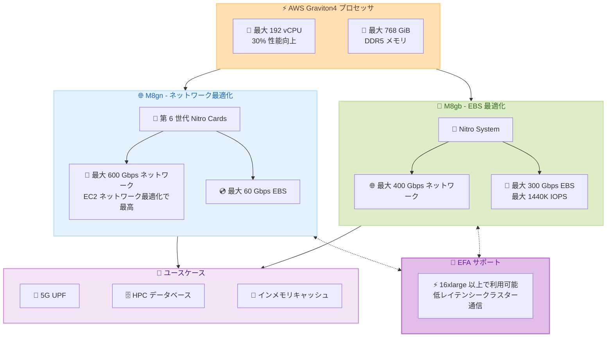

# Amazon EC2 - M8gn/M8gb インスタンスの新しい Metal サイズ

**リリース日**: 2026 年 2 月 25 日
**サービス**: Amazon EC2
**機能**: M8gn/M8gb metal-24xl and metal-48xl

📊 [このアップデートのインフォグラフィックを見る](https://takech9203.github.io/aws-news-summary/20260225-amazon-ec2-m8gn-m8gb-new-metal-sizes.html)

## 概要

AWS は、Amazon EC2 M8gn および M8gb インスタンスに新しい metal-24xl と metal-48xl サイズの一般提供を発表した。これらのインスタンスは AWS Graviton4 プロセッサを搭載し、Graviton3 プロセッサと比較して最大 30% 優れたコンピューティングパフォーマンスを提供する。

M8gn インスタンスは最新の第 6 世代 AWS Nitro Cards を搭載し、最大 600 Gbps のネットワーク帯域幅を提供する。これはネットワーク最適化 EC2 インスタンスの中で最高のネットワーク帯域幅である。M8gb インスタンスは最大 300 Gbps の EBS 帯域幅を提供し、高いブロックストレージパフォーマンスを必要とするワークロードに最適である。両インスタンスとも最大 48xlarge および metal-48xl サイズで提供され、最大 768 GiB のメモリを搭載する。

**アップデート前の課題**

- M8gn/M8gb インスタンスにはベアメタルサイズが提供されていなかった
- ハードウェアへの直接アクセスが必要なネットワーク集約型やストレージ集約型ワークロードでは、他のインスタンスタイプを使用する必要があった
- 5G UPF や HPC ファイルシステムなどの特定のワークロードで、仮想化オーバーヘッドのないベアメタル性能を M8gn/M8gb で利用できなかった

**アップデート後の改善**

- metal-24xl (96 vCPU、384 GiB) と metal-48xl (192 vCPU、768 GiB) のベアメタルサイズが利用可能に
- M8gn metal-48xl で最大 600 Gbps のネットワーク帯域幅をベアメタルで活用可能
- M8gb metal-48xl で最大 300 Gbps の EBS 帯域幅と最大 1440K IOPS をベアメタルで活用可能
- 16xlarge 以上のサイズで Elastic Fabric Adapter (EFA) ネットワーキングをサポート

## アーキテクチャ図



この図は M8gn (ネットワーク最適化) と M8gb (EBS 最適化) の特性の違いと、共通する Graviton4 プロセッサ基盤および EFA サポートの関係を示しています。

## サービスアップデートの詳細

### 主要機能

1. **metal-24xl および metal-48xl サイズの追加**
   - M8gn と M8gb の両方で metal-24xl (96 vCPU、384 GiB) と metal-48xl (192 vCPU、768 GiB) が利用可能に
   - ベアメタルインスタンスにより、ハードウェアへの直接アクセスが可能
   - 仮想化オーバーヘッドのない最大パフォーマンスを実現

2. **AWS Graviton4 プロセッサ**
   - Graviton3 と比較して最大 30% 優れたコンピューティングパフォーマンス
   - DDR5 メモリ搭載
   - 高効率でコスト効果の高い Arm ベースプロセッサ

3. **M8gn: 最高のネットワーク帯域幅**
   - 最新の第 6 世代 AWS Nitro Cards 搭載
   - metal-48xl で最大 600 Gbps のネットワーク帯域幅
   - ネットワーク最適化 EC2 インスタンスの中で最高
   - 最大 60 Gbps の EBS 帯域幅

4. **M8gb: 最高クラスの EBS パフォーマンス**
   - metal-48xl で最大 300 Gbps の EBS 帯域幅
   - 最大 1440K IOPS
   - 2 枚の EBS カードによる高スループット (48xlarge、metal-48xl)
   - 最大 400 Gbps のネットワーク帯域幅

5. **Elastic Fabric Adapter (EFA) サポート**
   - M8gn: 16xlarge、24xlarge、48xlarge、metal-24xl、metal-48xl でサポート
   - M8gb: 16xlarge、24xlarge、48xlarge、metal-24xl、metal-48xl でサポート
   - 密結合クラスターでの低レイテンシー通信を実現

## 技術仕様

### M8gn インスタンスサイズ (ネットワーク最適化)

| インスタンスサイズ | vCPU | メモリ (GiB) | ネットワーク帯域幅 (Gbps) | EBS 帯域幅 (Mbps) | EBS 最大 IOPS | EFA |
|-------------------|------|-------------|--------------------------|-------------------|--------------|-----|
| m8gn.medium | 1 | 4 | 最大 25 | 最大 10,000 | 最大 40,000 | - |
| m8gn.large | 2 | 8 | 最大 30 | 最大 10,000 | 最大 40,000 | - |
| m8gn.xlarge | 4 | 16 | 最大 40 | 最大 10,000 | 最大 40,000 | - |
| m8gn.2xlarge | 8 | 32 | 最大 50 | 最大 10,000 | 最大 40,000 | - |
| m8gn.4xlarge | 16 | 64 | 50 | 10,000 | 40,000 | - |
| m8gn.8xlarge | 32 | 128 | 100 | 20,000 | 80,000 | - |
| m8gn.12xlarge | 48 | 192 | 150 | 30,000 | 120,000 | - |
| m8gn.16xlarge | 64 | 256 | 200 | 40,000 | 160,000 | 対応 |
| m8gn.24xlarge | 96 | 384 | 300 | 60,000 | 240,000 | 対応 |
| m8gn.48xlarge | 192 | 768 | 600 | 60,000 | 240,000 | 対応 |
| **m8gn.metal-24xl** | **96** | **384** | **300** | **60,000** | **240,000** | **対応** |
| **m8gn.metal-48xl** | **192** | **768** | **600** | **60,000** | **240,000** | **対応** |

### M8gb インスタンスサイズ (EBS 最適化)

| インスタンスサイズ | vCPU | メモリ (GiB) | ネットワーク帯域幅 (Gbps) | EBS 帯域幅 (Mbps) | EBS 最大 IOPS | EFA |
|-------------------|------|-------------|--------------------------|-------------------|--------------|-----|
| m8gb.medium | 1 | 4 | 最大 16.7 | 最大 25,000 | 最大 120,000 | - |
| m8gb.large | 2 | 8 | 最大 20 | 最大 25,000 | 最大 120,000 | - |
| m8gb.xlarge | 4 | 16 | 最大 26.7 | 最大 25,000 | 最大 120,000 | - |
| m8gb.2xlarge | 8 | 32 | 最大 33.3 | 最大 25,000 | 最大 120,000 | - |
| m8gb.4xlarge | 16 | 64 | 33.3 | 25,000 | 120,000 | - |
| m8gb.8xlarge | 32 | 128 | 66.7 | 50,000 | 240,000 | - |
| m8gb.12xlarge | 48 | 192 | 100 | 75,000 | 360,000 | - |
| m8gb.16xlarge | 64 | 256 | 133.3 | 100,000 | 480,000 | 対応 |
| m8gb.24xlarge | 96 | 384 | 200 | 150,000 | 720,000 | 対応 |
| m8gb.48xlarge | 192 | 768 | 400 | 300,000 | 1,440,000 | 対応 |
| **m8gb.metal-24xl** | **96** | **384** | **200** | **150,000** | **720,000** | **対応** |
| **m8gb.metal-48xl** | **192** | **768** | **400** | **300,000** | **1,440,000** | **対応** |

### M8gn vs M8gb 比較 (metal-48xl)

| 項目 | M8gn metal-48xl | M8gb metal-48xl |
|------|-----------------|-----------------|
| 最適化対象 | ネットワーク | EBS ストレージ |
| vCPU | 192 | 192 |
| メモリ | 768 GiB | 768 GiB |
| ネットワーク帯域幅 | 600 Gbps | 400 Gbps |
| EBS 帯域幅 | 60 Gbps | 300 Gbps |
| EBS 最大 IOPS | 240,000 | 1,440,000 |
| Nitro Cards | 第 6 世代 | - |
| ネットワークカード数 | 2 | 2 |
| EBS カード | 1 | 2 |
| EFA | 対応 | 対応 |

## 設定方法

### 前提条件

1. AWS アカウントを保有していること
2. US East (N. Virginia) リージョンを使用すること
3. EC2 インスタンスの起動権限を持つ IAM ユーザーまたはロールがあること
4. Arm (arm64) 対応の AMI を使用すること (Graviton4 は Arm ベースプロセッサ)

### 手順

#### ステップ 1: AWS マネジメントコンソールからの起動

1. EC2 コンソールで [インスタンスを起動] を選択
2. Arm 対応の AMI (Amazon Linux 2023 arm64 等) を選択
3. インスタンスタイプで `m8gn.metal-24xl`、`m8gn.metal-48xl`、`m8gb.metal-24xl`、または `m8gb.metal-48xl` を選択
4. ネットワーク設定で VPC とサブネットを指定
5. [インスタンスを起動] を選択

#### ステップ 2: AWS CLI からの起動

```bash
# M8gn metal-48xl インスタンスを起動
aws ec2 run-instances \
  --image-id ami-xxxxxxxxxxxxxxxxx \
  --instance-type m8gn.metal-48xl \
  --key-name my-key-pair \
  --subnet-id subnet-xxxxxxxxxxxxxxxxx \
  --security-group-ids sg-xxxxxxxxxxxxxxxxx \
  --region us-east-1
```

このコマンドは US East (N. Virginia) リージョンで M8gn metal-48xl ベアメタルインスタンスを起動します。

#### ステップ 3: AWS SDK (Python/Boto3) からの起動

```python
import boto3

ec2 = boto3.client('ec2', region_name='us-east-1')

response = ec2.run_instances(
    ImageId='ami-xxxxxxxxxxxxxxxxx',
    InstanceType='m8gb.metal-48xl',
    KeyName='my-key-pair',
    MinCount=1,
    MaxCount=1,
    SubnetId='subnet-xxxxxxxxxxxxxxxxx',
    SecurityGroupIds=['sg-xxxxxxxxxxxxxxxxx']
)

instance_id = response['Instances'][0]['InstanceId']
print(f'Instance launched: {instance_id}')
```

このコードは M8gb metal-48xl ベアメタルインスタンスを起動します。

#### ステップ 4: EFA の設定 (クラスターワークロード向け)

```bash
# EFA 対応のセキュリティグループを作成
aws ec2 create-security-group \
  --group-name efa-sg \
  --description "Security group for EFA" \
  --vpc-id vpc-xxxxxxxxxxxxxxxxx

# EFA トラフィックを許可
aws ec2 authorize-security-group-ingress \
  --group-id sg-xxxxxxxxxxxxxxxxx \
  --ip-permissions IpProtocol=-1,UserIdGroupPairs=[{GroupId=sg-xxxxxxxxxxxxxxxxx}]

# EFA 有効化で M8gn metal-48xl インスタンスを起動
aws ec2 run-instances \
  --image-id ami-xxxxxxxxxxxxxxxxx \
  --instance-type m8gn.metal-48xl \
  --network-interfaces InterfaceType=efa,SubnetId=subnet-xxxxxxxxxxxxxxxxx,Groups=sg-xxxxxxxxxxxxxxxxx \
  --key-name my-key-pair \
  --placement GroupName=my-placement-group \
  --region us-east-1
```

これらのコマンドは EFA を有効にした M8gn metal-48xl インスタンスを起動します。

## メリット

### ビジネス面

- **コスト効率**: Graviton4 プロセッサの高い価格パフォーマンスにより、同等のワークロードをより低コストで実行可能
- **スケーラビリティ**: metal-48xl サイズにより、単一インスタンスで 192 vCPU と 768 GiB メモリの大規模ワークロードに対応
- **ワークロード最適化**: ネットワーク集約型 (M8gn) とストレージ集約型 (M8gb) を明確に選択でき、コストとパフォーマンスを最適化

### 技術面

- **ベアメタルパフォーマンス**: 仮想化オーバーヘッドのないハードウェアへの直接アクセスにより、最大限のパフォーマンスを実現
- **EC2 最高のネットワーク帯域幅**: M8gn metal-48xl の 600 Gbps はネットワーク最適化インスタンスで最高
- **EC2 最高クラスの EBS パフォーマンス**: M8gb metal-48xl の 300 Gbps EBS 帯域幅と 1440K IOPS
- **EFA による低レイテンシー**: 密結合クラスターでの HPC ワークロードに最適

## デメリット・制約事項

### 制限事項

- 現時点では US East (N. Virginia) リージョンのみで利用可能
- Arm (arm64) アーキテクチャのため、x86_64 向けアプリケーションの再コンパイルまたは移行が必要
- ベアメタルインスタンスのため、起動時間が通常のインスタンスよりも長くなる場合がある

### 考慮すべき点

- metal-24xl や metal-48xl は大規模インスタンスのため、On-Demand 料金が高額になる可能性がある。Savings Plans や Spot インスタンスの活用を検討すべき
- ベアメタルインスタンスでは一部の EC2 機能 (ライブマイグレーションなど) が利用できない場合がある
- M8gn は EBS 帯域幅が最大 60 Gbps に限定されるため、高い EBS パフォーマンスが必要な場合は M8gb を選択すべき
- M8gb はネットワーク帯域幅が最大 400 Gbps のため、600 Gbps が必要な場合は M8gn を選択すべき

## ユースケース

### ユースケース 1: 5G UPF (User Plane Function)

**シナリオ**: 通信事業者が 5G ネットワークのユーザープレーン処理を高スループットで実行する必要がある。

**実装例**:
```bash
aws ec2 run-instances \
  --instance-type m8gn.metal-48xl \
  --image-id ami-xxxxxxxxxxxxxxxxx \
  --network-interfaces InterfaceType=efa,SubnetId=subnet-xxx,Groups=sg-xxx \
  --region us-east-1
```

**効果**: 600 Gbps のネットワーク帯域幅とベアメタルパフォーマンスにより、5G UPF のパケット処理を最大限の効率で実行でき、DPDK などのパケット処理フレームワークをベアメタル上で直接動作させることが可能。

### ユースケース 2: HPC データベースと NoSQL

**シナリオ**: 大規模な NoSQL データベース (Cassandra、MongoDB 等) を高い IOPS とスループットで運用したい。

**実装例**:
```bash
# M8gb metal-48xl で高性能データベースノードを構築
aws ec2 run-instances \
  --instance-type m8gb.metal-48xl \
  --image-id ami-xxxxxxxxxxxxxxxxx \
  --key-name db-key \
  --block-device-mappings "DeviceName=/dev/sda1,Ebs={VolumeSize=2000,VolumeType=io2,Iops=64000}" \
  --region us-east-1
```

**効果**: 300 Gbps の EBS 帯域幅と 1440K IOPS により、大規模なデータベースのトランザクション処理とクエリパフォーマンスを最大化。ベアメタルにより NUMA 最適化やカーネルチューニングが可能。

### ユースケース 3: 分散型インメモリキャッシュ

**シナリオ**: 大規模な Web アプリケーション向けに、分散型インメモリキャッシュ (Redis、Memcached 等) を高帯域幅ネットワークで構築したい。

**実装例**:
```bash
# M8gn metal-24xl でキャッシュクラスターを構築
for i in {1..4}; do
  aws ec2 run-instances \
    --instance-type m8gn.metal-24xl \
    --image-id ami-xxxxxxxxxxxxxxxxx \
    --network-interfaces InterfaceType=efa,SubnetId=subnet-xxx,Groups=sg-xxx \
    --placement GroupName=cache-cluster-pg \
    --tag-specifications "ResourceType=instance,Tags=[{Key=Name,Value=cache-node-$i}]" \
    --region us-east-1
done
```

**効果**: 300 Gbps のネットワーク帯域幅と EFA による低レイテンシー通信により、ノード間のデータレプリケーションと取得が高速化。384 GiB のメモリで大量のキャッシュデータを保持可能。

## 料金

M8gn および M8gb インスタンスは、以下の購入オプションで利用可能です。

- **On-Demand インスタンス**: 長期契約なしで時間単位の料金
- **Savings Plans**: 1 年または 3 年のコミットメントで割引。Compute Savings Plans は M8gn/M8gb を含む Graviton インスタンスに適用可能
- **Spot インスタンス**: 未使用キャパシティを大幅な割引で利用

*注: 正確な料金はインスタンスサイズとリージョンにより異なります。最新の料金情報は [Amazon EC2 料金ページ](https://aws.amazon.com/ec2/pricing/) を参照してください。

## 利用可能リージョン

M8gn および M8gb の metal-24xl と metal-48xl サイズは、以下のリージョンで利用可能です。

- US East (N. Virginia) - us-east-1

*注: 今後、追加リージョンでの提供が予定されています。

## 関連サービス・機能

- **AWS Graviton4**: 最新世代の AWS 設計の Arm ベースプロセッサ
- **AWS Nitro System**: EC2 インスタンスに高パフォーマンス、高セキュリティを提供する基盤
- **Elastic Fabric Adapter (EFA)**: HPC および ML アプリケーション向けの高スループット、低レイテンシーのネットワークインターフェース
- **Amazon EBS**: EC2 インスタンス向けの高性能ブロックストレージ

## 参考リンク

- 📊 [インフォグラフィック](https://takech9203.github.io/aws-news-summary/20260225-amazon-ec2-m8gn-m8gb-new-metal-sizes.html)
- [公式発表 (What's New)](https://aws.amazon.com/about-aws/whats-new/2026/02/amazon-ec2-m8gn-m8gb-new-metal-sizes/)
- [AWS Graviton ページ](https://aws.amazon.com/ec2/graviton/level-up-with-graviton/)
- [Amazon EC2 汎用インスタンス仕様](https://docs.aws.amazon.com/ec2/latest/instancetypes/gp.html)
- [Amazon EC2 料金ページ](https://aws.amazon.com/ec2/pricing/)

## まとめ

Amazon EC2 M8gn および M8gb インスタンスに metal-24xl と metal-48xl のベアメタルサイズが追加された。M8gn は第 6 世代 AWS Nitro Cards により最大 600 Gbps のネットワーク帯域幅を提供し、5G UPF、HPC ファイルシステム、分散型インメモリキャッシュなどのネットワーク集約型ワークロードに最適である。M8gb は最大 300 Gbps の EBS 帯域幅と 1440K IOPS を提供し、HPC データベースや NoSQL などの高ブロックストレージパフォーマンスワークロードに適している。現時点では US East (N. Virginia) リージョンのみでの提供だが、Graviton4 の高いコンピューティングパフォーマンスとベアメタルアクセスを必要とするワークロードでは、これらの新しいインスタンスサイズの活用を検討することを推奨する。
