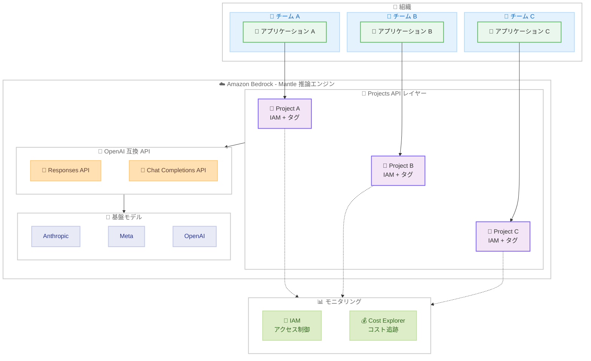

# Amazon Bedrock - OpenAI 互換 Projects API の提供開始

**リリース日**: 2026 年 2 月 26 日
**サービス**: Amazon Bedrock
**機能**: Projects API (Mantle 推論エンジン)

📊 [このアップデートのインフォグラフィックを見る](https://takech9203.github.io/aws-news-summary/20260226-amazon-bedrock-projects-api-mantle-inference-engine.html)

## 概要

Amazon Bedrock が Mantle 推論エンジンで OpenAI 互換の Projects API をサポートしました。Amazon Bedrock は、Anthropic、Meta、OpenAI などの主要 AI 企業が提供する基盤モデルを幅広く提供するフルマネージドサービスです。Mantle は Amazon Bedrock の分散推論エンジンであり、大規模なモデルサービングのために OpenAI 互換 API をサポートしています。

Projects API を使用することで、複数のアプリケーション、環境、チームを持つお客様は、それぞれに個別のプロジェクトを作成し、ワークロード間の分離を実現できます。各プロジェクトに異なる IAM ベースのアクセス制御を割り当て、タグを追加することでコストの可視性を向上させることが可能です。Projects API の利用に追加料金は発生せず、基盤となるモデル推論の使用量に対してのみ課金されます。

**アップデート前の課題**

- OpenAI 互換 API を使用する場合、複数のアプリケーションやチーム間でワークロードを論理的に分離する手段がなかった
- コスト追跡はアカウントレベルで行う必要があり、プロジェクトやチーム単位での正確なコスト配分が困難だった
- アプリケーション間のアクセス制御を実現するには、個別の AWS アカウントを作成するか、複雑な IAM ポリシーを構成する必要があった
- プロンプトやレスポンスデータの分離が保証されず、マルチテナント環境でのガバナンスが課題だった

**アップデート後の改善**

- Projects API により、単一の AWS アカウント内で複数の AI ワークロードを論理的に分離可能に
- 各プロジェクトに AWS タグを付与し、AWS Cost Explorer でプロジェクト単位のコスト追跡が可能に
- IAM ポリシーでプロジェクトをリソースとして指定し、きめ細かなアクセス制御を実現
- Responses API および Chat Completions API の両方で Projects API を利用可能

## アーキテクチャ図



複数のチームがそれぞれ専用のプロジェクトを通じて Amazon Bedrock の Mantle 推論エンジンにアクセスします。各プロジェクトは IAM によるアクセス制御とタグベースのコスト追跡により分離され、Responses API と Chat Completions API を通じて基盤モデルを利用します。

## サービスアップデートの詳細

### 主要機能

1. **プロジェクトによるワークロード分離**
   - 各プロジェクトは論理的な境界として機能し、アプリケーション、環境、実験を分離
   - 各 AWS アカウントにはデフォルトプロジェクトが自動的に作成され、すべての推論リクエストが関連付けられる
   - 追加プロジェクトは Projects API を通じて作成可能

2. **IAM ベースのアクセス制御**
   - プロジェクトを IAM ポリシーのリソースとして指定し、きめ細かなアクセス制御を実現
   - プロジェクト ARN を使用して、特定のユーザーやロールにプロジェクトへのアクセスを制限
   - 個別の AWS アカウントを作成する必要がなく、運用の複雑さを軽減

3. **タグベースのコスト追跡**
   - プロジェクトに AWS タグを付与し、AWS Cost Explorer でコスト配分を実現
   - ビジネスユニット、チーム、環境、コストセンターなどの分類軸でタグ付けが可能
   - プロジェクト作成時にタグを指定し、すべてのレスポンスにタグ情報が含まれる

4. **OpenAI 互換 API との統合**
   - Responses API と Chat Completions API の両方でプロジェクトを使用可能
   - OpenAI SDK のプロジェクト ID パラメータを使用して、推論リクエストをプロジェクトに関連付け
   - cURL リクエストでは `OpenAI-Project` ヘッダーでプロジェクト ID を指定

## 技術仕様

### Projects API と Inference Profiles の比較

| 項目 | Projects API | Inference Profiles |
|------|-------------|-------------------|
| 対応 API | OpenAI 互換 API (Responses、Chat Completions) | ネイティブ Bedrock API (Invoke、Converse) |
| エンドポイント | `bedrock-mantle.{region}.api.aws` | `bedrock-runtime.{region}.amazonaws.com` |
| ユースケース | OpenAI 互換エンドポイントを使用するアプリケーション | ネイティブ Bedrock API を使用するアプリケーション |
| アクセス制御 | IAM ポリシーでプロジェクトをリソースとして指定 | Inference Profile ARN に対する IAM ポリシー |
| コスト追跡 | プロジェクトに付与した AWS タグ | Inference Profile に付与した AWS タグ |

### API 変更履歴

| 日付 | サービス | 変更内容 |
|------|----------|----------|
| 2026/02/23 | [Amazon Bedrock](https://awsapichanges.com/archive/changes/bedrock.html) | 4 updated api methods - Guardrails の Automated Reasoning チェックで忠実性レポート生成をサポート |

### プロジェクト作成リクエスト例

```bash
# プロジェクトの作成
curl -X POST $OPENAI_BASE_URL/organization/projects \
  -H "Authorization: Bearer $OPENAI_API_KEY" \
  -H "Content-Type: application/json" \
  -d '{
    "name": "CustomerChatbot-Production",
    "tags": {
      "Project": "CustomerChatbot",
      "Environment": "Production",
      "Owner": "TeamAlpha",
      "CostCenter": "21524"
    }
  }'
```

### プロジェクト作成レスポンス例

```json
{
  "arn": "arn:aws:bedrock-mantle:ap-northeast-1:123456789012:project/proj_5d5ykleja6cwpirysbb7",
  "created_at": 1772135628,
  "id": "proj_5d5ykleja6cwpirysbb7",
  "name": "CustomerChatbot-Production",
  "object": "organization.project",
  "status": "active",
  "tags": {
    "Owner": "TeamAlpha",
    "Project": "CustomerChatbot",
    "Environment": "Production",
    "CostCenter": "21524"
  }
}
```

## 設定方法

### 前提条件

1. Amazon Bedrock へのアクセスが有効な AWS アカウント
2. IAM 権限 (Bedrock プロジェクトの作成・管理権限)
3. Python 3.7 以降 (SDK を使用する場合)
4. OpenAI Python SDK: `pip install openai boto3`
5. Amazon Bedrock の API キー

### 手順

#### ステップ 1: 環境変数の設定

```bash
# Amazon Bedrock の認証情報を設定
export OPENAI_API_KEY="<your-bedrock-key>"
export OPENAI_BASE_URL="https://bedrock-mantle.<your-region>.api.aws/v1"
```

環境変数に Amazon Bedrock の API キーとエンドポイント URL を設定します。`<your-region>` を使用する AWS リージョン (例: us-east-1、ap-northeast-1) に置き換えてください。

#### ステップ 2: プロジェクトの作成

```bash
# プロジェクトの作成
curl -X POST $OPENAI_BASE_URL/organization/projects \
  -H "Authorization: Bearer $OPENAI_API_KEY" \
  -H "Content-Type: application/json" \
  -d '{
    "name": "MyProject",
    "tags": {
      "Environment": "Production",
      "Team": "ML-Platform"
    }
  }'
```

Projects API を使用して新しいプロジェクトを作成します。名前とタグを指定することで、コスト追跡と組織的な管理を実現します。

#### ステップ 3: プロジェクトを使用した推論リクエスト

```python
from openai import OpenAI

# プロジェクト ID を指定してクライアントを作成
client = OpenAI(project="proj_5d5ykleja6cwpirysbb7")

# Responses API を使用した推論リクエスト
response = client.responses.create(
    model="openai.gpt-oss-120b",
    input="Amazon Bedrock の Projects API の利点を説明してください"
)

print(response)
```

OpenAI SDK でプロジェクト ID を指定してクライアントを作成します。このクライアントで行われるすべての推論リクエストは、指定されたプロジェクトに関連付けられます。

#### ステップ 4: プロジェクトの確認

```bash
# プロジェクト一覧の取得
curl -X GET $OPENAI_BASE_URL/organization/projects \
  -H "Authorization: Bearer $OPENAI_API_KEY"
```

作成したプロジェクトが正しく設定されていることを確認します。

## メリット

### ビジネス面

- **コスト可視性の向上**: プロジェクト単位でコストを追跡し、チームやアプリケーションごとの AI 支出を正確に把握できる
- **ガバナンスの強化**: IAM ベースのアクセス制御により、組織のセキュリティポリシーに準拠したワークロード管理が可能
- **運用の簡素化**: 個別の AWS アカウントを作成する必要がなく、数秒で新しいプロジェクトをセットアップ可能
- **追加コストなし**: Projects API の利用に追加料金は発生せず、モデル推論の使用量に対してのみ課金

### 技術面

- **OpenAI SDK 互換**: 既存の OpenAI SDK コードベースを最小限の変更で移行可能
- **柔軟な認証**: Amazon Bedrock API キーと AWS 認証情報の両方をサポート
- **マルチ API 対応**: Responses API と Chat Completions API の両方でプロジェクトを使用可能
- **タグの自動伝播**: プロジェクトに付与したタグがすべてのレスポンスに含まれ、監査やコスト配分が容易

## デメリット・制約事項

### 制限事項

- Projects API は Mantle 推論エンジン (`bedrock-mantle` エンドポイント) でのみ利用可能であり、`bedrock-runtime` エンドポイントでは Inference Profiles を使用する必要がある
- 長期 API キーを使用する場合、デフォルトポリシーではプロジェクトの取得・一覧のみが許可され、作成・更新・アーカイブには追加の IAM ポリシーが必要
- 現時点では cURL のみがプロジェクト管理 API をサポートしており、SDK でのプロジェクト管理は制限される
- OpenAI API 仕様の geography パラメータは Amazon Bedrock では無視される

### 考慮すべき点

- Mantle エンドポイントが利用可能なリージョンが限定されているため、利用前にリージョンの対応状況を確認すること
- セキュリティ要件が高いアプリケーションでは、長期 API キーではなく短期キーの使用が推奨される
- プロジェクトのタグ設計は、コスト配分とガバナンスの要件を事前に検討した上で決定すること

## ユースケース

### ユースケース 1: マルチテナント SaaS アプリケーション

**シナリオ**: SaaS プロバイダーが複数のテナントに AI 機能を提供し、テナントごとのコスト追跡とアクセス分離が必要

**実装例**:
```bash
# テナントごとにプロジェクトを作成
curl -X POST $OPENAI_BASE_URL/organization/projects \
  -H "Authorization: Bearer $OPENAI_API_KEY" \
  -H "Content-Type: application/json" \
  -d '{
    "name": "tenant-acme-corp",
    "tags": {
      "TenantId": "acme-corp",
      "Plan": "Enterprise",
      "CostCenter": "SAAS-001"
    }
  }'
```

**効果**: テナントごとに独立したプロジェクトを作成することで、コストの正確な配分とアクセスの分離を実現し、マルチテナント環境のガバナンスを強化できます。

### ユースケース 2: 開発ライフサイクル環境の分離

**シナリオ**: 開発チームが dev、staging、production の各環境で異なる AI モデルの設定とアクセス制御を必要とする

**実装例**:
```python
from openai import OpenAI

# 環境ごとのプロジェクト ID を設定
PROJECTS = {
    "dev": "proj_dev_abc123",
    "staging": "proj_stg_def456",
    "production": "proj_prd_ghi789"
}

# 環境に応じたクライアントを作成
env = "production"
client = OpenAI(project=PROJECTS[env])

response = client.responses.create(
    model="openai.gpt-oss-120b",
    input="ユーザーの質問に回答してください"
)
```

**効果**: 環境ごとにプロジェクトを分離することで、本番環境のデータが開発環境からアクセスされるリスクを排除し、環境単位でのコスト追跡を実現できます。

### ユースケース 3: ビジネスユニット別のコスト管理

**シナリオ**: 大企業の複数のビジネスユニットが共通の AWS アカウントで Amazon Bedrock を使用し、部門別のコスト配分が必要

**実装例**:
```bash
# マーケティング部門のプロジェクト
curl -X POST $OPENAI_BASE_URL/organization/projects \
  -H "Authorization: Bearer $OPENAI_API_KEY" \
  -H "Content-Type: application/json" \
  -d '{
    "name": "marketing-content-gen",
    "tags": {
      "BusinessUnit": "Marketing",
      "Application": "ContentGeneration",
      "CostCenter": "MKT-2026"
    }
  }'

# カスタマーサポート部門のプロジェクト
curl -X POST $OPENAI_BASE_URL/organization/projects \
  -H "Authorization: Bearer $OPENAI_API_KEY" \
  -H "Content-Type: application/json" \
  -d '{
    "name": "support-chatbot",
    "tags": {
      "BusinessUnit": "CustomerSupport",
      "Application": "Chatbot",
      "CostCenter": "CS-2026"
    }
  }'
```

**効果**: ビジネスユニットごとにプロジェクトを作成し、AWS Cost Explorer でタグベースのコスト配分レポートを生成することで、部門別の AI 支出を正確に把握できます。

## 料金

Projects API の利用に追加料金は発生しません。お客様は基盤となるモデル推論の使用量に対してのみ課金されます。

### 料金体系

| 項目 | 説明 |
|------|------|
| Projects API | 無料 (追加料金なし) |
| モデル推論 | 使用するモデルの料金体系に従う |
| タグベースのコスト追跡 | AWS Cost Explorer の料金に従う |

最新の料金は [Amazon Bedrock 料金ページ](https://aws.amazon.com/bedrock/pricing/) を参照してください。

## 利用可能リージョン

Mantle 推論エンジンは以下のリージョンで利用可能です。

| リージョン名 | リージョンコード | エンドポイント |
|-------------|----------------|--------------|
| 米国東部 (オハイオ) | us-east-2 | bedrock-mantle.us-east-2.api.aws |
| 米国東部 (バージニア北部) | us-east-1 | bedrock-mantle.us-east-1.api.aws |
| 米国西部 (オレゴン) | us-west-2 | bedrock-mantle.us-west-2.api.aws |
| アジアパシフィック (ジャカルタ) | ap-southeast-3 | bedrock-mantle.ap-southeast-3.api.aws |
| アジアパシフィック (ムンバイ) | ap-south-1 | bedrock-mantle.ap-south-1.api.aws |
| アジアパシフィック (東京) | ap-northeast-1 | bedrock-mantle.ap-northeast-1.api.aws |
| 欧州 (フランクフルト) | eu-central-1 | bedrock-mantle.eu-central-1.api.aws |
| 欧州 (アイルランド) | eu-west-1 | bedrock-mantle.eu-west-1.api.aws |
| 欧州 (ロンドン) | eu-west-2 | bedrock-mantle.eu-west-2.api.aws |
| 欧州 (ミラノ) | eu-south-1 | bedrock-mantle.eu-south-1.api.aws |
| 欧州 (ストックホルム) | eu-north-1 | bedrock-mantle.eu-north-1.api.aws |
| 南米 (サンパウロ) | sa-east-1 | bedrock-mantle.sa-east-1.api.aws |

## 関連サービス・機能

- **Amazon Bedrock Inference Profiles**: `bedrock-runtime` エンドポイントでのタグベースのコスト追跡とアクセス制御を提供。Projects API と同等の機能をネイティブ Bedrock API 向けに提供
- **AWS IAM**: プロジェクトをリソースとした IAM ポリシーにより、きめ細かなアクセス制御を実現
- **AWS Cost Explorer**: プロジェクトタグに基づくコスト配分レポートの生成とコスト分析
- **Amazon CloudWatch**: Bedrock の推論メトリクスとアラームの設定によるモニタリング

## 参考リンク

- 📊 [インフォグラフィック](https://takech9203.github.io/aws-news-summary/20260226-amazon-bedrock-projects-api-mantle-inference-engine.html)
- [公式発表 (What's New)](https://aws.amazon.com/about-aws/whats-new/2026/03/amazon-bedrock-projects-api-mantle-inference-engine/)
- [ドキュメント - Projects API](https://docs.aws.amazon.com/bedrock/latest/userguide/projects.html)
- [ドキュメント - Mantle 推論エンジン](https://docs.aws.amazon.com/bedrock/latest/userguide/bedrock-mantle.html)

## まとめ

Amazon Bedrock の Projects API により、OpenAI 互換 API を使用するお客様は、単一の AWS アカウント内で複数の AI ワークロードを論理的に分離し、プロジェクト単位でのアクセス制御とコスト追跡を実現できるようになりました。Projects API の利用に追加料金は発生せず、既存の OpenAI SDK コードベースとの互換性も維持されます。複数のアプリケーション、チーム、環境で Amazon Bedrock を活用している組織は、Projects API を導入してガバナンスとコスト管理を強化することをお勧めします。
