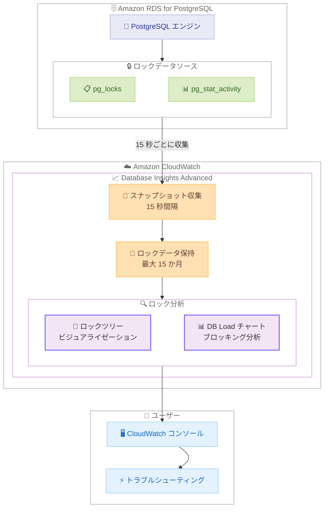

# Amazon CloudWatch - Amazon RDS for PostgreSQL 向けロック競合診断の提供開始

**リリース日**: 2026 年 2 月 26 日
**サービス**: Amazon CloudWatch
**機能**: Database Insights ロック競合診断 (Amazon RDS for PostgreSQL)

📊 [このアップデートのインフォグラフィックを見る](https://takech9203.github.io/aws-news-summary/20260226-amazon-cloudwatch-lock-contention-diagnostics-rds-postgresql.html)

## 概要

Amazon CloudWatch Database Insights が Amazon RDS for PostgreSQL インスタンス向けのロック競合診断機能を提供開始しました。この機能により、進行中のロック競合と過去のロック競合の両方について、根本原因を数分以内に特定できるようになります。ロック競合診断機能は CloudWatch Database Insights の Advanced モードでのみ利用可能です。

今回のアップデートにより、Database Insights コンソールでロック状態をビジュアルに表示し、ブロッキングセッションと待機セッションの関係を可視化できます。このビジュアライゼーションにより、ロック競合の原因となっている主要なセッション、クエリ、オブジェクトを迅速に特定できます。さらに、過去のロックデータが 15 か月間保持されるため、履歴的なロック状態の分析と調査が可能です。

CloudWatch Database Insights はすべてのパブリック AWS リージョンで利用可能であり、vCPU ベースの料金体系を採用しています。

**アップデート前の課題**

- ロック競合の診断には、`pg_locks` や `pg_stat_activity` ビューに対するカスタムクエリを手動で実行する必要があった
- ブロッキングセッションと待機セッションの関係をビジュアルに把握する手段がなく、複雑なロックチェーンの分析が困難だった
- 過去のロック競合データが保持されず、履歴的なロック問題の事後分析ができなかった
- アプリケーションログに依存したトラブルシューティングは時間がかかり、正確性に欠けることがあった

**アップデート後の改善**

- Database Insights コンソールでロックツリーをビジュアルに表示し、ブロッキングセッションと待機セッションの関係を直感的に把握可能に
- DB Load チャートで「Blocking object」「Blocking session」「Blocking SQL」のディメンションでスライスし、ロック競合の傾向を分析可能に
- 過去 15 か月間のロックデータが自動的に保持され、履歴的なロック問題の調査が可能に
- カスタムクエリやアプリケーションログに依存せず、トラブルシューティングプロセスを効率化

## アーキテクチャ図



Amazon RDS for PostgreSQL の `pg_locks` と `pg_stat_activity` ビューから 15 秒間隔でスナップショットが収集され、CloudWatch Database Insights に保存されます。ユーザーは CloudWatch コンソールのロック分析タブでロックツリーと DB Load チャートを使用して、ロック競合の根本原因を特定します。

## サービスアップデートの詳細

### 主要機能

1. **ロックツリービジュアライゼーション**
   - ブロッキングセッションと待機セッションの関係をツリー構造で表示
   - 各ノードがセッションを表し、親ノードが子ノードをブロックしている関係を視覚化
   - ブロックされているセッション数、最後に実行されたクエリ、ブロック時間などの詳細情報を表示

2. **DB Load チャートのブロッキングディメンション**
   - 「Blocking object」でブロッキングオブジェクト別の DB Load を分析
   - 「Blocking session」でブロッキングセッション別の DB Load を分析
   - 「Blocking SQL」でブロッキング SQL 別の DB Load を分析
   - 各ディメンションで上位のブロッカーの変化傾向を把握

3. **自動スナップショット収集と履歴データ保持**
   - 15 秒間隔でロックスナップショットを自動収集
   - 15 分間連続でスナップショットが取得された場合、「High locking detected」バナーを表示
   - 過去 15 か月間のロックデータを保持し、履歴分析が可能

4. **詳細なロック情報の表示**
   - セッション ID、PID、ブロックされたセッション数、最後に実行されたクエリ、待機イベントなどのデフォルト列を表示
   - ブロッキングモード、待機モード、アプリケーション名、トランザクション開始時刻などの追加列を設定で有効化
   - `pg_locks` と `pg_stat_activity` ビューの情報を統合して表示

## 技術仕様

### ロックスナップショットのデフォルト表示列

| 列名 | 説明 | データソース |
|------|------|-------------|
| session_id | 一意のセッション識別子 | HEX(backend_start).HEX(pid) |
| pid | バックエンドの PID | pg_locks.pid |
| blocked_sessions_count | ブロックされているセッション数 | 導出値 |
| last_query_executed | セッションが最後に実行したクエリ | pg_stat_activity.query |
| wait_event | 現在の待機イベント名 | pg_stat_activity.wait_event |
| blocking_time (秒) | ロック開始からの経過時間 | pg_locks.waitstart からの導出値 |

### 追加で有効化可能な列

| 列名 | 説明 | データソース |
|------|------|-------------|
| blocking_mode | ブロッキングセッションが保持するロックモード | pg_locks.mode |
| waiting_mode | 待機セッションが要求するロックモード | pg_locks.mode |
| application | 接続しているアプリケーション名 | pg_stat_activity.application_name |
| blocking_txn_start_time | ブロッキングトランザクションの開始時刻 | pg_stat_activity.xact_start |
| waiting_start_time | 待機開始時刻 | pg_locks.waitstart |
| user | ログインしているユーザー名 | pg_stat_activity.usename |
| waiting_locktype | ロック対象のタイプ | pg_locks.locktype |

### API 変更履歴

| 日付 | サービス | 変更内容 |
|------|----------|----------|
| 2026/02/26 | Amazon CloudWatch | Database Insights にロック競合診断機能を追加 (直接的な API 変更なし) |

## 設定方法

### 前提条件

1. Amazon RDS for PostgreSQL クラスターが作成済みであること
2. CloudWatch Database Insights の Advanced モードが有効であること
3. 適切な IAM 権限 (CloudWatch および RDS へのアクセス権限)
4. AWS Management Console へのアクセス

### 手順

#### ステップ 1: Database Insights Advanced モードの有効化

```bash
# RDS コンソールまたは AWS CLI で Advanced モードを有効化
aws rds modify-db-instance \
  --db-instance-identifier my-postgres-instance \
  --monitoring-interval 1 \
  --enable-performance-insights \
  --performance-insights-retention-period 731
```

RDS コンソールまたは AWS CLI を使用して、対象の PostgreSQL インスタンスで CloudWatch Database Insights の Advanced モードを有効化します。Performance Insights の有効化と拡張モニタリングの設定が含まれます。

#### ステップ 2: CloudWatch コンソールでのロック分析へのアクセス

1. AWS Management Console にサインインし、CloudWatch コンソールを開く
2. 「Insights」を選択
3. 「Database Insights」を選択
4. 「Database Instance」ビューを選択
5. 対象の DB インスタンスを選択

CloudWatch コンソールで Database Insights のダッシュボードにアクセスします。

#### ステップ 3: ロック分析タブの使用

1. 「DB Load Analysis」タブを選択
2. 「Lock analysis」タブを選択
3. 分析期間を 1 日以内に設定
4. スナップショットウィンドウを選択 (デフォルトではブロックされたセッションが最も多いウィンドウが選択される)

ロック分析タブでロックツリーを確認し、ブロッキングセッションの詳細情報を分析します。

#### ステップ 4: DB Load チャートでのブロッキング分析

1. 「DB Load Analysis」タブで「Sliced by」ドロップダウンを選択
2. 「Blocking object」「Blocking session」「Blocking SQL」のいずれかを選択
3. 上位のブロッカーの DB Load への寄与度を時系列で分析

DB Load チャートのブロッキングディメンションを使用して、ロック競合の傾向と主要なブロッカーを特定します。

## メリット

### ビジネス面

- **トラブルシューティング時間の短縮**: ロック競合の根本原因を数分以内に特定でき、ダウンタイムを最小化
- **運用コストの削減**: カスタムクエリの作成・実行やアプリケーションログの分析が不要になり、DBA の作業効率が向上
- **履歴分析によるプロアクティブな対応**: 15 か月間の履歴データにより、繰り返し発生するロック問題のパターンを発見し、予防策を実施可能
- **SLA 遵守の支援**: データベースパフォーマンスの劣化を迅速に検出・解決し、アプリケーションの SLA を維持

### 技術面

- **ビジュアルなロックツリー表示**: `pg_locks` と `pg_stat_activity` の情報を統合し、ブロッキング関係を直感的に把握可能
- **15 秒間隔のスナップショット**: 高頻度なデータ収集により、一時的なロック競合も捕捉可能
- **自動的な高ロック検出**: 15 分間連続でスナップショットが取得された場合に「High locking detected」バナーを自動表示
- **詳細なメタデータ**: セッション ID、PID、ブロック時間、待機イベント、ロックモードなど、豊富な診断情報を提供

## デメリット・制約事項

### 制限事項

- ロック競合診断は CloudWatch Database Insights の Advanced モードでのみ利用可能であり、Standard モードでは使用できない
- ロックデータの表示期間は 1 日以内に制限される
- スナップショットはポイントインタイムのデータであり、15 秒間隔の間に発生した短期間のロック競合は捕捉できない可能性がある
- Database Insights Advanced モードには vCPU ベースの追加料金が発生する

### 考慮すべき点

- Advanced モードの有効化に伴うコスト増加を事前に評価すること
- ロック競合の根本原因は多くの場合アプリケーションのクエリ設計に起因するため、診断結果に基づくクエリ最適化が重要
- 大量のロックが発生する環境では、スナップショットデータの量が増加する可能性がある
- Aurora PostgreSQL と RDS for PostgreSQL の両方でサポートされるが、有効化手順が若干異なる場合がある

## ユースケース

### ユースケース 1: 本番環境のロック競合リアルタイム診断

**シナリオ**: EC サイトのバックエンドデータベースで突発的なレスポンス遅延が発生し、ロック競合が疑われる

**実装例**:
1. CloudWatch コンソールで Database Insights を開く
2. 対象の RDS for PostgreSQL インスタンスを選択
3. 「DB Load Analysis」タブで「Sliced by: Blocking SQL」を選択
4. ロック競合を引き起こしている SQL を特定
5. 「Lock analysis」タブでロックツリーを確認し、ブロッキングセッションの詳細を分析

**効果**: カスタムクエリを実行することなく、ロック競合の原因 SQL とセッションを数分以内に特定でき、迅速な対応が可能になります。

### ユースケース 2: 定期バッチ処理によるロック影響の分析

**シナリオ**: 毎日の定期バッチ処理がオンライントランザクションに影響を与えている可能性があり、履歴データを使用して影響を分析したい

**実装例**:
1. CloudWatch コンソールで Database Insights を開く
2. バッチ処理が実行される時間帯に期間を設定
3. 「Sliced by: Blocking session」でバッチ処理セッションの DB Load への寄与度を確認
4. 「Lock analysis」タブで過去のスナップショットを確認し、ロックツリーの傾向を分析

**効果**: 15 か月間の履歴データを活用して、バッチ処理がオンライントランザクションに与えるロック影響のパターンを特定し、バッチ処理のスケジュール最適化やクエリ改善に活かせます。

### ユースケース 3: デッドロックの事後分析

**シナリオ**: アプリケーションログでデッドロックエラーが記録され、発生条件と関連するセッションを事後的に分析したい

**実装例**:
1. CloudWatch コンソールで Database Insights を開く
2. デッドロックが発生した時間帯に期間を設定
3. 「Lock analysis」タブで該当時間帯のスナップショットを確認
4. ロックツリーを展開し、関連するセッション、SQL、ロックモードを分析
5. 「waiting_locktype」列を有効化し、ロックの種類を確認

**効果**: デッドロック発生時のロック状態を事後的に再現し、関連するセッションとクエリの組み合わせを特定できます。この情報を基にアプリケーションのトランザクション設計を改善し、再発を防止できます。

## 料金

CloudWatch Database Insights のロック競合診断は、Advanced モードの料金に含まれます。

### 料金体系

| 項目 | 料金 |
|------|------|
| Database Insights Advanced モード | vCPU ベースの料金 |
| データ保持 (15 か月) | Advanced モード料金に含まれる |

最新の料金は [Amazon CloudWatch 料金ページ](https://aws.amazon.com/cloudwatch/pricing/) を参照してください。

## 利用可能リージョン

CloudWatch Database Insights はすべてのパブリック AWS リージョンで利用可能です。vCPU ベースの料金体系が適用されます。

## 関連サービス・機能

- **Amazon RDS Performance Insights**: データベースの負荷をモニタリングし、パフォーマンスのボトルネックを特定。Database Insights Advanced モードの一部として統合
- **Amazon CloudWatch Database Insights**: データベースの健全性モニタリングをフリートレベルで集約し、インスタンスレベルの詳細分析を提供
- **Amazon Aurora PostgreSQL**: Aurora PostgreSQL でも同様のロック競合診断機能が利用可能
- **Amazon RDS for PostgreSQL**: 今回のアップデートの対象サービス。PostgreSQL エンジンのロック管理メカニズムを活用

## 参考リンク

- 📊 [インフォグラフィック](https://takech9203.github.io/aws-news-summary/20260226-amazon-cloudwatch-lock-contention-diagnostics-rds-postgresql.html)
- [公式発表 (What's New)](https://aws.amazon.com/about-aws/whats-new/2026/02/amazon-cloudwatch-lock-contention-diagnostics-rds-postgresql/)
- [ドキュメント - Lock Analysis](https://docs.aws.amazon.com/AmazonCloudWatch/latest/monitoring/Database-Insights-Lock-Analysis.html)
- [ドキュメント - Database Insights](https://docs.aws.amazon.com/AmazonCloudWatch/latest/monitoring/Database-Insights.html)
- [料金ページ](https://aws.amazon.com/cloudwatch/pricing/)

## まとめ

Amazon CloudWatch Database Insights のロック競合診断機能により、Amazon RDS for PostgreSQL のロック競合問題を迅速に特定・解決できるようになりました。ロックツリーのビジュアライゼーション、DB Load チャートのブロッキングディメンション、15 か月間の履歴データ保持により、カスタムクエリやアプリケーションログに依存することなく、効率的なトラブルシューティングが可能です。PostgreSQL データベースのパフォーマンス管理を強化したい組織は、Database Insights の Advanced モードを有効化し、ロック競合診断機能を活用することをお勧めします。
