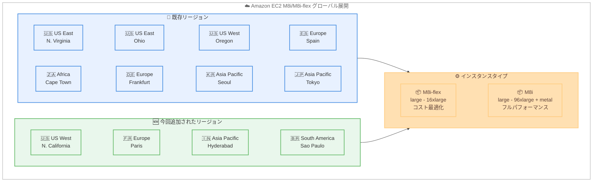

# Amazon EC2 - M8i および M8i-flex インスタンスが追加リージョンで利用可能に

**リリース日**: 2026 年 2 月 26 日
**サービス**: Amazon EC2
**機能**: M8i および M8i-flex インスタンスの追加リージョン展開

📊 [このアップデートのインフォグラフィックを見る](https://takech9203.github.io/aws-news-summary/20260226-amazon-ec2-m8i-m8i-flex-instances-additional-regions.html)

## 概要

Amazon EC2 M8i および M8i-flex インスタンスが、US West (N. California)、Europe (Paris)、Asia Pacific (Hyderabad)、South America (Sao Paulo) の 4 つの追加リージョンで利用可能になりました。これらのインスタンスは AWS 専用のカスタム Intel Xeon 6 プロセッサを搭載し、クラウド上の同等の Intel プロセッサの中で最高のパフォーマンスと最速のメモリ帯域幅を提供します。

M8i および M8i-flex インスタンスは、前世代の Intel ベースインスタンスと比較して最大 15% 優れた価格パフォーマンスと 2.5 倍のメモリ帯域幅を実現します。M7i および M7i-flex インスタンスと比較して最大 20% 高いパフォーマンスを発揮し、特定のワークロードではさらに大きなパフォーマンス向上が見られます。PostgreSQL データベースでは最大 30% 高速化、NGINX ウェブアプリケーションでは最大 60% 高速化、AI ディープラーニング推奨モデルでは最大 40% 高速化されます。

**アップデート前の課題**

- M8i/M8i-flex インスタンスが US West (N. California)、Europe (Paris)、Asia Pacific (Hyderabad)、South America (Sao Paulo) リージョンで利用できなかった
- これらのリージョンのお客様は前世代の汎用インスタンスを使用する必要があり、最新世代のパフォーマンス向上を活用できなかった
- 最新世代の Intel ベースインスタンスを利用するために、対応リージョンへのワークロード配置やリージョン間データ転送が必要だった

**アップデート後の改善**

- 4 つの追加リージョンで M8i/M8i-flex インスタンスを直接起動できるようになった
- 南米、ヨーロッパ、アジア太平洋地域のお客様がデータローカリティ要件を維持しながら最新世代のパフォーマンスを享受できるようになった
- より多くのリージョンでワークロードの価格パフォーマンスの最適化が可能になった

## アーキテクチャ図



M8i および M8i-flex インスタンスのグローバル展開状況を示しています。既存リージョンに加え、今回 4 つの新しいリージョンが追加されました。

## サービスアップデートの詳細

### 主要機能

1. **M8i-flex インスタンス**
   - 汎用ワークロードの大部分で価格パフォーマンスの恩恵を受けられる最も簡単な方法
   - large から 16xlarge まで最も一般的なサイズを提供
   - すべてのコンピューティングリソースを完全に活用しないアプリケーションに最適な選択肢
   - 95% の時間でフル CPU パフォーマンスに到達可能
   - ウェブサーバー、アプリケーションサーバー、マイクロサービス、小中規模データストア、仮想デスクトップ、エンタープライズアプリケーションに適している
   - M8i と比較して 5% 低い価格で 5% 優れた価格パフォーマンスを提供

2. **M8i インスタンス**
   - すべての汎用ワークロードに最適で、特に最大のインスタンスサイズや継続的な高 CPU 使用率を必要とするワークロードに適している
   - 2 つのベアメタルサイズを含む 13 サイズを提供
   - 最大規模のアプリケーション向けの新しい 96xlarge サイズを含む
   - SAP 認定を取得しており、ミッションクリティカルなエンタープライズワークロードに対応

3. **カスタム Intel Xeon 6 プロセッサ**
   - AWS 専用プロセッサ、オールコアターボ周波数 3.9 GHz
   - クラウド上の同等の Intel プロセッサの中で最高のパフォーマンスと最速のメモリ帯域幅
   - DDR5 7200MT/s DIMM を使用し、前世代比で 2.5 倍のメモリ帯域幅
   - 前世代比で 4.6 倍の L3 キャッシュ
   - 常時メモリ暗号化をサポート

4. **第 6 世代 AWS Nitro Cards**
   - 前世代と比較して最大 2 倍のネットワークおよび EBS 帯域幅
   - Instance Bandwidth Configuration (IBC) 機能でネットワークまたは EBS 帯域幅を 25% ブースト可能
   - 小パケット処理ワークロードのネットワークスループットを改善

## 技術仕様

### パフォーマンス比較

| ワークロード | M7i/M7i-flex 比較 | 前世代 Intel 比較 |
|------------|------------------|------------------|
| 全般 | 最大 20% 高速 | 最大 15% 優れた価格パフォーマンス |
| メモリ帯域幅 | - | 2.5 倍 |
| PostgreSQL データベース | 最大 30% 高速 | - |
| NGINX ウェブアプリケーション | 最大 60% 高速 | - |
| AI ディープラーニング推奨モデル | 最大 40% 高速 | - |

### M8i-flex インスタンスサイズ

| インスタンスサイズ | vCPU | メモリ (GiB) | ネットワーク帯域幅 (Gbps) | EBS 帯域幅 (Gbps) |
|-------------------|------|-------------|--------------------------|-------------------|
| m8i-flex.large | 2 | 8 | 最大 12.5 | 最大 10 |
| m8i-flex.xlarge | 4 | 16 | 最大 12.5 | 最大 10 |
| m8i-flex.2xlarge | 8 | 32 | 最大 15 | 最大 10 |
| m8i-flex.4xlarge | 16 | 64 | 最大 15 | 最大 10 |
| m8i-flex.8xlarge | 32 | 128 | 最大 15 | 最大 10 |
| m8i-flex.12xlarge | 48 | 192 | 最大 22.5 | 最大 15 |
| m8i-flex.16xlarge | 64 | 256 | 最大 30 | 最大 20 |

### M8i インスタンスサイズ

| インスタンスサイズ | vCPU | メモリ (GiB) | ネットワーク帯域幅 (Gbps) | EBS 帯域幅 (Gbps) |
|-------------------|------|-------------|--------------------------|-------------------|
| m8i.large | 2 | 8 | 最大 12.5 | 最大 10 |
| m8i.xlarge | 4 | 16 | 最大 12.5 | 最大 10 |
| m8i.2xlarge | 8 | 32 | 最大 15 | 最大 10 |
| m8i.4xlarge | 16 | 64 | 最大 15 | 最大 10 |
| m8i.8xlarge | 32 | 128 | 15 | 10 |
| m8i.12xlarge | 48 | 192 | 22.5 | 15 |
| m8i.16xlarge | 64 | 256 | 30 | 20 |
| m8i.24xlarge | 96 | 384 | 40 | 30 |
| m8i.32xlarge | 128 | 512 | 50 | 40 |
| m8i.48xlarge | 192 | 768 | 75 | 60 |
| m8i.96xlarge | 384 | 1,536 | 100 | 80 |
| m8i.metal-48xl | 192 | 768 | 75 | 60 |
| m8i.metal-96xl | 384 | 1,536 | 100 | 80 |

### API 変更履歴

| 日付 | サービス | 変更内容 |
|------|----------|----------|
| 2026/02/26 | [Amazon Elastic Compute Cloud](https://awsapichanges.com/archive/changes/f76046-ec2.html) | 25 updated methods - c8id、m8id、hpc8a インスタンスタイプを追加 |

## 設定方法

### 前提条件

1. AWS アカウント
2. 対象リージョンへのアクセス権限 (us-west-1、eu-west-3、ap-south-2、sa-east-1)
3. 適切な IAM 権限 (EC2 インスタンス起動権限)
4. M8i/M8i-flex インスタンスタイプのサービスクォータ確認

### 手順

#### ステップ 1: AWS CLI でインスタンスを起動

```bash
# Europe (Paris) リージョンで M8i-flex インスタンスを起動
aws ec2 run-instances \
  --image-id ami-xxxxxxxxxxxxxxxxx \
  --instance-type m8i-flex.xlarge \
  --region eu-west-3 \
  --subnet-id subnet-xxxxxxxxxxxxxxxxx \
  --security-group-ids sg-xxxxxxxxxxxxxxxxx \
  --key-name my-key-pair
```

このコマンドは、Europe (Paris) リージョンで m8i-flex.xlarge インスタンスを起動します。`--region` パラメータを変更することで、他の新規対応リージョンでも起動可能です。

#### ステップ 2: 利用可能なインスタンスサイズを確認

```bash
# 利用可能な M8i インスタンスタイプを確認
aws ec2 describe-instance-types \
  --filters "Name=instance-type,Values=m8i*" \
  --region eu-west-3 \
  --query "InstanceTypes[].{Type:InstanceType,vCPU:VCpuInfo.DefaultVCpus,Memory:MemoryInfo.SizeInMiB}" \
  --output table
```

指定リージョンで利用可能な M8i インスタンスタイプとスペックを一覧表示するコマンドです。

#### ステップ 3: 購入オプションの選択

M8i および M8i-flex インスタンスは、以下の購入オプションで利用可能です。

- **オンデマンドインスタンス**: 使用した分だけ支払い
- **Savings Plans**: 1 年または 3 年のコミットメントで割引
- **スポットインスタンス**: 未使用の EC2 キャパシティを大幅な割引で利用
- **Dedicated Instances / Dedicated Hosts**: M8i インスタンスのみ対応

## メリット

### ビジネス面

- **コスト効率の向上**: 前世代と比較して最大 15% 優れた価格パフォーマンスにより、汎用ワークロードのコストを削減
- **グローバル展開の拡充**: 南米、ヨーロッパ、アジア太平洋の新リージョンで最新インスタンスが利用可能になり、グローバルなビジネス展開を支援
- **データローカリティ**: 各リージョンのデータ主権やコンプライアンス要件を満たしながら高性能コンピューティングを実現
- **SAP 認定**: M8i インスタンスは SAP 認定を取得しており、ミッションクリティカルなエンタープライズワークロードに対応

### 技術面

- **パフォーマンス向上**: M7i/M7i-flex と比較して最大 20% 高速化、ワークロード固有では最大 60% の高速化
- **メモリ帯域幅の向上**: DDR5 7200MT/s により前世代比 2.5 倍のメモリ帯域幅を実現
- **大容量 L3 キャッシュ**: 前世代比 4.6 倍の L3 キャッシュにより、CPU ベース推論、科学計算、データベースワークロードのレイテンシーを改善
- **IBC 機能**: ネットワークまたは EBS 帯域幅を 25% ブースト可能で、データベースパフォーマンスやクエリ処理速度を最適化

## デメリット・制約事項

### 制限事項

- 新規リージョンでの初期サービスクォータが制限される場合がある
- すべてのインスタンスサイズがすべてのリージョンで利用可能とは限らない
- 既存の M7i/M7i-flex インスタンスからの自動移行はサポートされていない

### 考慮すべき点

- ワークロードの特性に応じて M8i-flex と M8i を適切に選択する必要がある
- M8i-flex はコンピューティングリソースを完全に活用しないアプリケーションに最適で、95% の時間でフル CPU パフォーマンスに到達可能
- 継続的な高 CPU 使用率や最大サイズが必要な場合は M8i を選択すべき
- 既存の Savings Plans やリザーブドインスタンスの適用範囲を確認する

## ユースケース

### ユースケース 1: 南米向けウェブアプリケーションサーバー

**シナリオ**: 南米のユーザーに提供する NGINX ベースのウェブアプリケーションを South America (Sao Paulo) リージョンで稼働

**実装例**:
```bash
aws ec2 run-instances \
  --instance-type m8i-flex.8xlarge \
  --image-id ami-xxxxxxxxxxxxxxxxx \
  --region sa-east-1 \
  --user-data file://webserver-setup.sh
```

**効果**: M7i-flex と比較して最大 60% の NGINX パフォーマンス向上により、南米のエンドユーザーへのレイテンシーを大幅に低減しながら、より多くの同時リクエストを処理可能

### ユースケース 2: ヨーロッパ向け PostgreSQL データベース

**シナリオ**: GDPR に準拠しつつ、PostgreSQL データベースを Europe (Paris) リージョンで実行

**実装例**:
```bash
aws ec2 run-instances \
  --instance-type m8i.24xlarge \
  --image-id ami-xxxxxxxxxxxxxxxxx \
  --region eu-west-3 \
  --block-device-mappings "DeviceName=/dev/sda1,Ebs={VolumeSize=500,VolumeType=gp3,Iops=16000}"
```

**効果**: M7i と比較して最大 30% 高速な PostgreSQL パフォーマンスと 2.5 倍のメモリ帯域幅により、データベースクエリの応答時間を大幅に改善

### ユースケース 3: アジア太平洋での AI 推論ワークロード

**シナリオ**: ディープラーニングベースの推奨エンジンを Asia Pacific (Hyderabad) リージョンで実行し、インドのお客様にリアルタイムの推奨を提供

**実装例**:
```bash
aws ec2 run-instances \
  --instance-type m8i.16xlarge \
  --image-id ami-xxxxxxxxxxxxxxxxx \
  --region ap-south-2 \
  --iam-instance-profile Name=ML-Inference-Role
```

**効果**: M7i と比較して最大 40% 高速な AI ディープラーニング推奨モデルの処理と 4.6 倍の L3 キャッシュにより、推論レイテンシーを大幅に短縮

## 料金

M8i および M8i-flex インスタンスの料金は、インスタンスタイプ、リージョン、購入オプションによって異なります。前世代と比較して最大 15% 優れた価格パフォーマンスにより、同等の処理をより低コストで実行できます。

購入オプション:
- **オンデマンド**: 時間単位の従量課金
- **Savings Plans**: 1 年または 3 年の利用契約で割引
- **スポットインスタンス**: 余剰キャパシティを活用して大幅な割引
- **Dedicated Instances / Dedicated Hosts**: M8i インスタンスのみ

詳細な料金情報は [Amazon EC2 料金ページ](https://aws.amazon.com/ec2/pricing/) を参照してください。

## 利用可能リージョン

M8i および M8i-flex インスタンスは、以下のリージョンで利用可能です。

- US East (N. Virginia) - us-east-1
- US East (Ohio) - us-east-2
- US West (Oregon) - us-west-2
- **US West (N. California) - us-west-1** (今回追加)
- Europe (Spain) - eu-south-2
- **Europe (Paris) - eu-west-3** (今回追加)
- Europe (Frankfurt) - eu-central-1
- Asia Pacific (Seoul) - ap-northeast-2
- Asia Pacific (Tokyo) - ap-northeast-1
- Asia Pacific (Singapore) - ap-southeast-1
- Asia Pacific (Kuala Lumpur) - ap-southeast-5
- **Asia Pacific (Hyderabad) - ap-south-2** (今回追加)
- Africa (Cape Town) - af-south-1
- Canada (Central) - ca-central-1
- **South America (Sao Paulo) - sa-east-1** (今回追加)

## API の変更

2026 年 2 月 26 日付けで、Amazon EC2 API において 25 のメソッドが更新され、c8id、m8id、hpc8a インスタンスタイプのサポートが追加されました。M8i/M8i-flex のリージョン展開に関連する API の更新です。

- **対象サービス**: [Amazon Elastic Compute Cloud](https://awsapichanges.com/archive/changes/f76046-ec2.html)
- **更新内容**: 25 の API メソッドで c8id、m8id、hpc8a インスタンスタイプを追加

## 関連サービス・機能

- **Amazon EC2 Auto Scaling**: M8i/M8i-flex インスタンスの自動スケーリングで需要に応じたキャパシティ調整を実現
- **Elastic Load Balancing**: 複数の M8i/M8i-flex インスタンス間での負荷分散
- **AWS Compute Optimizer**: ワークロードに最適なインスタンスタイプの推奨を取得
- **Amazon EC2 C8i/C8i-flex**: 同世代の Intel ベースコンピューティング最適化インスタンス
- **Amazon EC2 R8i/R8i-flex**: 同世代の Intel ベースメモリ最適化インスタンス
- **AWS Nitro System**: EC2 インスタンスの基盤となるセキュリティとパフォーマンスを提供するシステム

## 参考リンク

- 📊 [インフォグラフィック](https://takech9203.github.io/aws-news-summary/20260226-amazon-ec2-m8i-m8i-flex-instances-additional-regions.html)
- [公式発表 (What's New)](https://aws.amazon.com/about-aws/whats-new/2026/02/amazon-ec2-m8i-m8i-flex-instances-additional-regions/)
- [AWS Blog - M8i and M8i-flex インスタンスの紹介](https://aws.amazon.com/blogs/aws/new-general-purpose-amazon-ec2-m8i-and-m8i-flex-instances-are-now-available/)
- [M8i インスタンスタイプページ](https://aws.amazon.com/ec2/instance-types/m8i/)
- [Amazon EC2 料金ページ](https://aws.amazon.com/ec2/pricing/)

## まとめ

Amazon EC2 M8i および M8i-flex インスタンスが US West (N. California)、Europe (Paris)、Asia Pacific (Hyderabad)、South America (Sao Paulo) の 4 リージョンに拡大し、より多くの地域のお客様がカスタム Intel Xeon 6 プロセッサの性能を活用できるようになりました。M7i/M7i-flex と比較して最大 20% のパフォーマンス向上、2.5 倍のメモリ帯域幅、そして PostgreSQL で最大 30%、NGINX で最大 60%、AI 推論で最大 40% の高速化を実現します。これらのリージョンで汎用ワークロードを運用しているお客様は、M8i/M8i-flex への移行を検討し、パフォーマンスとコスト効率の向上を実現してください。
