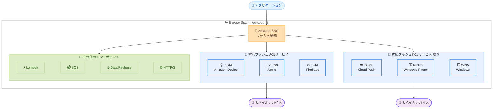

# Amazon SNS - Europe (Spain) リージョンでプッシュ通知をサポート

**リリース日**: 2026 年 2 月 26 日
**サービス**: Amazon Simple Notification Service (Amazon SNS)
**機能**: Europe (Spain) リージョンでのモバイルプッシュ通知サポート

📊 [このアップデートのインフォグラフィックを見る](https://takech9203.github.io/aws-news-summary/20260226-amazon-sns-push-expansion-spain.html)

## 概要

Amazon Simple Notification Service (Amazon SNS) が、Europe (Spain) リージョンでモバイルプッシュ通知の送信をサポートしました。この拡張により、Amazon SNS はプッシュ通知を 25 リージョンから送信できるようになりました。

Europe (Spain) リージョンのお客様は、Amazon Device Messaging (ADM)、Apple Push Notification Service (APNs)、Baidu Cloud Push (Baidu)、Firebase Cloud Messaging (FCM)、Microsoft Push Notification Service for Windows Phone (MPNS)、Windows Push Notification Services (WNS) の 6 つのプッシュ通知サービスを利用してモバイルデバイスにプッシュ通知を送信できるようになりました。Amazon SNS はフルマネージドの pub/sub サービスとして、AWS Lambda、Amazon SQS、Amazon Data Firehose、HTTP、SMS、プッシュ通知、E メールなど、複数のエンドポイントへのメッセージ配信を提供します。

**アップデート前の課題**

- Europe (Spain) リージョンでは Amazon SNS のプッシュ通知機能が利用できなかった
- スペインおよび周辺地域のお客様がプッシュ通知を送信するには他のヨーロッパリージョンを使用する必要があった
- データローカリティやコンプライアンス要件を満たすためにリージョン間のデータ転送が発生していた

**アップデート後の改善**

- Europe (Spain) リージョンから直接モバイルプッシュ通知を送信できるようになった
- 6 つの主要プッシュ通知サービスすべてに対応し、iOS、Android、Windows などのモバイルプラットフォームをカバー
- スペインのデータレジデンシー要件を満たしながらプッシュ通知サービスを利用可能になった

## アーキテクチャ図



Amazon SNS がプッシュ通知サービスを経由してモバイルデバイスにメッセージを配信するアーキテクチャを示しています。Europe (Spain) リージョンで 6 つのプッシュ通知サービスすべてが利用可能です。

## サービスアップデートの詳細

### 主要機能

1. **6 つのプッシュ通知サービスをサポート**
   - Amazon Device Messaging (ADM): Amazon デバイス向けプッシュ通知
   - Apple Push Notification Service (APNs): iOS および macOS デバイス向けプッシュ通知
   - Baidu Cloud Push (Baidu): 中国の Android デバイス向けプッシュ通知
   - Firebase Cloud Messaging (FCM): Android デバイス向けプッシュ通知
   - Microsoft Push Notification Service for Windows Phone (MPNS): Windows Phone 向けプッシュ通知
   - Windows Push Notification Services (WNS): Windows デバイス向けプッシュ通知

2. **フルマネージド pub/sub サービス**
   - プッシュ通知以外にも、AWS Lambda、Amazon SQS、Amazon Data Firehose、HTTP、SMS、E メールなど多様なエンドポイントへのメッセージ配信が可能
   - トピックベースのメッセージファンアウトによりスケーラブルなメッセージ配信を実現
   - サーバー管理やインフラストラクチャの運用が不要

3. **Europe (Spain) リージョンでのフル機能提供**
   - プッシュ通知の直接送信とトピック経由のサブスクリプションの両方をサポート
   - デバイストークンの登録、プラットフォームアプリケーションの作成、エンドポイントの管理が可能
   - メッセージアラート、バッジ更新、サウンドアラートとしてモバイルアプリに通知を表示

## 技術仕様

### サポートされるプッシュ通知サービス

| プッシュ通知サービス | 対象プラットフォーム | 用途 |
|---------------------|---------------------|------|
| ADM | Amazon Fire デバイス | Amazon Kindle Fire タブレットなどへの通知 |
| APNs | iOS、macOS | iPhone、iPad、Mac への通知 |
| Baidu Cloud Push | Android (中国) | 中国市場の Android デバイスへの通知 |
| FCM | Android | Google Play 搭載 Android デバイスへの通知 |
| MPNS | Windows Phone | Windows Phone デバイスへの通知 |
| WNS | Windows | Windows デスクトップおよびタブレットへの通知 |

### プッシュ通知の設定フロー

| ステップ | 操作 | 説明 |
|---------|------|------|
| 1 | 認証情報の取得 | 各プッシュ通知サービスの認証情報とデバイストークンを取得 |
| 2 | プラットフォームアプリケーション作成 | PlatformApplicationArn を生成 |
| 3 | デバイストークンの登録 | モバイルアプリとデバイスからトークンを取得 |
| 4 | エンドポイント作成 | EndpointArn を生成 |
| 5 | メッセージ送信 | Publish API でプッシュ通知を送信 |

### プッシュ通知対応リージョン一覧

Amazon SNS モバイルプッシュ通知は現在 25 リージョンで利用可能です。

| リージョン | リージョンコード |
|-----------|----------------|
| US East (Ohio) | us-east-2 |
| US East (N. Virginia) | us-east-1 |
| US West (N. California) | us-west-1 |
| US West (Oregon) | us-west-2 |
| Africa (Cape Town) | af-south-1 |
| Asia Pacific (Hong Kong) | ap-east-1 |
| Asia Pacific (Jakarta) | ap-southeast-3 |
| Asia Pacific (Mumbai) | ap-south-1 |
| Asia Pacific (Osaka) | ap-northeast-3 |
| Asia Pacific (Seoul) | ap-northeast-2 |
| Asia Pacific (Singapore) | ap-southeast-1 |
| Asia Pacific (Sydney) | ap-southeast-2 |
| Asia Pacific (Tokyo) | ap-northeast-1 |
| Canada (Central) | ca-central-1 |
| Europe (Frankfurt) | eu-central-1 |
| Europe (Ireland) | eu-west-1 |
| Europe (London) | eu-west-2 |
| Europe (Milan) | eu-south-1 |
| **Europe (Spain)** | **eu-south-2** (今回追加) |
| Europe (Paris) | eu-west-3 |
| Europe (Stockholm) | eu-north-1 |
| Middle East (Bahrain) | me-south-1 |
| Middle East (UAE) | me-central-1 |
| South America (Sao Paulo) | sa-east-1 |
| AWS GovCloud (US-West) | us-gov-west-1 |

## 設定方法

### 前提条件

1. AWS アカウント
2. Europe (Spain) リージョン (eu-south-2) へのアクセス権限
3. 対象プッシュ通知サービスの認証情報 (APNs 証明書、FCM API キーなど)
4. 適切な IAM 権限 (SNS のプラットフォームアプリケーション作成・管理権限)

### 手順

#### ステップ 1: プラットフォームアプリケーションの作成

```bash
# FCM 用のプラットフォームアプリケーションを作成
aws sns create-platform-application \
  --name MyAppFCM \
  --platform GCM \
  --attributes PlatformCredential=YOUR_FCM_SERVER_KEY \
  --region eu-south-2
```

このコマンドは、Europe (Spain) リージョンで Firebase Cloud Messaging (FCM) 用のプラットフォームアプリケーションを作成します。`--platform` に `GCM` を指定するのは、FCM が Google Cloud Messaging の後継であるためです。

#### ステップ 2: プラットフォームエンドポイントの作成

```bash
# デバイストークンを使用してエンドポイントを作成
aws sns create-platform-endpoint \
  --platform-application-arn arn:aws:sns:eu-south-2:123456789012:app/GCM/MyAppFCM \
  --token DEVICE_TOKEN_FROM_FCM \
  --region eu-south-2
```

モバイルデバイスから取得したデバイストークンを使用して、プッシュ通知の送信先となるプラットフォームエンドポイントを作成します。

#### ステップ 3: プッシュ通知の送信

```bash
# エンドポイントにプッシュ通知を送信
aws sns publish \
  --target-arn arn:aws:sns:eu-south-2:123456789012:endpoint/GCM/MyAppFCM/xxxxxxxx-xxxx-xxxx-xxxx-xxxxxxxxxxxx \
  --message '{"GCM": "{\"notification\": {\"title\": \"お知らせ\", \"body\": \"新しいメッセージがあります\"}}"}' \
  --message-structure json \
  --region eu-south-2
```

指定したエンドポイントに JSON 形式のプッシュ通知メッセージを送信します。`--message-structure json` を指定することで、プラットフォーム固有のメッセージフォーマットを使用できます。

## メリット

### ビジネス面

- **データレジデンシー**: スペインおよびヨーロッパのデータ保護規制に準拠しながらプッシュ通知を配信可能
- **レイテンシーの低減**: Europe (Spain) リージョンから直接送信することで、スペインおよび南ヨーロッパのユーザーへのプッシュ通知配信速度を向上
- **リージョン選択肢の拡大**: ヨーロッパ内で 7 つのリージョンからプッシュ通知を送信でき、ビジネス要件に最適なリージョンを選択可能

### 技術面

- **マルチプラットフォーム対応**: 6 つのプッシュ通知サービスにより、iOS、Android、Windows、Amazon デバイスなど主要プラットフォームをカバー
- **統合メッセージング**: プッシュ通知に加え、Lambda、SQS、HTTP など多様なエンドポイントへの統合メッセージ配信が可能
- **スケーラビリティ**: フルマネージドサービスとして、数百万台のデバイスへのプッシュ通知送信を自動的にスケール

## デメリット・制約事項

### 制限事項

- プッシュ通知サービスの認証情報は各プラットフォームベンダーから個別に取得する必要がある
- プッシュ通知のペイロードサイズはプラットフォームごとに制限がある (APNs: 4 KB、FCM: 4 KB)
- デバイストークンの有効期限管理はアプリケーション側で実施する必要がある

### 考慮すべき点

- 既存のプッシュ通知インフラストラクチャを他のヨーロッパリージョンで運用している場合、移行の必要性を評価する
- プッシュ通知サービスの認証情報をリージョンごとに設定する必要がある
- Time to Live (TTL) 設定をプラットフォームごとに適切に構成する

## ユースケース

### ユースケース 1: スペイン向け E コマースアプリ通知

**シナリオ**: スペイン市場向けの E コマースアプリから、セール情報や注文ステータスの更新をプッシュ通知で配信

**実装例**:
```bash
# トピックを作成してプッシュ通知を一斉配信
aws sns create-topic \
  --name SaleNotifications \
  --region eu-south-2

aws sns publish \
  --topic-arn arn:aws:sns:eu-south-2:123456789012:SaleNotifications \
  --message '{"default": "セール開始のお知らせ", "GCM": "{\"notification\": {\"title\": \"セール開始\", \"body\": \"本日限定 50% オフ\"}}"}' \
  --message-structure json \
  --region eu-south-2
```

**効果**: スペインのデータレジデンシー要件を満たしながら、数万人のユーザーに低レイテンシーでプッシュ通知を配信

### ユースケース 2: マルチプラットフォーム配信

**シナリオ**: iOS と Android の両方のユーザーに対して、同一メッセージをクロスプラットフォームで配信

**実装例**:
```bash
# プラットフォーム固有のメッセージを一括送信
aws sns publish \
  --topic-arn arn:aws:sns:eu-south-2:123456789012:AppNotifications \
  --message '{
    "default": "新機能のお知らせ",
    "APNS": "{\"aps\": {\"alert\": \"新機能が利用可能です\", \"badge\": 1}}",
    "GCM": "{\"notification\": {\"title\": \"新機能\", \"body\": \"新機能が利用可能です\"}}"
  }' \
  --message-structure json \
  --region eu-south-2
```

**効果**: 1 回の Publish API 呼び出しで iOS と Android の両プラットフォームに最適化されたプッシュ通知を配信

### ユースケース 3: リアルタイムアラート配信

**シナリオ**: ヘルスケアアプリケーションや IoT モニタリングシステムから、緊急アラートをリアルタイムでモバイルデバイスに送信

**実装例**:
```bash
# Lambda 関数からプッシュ通知を送信する設定
aws sns publish \
  --target-arn arn:aws:sns:eu-south-2:123456789012:endpoint/GCM/HealthApp/xxxxxxxx \
  --message '{"GCM": "{\"notification\": {\"title\": \"緊急アラート\", \"body\": \"センサー値が閾値を超えました\"}, \"priority\": \"high\"}"}' \
  --message-structure json \
  --region eu-south-2
```

**効果**: Europe (Spain) リージョンから直接配信することで、緊急性の高いアラートのレイテンシーを最小化

## 料金

Amazon SNS のモバイルプッシュ通知は、送信したプッシュ通知の数に基づいて課金されます。最初の 100 万件のモバイルプッシュ通知は無料利用枠に含まれます。

| 項目 | 料金 |
|------|------|
| 最初の 100 万件/月 | 無料 |
| それ以降 100 万件あたり | $0.50 |

SNS トピックへの Publish API 呼び出しやデータ転送にも別途料金が発生します。詳細な料金情報は [Amazon SNS 料金ページ](https://aws.amazon.com/sns/pricing/) を参照してください。

## 利用可能リージョン

Amazon SNS のモバイルプッシュ通知は、今回の Europe (Spain) リージョン追加により、25 リージョンで利用可能です。詳細なリージョン一覧は技術仕様セクションの「プッシュ通知対応リージョン一覧」を参照してください。

## 関連サービス・機能

- **Amazon SQS**: SNS と組み合わせた fanout パターンでメッセージを複数のキューに配信
- **AWS Lambda**: SNS トピックをトリガーとしてサーバーレス処理を実行
- **Amazon Data Firehose**: プッシュ通知ログを S3 や Redshift にストリーミング配信
- **AWS End User Messaging**: SMS メッセージングサービスと組み合わせたマルチチャネル通知
- **Amazon Pinpoint**: セグメントベースのターゲティングプッシュ通知キャンペーン

## 参考リンク

- 📊 [インフォグラフィック](https://takech9203.github.io/aws-news-summary/20260226-amazon-sns-push-expansion-spain.html)
- [公式発表 (What's New)](https://aws.amazon.com/about-aws/whats-new/2026/02/amazon-sns-push-expansion-spain/)
- [プッシュ通知対応リージョン](https://docs.aws.amazon.com/sns/latest/dg/sns-mobile-push-supported-regions.html)
- [モバイルプッシュ通知ドキュメント](https://docs.aws.amazon.com/sns/latest/dg/sns-mobile-application-as-subscriber.html)
- [Amazon SNS 料金ページ](https://aws.amazon.com/sns/pricing/)

## まとめ

Amazon SNS が Europe (Spain) リージョンでモバイルプッシュ通知をサポートし、対応リージョンが 25 に拡大しました。ADM、APNs、Baidu、FCM、MPNS、WNS の 6 つのプッシュ通知サービスに対応し、iOS、Android、Windows、Amazon デバイスなど主要なモバイルプラットフォームへの通知配信が可能です。スペインおよび南ヨーロッパ地域でモバイルアプリケーションを運用しているお客様は、データレジデンシー要件を満たしながら低レイテンシーでプッシュ通知を配信できるため、Europe (Spain) リージョンでの SNS プッシュ通知の活用を検討してください。
