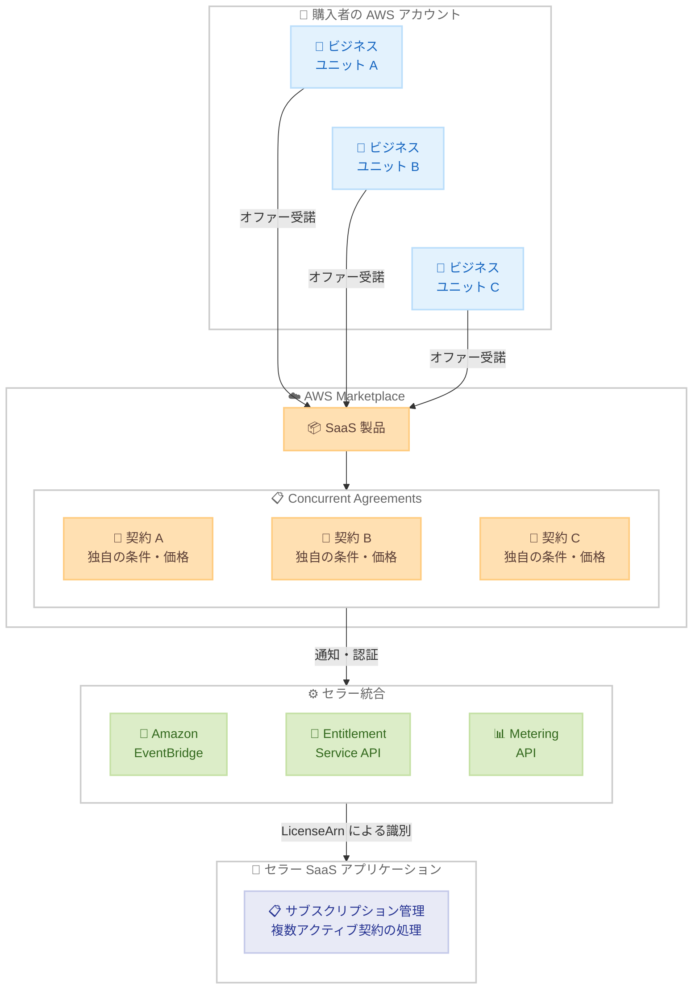

# AWS Marketplace - SaaS およびプロフェッショナルサービス製品の Concurrent Agreements サポート

**リリース日**: 2026 年 2 月 26 日
**サービス**: AWS Marketplace
**機能**: Concurrent Agreements for SaaS and Professional Services

📊 [このアップデートのインフォグラフィックを見る](https://takech9203.github.io/aws-news-summary/20260226-concurrent-agreements-february.html)

## 概要

AWS Marketplace は SaaS およびプロフェッショナルサービス製品の Concurrent Agreements をサポートしました。この機能により、購入者は単一の AWS アカウント内で同一製品の複数購入が可能になります。従来は 1 つの AWS アカウントにつき 1 つの製品に対して 1 つのアクティブな契約しか維持できなかったため、拡張取引をサポートするにはセラー側の回避策が必要でした。

Concurrent Agreements は購入者とセラーの双方に柔軟性を提供します。購入者は既存の契約を中断することなく同一製品の追加オファーを受け入れることができ、複数のビジネスユニットがそれぞれ独自に交渉した条件と価格で独立して調達を行えます。セラーは従来実現できなかった複数ビジネスユニットへの取引を成立させ、更新サイクルを待たずに拡張を即座に処理し、回避策の管理に伴う運用オーバーヘッドを排除できます。

**アップデート前の課題**

- 1 つの AWS アカウントにつき同一製品のアクティブな契約は 1 つのみに制限されていた
- 複数のビジネスユニットが同一製品を利用する場合、セラー側で回避策を講じる必要があった
- 中期的な拡張やリピート購入の際に、既存契約との競合が発生していた
- 一元管理された AWS アカウント内での複数チームによる独立した調達が困難だった

**アップデート後の改善**

- 同一 AWS アカウント内で同一製品の複数契約を同時に維持可能
- 各ビジネスユニットが独自の交渉条件と価格で独立して調達可能
- 中期拡張やリピート購入を既存契約を中断せずに即座に実行可能
- セラーは回避策の運用オーバーヘッドから解放され、取引の即時処理が可能

## アーキテクチャ図



この図は、単一の AWS アカウント内の複数のビジネスユニットが、AWS Marketplace を通じて同一 SaaS 製品に対して個別の契約を同時に締結し、セラー側が EventBridge 通知、Entitlement Service API、Metering API を通じて複数のアクティブなサブスクリプションを管理する流れを示しています。各契約は LicenseArn によって一意に識別されます。

## サービスアップデートの詳細

### 主要機能

1. **Concurrent Agreements - 同一製品の複数購入**
   - 単一の AWS アカウント内で同一製品に対する複数のアクティブな契約を維持可能
   - 各契約は独自の交渉条件、価格、期間を持つことが可能
   - 既存の契約を中断することなく追加契約を締結可能

2. **プロフェッショナルサービスのデフォルト有効化**
   - 2026 年 2 月 26 日より、すべてのプロフェッショナルサービスリスティングで Concurrent Agreements がデフォルトで有効化
   - セラー側のアクション不要で自動的に適用

3. **SaaS 製品の統合更新**
   - SaaS リスティングでは、セラーが AWS Marketplace 統合を更新して複数のアクティブなサブスクリプションを処理する必要がある
   - サブスクリプション通知を EventBridge に更新
   - Entitlement API および Metering API の更新
   - 2026 年 6 月 1 日以降、新規 SaaS 製品では Concurrent Agreements のサポートが必須

## 技術仕様

### 統合要件の変更点

| 項目 | 詳細 |
|------|------|
| 通知方式 | SNS から Amazon EventBridge への移行が必要 |
| 顧客識別 | LicenseArn を使用して個別の契約を識別 |
| ResolveCustomer API | CustomerIdentifier、CustomerAWSAccountId、LicenseArn、ProductCode を返却 |
| GetEntitlements API | LicenseArn ベースのエンタイトルメント取得をサポート |
| BatchMeterUsage API | LicenseArn を使用した使用量レコードの送信をサポート |
| 必須化期限 | 2026 年 6 月 1 日以降の新規 SaaS 製品で必須 |

### API 変更履歴

| 日付 | サービス | 変更内容 |
|------|----------|----------|
| 2026/02/26 | [AWS Marketplace Entitlement Service](https://awsapichanges.com/archive/changes/f76046-entitlement.marketplace.html) | 1 updated method - Concurrent Agreements 対応のエンタイトルメント取得 |
| 2026/02/26 | [AWSMarketplace Metering](https://awsapichanges.com/archive/changes/f76046-metering.marketplace.html) | 2 updated methods - ResolveCustomer レスポンスに LicenseArn を追加、BatchMeterUsage 使用量レコードに LicenseArn を追加 |

### ResolveCustomer API レスポンス例

```json
{
  "CustomerIdentifier": "customer-123",
  "CustomerAWSAccountId": "123456789012",
  "ProductCode": "prod-abcdefgh",
  "LicenseArn": "arn:aws:license-manager::123456789012:license/lic-abcdefgh12345"
}
```

## 設定方法

### 前提条件

1. AWS Marketplace にセラーとして登録済みであること
2. SaaS またはプロフェッショナルサービス製品のリスティングが存在すること
3. SaaS 製品の場合、既存の統合コードを更新するための開発リソースが確保されていること

### 手順

#### ステップ 1: プロフェッショナルサービス製品の場合

プロフェッショナルサービスリスティングでは、2026 年 2 月 26 日よりデフォルトで Concurrent Agreements が有効化されています。セラー側のアクションは不要です。

#### ステップ 2: SaaS 製品 - EventBridge 通知への移行

SaaS 製品では、サブスクリプション通知を SNS から Amazon EventBridge に更新します。EventBridge ルールを設定し、Amazon SQS キューをターゲットとして顧客エンタイトルメントの変更イベントを受信します。

#### ステップ 3: SaaS 製品 - ResolveCustomer API の更新

顧客が製品をサブスクライブした際のフローを更新します。ResolveCustomer API のレスポンスに含まれる `LicenseArn` を永続化し、個別の契約を識別するために使用します。

```bash
# ResolveCustomer API の呼び出し例
aws marketplace-metering resolve-customer \
  --registration-token "x-amzn-marketplace-token-value"
```

このコマンドは一時トークンを使用して顧客情報を解決し、CustomerIdentifier、CustomerAWSAccountId、LicenseArn、ProductCode を返却します。

#### ステップ 4: SaaS 製品 - Entitlement API と Metering API の更新

GetEntitlements API と BatchMeterUsage API を更新して、LicenseArn を使用した複数アクティブサブスクリプションの処理をサポートします。

```bash
# GetEntitlements API の呼び出し例
aws marketplace-entitlement get-entitlements \
  --product-code "prod-abcdefgh" \
  --filter "CUSTOMER_IDENTIFIER=customer-123"
```

このコマンドは指定した製品コードと顧客識別子に基づいてエンタイトルメント情報を取得します。

#### ステップ 5: 統合テスト

[Integration Lab](https://catalog.workshops.aws/mpseller/en-US/saas/integration-for-concurrent-agreements) を参照し、Concurrent Agreements の統合テストを実施します。テストアカウントを使用して複数の同時契約シナリオを検証します。

## メリット

### ビジネス面

- **複数ビジネスユニットへの展開**: 各部門が独自の条件と価格で独立して同一製品を調達でき、大規模組織での展開が容易に
- **拡張取引の即時処理**: 更新サイクルを待たずに中期的な拡張を即座に処理でき、セールスサイクルを短縮
- **運用オーバーヘッドの削減**: セラーは従来の回避策を維持する必要がなくなり、契約管理の効率が向上
- **リピート購入の簡素化**: 同一製品の追加購入が既存契約を中断せずに可能となり、顧客体験が向上

### 技術面

- **LicenseArn による契約識別**: 各契約が一意の LicenseArn で識別されるため、複数契約の管理が明確
- **EventBridge 統合**: SNS から EventBridge への移行により、サブスクリプションイベントの処理がより柔軟に
- **API の後方互換性**: 既存の API インターフェースを拡張する形で実装されており、段階的な移行が可能

## デメリット・制約事項

### 制限事項

- SaaS 製品では、セラーが統合コードを更新して複数のアクティブなサブスクリプションを処理する必要がある
- 2026 年 6 月 1 日以降の新規 SaaS 製品では Concurrent Agreements のサポートが必須となる
- サブスクリプション通知方式を SNS から EventBridge に移行する必要がある

### 考慮すべき点

- 既存の SaaS 統合を Concurrent Agreements 対応に更新するための開発工数とテスト期間を確保する必要がある
- 複数の同時契約を管理するための内部プロセスとシステムの見直しが必要になる場合がある
- EventBridge への移行期間中は、SNS と EventBridge の両方のイベントを処理する必要がある可能性がある
- 2026 年 6 月 1 日の必須化期限に向けて、既存製品の統合更新計画を早期に策定することを推奨

## ユースケース

### ユースケース 1: 大規模企業での複数部門調達

**シナリオ**: グローバル企業の IT 部門が一元管理する AWS アカウントで、マーケティング部門、営業部門、エンジニアリング部門がそれぞれ異なる条件で同一の SaaS 分析ツールを利用したい。

**実装例**:
1. マーケティング部門が年間契約でプレミアムティアを購入
2. 営業部門が四半期契約でスタンダードティアを購入
3. エンジニアリング部門が月額契約でエンタープライズティアを購入

**効果**: 各部門が独自のニーズと予算に合わせた条件で独立して調達でき、IT 部門は単一の AWS アカウントで全契約を一元管理できます。従来必要だった複数の AWS アカウントの作成や回避策が不要になります。

### ユースケース 2: SaaS セラーの拡張取引の即時処理

**シナリオ**: SaaS セラーが既存顧客の別事業部門から追加ライセンスの要望を受けたが、既存契約の更新サイクルが半年先のため、即座に取引を成立させたい。

**実装例**:
1. セラーが新しいプライベートオファーを作成し、追加のライセンス条件を設定
2. 購入者が既存契約を維持したまま、新しいオファーを受諾
3. 新しい契約が即座にアクティブになり、LicenseArn で個別に識別

**効果**: 更新サイクルを待たずに拡張取引を即時処理でき、セールスサイクルが短縮されます。セラーの売上認識が早まり、購入者は必要なライセンスを遅延なく取得できます。

### ユースケース 3: プロフェッショナルサービスのリピート購入

**シナリオ**: コンサルティング企業が AWS Marketplace でプロフェッショナルサービスを提供しており、同一顧客が前回のプロジェクト完了前に新しいプロジェクトを開始したい。

**実装例**:
1. 顧客がプロジェクト A の契約を維持したまま、プロジェクト B の契約を新規締結
2. 両プロジェクトが独立した契約として同時にアクティブ

**効果**: プロフェッショナルサービスではデフォルトで有効化されているため、セラー側の追加作業なしにリピート購入が可能です。顧客は前回のプロジェクト完了を待たずに新しいプロジェクトを開始できます。

## 料金

Concurrent Agreements の利用自体に追加料金は発生しません。

| 項目 | 詳細 |
|------|------|
| Concurrent Agreements 機能 | 追加料金なし |
| 各契約の料金 | セラーが設定した個別の条件と価格に基づく |
| AWS Marketplace 手数料 | 標準の AWS Marketplace 手数料が各契約に適用 |

## 利用可能リージョン

Concurrent Agreements は、AWS Marketplace がサポートされているすべての AWS リージョンで利用可能です。サポートされているリージョンの一覧は [AWS Marketplace サポートリージョン](https://docs.aws.amazon.com/marketplace/latest/buyerguide/supported-regions.html) を参照してください。

## 関連サービス・機能

- **AWS Marketplace**: SaaS、プロフェッショナルサービス、AMI などのサードパーティソフトウェアの検索、購入、デプロイを可能にするデジタルカタログ
- **Amazon EventBridge**: サブスクリプション変更イベントの通知に使用されるサーバーレスイベントバスサービス
- **AWS Marketplace Entitlement Service**: 顧客のエンタイトルメント情報を管理する API サービス
- **AWS Marketplace Metering Service**: SaaS 製品の使用量計測と顧客情報の解決に使用される API サービス

## 参考リンク

- 📊 [インフォグラフィック](https://takech9203.github.io/aws-news-summary/20260226-concurrent-agreements-february.html)
- [公式発表 (What's New)](https://aws.amazon.com/about-aws/whats-new/2026/02/concurrent-agreements-february/)
- [ドキュメント - SaaS 契約製品の統合](https://docs.aws.amazon.com/marketplace/latest/userguide/saas-integrate-contract.html)
- [Integration Lab - Concurrent Agreements](https://catalog.workshops.aws/mpseller/en-US/saas/integration-for-concurrent-agreements)
- [サポートリージョン](https://docs.aws.amazon.com/marketplace/latest/buyerguide/supported-regions.html)
- [関連 API 変更 - Entitlement Service](https://awsapichanges.com/archive/changes/f76046-entitlement.marketplace.html)
- [関連 API 変更 - Metering](https://awsapichanges.com/archive/changes/f76046-metering.marketplace.html)

## まとめ

AWS Marketplace の Concurrent Agreements により、購入者は単一の AWS アカウント内で同一の SaaS およびプロフェッショナルサービス製品に対して複数の契約を同時に維持できるようになりました。プロフェッショナルサービスではデフォルトで有効化されており、SaaS 製品ではセラーが統合を更新する必要があります。2026 年 6 月 1 日以降の新規 SaaS 製品では Concurrent Agreements のサポートが必須となるため、SaaS セラーは早期に [Integration Lab](https://catalog.workshops.aws/mpseller/en-US/saas/integration-for-concurrent-agreements) を参照して統合更新の計画を策定することをお勧めします。
