# Amazon EC2 I8g.metal-48xl - ストレージ最適化インスタンスの一般提供開始

**リリース日**: 2026 年 2 月 26 日
**サービス**: Amazon EC2
**機能**: I8g.metal-48xl インスタンスの一般提供

📊 [このアップデートのインフォグラフィックを見る](https://takech9203.github.io/aws-news-summary/20260226-ec2-i8g-metal-48xl-generally-available.html)

## 概要

Amazon EC2 ストレージ最適化 I8g.metal-48xl インスタンスが一般提供 (GA) されました。I8g インスタンスは AWS Graviton4 プロセッサを搭載し、前世代の I4g インスタンスと比較して最大 60% 優れたコンピューティング性能を提供します。

本インスタンスは最新の第 3 世代 AWS Nitro SSD を使用しており、TB あたり最大 65% 優れたリアルタイムストレージ性能を実現するとともに、ストレージ I/O レイテンシーを最大 50% 削減、ストレージ I/O レイテンシーのばらつきを最大 60% 削減しています。AWS Nitro System 上に構築されており、CPU 仮想化、ストレージ、ネットワーキング機能を専用のハードウェアとソフトウェアにオフロードすることで、ワークロードの性能とセキュリティを強化しています。

I8g.metal-48xl は、192 vCPU、1,536 GiB のメモリ、45 TB のローカル NVMe ストレージを備え、最大 100 Gbps のネットワーク帯域幅と 60 Gbps の Amazon EBS 専用帯域幅を提供する、I8g ファミリー最大のインスタンスサイズです。

**アップデート前の課題**

- 前世代の I4g インスタンスでは、大規模なトランザクションデータベースやリアルタイム分析ワークロードに対するコンピューティング性能が不足するケースがあった
- ストレージ I/O レイテンシーとそのばらつきが大きく、レイテンシーに敏感なワークロードで一貫した性能を確保することが困難だった
- I8g ファミリーでは metal-48xl サイズが利用できず、ベアメタルインスタンスで最大規模のリソースを必要とするワークロードに対応できなかった
- TB あたりのストレージ性能に制約があり、大容量データを扱うリアルタイムワークロードでボトルネックが発生していた

**アップデート後の改善**

- I8g.metal-48xl の追加により、192 vCPU と 1,536 GiB メモリ、45 TB ローカルストレージをベアメタル環境で利用可能に
- 第 3 世代 AWS Nitro SSD により、TB あたり最大 65% 優れたリアルタイムストレージ性能を実現
- ストレージ I/O レイテンシーが最大 50% 低減し、レイテンシーに敏感なデータベースワークロードの応答性が向上
- Graviton4 プロセッサにより、前世代比で最大 60% のコンピューティング性能向上を実現

## アーキテクチャ図

```mermaid
flowchart TD
    subgraph Instance["⚙️ Amazon EC2 I8g.metal-48xl"]
        subgraph Compute["🧠 コンピューティング"]
            direction LR
            CPU["🔧 AWS Graviton4<br/>192 vCPU"]
            MEM["💾 DDR5 メモリ<br/>1,536 GiB"]
            CPU ~~~ MEM
        end
        subgraph Storage["🗄️ ローカルストレージ"]
            direction LR
            NVMe["💿 第 3 世代 Nitro SSD<br/>12 x 3,750 GB = 45 TB"]
        end
        subgraph Network["🌐 ネットワーク"]
            direction LR
            NET["📡 ネットワーク帯域幅<br/>100 Gbps"]
            EBS["📦 EBS 専用帯域幅<br/>60 Gbps"]
            NET ~~~ EBS
        end
    end

    subgraph Nitro["🛡️ AWS Nitro System"]
        direction LR
        NVIRT["⚡ CPU 仮想化<br/>オフロード"]
        NSTOR["💿 ストレージ<br/>オフロード"]
        NNET["🌐 ネットワーク<br/>オフロード"]
        NVIRT ~~~ NSTOR ~~~ NNET
    end

    subgraph Workloads["📊 対象ワークロード"]
        direction LR
        DB["🗃️ トランザクション DB<br/>MySQL / PostgreSQL"]
        NoSQL["📋 NoSQL DB<br/>ClickHouse / MongoDB"]
        Analytics["📈 リアルタイム分析<br/>Apache Spark"]
        DB ~~~ NoSQL ~~~ Analytics
    end

    Nitro --> Instance
    Instance --> Workloads

    classDef cloud fill:none,stroke:#CCCCCC,stroke-width:2px,color:#666666
    classDef layer fill:none,stroke:#E1BEE7,stroke-width:2px,color:#666666
    classDef compute fill:#E8F1FF,stroke:#4A90E2,stroke-width:2px,color:#333333
    classDef storage fill:#DCEDC8,stroke:#C5E1A5,stroke-width:2px,color:#33691E
    classDef network fill:#FFE0B2,stroke:#FFCC80,stroke-width:2px,color:#5D4037
    classDef nitro fill:#F3E5F5,stroke:#7B61FF,stroke-width:2px,color:#333333
    classDef workload fill:#E9F7EC,stroke:#66BB6A,stroke-width:2px,color:#333333

    class Instance cloud
    class Compute,Storage,Network layer
    class CPU,MEM compute
    class NVMe storage
    class NET,EBS network
    class Nitro layer
    class NVIRT,NSTOR,NNET nitro
    class Workloads layer
    class DB,NoSQL,Analytics workload
```



I8g.metal-48xl インスタンスは、AWS Graviton4 プロセッサと第 3 世代 AWS Nitro SSD を搭載し、AWS Nitro System によってハードウェアレベルでの最適化を実現しています。トランザクションデータベース、NoSQL データベース、リアルタイム分析といった I/O 集約型ワークロードに最適化されています。

## サービスアップデートの詳細

### 主要機能

1. **AWS Graviton4 プロセッサ搭載**
   - 前世代の I4g インスタンスと比較して最大 60% 優れたコンピューティング性能を提供
   - 2 倍のキャッシュサイズにより、メモリアクセスの効率が向上
   - DDR5-5600 メモリを採用し、メモリ帯域幅が改善
   - すべての高速物理ハードウェアインターフェースを完全に暗号化することでセキュリティを強化

2. **第 3 世代 AWS Nitro SSD**
   - TB あたり最大 65% 優れたリアルタイムストレージ性能を実現
   - ストレージ I/O レイテンシーを最大 50% 削減
   - ストレージ I/O レイテンシーのばらつきを最大 60% 削減
   - 常時暗号化によるセキュリティ確保

3. **AWS Nitro System 基盤**
   - CPU 仮想化、ストレージ、ネットワーキング機能を専用ハードウェアにオフロード
   - ワークロードの性能とセキュリティを強化
   - ベアメタルインスタンスとして仮想化オーバーヘッドなしで利用可能

4. **大規模リソース構成**
   - 192 vCPU と 1,536 GiB のメモリを 1 インスタンスで提供
   - 45 TB のローカル NVMe ストレージ (12 x 3,750 GB)
   - 100 Gbps のネットワーク帯域幅と 60 Gbps の EBS 専用帯域幅

## 技術仕様

### I8g インスタンスファミリー全サイズ

| インスタンスサイズ | vCPU | メモリ (GiB) | ストレージ (GB) | ネットワーク帯域幅 (Gbps) | EBS 帯域幅 (Gbps) |
|-------------------|------|-------------|----------------|--------------------------|-------------------|
| i8g.large | 2 | 16 | 1 x 468 = 468 | 最大 10 | 最大 10 |
| i8g.xlarge | 4 | 32 | 1 x 937 = 937 | 最大 10 | 最大 10 |
| i8g.2xlarge | 8 | 64 | 1 x 1,875 = 1,875 | 最大 12 | 最大 10 |
| i8g.4xlarge | 16 | 128 | 1 x 3,750 = 3,750 | 最大 25 | 最大 10 |
| i8g.8xlarge | 32 | 256 | 2 x 3,750 = 7,500 | 25 | 10 |
| i8g.12xlarge | 48 | 384 | 3 x 3,750 = 11,250 | 28.125 | 15 |
| i8g.16xlarge | 64 | 512 | 4 x 3,750 = 15,000 | 37.5 | 20 |
| i8g.24xlarge | 96 | 768 | 6 x 3,750 = 22,500 | 56.25 | 30 |
| i8g.48xlarge | 192 | 1,536 | 12 x 3,750 = 45,000 | 100 | 60 |
| i8g.metal-24xl | 96 | 768 | 6 x 3,750 = 22,500 | 56.25 | 30 |
| i8g.metal-48xl | 192 | 1,536 | 12 x 3,750 = 45,000 | 100 | 60 |

### 前世代との性能比較

| 項目 | I8g vs I4g |
|------|-----------|
| コンピューティング性能 | 最大 60% 向上 |
| リアルタイムストレージ性能 (TB あたり) | 最大 65% 向上 |
| ストレージ I/O レイテンシー | 最大 50% 削減 |
| ストレージ I/O レイテンシーばらつき | 最大 60% 削減 |
| キャッシュサイズ | 2 倍 |

### API 変更履歴

| 日付 | サービス | 変更内容 |
|------|----------|----------|
| 2026/02/26 | [Amazon Elastic Compute Cloud](https://awsapichanges.com/archive/changes/f76046-ec2.html) | 25 updated api methods - c8id、m8id、hpc8a インスタンスタイプの追加 |

### 対応オペレーティングシステム

| OS | バージョン |
|----|-----------|
| Amazon Linux 2023 | 最新版 |
| Amazon Linux 2 | 最新版 |
| Ubuntu | 18.04 以降 |
| Red Hat Enterprise Linux | 8.2 以降 |
| SUSE Linux Enterprise | 15 SP2 以降 |
| Debian | 11 以降 |
| CentOS Stream | 8 以降 |
| FreeBSD | 13 以降 |
| Rocky Linux | 8.4 以降 |
| Alma Linux | 8.4 以降 |

## 設定方法

### 前提条件

1. AWS アカウントが有効化されている
2. 利用可能なリージョンでリソースを作成する
3. 適切な IAM 権限が設定されている
4. I8g.metal-48xl のサービスクォータが十分に確保されている

### 手順

#### ステップ 1: I8g.metal-48xl インスタンスの起動

```bash
# AWS CLI で I8g.metal-48xl インスタンスを起動
aws ec2 run-instances \
  --instance-type i8g.metal-48xl \
  --image-id ami-xxxxxxxxxxxxxxxxx \
  --key-name my-key-pair \
  --security-group-ids sg-xxxxxxxxxxxxxxxxx \
  --subnet-id subnet-xxxxxxxxxxxxxxxxx \
  --block-device-mappings '[{"DeviceName":"/dev/xvda","Ebs":{"VolumeSize":100,"VolumeType":"gp3"}}]' \
  --tag-specifications 'ResourceType=instance,Tags=[{Key=Name,Value=i8g-metal-48xl-db}]'
```

このコマンドは、指定した AMI、キーペア、セキュリティグループ、サブネットを使用して I8g.metal-48xl インスタンスを起動します。ベアメタルインスタンスのため、完全なハードウェアアクセスが可能です。

#### ステップ 2: ローカル NVMe ストレージの確認と設定

```bash
# インスタンスに SSH 接続後、NVMe デバイスを確認
lsblk

# NVMe ストレージをフォーマットしてマウント
sudo mkfs.xfs /dev/nvme1n1
sudo mkdir -p /data
sudo mount /dev/nvme1n1 /data

# ストレージ性能の確認
sudo fio --name=randread --ioengine=libaio --iodepth=32 \
  --rw=randread --bs=4k --direct=1 --size=1G \
  --numjobs=4 --runtime=60 --filename=/data/testfile
```

これらのコマンドで NVMe ローカルストレージデバイスの確認、フォーマット、マウント、および I/O 性能のベンチマークテストを実行します。I8g.metal-48xl では 12 本の NVMe ドライブ (各 3,750 GB) にアクセスできます。

#### ステップ 3: データベースワークロードの設定

```bash
# PostgreSQL の設定例 - ローカル NVMe ストレージをデータディレクトリに使用
sudo mkdir -p /data/postgresql
sudo chown postgres:postgres /data/postgresql
sudo -u postgres initdb -D /data/postgresql/data

# postgresql.conf の設定最適化
sudo -u postgres cat >> /data/postgresql/data/postgresql.conf << 'EOF'
shared_buffers = 384GB
effective_cache_size = 1152GB
work_mem = 2GB
maintenance_work_mem = 8GB
max_connections = 500
EOF

# PostgreSQL の起動
sudo -u postgres pg_ctl -D /data/postgresql/data start
```

I8g.metal-48xl の大容量メモリ (1,536 GiB) とローカル NVMe ストレージを活用して PostgreSQL を最適化する設定例です。shared_buffers をメモリの約 25% に設定し、effective_cache_size を約 75% に設定しています。

## メリット

### ビジネス面

- **コスト効率の向上**: Graviton4 プロセッサによるエネルギー効率の改善と、TB あたりのストレージ性能向上により、同等のワークロードをより少ないインスタンスで処理可能
- **データベース性能の大幅改善**: ストレージ I/O レイテンシーの 50% 削減とばらつきの 60% 削減により、エンドユーザー体験が向上
- **柔軟な購入オプション**: オンデマンド、Savings Plans、スポットインスタンス、専用インスタンス、Dedicated Hosts に対応し、コスト最適化の選択肢が豊富

### 技術面

- **ベアメタルアクセス**: 仮想化オーバーヘッドなしでハードウェアに直接アクセスでき、カスタムハイパーバイザーやコンテナランタイムの実行が可能
- **一貫した低レイテンシー**: 第 3 世代 Nitro SSD によるレイテンシーばらつきの大幅削減で、予測可能な性能を提供
- **広範な OS サポート**: Amazon Linux、Ubuntu、RHEL、SUSE、Debian、FreeBSD など主要な Linux ディストリビューションに対応
- **Graviton エコシステム**: ARM アーキテクチャ向けに最適化された広範なソフトウェアエコシステムを活用可能

## デメリット・制約事項

### 制限事項

- ベアメタルインスタンスのため、起動時間が仮想化インスタンスと比較して長くなる場合がある
- ローカル NVMe ストレージはインスタンスストアのため、インスタンスの停止や終了時にデータが失われる。永続化が必要なデータは別途 EBS や S3 へのバックアップが必須
- ARM アーキテクチャ (Graviton4) のため、x86 専用のソフトウェアは直接実行できない

### 考慮すべき点

- I4g インスタンスからの移行は比較的容易だが、アプリケーションが ARM アーキテクチャに対応しているか事前に確認が必要
- metal-48xl は大規模なインスタンスサイズのため、小規模なワークロードには I8g の他のサイズ (large から 24xlarge) の方がコスト効率に優れる場合がある
- ストレージ集約型ワークロードのネットワーク使用パターンはバースト型になることが多く、I8g インスタンスのバースト可能なネットワーク帯域幅の仕様をインスタンスサイズごとに確認することを推奨

## ユースケース

### ユースケース 1: 大規模トランザクションデータベース

**シナリオ**: 金融機関がリアルタイム取引処理システムの PostgreSQL データベースを I8g.metal-48xl 上で運用し、低レイテンシーかつ高スループットのトランザクション処理を実現する。

**実装例**:
```bash
# I8g.metal-48xl インスタンスの起動
aws ec2 run-instances \
  --instance-type i8g.metal-48xl \
  --image-id ami-xxxxxxxxxxxxxxxxx \
  --key-name db-key \
  --security-group-ids sg-xxxxxxxxxxxxxxxxx \
  --subnet-id subnet-xxxxxxxxxxxxxxxxx \
  --tag-specifications 'ResourceType=instance,Tags=[{Key=Name,Value=trading-db-primary}]'

# RAID 0 構成でローカル NVMe ストレージを最大限に活用
sudo mdadm --create /dev/md0 --level=0 --raid-devices=12 \
  /dev/nvme1n1 /dev/nvme2n1 /dev/nvme3n1 /dev/nvme4n1 \
  /dev/nvme5n1 /dev/nvme6n1 /dev/nvme7n1 /dev/nvme8n1 \
  /dev/nvme9n1 /dev/nvme10n1 /dev/nvme11n1 /dev/nvme12n1
sudo mkfs.xfs /dev/md0
sudo mount /dev/md0 /data
```

**効果**: 12 本の NVMe ドライブを RAID 0 で構成することで最大限の I/O スループットを確保し、1,536 GiB のメモリでデータベースの大部分をキャッシュ可能。前世代比 60% のコンピューティング性能向上と 50% のレイテンシー削減により、トランザクション処理のスループットが大幅に向上。

### ユースケース 2: NoSQL データベースクラスター

**シナリオ**: EC サイトが MongoDB クラスターを I8g インスタンス上で運用し、商品カタログ、ユーザーセッション、注文履歴などの大規模データセットに対するリアルタイムクエリを処理する。

**実装例**:
```bash
# MongoDB の WiredTiger ストレージエンジン設定
cat > /etc/mongod.conf << 'EOF'
storage:
  dbPath: /data/mongodb
  engine: wiredTiger
  wiredTiger:
    engineConfig:
      cacheSizeGB: 1024
    collectionConfig:
      blockCompressor: snappy
net:
  port: 27017
  bindIp: 0.0.0.0
replication:
  replSetName: rs0
EOF

# MongoDB の起動
sudo systemctl start mongod
```

**効果**: 第 3 世代 Nitro SSD の低レイテンシー特性により、MongoDB の WiredTiger ストレージエンジンの読み取り性能が向上。大容量メモリを WiredTiger キャッシュに割り当てることで、頻繁にアクセスされるデータをメモリ内に保持し、応答時間を短縮。

### ユースケース 3: リアルタイム分析基盤

**シナリオ**: データ分析企業が Apache Spark クラスターを I8g インスタンス群で構成し、ストリーミングデータに対するリアルタイム分析と機械学習モデルの推論を同時に実行する。

**実装例**:
```bash
# Spark の設定 - I8g.metal-48xl のリソースを最大限に活用
cat > spark-defaults.conf << 'EOF'
spark.executor.memory=128g
spark.executor.cores=16
spark.driver.memory=64g
spark.local.dir=/data/spark-local
spark.sql.shuffle.partitions=384
spark.executor.instances=10
EOF

# Spark クラスターの起動
$SPARK_HOME/sbin/start-master.sh
$SPARK_HOME/sbin/start-worker.sh spark://master:7077
```

**効果**: 45 TB のローカル NVMe ストレージをシャッフルデータやキャッシュに使用し、1,536 GiB のメモリで大規模データセットをインメモリ処理。ストレージ I/O レイテンシーのばらつきが 60% 削減されることで、Spark ジョブの実行時間がより予測可能になり、SLA の遵守が容易に。

## 料金

Amazon EC2 I8g インスタンスは、オンデマンド、Savings Plans、スポットインスタンス、専用インスタンス、Dedicated Hosts の各購入オプションで利用可能です。

### 購入オプション

| 購入オプション | 説明 |
|--------------|------|
| オンデマンド | 時間単位の従量課金。コミットメント不要 |
| Savings Plans | 1 年または 3 年のコミットメントで最大割引 |
| スポットインスタンス | 未使用の EC2 容量を大幅割引で利用 |
| 専用インスタンス | 専用ハードウェア上でインスタンスを実行 |
| Dedicated Hosts | 専用の物理サーバーを割り当て |

### コスト最適化のポイント

- Graviton4 プロセッサのエネルギー効率改善により、同等の x86 インスタンスと比較してコストパフォーマンスが向上
- 前世代の I4g から移行することで、同じワークロードをより少ないリソースで処理可能
- Savings Plans の活用により、長期利用のコストをさらに削減可能

※ 料金の詳細は [Amazon EC2 料金ページ](https://aws.amazon.com/ec2/pricing/) を参照してください。

## 利用可能リージョン

I8g インスタンスは以下のリージョンで利用可能です。metal-48xl サイズの対応リージョンは今後拡大される見込みです。

- 米国東部 (バージニア北部) - us-east-1
- 米国西部 (オレゴン) - us-west-2

## 関連サービス・機能

- **Amazon EBS**: I8g.metal-48xl は 60 Gbps の EBS 専用帯域幅を提供し、永続ストレージとの高速データ転送が可能
- **AWS Graviton**: Graviton4 プロセッサは、広範なワークロード向けに最高の性能とエネルギー効率を提供する AWS 設計のプロセッサ
- **AWS Nitro System**: CPU 仮想化、ストレージ、ネットワーキング機能を専用ハードウェアにオフロードし、性能とセキュリティを強化
- **Amazon EC2 I8ge インスタンス**: I8g と同じ Graviton4 プロセッサと第 3 世代 Nitro SSD を搭載し、最大 120 TB のさらに高いストレージ密度を提供するインスタンスファミリー

## 参考リンク

- 📊 [インフォグラフィック](https://takech9203.github.io/aws-news-summary/20260226-ec2-i8g-metal-48xl-generally-available.html)
- [公式発表 (What's New)](https://aws.amazon.com/about-aws/whats-new/2026/02/ec2-i8g-metal-48xl-generally-available/)
- [AWS Blog - Introducing storage optimized Amazon EC2 I8g instances powered by AWS Graviton4 processors and 3rd gen AWS Nitro SSDs](https://aws.amazon.com/blogs/aws/introducing-storage-optimized-amazon-ec2-i8g-instances-powered-by-aws-graviton4-processors-and-3rd-gen-aws-nitro-ssds/)
- [I8g インスタンス](https://aws.amazon.com/ec2/instance-types/i8g/)
- [Graviton](https://aws.amazon.com/ec2/graviton/level-up-with-graviton/)

## まとめ

Amazon EC2 I8g.metal-48xl インスタンスは、AWS Graviton4 プロセッサと第 3 世代 AWS Nitro SSD を組み合わせ、ストレージ最適化ワークロード向けに最高水準の性能を提供するベアメタルインスタンスです。192 vCPU、1,536 GiB メモリ、45 TB ローカル NVMe ストレージという大規模リソースにより、MySQL、PostgreSQL、MongoDB、ClickHouse、Apache Spark などの I/O 集約型ワークロードを最適に処理できます。前世代比で最大 60% のコンピューティング性能向上と最大 65% のストレージ性能向上を実現しており、大規模データベースやリアルタイム分析基盤の構築を検討しているお客様は、I8g ファミリーへの移行を評価することを推奨します。
