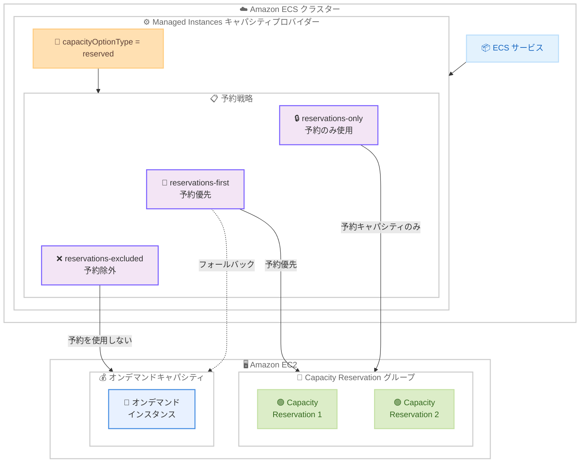

# Amazon ECS Managed Instances - Amazon EC2 Capacity Reservations との統合

**リリース日**: 2026 年 2 月 26 日
**サービス**: Amazon Elastic Container Service (Amazon ECS)
**機能**: ECS Managed Instances と EC2 Capacity Reservations の統合

📊 [このアップデートのインフォグラフィックを見る](https://takech9203.github.io/aws-news-summary/20260226-ecs-mi-ec2-capacity-reservations.html)

## 概要

Amazon ECS Managed Instances が Amazon EC2 Capacity Reservations と統合され、予約済みキャパシティをコンテナワークロードに活用できるようになりました。これにより、ECS がすべてのインフラストラクチャ管理を行いながら、予測可能なワークロードの可用性を確保し、コスト効率とのバランスを実現できます。

ECS Managed Instances は、インフラストラクチャ管理のオーバーヘッドを排除し、EC2 インスタンスをワークロード要件に合わせて動的にスケーリングし、タスク配置を継続的に最適化するフルマネージドコンピュートオプションです。今回のアップデートにより、キャパシティプロバイダーの `capacityOptionType` パラメータを `reserved` に設定することで、既存の `spot` や `on-demand` オプションに加えて Capacity Reservations を使用できるようになりました。

この機能はすべての AWS リージョンで利用可能です。

**アップデート前の課題**

- ECS Managed Instances のキャパシティプロバイダーでは、オンデマンドまたはスポットインスタンスのみを選択可能で、Capacity Reservations を活用する手段がなかった
- ミッションクリティカルなワークロードで確実なキャパシティ確保が必要な場合、EC2 Auto Scaling グループ (ASG) ベースのキャパシティプロバイダーを自前で管理する必要があった
- 予約済みキャパシティとオンデマンドキャパシティのフォールバックを手動で管理する必要があり、運用が複雑だった
- コンテナワークロードで Capacity Reservations の投資を最大限に活用することが困難だった

**アップデート後の改善**

- `capacityOptionType=reserved` の設定により、ECS Managed Instances で Capacity Reservations を直接利用可能に
- `reservations-only`、`reservations-first`、`reservations-excluded` の 3 つの予約戦略で、柔軟なキャパシティ管理を実現
- 予約キャパシティからオンデマンドへの自動フォールバックにより、可用性とコスト効率の最適なバランスを達成
- すべてのインフラストラクチャ管理は引き続き ECS が自動で実行

## アーキテクチャ図



ECS サービスが Managed Instances キャパシティプロバイダーを通じて EC2 インスタンスを起動する際、`capacityOptionType=reserved` の設定と予約戦略に基づいて、Capacity Reservations のキャパシティを使用します。`reservations-first` 戦略では、予約キャパシティが不足した場合にオンデマンドインスタンスへ自動的にフォールバックします。

## サービスアップデートの詳細

### 主要機能

1. **Capacity Reservations タイプの追加**
   - `capacityOptionType` に新しい値 `RESERVED` が追加
   - 既存の `SPOT` と `ON_DEMAND` に加え、3 つ目のキャパシティオプションとして利用可能
   - キャパシティプロバイダーの作成時または更新時に設定可能

2. **予約戦略の選択**
   - `reservations-only`: EC2 インスタンスを予約キャパシティでのみ起動。最大限の予測可能性を確保
   - `reservations-first`: 予約キャパシティを優先的に使用し、不足時にオンデマンドキャパシティへフォールバック
   - `reservations-excluded`: キャパシティプロバイダーが予約を使用しないよう設定

3. **Capacity Reservation グループの指定**
   - キャパシティプロバイダーに Capacity Reservation グループを関連付け
   - グループ内の複数の Capacity Reservations をまとめて管理
   - EC2 Capacity Reservation グループの作成と管理は Amazon EC2 のコンソールまたは API で実施

4. **フルマネージドインフラストラクチャ管理の継続**
   - Capacity Reservations を使用する場合も、インスタンスのプロビジョニング、スケーリング、最適化は ECS が自動で実行
   - タスクの AZ 分散、ビンパッキング、アイドルインスタンスの自動終了などの既存の最適化機能はそのまま利用可能

## 技術仕様

### キャパシティオプションタイプの比較

| オプション | 説明 | ユースケース |
|-----------|------|-------------|
| `ON_DEMAND` | オンデマンド EC2 インスタンスを使用 | 一般的なワークロード |
| `SPOT` | スポットインスタンスを使用 | 中断許容可能なワークロード |
| `RESERVED` | Capacity Reservations を使用 | ミッションクリティカルなワークロード |

### 予約戦略の詳細

| 戦略 | 動作 | 推奨用途 |
|------|------|---------|
| `reservations-only` | 予約キャパシティでのみインスタンスを起動 | キャパシティの確保が最優先のワークロード |
| `reservations-first` | 予約を優先し、不足時はオンデマンドにフォールバック | 高可用性と柔軟性の両立が必要なワークロード |
| `reservations-excluded` | 予約キャパシティを使用しない | 予約が他の用途に割り当てられている場合 |

### API 変更履歴

| 日付 | サービス | 変更内容 |
|------|----------|----------|
| 2026/02/26 | [Amazon EC2 Container Service](https://awsapichanges.com/archive/changes/f76046-ecs.html) | 4 updated api methods - ECS Managed Instances の Capacity Reservations サポートを追加。CreateCapacityProvider と UpdateCapacityProvider API に新しい `capacityOptionType` 値 `RESERVED` と `capacityReservations` フィールドを導入 |

### キャパシティプロバイダー設定例

```json
{
  "name": "mi-reserved-cp",
  "managedInstancesConfiguration": {
    "capacityOptionType": "RESERVED",
    "capacityReservations": {
      "capacityReservationGroup": "arn:aws:ec2:us-east-1:123456789012:capacity-reservation-group/my-cr-group",
      "reservationPreference": "reservations-first"
    },
    "instanceTypeConfiguration": {
      "instanceTypes": ["m6i.xlarge", "m6i.2xlarge"]
    }
  }
}
```

## 設定方法

### 前提条件

1. Amazon ECS クラスターが作成済みであること
2. EC2 Capacity Reservation グループが作成済みであること
3. 適切な IAM 権限 (ECS キャパシティプロバイダーの作成・更新権限、EC2 Capacity Reservations の使用権限)
4. AWS CLI v2 がインストールされていること

### 手順

#### ステップ 1: Capacity Reservation グループの確認

```bash
# Capacity Reservation グループの一覧を確認
aws ec2 describe-capacity-reservation-groups \
  --region us-east-1
```

使用する Capacity Reservation グループの ARN を確認します。グループが存在しない場合は、事前に EC2 コンソールまたは AWS CLI で作成してください。

#### ステップ 2: キャパシティプロバイダーの作成

```bash
# Capacity Reservations を使用する Managed Instances キャパシティプロバイダーの作成
aws ecs create-capacity-provider \
  --name mi-reserved-cp \
  --managed-instances-configuration '{
    "capacityOptionType": "RESERVED",
    "capacityReservations": {
      "capacityReservationGroup": "arn:aws:ec2:us-east-1:123456789012:capacity-reservation-group/my-cr-group",
      "reservationPreference": "reservations-first"
    }
  }'
```

`capacityOptionType` を `RESERVED` に設定し、Capacity Reservation グループの ARN と予約戦略を指定してキャパシティプロバイダーを作成します。

#### ステップ 3: クラスターへのキャパシティプロバイダーの関連付け

```bash
# クラスターにキャパシティプロバイダーを関連付け
aws ecs put-cluster-capacity-providers \
  --cluster my-cluster \
  --capacity-providers mi-reserved-cp \
  --default-capacity-provider-strategy capacityProvider=mi-reserved-cp,weight=1
```

作成したキャパシティプロバイダーを ECS クラスターに関連付け、デフォルトのキャパシティプロバイダー戦略として設定します。

#### ステップ 4: サービスの作成とデプロイ

```bash
# 予約キャパシティを使用するサービスの作成
aws ecs create-service \
  --cluster my-cluster \
  --service-name my-service \
  --task-definition my-task:1 \
  --desired-count 3 \
  --capacity-provider-strategy capacityProvider=mi-reserved-cp,weight=1
```

キャパシティプロバイダー戦略で作成したプロバイダーを指定してサービスを作成します。ECS が自動的に Capacity Reservations を使用して EC2 インスタンスをプロビジョニングします。

## メリット

### ビジネス面

- **キャパシティの確実な確保**: Capacity Reservations により、ミッションクリティカルなワークロードに必要なコンピューティングキャパシティを事前に確保
- **コスト最適化**: Savings Plans や Reserved Instances と組み合わせることで、予約済みキャパシティに対する割引を最大限に活用
- **運用負荷の軽減**: インフラストラクチャ管理は引き続き ECS が自動で実行し、お客様はアプリケーション開発に集中可能
- **柔軟なフォールバック**: `reservations-first` 戦略により、予約キャパシティとオンデマンドキャパシティの柔軟な組み合わせが可能

### 技術面

- **API レベルでの統合**: CreateCapacityProvider と UpdateCapacityProvider API への設定追加のみで利用可能
- **既存の最適化機能との共存**: AZ 分散、ビンパッキング、アイドルインスタンスの自動終了などの既存の最適化機能はそのまま活用
- **複数の設定方法**: AWS Management Console、AWS CLI、AWS CloudFormation、AWS SDK で設定可能
- **インスタンスタイプの柔軟性**: 特定のインスタンスタイプ指定と属性ベースのインスタンスタイプ選択の両方に対応

## デメリット・制約事項

### 制限事項

- Capacity Reservations は事前に購入・設定が必要であり、使用しない場合でもコストが発生する
- `reservations-only` 戦略では、予約キャパシティが不足した場合にタスクの起動が失敗する可能性がある
- Capacity Reservation グループは同一リージョン内のリザベーションのみをグループ化可能
- Capacity Reservations のインスタンスタイプと ECS タスクのリソース要件が一致する必要がある

### 考慮すべき点

- 予約戦略の選択は、ワークロードの可用性要件とコスト制約に基づいて慎重に決定すること
- `reservations-first` 戦略を使用する場合、オンデマンドへのフォールバック時のコスト増加を考慮すること
- 既存の Savings Plans や Reserved Instances との組み合わせで最大限のコスト削減を目指すことを推奨
- Capacity Reservations の利用率をモニタリングし、未使用の予約が発生しないよう定期的に見直すこと

## ユースケース

### ユースケース 1: ミッションクリティカルな本番ワークロード

**シナリオ**: 金融サービス企業がリアルタイム取引処理システムを ECS で運用し、キャパシティの確実な確保が必要

**実装例**:
```bash
# 取引処理用のキャパシティプロバイダー
aws ecs create-capacity-provider \
  --name trading-reserved-cp \
  --managed-instances-configuration '{
    "capacityOptionType": "RESERVED",
    "capacityReservations": {
      "capacityReservationGroup": "arn:aws:ec2:us-east-1:123456789012:capacity-reservation-group/trading-cr-group",
      "reservationPreference": "reservations-only"
    },
    "instanceTypeConfiguration": {
      "instanceTypes": ["c6i.2xlarge"]
    }
  }'
```

**効果**: `reservations-only` 戦略により、取引処理に必要なキャパシティが常に確保され、キャパシティ不足による取引遅延のリスクを排除できます。

### ユースケース 2: 可用性とコストのバランスが必要な Web アプリケーション

**シナリオ**: EC サイトがピーク時のキャパシティを予約しつつ、予期せぬトラフィック増加にも対応可能な柔軟性を確保したい

**実装例**:
```bash
# EC サイト用のキャパシティプロバイダー
aws ecs create-capacity-provider \
  --name ecommerce-cp \
  --managed-instances-configuration '{
    "capacityOptionType": "RESERVED",
    "capacityReservations": {
      "capacityReservationGroup": "arn:aws:ec2:us-east-1:123456789012:capacity-reservation-group/ecommerce-cr-group",
      "reservationPreference": "reservations-first"
    }
  }'
```

**効果**: `reservations-first` 戦略により、通常時は予約キャパシティを使用してコストを最適化し、トラフィックの急増時にはオンデマンドキャパシティへ自動的にフォールバックして可用性を維持できます。

### ユースケース 3: GPU ワークロードのキャパシティ確保

**シナリオ**: ML 推論ワークロードで GPU インスタンスのキャパシティを事前に確保し、推論リクエストの処理を安定的に実行したい

**実装例**:
```bash
# GPU ワークロード用のキャパシティプロバイダー
aws ecs create-capacity-provider \
  --name ml-inference-cp \
  --managed-instances-configuration '{
    "capacityOptionType": "RESERVED",
    "capacityReservations": {
      "capacityReservationGroup": "arn:aws:ec2:us-east-1:123456789012:capacity-reservation-group/gpu-cr-group",
      "reservationPreference": "reservations-first"
    },
    "instanceTypeConfiguration": {
      "instanceTypes": ["g5.xlarge", "g5.2xlarge"]
    }
  }'
```

**効果**: GPU インスタンスの供給が逼迫する状況でも、予約済みキャパシティにより必要な GPU リソースを確保し、ML 推論のレイテンシ SLA を満たすことができます。

## 料金

ECS Managed Instances と Capacity Reservations の統合に対する追加料金は発生しません。お客様は以下のコストを負担します。

### 料金体系

| 項目 | 説明 |
|------|------|
| EC2 Capacity Reservations | 予約したキャパシティに対する EC2 インスタンス料金 (使用の有無にかかわらず発生) |
| ECS Managed Instances | ECS Managed Instances の利用料金 |
| データ転送 | 標準の EC2 データ転送料金 |

### 料金例

| 構成 | 月額料金 (概算、us-east-1) |
|------|--------------------------|
| m6i.xlarge x 3 (Capacity Reservation) | 約 $432/月 |
| m6i.2xlarge x 2 (Capacity Reservation) | 約 $576/月 |

注: 実際の料金は使用するインスタンスタイプ、リージョン、Savings Plans の適用状況により異なります。最新の料金は [EC2 料金ページ](https://aws.amazon.com/ec2/pricing/) を参照してください。

## 利用可能リージョン

この機能はすべての AWS リージョンで利用可能です。

## 関連サービス・機能

- **Amazon EC2 Capacity Reservations**: 特定の AZ で EC2 インスタンスのキャパシティを事前に予約するサービス。今回の統合の基盤
- **Amazon ECS Managed Instances**: インフラストラクチャ管理を自動化するフルマネージドコンピュートオプション
- **AWS Fargate**: サーバーレスコンピュートオプション。キャパシティ予約は不要だが、EC2 固有の機能は利用できない
- **Amazon EC2 Auto Scaling グループ**: 従来の ECS キャパシティプロバイダーオプション。より詳細なインスタンス制御が必要な場合に使用
- **AWS Savings Plans / Reserved Instances**: Capacity Reservations と組み合わせてコスト最適化を実現

## 参考リンク

- 📊 [インフォグラフィック](https://takech9203.github.io/aws-news-summary/20260226-ecs-mi-ec2-capacity-reservations.html)
- [公式発表 (What's New)](https://aws.amazon.com/about-aws/whats-new/2026/02/ecs-mi-ec2-capacity-reservations/)
- [AWS Blog - Deep Dive: Amazon ECS Managed Instances provisioning and optimization](https://aws.amazon.com/blogs/containers/deep-dive-amazon-ecs-managed-instances-provisioning-and-optimization/)
- [ドキュメント - ECS Managed Instances インスタンスタイプ](https://docs.aws.amazon.com/AmazonECS/latest/developerguide/managed-instances-instance-types.html#managed-instances-instance-billing-and-purchase-options)

## まとめ

Amazon ECS Managed Instances と Amazon EC2 Capacity Reservations の統合により、コンテナワークロードで予約済みキャパシティを活用しながら、ECS によるフルマネージドのインフラストラクチャ管理を享受できるようになりました。`reservations-only`、`reservations-first`、`reservations-excluded` の 3 つの予約戦略により、可用性とコスト効率の最適なバランスを選択できます。ミッションクリティカルなワークロードや GPU を活用する ML 推論ワークロードを ECS で運用している組織は、Capacity Reservations との統合を検討し、キャパシティの確実な確保とコスト最適化を実現することをお勧めします。
