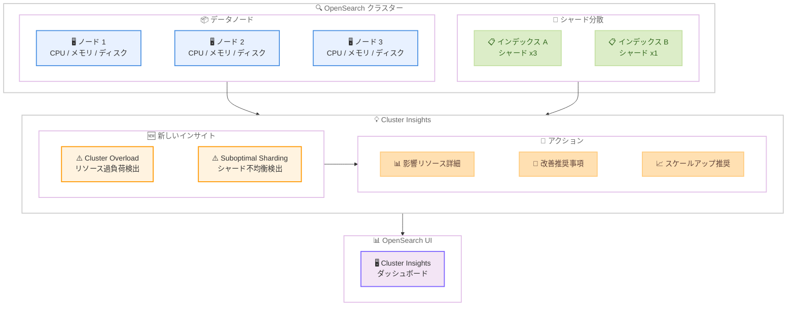

# Amazon OpenSearch Service - クラスター安定性向上のための新しいインサイト

**リリース日**: 2026 年 2 月 27 日
**サービス**: Amazon OpenSearch Service
**機能**: Cluster Insights に Cluster Overload と Suboptimal Sharding Strategy の 2 つの新しいインサイトを追加

📊 [このアップデートのインフォグラフィックを見る](https://takech9203.github.io/aws-news-summary/20260227-amazon-opensearch-service-adds-new-insights-improved-cluster-stability.html)

## 概要

Amazon OpenSearch Service の Cluster Insights に、Cluster Overload (クラスター過負荷) と Suboptimal Sharding Strategy (非最適シャーディング戦略) の 2 つの新しいインサイトが追加されました。これにより、クラスターのリソース制約やシャードの不均衡を早期に検出し、プロアクティブな対応が可能になります。

Suboptimal Sharding Strategy インサイトは、不均等なワークロード分散を引き起こすシャードの不均衡を即座に可視化します。一方、Cluster Overload インサイトは、リクエストのスロットリングやリジェクションにつながる可能性のあるクラスターリソースの過負荷状態を検出します。両方のインサイトには、影響を受けるリソースの詳細とアクションを伴う改善推奨事項が含まれています。

これらの新しいインサイトは、OpenSearch バージョン 2.17 以降を実行しているすべてのリージョンで追加料金なしで利用可能です。

**アップデート前の課題**

- リソース制約やシャードの不均衡を特定するには、複数のメトリクスやログを手動で相関分析する必要があった
- 問題の早期検出が困難で、リクエストのスロットリングやリジェクションが発生してから対応するケースが多かった
- シャードの不均等な分散がクエリ性能の低下を引き起こしている場合、根本原因の特定に時間がかかっていた
- クラスターのリソース使用率が高水準に達している状態を包括的に把握する手段が限られていた

**アップデート後の改善**

- Suboptimal Sharding Strategy インサイトにより、シャード数の不足やデータ量の偏りを自動検出し、根本原因と改善推奨を提示
- Cluster Overload インサイトにより、CPU、メモリ、ディスク I/O、ディスクスループット、ディスク使用率の過負荷状態を検出
- 影響を受けるリソースの詳細とアクション可能な改善推奨事項が自動的に提供される
- 追加料金なしで利用可能なため、すべてのユーザーが即座にクラスターの健全性監視を強化可能

## アーキテクチャ図



OpenSearch クラスターのデータノードとシャード分散状態を Cluster Insights が継続的に監視し、Cluster Overload と Suboptimal Sharding Strategy の 2 つの新しいインサイトでリソース過負荷とシャード不均衡を検出します。検出された問題には影響リソースの詳細と改善推奨事項が提供され、OpenSearch UI のダッシュボードから確認できます。

## サービスアップデートの詳細

### 主要機能

1. **Suboptimal Sharding Strategy インサイト**
   - データノード数に対してシャード数が少なすぎるインデックスを検出 (シャード数がデータノード数の 80% 未満の場合)
   - 平均シャードサイズに対して 20% 以上大きいデータを持つシャードの偏りを検出
   - 不均等なワークロード分散の根本原因を特定し、最適なシャード配分のための推奨事項を提供
   - 重大度: Medium

2. **Cluster Overload インサイト**
   - データノードの 70% 以上でリソース使用率が高い状態を検出 (High 重大度)
   - CPU、メモリ、ディスク I/O、ディスクスループット、ディスク使用率を包括的に監視
   - リクエストのスロットリングやリジェクションが観測された場合は Critical 重大度に昇格
   - スケールアップ推奨を含む即座のアクション提案を提供

3. **アクション可能な改善推奨事項**
   - 各インサイトに影響を受けるリソースの詳細なマップを提供
   - ステップバイステップの改善ガイダンスを表示
   - リソース修復アクションの履歴タイムラインを記録

## 技術仕様

### 新しいインサイトの詳細

| インサイト | 重大度 | トリガー条件 |
|-----------|--------|-------------|
| Suboptimal Sharding Strategy - シャード数不足 | Medium | 1 つ以上のインデックスのシャード数がデータノード数の 80% 未満 |
| Suboptimal Sharding Strategy - データ偏り | Medium | 1 つ以上のインデックスのシャードが平均シャードサイズと比較して 20% 以上大きいデータを保持 |
| Cluster Overload - 高使用率 | High | データノードの 70% 以上で CPU、メモリ、ディスク I/O、ディスクスループット、ディスク使用率のいずれかが高い状態 |
| Cluster Overload - スロットリング発生 | Critical | データノードの 70% 以上でリソース高使用率が発生し、かつリクエストのスロットリングまたはリジェクションが観測 |

### 既存の Cluster Insights カタログ

| インサイト | 重大度 | 説明 |
|-----------|--------|------|
| Low Disk | High | FreeStorage が全容量の 25% または 25 GB を下回る |
| Cluster Write Blocked | Critical | FreeStorage が全容量の 20% または 20 GB を下回る |
| Large Shard | Low/Medium/High | シャードサイズが 50 GB 超 (Low)、100 GB 超 (Medium)、200 GB 超 (High) |
| Shard Count | High | Heap の GB あたり 25 シャード超、またはノードあたり 900 シャード以上 |
| Cluster Status Red | Critical | ノード交換により Red ステータスが発生 |
| Cluster Status Yellow | Medium | ノード交換により Yellow ステータスが発生 |
| Misconfigured Replica | Medium | レプリカ未設定、またはレプリカ数がデータノード数を超過 |
| KMS Key Inaccessible | Critical | 暗号化に使用する KMS キーへのアクセスが失われた |
| Misconfigured Index Settings | Medium | index.routing.allocation 設定の存在によりブルーグリーンデプロイメントに影響の可能性 |
| Incorrect Cluster Manager Configuration | Critical | 専用クラスターマネージャーなしの 2 データノード、または 2 つの専用クラスターマネージャーノード |

### API 変更履歴

| 日付 | サービス | 変更内容 |
|------|----------|----------|
| - | Amazon OpenSearch Service | 直接的な API 変更なし。OpenSearch UI のダッシュボード機能として提供 |

### 対応バージョン

| 項目 | 要件 |
|------|------|
| OpenSearch バージョン | 2.17 以降 |
| サービスソフトウェアバージョン | 最新版 (バージョン 2.17 および 2.19 の場合) |
| アクセス方法 | OpenSearch UI (Dashboards) |
| アクセス権限 | OpenSearch UI アプリケーションの管理者ロール |

## 設定方法

### 前提条件

1. OpenSearch Service ドメインが OpenSearch バージョン 2.17 以降で稼働している
2. OpenSearch UI (Dashboards) が有効化されている
3. ドメインが最新のサービスソフトウェアバージョンに更新されている (バージョン 2.17 および 2.19 の場合)
4. OpenSearch UI アプリケーションの管理者ロールが割り当てられている

### 手順

#### ステップ 1: OpenSearch アプリケーションの作成と設定

```
1. OpenSearch Service コンソール (https://console.aws.amazon.com/aos/home) にアクセス
2. 左側のナビゲーションから [OpenSearch UI (Dashboards)] を選択
3. アプリケーションを作成し、データソースを関連付ける
```

OpenSearch UI でアプリケーションを作成し、監視対象の OpenSearch Service クラスターをデータソースとして関連付けます。

#### ステップ 2: Cluster Insights へのアクセス

```
1. OpenSearch UI ダッシュボードにアクセス
2. 画面左下の [Settings] アイコンを選択
3. [Data administrator] セクションに移動
4. [Cluster Insights] を選択
```

Cluster Insights は OpenSearch UI の設定メニュー内の Data administrator セクションからアクセスできます。新しい Cluster Overload と Suboptimal Sharding Strategy のインサイトは自動的に表示されます。

#### ステップ 3: インサイトの確認と対応

```
1. Cluster Insights の概要ダッシュボードでクラスターの健全性を確認
2. [Top insights by severity] セクションで重大度の高いインサイトを優先的に確認
3. 各インサイトをクリックして影響リソースの詳細と改善推奨事項を確認
4. 推奨事項に従ってクラスター設定やリソースを調整
```

Cluster Insights ダッシュボードでは、すべてのインサイトが重大度別にソートされて表示されます。各インサイトをクリックすると、影響を受けるリソースの詳細マップ、推奨事項タブ、修復アクションの履歴タイムラインが確認できます。

## メリット

### ビジネス面

- **ダウンタイムの削減**: リソース過負荷やシャード不均衡を早期に検出し、クラスター障害を未然に防止することで、サービスの可用性を向上
- **運用コストの削減**: 複数のメトリクスやログを手動で相関分析する必要がなくなり、運用チームの工数を削減
- **追加料金なし**: OpenSearch バージョン 2.17 以降を使用していれば、新しいインサイト機能を追加コストなしで即座に利用可能

### 技術面

- **プロアクティブな監視**: CPU、メモリ、ディスク I/O、ディスクスループット、ディスク使用率の 5 つのリソースメトリクスを包括的に監視し、問題が顕在化する前に検出
- **根本原因の特定**: シャード不均衡の原因 (シャード数不足またはデータ量の偏り) を自動的に特定し、最適な解決策を提示
- **アクション可能な推奨事項**: スケールアップ推奨やシャード再配分のガイダンスなど、具体的な改善アクションを提供
- **統合ダッシュボード**: Cluster Insights の既存インサイトと統合された単一ダッシュボードで、クラスター全体の健全性を一元的に監視

## デメリット・制約事項

### 制限事項

- OpenSearch バージョン 2.17 以降でのみ利用可能。それ以前のバージョンを使用している場合はアップグレードが必要
- バージョン 2.17 および 2.19 の場合、最新のサービスソフトウェアバージョンへの更新が追加で必要
- OpenSearch UI (Dashboards) を通じてのみアクセス可能で、API 経由での直接的なインサイト取得はサポートされていない

### 考慮すべき点

- Cluster Overload インサイトの閾値 (データノードの 70% 以上での高使用率) は固定されており、ワークロードの特性に応じたカスタマイズはできない
- Suboptimal Sharding Strategy の検出基準 (データノード数の 80% 未満のシャード数、20% 以上のデータ偏り) も固定値のため、すべてのユースケースに最適とは限らない
- インサイトの推奨事項は一般的なガイダンスであり、実際のワークロード特性に応じて判断・調整が必要

## ユースケース

### ユースケース 1: ログ分析基盤のシャード最適化

**シナリオ**: 大規模なログ分析基盤で、日次ローテーションされるインデックスのシャード数がデータノード数に対して不適切に設定されており、一部のノードにクエリ負荷が集中している状態を検出・改善する。

**実装例**:
```json
{
  "index_template": {
    "index_patterns": ["logs-*"],
    "template": {
      "settings": {
        "number_of_shards": 6,
        "number_of_replicas": 1
      }
    }
  }
}
```

上記のインデックステンプレートは、Suboptimal Sharding Strategy インサイトの推奨に基づきシャード数をデータノード数に合わせて調整した例です。

**効果**: Suboptimal Sharding Strategy インサイトがシャード数不足を自動検出し、データノード数に応じた最適なシャード数の推奨を提供。シャード数の調整により、クエリ負荷がノード間で均等に分散され、検索レイテンシーが改善。

### ユースケース 2: EC サイトの検索クラスターのスケーリング判断

**シナリオ**: EC サイトの商品検索クラスターで、セール期間中のトラフィック増加によりクラスターリソースが逼迫し、検索リクエストのスロットリングが発生する前にスケールアップを実施する。

**実装例**:
```bash
# Cluster Overload インサイトの推奨に基づくスケールアップ
aws opensearch update-domain-config \
  --domain-name "product-search" \
  --cluster-config '{
    "InstanceType": "r6g.4xlarge.search",
    "InstanceCount": 9,
    "DedicatedMasterEnabled": true,
    "DedicatedMasterType": "m6g.large.search",
    "DedicatedMasterCount": 3
  }'
```

**効果**: Cluster Overload インサイトがデータノードの CPU およびメモリ使用率の上昇を High 重大度で検出。スロットリング発生前にスケールアップ推奨が提示され、プロアクティブにクラスターリソースを増強することで、セール期間中のサービス品質を維持。

### ユースケース 3: 時系列データベースのシャード再配分

**シナリオ**: IoT データを格納する OpenSearch クラスターで、特定のインデックスに大量のデータが集中し、シャード間のデータ量に大きな偏りが生じている状態を検出・改善する。

**実装例**:
```bash
# シャードの再配分を実行
curl -X POST "https://search-domain.region.es.amazonaws.com/_reindex" \
  -H "Content-Type: application/json" \
  -d '{
    "source": {
      "index": "iot-data-2026-02"
    },
    "dest": {
      "index": "iot-data-2026-02-rebalanced"
    }
  }'

# 新しいインデックスのシャード数を適切に設定
curl -X PUT "https://search-domain.region.es.amazonaws.com/iot-data-template" \
  -H "Content-Type: application/json" \
  -d '{
    "index_patterns": ["iot-data-*"],
    "settings": {
      "number_of_shards": 12,
      "number_of_replicas": 1,
      "routing.allocation.total_shards_per_node": 2
    }
  }'
```

**効果**: Suboptimal Sharding Strategy インサイトが、平均と比較して 20% 以上大きいデータを持つシャードの偏りを検出。推奨に従いインデックスの再作成とシャード設定の調整を行うことで、ノード間のデータ分散が均等化され、クエリ性能とリソース使用率が改善。

## 料金

Cluster Insights (新しいインサイトを含む) は、OpenSearch バージョン 2.17 以降を実行しているドメインに対して追加料金なしで提供されます。

### 料金体系

| 項目 | 料金 |
|------|------|
| Cluster Insights (全インサイト) | 追加料金なし |
| 対象条件 | OpenSearch バージョン 2.17 以降 |

※ OpenSearch Service ドメイン自体の料金 (インスタンス、ストレージ、データ転送) は別途適用されます。

## 利用可能リージョン

Cluster Overload および Suboptimal Sharding Strategy の新しいインサイトは、OpenSearch UI が利用可能なすべてのリージョンで提供されています。

## 関連サービス・機能

- **Amazon CloudWatch**: OpenSearch Service のクラスターメトリクスを CloudWatch で監視し、Cluster Insights と組み合わせてアラートを設定可能
- **OpenSearch UI Query View**: バージョン 2.19 以降で利用可能なクエリ監視機能。リソース集約型のクエリを特定し、Cluster Overload の根本原因分析を補完
- **Amazon OpenSearch Serverless**: サーバーレス構成でシャード管理を自動化したい場合の代替オプション
- **OpenSearch Dashboards**: Cluster Insights のダッシュボードを通じてノード、インデックス、シャードレベルの詳細メトリクスを可視化

## 参考リンク

- 📊 [インフォグラフィック](https://takech9203.github.io/aws-news-summary/20260227-amazon-opensearch-service-adds-new-insights-improved-cluster-stability.html)
- [公式発表 (What's New)](https://aws.amazon.com/about-aws/whats-new/2026/02/amazon-opensearch-service-adds-new-insights-improved-cluster-stability/)
- [ドキュメント - Cluster Insights](https://docs.aws.amazon.com/opensearch-service/latest/developerguide/cluster-insights.html)
- [ドキュメント - Insights Catalog](https://docs.aws.amazon.com/opensearch-service/latest/developerguide/insights-catalog.html)

## まとめ

Amazon OpenSearch Service の Cluster Insights に追加された Cluster Overload と Suboptimal Sharding Strategy の 2 つの新しいインサイトにより、クラスターのリソース過負荷とシャード不均衡をプロアクティブに検出できるようになりました。従来は複数のメトリクスやログを手動で相関分析する必要がありましたが、これらのインサイトが自動的に問題を検出し、影響リソースの詳細と具体的な改善推奨事項を提供します。OpenSearch バージョン 2.17 以降で追加料金なしで利用可能なため、OpenSearch クラスターを運用しているお客様は Cluster Insights ダッシュボードを確認し、クラスターの健全性監視を強化することを推奨します。
