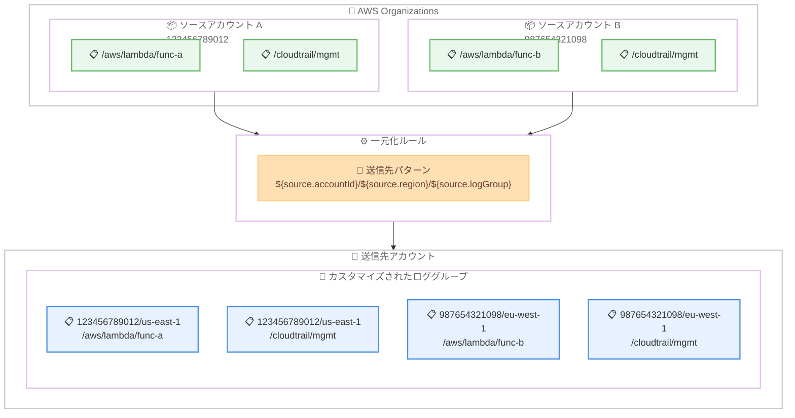

# Amazon CloudWatch Logs - 一元化ルールの送信先ロググループ名カスタマイズ

**リリース日**: 2026 年 2 月 27 日
**サービス**: Amazon CloudWatch Logs
**機能**: 一元化ルールにおけるカスタマイズ可能な送信先ロググループ構造

📊 [このアップデートのインフォグラフィックを見る](https://takech9203.github.io/aws-news-summary/20260227-cloudwatch-centralization-custom-groups.html)

## 概要

Amazon CloudWatch Logs の一元化ルール (centralization rules) において、送信先ロググループ名をカスタマイズできるようになりました。複数アカウントにまたがるログを管理する組織は、属性を使用してアカウント ID、リージョン、組織単位 (OU) などの AWS Organizations メタデータに基づいた階層構造で一元化ログを整理できるようになります。

送信先ロググループ名の構造は、CloudWatch Logs がログのコピー時に実際の値に自動的に置換する属性を使用して定義できます。例えば、`${source.accountId}/${source.region}/${source.logGroup}` というパターンを使用すると、`123456789012/us-east-1/cloudtrail/managementevent` のような送信先ロググループが作成され、どのアカウントとリージョンからのログかを容易に識別できます。

利用可能な属性には、ソースアカウント ID、リージョン、ロググループ名、組織 ID、組織単位 ID、ルート ID、完全な組織パスが含まれます。

**アップデート前の課題**

- 一元化ルールでは送信先ロググループ名を柔軟にカスタマイズする方法がなく、デフォルトではソースのロググループ名 (`${source.logGroup}`) のみが使用されていた
- 同じロググループ名を持つ複数のアカウントからのログが送信先で統合されてしまい、ログの発信元アカウントやリージョンの特定が困難だった
- 組織の構造やコンプライアンス要件に合わせたログの階層的な整理ができなかった
- アカウント ID やリージョン情報をログの整理に活用するには、追加のワークフローや後処理が必要だった

**アップデート後の改善**

- 属性ベースのパターンを使用して送信先ロググループ名を自由にカスタマイズ可能に
- アカウント ID、リージョン、組織単位などのメタデータを自動的にロググループ名に反映
- 組織の運用体制やコンプライアンス要件に合致した階層構造でログを整理可能
- ログの発信元の特定が容易になり、トラブルシューティングや監査の効率が向上

## アーキテクチャ図



複数のソースアカウントからのログが一元化ルールを通じて送信先アカウントにコピーされる際、`${source.accountId}/${source.region}/${source.logGroup}` パターンにより、アカウント ID とリージョンを含む階層構造のロググループ名が自動的に生成されます。

## サービスアップデートの詳細

### 主要機能

1. **属性ベースの送信先ロググループ名パターン**
   - 定義済みの属性変数を使用して送信先ロググループ名の構造を指定
   - CloudWatch Logs がログコピー時に属性を実際の値に自動置換
   - 変数が解決できない場合は、階層内の親変数の値を継承

2. **利用可能な属性変数**
   - `${source.accountId}`: ログの発信元 AWS アカウント ID
   - `${source.region}`: ログの発信元 AWS リージョン
   - `${source.logGroup}`: ソースアカウントの元のロググループ名
   - `${source.org.id}`: AWS Organizations の組織 ID
   - `${source.org.ouId}`: ソースアカウントの組織単位 ID
   - `${source.org.rootId}`: 組織のルート ID
   - `${source.org.path}`: アカウントからルートまでの完全な組織パス

3. **柔軟な階層構造の構築**
   - アカウント ID、リージョン、組織構造を組み合わせた多層的なログ分類が可能
   - コンプライアンス要件に応じた論理的なログのグルーピングを実現
   - 最大 512 文字のロググループ名をサポート

## 技術仕様

### 送信先ロググループ名の属性一覧

| 属性 | 説明 | 例 |
|------|------|-----|
| `${source.accountId}` | ソースアカウント ID | 123456789012 |
| `${source.region}` | ソースリージョン | us-east-1 |
| `${source.logGroup}` | 元のロググループ名 | /aws/lambda/my-function |
| `${source.org.id}` | 組織 ID | o-abc123 |
| `${source.org.ouId}` | 組織単位 ID | ou-xyz-12345678 |
| `${source.org.rootId}` | 組織ルート ID | r-abcd |
| `${source.org.path}` | 完全な組織パス | r-abcd/ou-xyz-12345678 |

### パターン例

| パターン | 生成されるロググループ名 |
|---------|----------------------|
| `${source.accountId}/${source.region}/${source.logGroup}` | `123456789012/us-east-1/cloudtrail/managementevent` |
| `/centralized/${source.accountId}${source.logGroup}` | `/centralized/123456789012/aws/lambda/my-function` |
| `/logs/${source.org.id}/${source.org.ouId}/${source.accountId}` | `/logs/o-abc123/ou-xyz-12345678/123456789012` |
| `/centralized-logs` | `/centralized-logs` |

### API 変更履歴

| 日付 | サービス | 変更内容 |
|------|----------|----------|
| 2026/02/24 | [CloudWatch Observability Admin Service](https://awsapichanges.com/archive/changes/b6a65c-observabilityadmin.html) | 5 updated api methods - CreateCentralizationRuleForOrganization、UpdateCentralizationRuleForOrganization API への新フィールド追加、GetCentralizationRuleForOrganization API レスポンスに新フィールドを含める更新 |

### 一元化ルールのヘルスステータス

| ステータス | 説明 |
|-----------|------|
| HEALTHY | ルールが正常に動作し、設定どおりにログをレプリケーション中 |
| UNHEALTHY | ルールに問題が発生し、正しくレプリケーションされていない可能性あり |
| PROVISIONING | 組織の一元化のセットアッププロセスが進行中 |

## 設定方法

### 前提条件

1. AWS Organizations が設定されており、ソースアカウントと送信先アカウントの両方が同じ組織に属している
2. CloudWatch の Trusted Access が有効化されている
3. 管理アカウントまたは委任管理者アカウントでの操作権限がある
4. 送信先アカウントのロググループに対する適切な権限が設定されている

### 手順

#### ステップ 1: CloudWatch コンソールでの一元化ルール作成

```
1. 管理アカウントまたは委任管理者アカウントで CloudWatch コンソールにアクセス
2. [Settings] を選択
3. [Organization] タブに移動
4. [Configure rule] を選択
5. ルール名とソースアカウント/リージョンを指定して [Next] を選択
```

コンソールから一元化ルールを作成する際の最初のステップです。ソースアカウントは、アカウントのリスト、組織単位のリスト、または組織全体から選択できます。

#### ステップ 2: 送信先ロググループ名パターンの設定

```
1. 送信先アカウントと送信先リージョンを選択
2. オプションでバックアップリージョンを選択
3. ロググループの送信先名パターンを設定
   例: ${source.accountId}/${source.region}/${source.logGroup}
4. テレメトリデータの設定で対象ロググループを選択
5. [Next] を選択してレビュー画面へ進む
```

送信先の詳細設定で、カスタマイズ可能なロググループ名パターンを指定します。属性変数は CloudWatch Logs が自動的に実際の値に置換します。

#### ステップ 3: AWS CLI での一元化ルール作成

```bash
# AWS CLI で送信先ロググループ名パターンを指定して一元化ルールを作成
aws observabilityadmin create-centralization-rule-for-organization \
  --rule-name "custom-log-centralization" \
  --source-selection-criteria '{
    "accounts": ["123456789012", "987654321098"],
    "regions": ["us-east-1", "eu-west-1"]
  }' \
  --destination-account-id "111111111111" \
  --destination-region "us-east-1" \
  --destination-log-group-name-pattern '${source.accountId}/${source.region}/${source.logGroup}' \
  --log-group-selection-criteria '{
    "selectionCriteria": "*"
  }'
```

このコマンドは、指定したソースアカウントとリージョンから送信先アカウントにログを一元化するルールを作成します。`--destination-log-group-name-pattern` パラメータで送信先ロググループ名の構造をカスタマイズしています。

## メリット

### ビジネス面

- **コンプライアンス要件への対応**: 組織構造、アカウント ID、リージョン情報に基づいた論理的なログ分類により、監査やコンプライアンスレポートの作成が効率化
- **運用効率の向上**: ログの発信元を送信先ロググループ名から即座に特定できるため、トラブルシューティングの時間を短縮
- **一元化ログの無料取り込み**: 一元化ルールによるログの 1 コピー目のインジェストは無料で、追加コピーのみ $0.05/GB の課金

### 技術面

- **柔軟な属性変数**: 7 種類の属性変数を自由に組み合わせて、組織の要件に最適なロググループ名の構造を設計可能
- **自動的な値の解決**: CloudWatch Logs がログコピー時に属性変数を実際の値に自動置換するため、手動での管理が不要
- **既存機能との統合**: 一元化されたロググループに対してメトリクスフィルター、サブスクリプションフィルター、アカウントフィルターを設定し、ソースアカウントやリージョンの情報をメトリクスディメンションとして出力可能
- **バックアップリージョン対応**: 送信先アカウント内にバックアップリージョンを設定し、レジリエンシーを確保可能

## デメリット・制約事項

### 制限事項

- 一元化ルールは、ルール作成後に到着した新しいログデータのみを処理する。ルール作成前の履歴データは一元化されない
- ロググループ名の最大長は 512 文字に制限されている。属性の組み合わせによっては上限を超える可能性がある
- 変数が解決できない場合は親変数の値が継承されるため、意図しないロググループ名が生成される可能性がある

### 考慮すべき点

- カスタマーマネージド KMS キーで暗号化されたソースロググループを一元化する場合、送信先アカウントの KMS キーに `LogsManaged = true` タグの追加が必要
- 一元化のスループット制限に達した場合、ログデータは帯域幅が利用可能になるまで一時的にカスタマーマネージド KMS キーで暗号化されて保存される
- 追加コピー (バックアップリージョンへのコピーを含む) は $0.05/GB の料金が発生するため、大量のログを一元化する場合はコストを事前に見積もることを推奨

## ユースケース

### ユースケース 1: マルチアカウント環境のセキュリティログ集約

**シナリオ**: 大規模な組織が数百のアカウントにまたがる CloudTrail ログを、アカウント ID とリージョンごとに整理された階層構造で一元管理し、セキュリティチームの調査を効率化する。

**実装例**:
```bash
# セキュリティログの一元化ルール作成
aws observabilityadmin create-centralization-rule-for-organization \
  --rule-name "security-log-centralization" \
  --source-selection-criteria '{
    "organizationId": "o-abc123"
  }' \
  --destination-account-id "111111111111" \
  --destination-region "us-east-1" \
  --backup-region "eu-west-1" \
  --destination-log-group-name-pattern '/security/${source.accountId}/${source.region}/${source.logGroup}' \
  --log-group-selection-criteria '{
    "selectionCriteria": "LogGroupName LIKE /cloudtrail/*"
  }'
```

**効果**: CloudTrail ログが `/security/123456789012/us-east-1/cloudtrail/managementevent` のような直感的な階層構造で整理され、セキュリティインシデント発生時に対象アカウントとリージョンのログへ即座にアクセス可能。バックアップリージョンにより災害復旧にも対応。

### ユースケース 2: 組織単位ごとのコンプライアンスログ管理

**シナリオ**: 金融機関が組織単位 (OU) ごとにログを分類し、部門ごとのコンプライアンス要件に対応した監査ログの管理体制を構築する。

**実装例**:
```bash
# OU ベースの一元化ルール作成
aws observabilityadmin create-centralization-rule-for-organization \
  --rule-name "compliance-log-centralization" \
  --source-selection-criteria '{
    "organizationUnitIds": ["ou-prod-12345678", "ou-dev-87654321"]
  }' \
  --destination-account-id "111111111111" \
  --destination-region "us-east-1" \
  --destination-log-group-name-pattern '/compliance/${source.org.ouId}/${source.accountId}/${source.logGroup}'
```

**効果**: ログが `/compliance/ou-prod-12345678/123456789012/aws/lambda/my-function` のように組織単位ごとに分類され、部門ごとの監査レポート作成が効率化。コンプライアンスチームが担当する OU のログだけを対象に分析やアラートを設定可能。

### ユースケース 3: マルチリージョン Lambda アプリケーションのログ統合

**シナリオ**: グローバルに展開されたサーバーレスアプリケーションのログを、リージョンとアカウントの情報を保持しつつ 1 つの送信先アカウントに統合し、アプリケーションチームの運用監視を一元化する。

**実装例**:
```bash
# Lambda ログの一元化ルール作成
aws observabilityadmin create-centralization-rule-for-organization \
  --rule-name "lambda-log-centralization" \
  --source-selection-criteria '{
    "accounts": ["123456789012", "987654321098", "456789012345"]
  }' \
  --destination-account-id "111111111111" \
  --destination-region "us-east-1" \
  --destination-log-group-name-pattern '/app-logs/${source.region}/${source.accountId}${source.logGroup}' \
  --log-group-selection-criteria '{
    "selectionCriteria": "LogGroupName LIKE /aws/lambda/*"
  }'
```

**効果**: 各リージョンの Lambda ログが `/app-logs/us-east-1/123456789012/aws/lambda/my-function` のように整理され、リージョン固有の問題の特定が容易に。CloudWatch Logs Insights のクロスロググループクエリと組み合わせることで、グローバルなアプリケーション監視を実現。

## 料金

CloudWatch Logs 一元化ルールの料金体系は以下のとおりです。

### 料金体系

| 項目 | 料金 |
|------|------|
| 1 コピー目のインジェスト | 無料 |
| 追加コピー (バックアップリージョン含む) | $0.05/GB |
| ストレージ | 標準の CloudWatch Logs ストレージ料金が適用 |

### 料金例

| 使用量 | 月額料金 (概算) |
|--------|-----------------|
| 100 GB/月 (1 コピー) | $0 (インジェスト無料) + ストレージ料金 |
| 100 GB/月 (バックアップリージョンあり) | $5.00 (追加コピー) + ストレージ料金 |
| 1 TB/月 (バックアップリージョンあり) | $51.20 (追加コピー) + ストレージ料金 |

※ ストレージ料金は別途適用されます。詳細は [CloudWatch 料金ページ](https://aws.amazon.com/cloudwatch/pricing/) を参照してください。

## 利用可能リージョン

カスタマイズ可能な送信先ロググループ名は、一元化ルールがサポートされているすべてのリージョンで利用可能です。

## 関連サービス・機能

- **AWS Organizations**: 一元化ルールのソースアカウント選択に組織構造を活用。組織 ID、OU ID、組織パスなどのメタデータを送信先ロググループ名に反映可能
- **AWS CloudTrail**: 一元化ルールの設定変更を監査ログとして記録し、構成管理の追跡が可能
- **Amazon CloudWatch Logs Insights**: 一元化されたロググループに対するクロスロググループクエリにより、複数アカウント・リージョンのログを横断的に分析
- **AWS KMS**: 一元化されたロググループに対するカスタマーマネージド暗号化キーによるデータ保護

## 参考リンク

- 📊 [インフォグラフィック](https://takech9203.github.io/aws-news-summary/20260227-cloudwatch-centralization-custom-groups.html)
- [公式発表 (What's New)](https://aws.amazon.com/about-aws/whats-new/2026/02/cloudwatch-centralization-custom-groups/)
- [ドキュメント - Cross-account cross-Region log centralization](https://docs.aws.amazon.com/AmazonCloudWatch/latest/logs/CloudWatchLogs_Centralization.html)
- [料金ページ](https://aws.amazon.com/cloudwatch/pricing/)

## まとめ

Amazon CloudWatch Logs の一元化ルールにおける送信先ロググループ名のカスタマイズ機能により、マルチアカウント環境のログ管理が大幅に効率化されます。アカウント ID、リージョン、組織単位などの 7 種類の属性変数を組み合わせて、組織の運用体制やコンプライアンス要件に最適な階層構造でログを整理できます。1 コピー目のインジェストは無料で提供されるため、コスト効率も優れています。複数アカウントでログを管理している組織は、既存の一元化ルールを更新して新しいロググループ名パターンを適用し、ログの可視性と管理効率の向上を検討することを推奨します。
