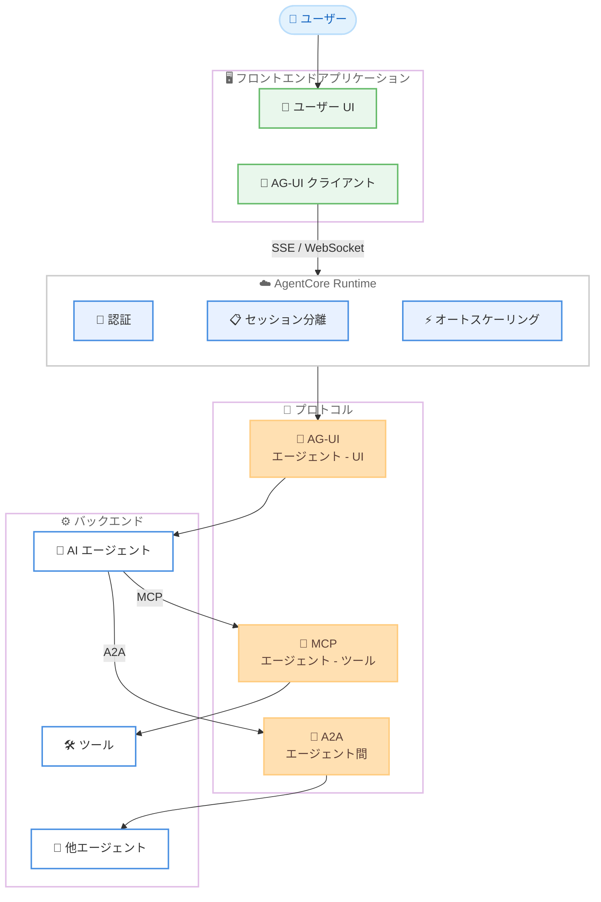

# Amazon Bedrock AgentCore Runtime - AG-UI プロトコルサポート

**リリース日**: 2026 年 3 月 13 日
**サービス**: Amazon Bedrock AgentCore Runtime
**機能**: Agent-User Interaction (AG-UI) プロトコルサポート

[このアップデートのインフォグラフィックを見る](https://takech9203.github.io/aws-news-summary/20260313-amazon-bedrock-agentcore-runtime-ag-ui-protocol.html)

## 概要

Amazon Bedrock AgentCore Runtime が Agent-User Interaction (AG-UI) プロトコルをサポートした。AG-UI は、AI エージェントとユーザーインターフェース間の通信を標準化するオープンなイベントベースのプロトコルであり、開発者はレスポンシブかつリアルタイムなエージェント体験をユーザー向けアプリケーションに組み込むことが可能になった。

AgentCore Runtime は既に Model Context Protocol (MCP) と Agent-to-Agent (A2A) プロトコルをサポートしており、今回の AG-UI 対応によりエージェント通信の 3 つの主要プロトコルすべてに対応した。MCP がエージェントにツールを提供し、A2A がエージェント間通信を実現する一方、AG-UI はエージェントをユーザー向けアプリケーションに接続する役割を担う。

**アップデート前の課題**

- エージェントの応答をユーザーインターフェースにリアルタイムでストリーミングするための標準化されたプロトコルがなかった
- エージェントの推論ステップやツール実行結果をフロントエンドに透過的に表示する仕組みが欠如していた
- エージェントと UI 間の状態同期を開発者が独自に実装する必要があった
- MCP と A2A はサポートされていたが、ユーザー向けインターフェースとの直接的な通信プロトコルが AgentCore Runtime に統合されていなかった

**アップデート後の改善**

- AG-UI プロトコルにより、テキストチャンク、推論ステップ、ツール結果をフロントエンドにリアルタイムでストリーミングできるようになった
- プログレスバーやダッシュボードなどの UI 要素をリアルタイムに更新する状態同期が可能になった
- AgentCore Runtime が認証、セッション分離、スケーリングを自動的に処理するため、開発者はフロントエンド構築に集中できるようになった
- Server-Sent Events (SSE) と WebSocket の両トランスポートによる双方向通信がサポートされた

## アーキテクチャ図



AG-UI プロトコルを中心とした AgentCore Runtime のアーキテクチャを示す。AG-UI がユーザー向けフロントエンドとエージェントを接続し、MCP と A2A が既存のツール連携およびエージェント間通信を担う。

## サービスアップデートの詳細

### 主要機能

1. **リアルタイムストリーミング**
   - テキストチャンクをフロントエンドに逐次配信し、応答のリアルタイム表示を実現
   - エージェントの推論ステップをストリーミングで可視化
   - ツール実行結果を発生時にフロントエンドへ即時配信

2. **リアルタイム状態同期**
   - プログレスバー、ダッシュボードなどの UI 要素をリアルタイムに更新
   - エージェントの処理状態をフロントエンドと双方向で同期
   - イベントベースのアーキテクチャにより、効率的な状態管理を実現

3. **構造化ツール呼び出しの可視化**
   - エージェントが実行するツール呼び出しを構造化された形式で UI にレンダリング
   - エージェントのアクションを透過的に表示し、ユーザーの信頼性を向上
   - ツール入力パラメータと結果の詳細な表示が可能

4. **デュアルトランスポートサポート**
   - Server-Sent Events (SSE) によるサーバーからクライアントへの効率的なストリーミング
   - WebSocket による双方向通信のサポート
   - アプリケーション要件に応じたトランスポートの選択が可能

## 技術仕様

### プロトコル比較

| プロトコル | 役割 | 通信方向 | 主な用途 |
|-----------|------|---------|---------|
| AG-UI | エージェント - UI | エージェントからフロントエンド | ユーザー向けリアルタイム体験 |
| MCP | エージェント - ツール | エージェントからツールサーバー | ツールとコンテキストの提供 |
| A2A | エージェント間 | エージェント同士 | マルチエージェント連携 |

### トランスポート

| トランスポート | 特徴 | 適用場面 |
|--------------|------|---------|
| Server-Sent Events (SSE) | サーバーからクライアントへの一方向ストリーミング | テキスト生成、進捗通知 |
| WebSocket | 双方向リアルタイム通信 | インタラクティブなエージェント操作 |

### API 変更履歴

| 日付 | サービス | 変更内容 |
|------|----------|----------|
| 2026/03/10 | [Amazon Bedrock AgentCore Control](https://awsapichanges.com/archive/changes/9ed5c2-bedrock-agentcore-control.html) | 3 updated api methods - AG-UI プロトコルサポートの追加 (CreateAgentRuntime, GetAgentRuntime, UpdateAgentRuntime) |

### デプロイ設定

```python
import boto3

client = boto3.client('bedrock-agentcore-control')

# AG-UI プロトコルで AgentCore Runtime を作成
response = client.create_agent_runtime(
    agentRuntimeName='my-agui-server',
    agentRuntimeArtifact={
        'containerConfiguration': {
            'containerUri': '123456789012.dkr.ecr.us-east-1.amazonaws.com/my-agui-server:latest'
        }
    },
    roleArn='arn:aws:iam::123456789012:role/AgentCoreRuntimeRole',
    protocolConfiguration={
        'serverProtocol': 'AGUI'
    },
    networkConfiguration={
        'networkMode': 'PUBLIC'
    }
)
```

`protocolConfiguration` の `serverProtocol` に `AGUI` を指定することで、AG-UI プロトコルをサポートするランタイムを作成できる。

## 設定方法

### 前提条件

1. AWS アカウントと適切な IAM 権限
2. AG-UI サーバーのコンテナイメージまたは Python コードアーティファクト
3. AgentCore Runtime 用の IAM ロール

### 手順

#### ステップ 1: AG-UI サーバーの実装

```python
# AG-UI サーバーの実装例
from agui import AGUIServer, Event

server = AGUIServer("my-agent-ui")

@server.on_message
async def handle_message(message: str, session):
    # テキストチャンクのストリーミング
    async for chunk in agent.generate_response(message):
        await session.emit(Event.text_chunk(chunk))

    # ツール実行結果の可視化
    tool_result = await agent.execute_tool("search", query=message)
    await session.emit(Event.tool_result(
        tool_name="search",
        result=tool_result
    ))

    # 状態同期
    await session.emit(Event.state_update(
        progress=100,
        status="completed"
    ))
```

AG-UI サーバーの基本的な実装例を示している。テキストストリーミング、ツール結果の配信、状態同期の各イベントを送信する。

#### ステップ 2: AgentCore Runtime へのデプロイ

```bash
# コンテナイメージを ECR にプッシュ
aws ecr get-login-password --region us-east-1 | \
  docker login --username AWS --password-stdin 123456789012.dkr.ecr.us-east-1.amazonaws.com

docker push 123456789012.dkr.ecr.us-east-1.amazonaws.com/my-agui-server:latest

# AG-UI プロトコルで AgentCore Runtime を作成
aws bedrock-agentcore-control create-agent-runtime \
  --agent-runtime-name my-agui-server \
  --agent-runtime-artifact '{"containerConfiguration":{"containerUri":"123456789012.dkr.ecr.us-east-1.amazonaws.com/my-agui-server:latest"}}' \
  --role-arn arn:aws:iam::123456789012:role/AgentCoreRuntimeRole \
  --protocol-configuration '{"serverProtocol":"AGUI"}'
```

コンテナイメージを ECR にプッシュし、AG-UI プロトコルを指定して AgentCore Runtime としてデプロイするコマンドを示している。

#### ステップ 3: フロントエンドからの接続

```javascript
// AG-UI クライアントからの接続例
import { AGUIClient } from '@ag-ui/client';

const client = new AGUIClient({
  endpoint: 'https://<runtime-endpoint>/agui',
  transport: 'sse' // または 'websocket'
});

// テキストストリーミングの受信
client.on('text_chunk', (chunk) => {
  appendToChat(chunk.content);
});

// ツール実行結果の受信
client.on('tool_result', (result) => {
  renderToolAction(result.tool_name, result.result);
});

// 状態同期の受信
client.on('state_update', (state) => {
  updateProgressBar(state.progress);
});

// メッセージ送信
await client.send('売上データを分析してください');
```

フロントエンドから AG-UI エンドポイントに接続し、リアルタイムイベントを受信する例を示している。

## メリット

### ビジネス面

- **ユーザーエクスペリエンスの大幅な向上**: テキスト、推論ステップ、ツール結果のリアルタイムストリーミングにより、エージェントの応答を待つ時間が体感的に短縮される
- **エージェント透明性の向上**: 構造化されたツール呼び出しの可視化により、エージェントが何を行っているかをユーザーが確認でき、信頼性が向上する
- **開発効率の向上**: AgentCore Runtime が認証、セッション分離、スケーリングを処理するため、開発者はフロントエンド体験の構築に集中できる

### 技術面

- **プロトコルの統一**: MCP、A2A、AG-UI の 3 プロトコルを AgentCore Runtime で統合管理でき、アーキテクチャが簡素化される
- **柔軟なトランスポート選択**: SSE と WebSocket の両方をサポートしており、アプリケーション要件に最適なトランスポートを選択できる
- **オープン標準準拠**: AG-UI はオープンプロトコルであるため、特定のベンダーにロックインされず、エコシステムの広がりが期待できる

## デメリット・制約事項

### 制限事項

- AG-UI は比較的新しいプロトコルであり、対応するクライアントライブラリやフレームワークのエコシステムが発展途上の可能性がある
- SSE と WebSocket のトランスポート選択において、ネットワーク環境やプロキシの制約を考慮する必要がある
- リアルタイムストリーミングの特性上、クライアント側でのイベント処理とエラーハンドリングの実装が必要

### 考慮すべき点

- 既に MCP や A2A で AgentCore Runtime を利用している場合、AG-UI サーバーは別途作成する必要がある
- 双方向通信を必要とする場合は WebSocket、一方向ストリーミングで十分な場合は SSE を選択するなど、トランスポートの適切な選定が重要

## ユースケース

### ユースケース 1: インタラクティブなチャットボット

**シナリオ**: カスタマーサポート用のチャットボットで、エージェントの応答をリアルタイムにストリーミング表示し、ツール呼び出しの過程を透過的にユーザーに見せる。

**実装例**:
```python
@server.on_message
async def support_chat(message: str, session):
    # 推論ステップのストリーミング
    await session.emit(Event.reasoning_step("ナレッジベースを検索中..."))

    results = await search_knowledge_base(message)
    await session.emit(Event.tool_result("knowledge_search", results))

    # 回答のストリーミング生成
    async for chunk in generate_answer(message, results):
        await session.emit(Event.text_chunk(chunk))
```

**効果**: エージェントの思考プロセスとツール使用をリアルタイムに表示することで、ユーザーの待機時間を体感的に短縮し、回答の根拠を透明に提示できる。

### ユースケース 2: データ分析ダッシュボード

**シナリオ**: ビジネスデータの分析リクエストをエージェントが処理し、分析の進捗状況やグラフデータをダッシュボードにリアルタイムで反映する。

**実装例**:
```python
@server.on_message
async def analyze_data(query: str, session):
    await session.emit(Event.state_update(progress=10, status="データ取得中"))
    data = await fetch_data(query)

    await session.emit(Event.state_update(progress=50, status="分析実行中"))
    analysis = await run_analysis(data)

    # グラフデータの送信
    await session.emit(Event.state_update(
        progress=90,
        chart_data=analysis.to_chart()
    ))

    async for chunk in summarize(analysis):
        await session.emit(Event.text_chunk(chunk))

    await session.emit(Event.state_update(progress=100, status="完了"))
```

**効果**: 分析の進捗をプログレスバーで表示し、結果のグラフデータをリアルタイムにダッシュボードへ反映できる。

### ユースケース 3: マルチエージェント協調ワークフロー

**シナリオ**: 複数のエージェントが A2A で協調しながらタスクを処理し、その進捗と結果を AG-UI 経由でユーザーにリアルタイム表示する。

**実装例**:
```python
@server.on_message
async def multi_agent_task(request: str, session):
    # リサーチエージェントに A2A で依頼
    await session.emit(Event.reasoning_step("リサーチエージェントに調査を依頼中..."))
    research = await a2a_client.delegate("research-agent", request)
    await session.emit(Event.tool_result("research_agent", research))

    # ライティングエージェントに A2A で依頼
    await session.emit(Event.reasoning_step("ライティングエージェントに執筆を依頼中..."))
    async for chunk in a2a_client.stream("writing-agent", research):
        await session.emit(Event.text_chunk(chunk))
```

**効果**: バックエンドで複数のエージェントが連携する過程をユーザーに可視化し、各エージェントの役割と成果物を透明に表示できる。

## 料金

AgentCore Runtime の料金は、microVM の実行時間とリソース使用量に基づく。AG-UI サーバーも既存の MCP や A2A サーバーと同様の課金モデルが適用される。詳細な料金情報は Amazon Bedrock の料金ページを参照のこと。

## 利用可能リージョン

以下の 14 リージョンで利用可能。

| リージョン | コード |
|-----------|--------|
| 米国東部 (バージニア北部) | us-east-1 |
| 米国東部 (オハイオ) | us-east-2 |
| 米国西部 (オレゴン) | us-west-2 |
| アジアパシフィック (ムンバイ) | ap-south-1 |
| カナダ (中部) | ca-central-1 |
| アジアパシフィック (ソウル) | ap-northeast-2 |
| アジアパシフィック (シンガポール) | ap-southeast-1 |
| アジアパシフィック (シドニー) | ap-southeast-2 |
| アジアパシフィック (東京) | ap-northeast-1 |
| 欧州 (フランクフルト) | eu-central-1 |
| 欧州 (アイルランド) | eu-west-1 |
| 欧州 (ロンドン) | eu-west-2 |
| 欧州 (パリ) | eu-west-3 |
| 欧州 (ストックホルム) | eu-north-1 |

## 関連サービス・機能

- **Amazon Bedrock AgentCore Runtime**: AG-UI サーバーのホスティング基盤で、認証、セッション分離、スケーリングを自動管理
- **Model Context Protocol**: エージェントにツールやコンテキストを提供するプロトコルで、AG-UI と組み合わせてフルスタックのエージェントアプリケーションを構築可能
- **Agent-to-Agent Protocol**: エージェント間通信を実現するプロトコルで、マルチエージェントシステムのバックエンド連携に使用

## 参考リンク

- [インフォグラフィック](https://takech9203.github.io/aws-news-summary/20260313-amazon-bedrock-agentcore-runtime-ag-ui-protocol.html)
- [公式発表 (What's New)](https://aws.amazon.com/about-aws/whats-new/2026/03/amazon-bedrock-agentcore-runtime-ag-ui-protocol/)
- [Amazon Bedrock AgentCore ドキュメント](https://docs.aws.amazon.com/bedrock/latest/userguide/agentcore.html)
- [Amazon Bedrock 料金ページ](https://aws.amazon.com/bedrock/pricing/)

## まとめ

Amazon Bedrock AgentCore Runtime の AG-UI プロトコルサポートにより、AI エージェントとユーザーインターフェース間のリアルタイム通信が標準化された。MCP、A2A と合わせて 3 つの主要プロトコルすべてに対応したことで、ツール連携からエージェント間通信、ユーザー向けフロントエンドまでを AgentCore Runtime で統合的に管理できるようになった。14 リージョンで利用可能であり、東京リージョンでも即座に活用を開始できる。
