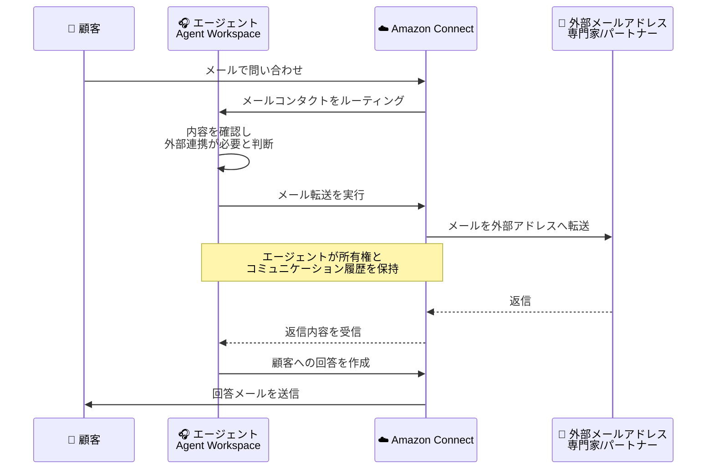

# Amazon Connect - メール転送機能

**リリース日**: 2026年3月16日
**サービス**: Amazon Connect
**機能**: エージェントによる外部メールアドレスへのメール転送

## 概要

Amazon Connect が、エージェントワークスペースおよび Contact Center Panel から直接、外部メールアドレスや配布リストへメールコンタクトを転送できる機能をリリースしました。この機能により、エージェントはバックオフィスチーム、専門家、パートナー、その他のステークホルダーをシームレスに巻き込みながら、顧客に対する一貫した窓口を維持できます。

メール転送時、エージェントは元のコンタクトの所有権と完全なコミュニケーション履歴を保持します。これにより、複数の関係者が関与する問い合わせにおいても、顧客は単一の連絡先とやり取りを続けることができ、顧客体験の一貫性が確保されます。

この機能は、Amazon Connect のメールチャネルが利用可能な 10 リージョンで提供されています。

**アップデート前の課題**

- エージェントが外部の関係者にメールを転送する場合、Amazon Connect の外部でメールクライアントを使用する必要があった
- 外部転送時にコンタクトの所有権やコミュニケーション履歴が分断されていた
- バックオフィスチームや専門家との連携時に、エージェントが一貫した窓口として機能することが困難だった
- 配布リストへの一括転送が Amazon Connect 内で完結できなかった

**アップデート後の改善**

- エージェントワークスペースおよび Contact Center Panel から直接外部メールアドレスへ転送が可能になった
- メール転送後も元のコンタクトの所有権と完全なコミュニケーション履歴を保持できるようになった
- バックオフィスチームや専門家を簡単にコミュニケーションに巻き込めるようになった
- 配布リストへの転送にも対応し、複数のステークホルダーへの同時連絡が可能になった

## アーキテクチャ図



この図は、顧客からのメール問い合わせをエージェントが受け取り、外部の専門家やパートナーへ転送した後、回答を顧客に返すまでの流れを示しています。エージェントは転送後もコンタクトの所有権を維持し、一貫した窓口として機能します。

## サービスアップデートの詳細

### 主要機能

1. **外部メールアドレスへの転送**
   - エージェントワークスペースから直接外部メールアドレスへメールを転送可能
   - Contact Center Panel からも同様の転送操作が可能
   - 個別のメールアドレスおよび配布リストの両方に対応

2. **コンタクト所有権の維持**
   - メール転送後もエージェントが元のコンタクトの所有権を保持
   - 完全なコミュニケーション履歴がエージェント側に残る
   - 顧客に対して一貫した窓口を提供

3. **シームレスなコラボレーション**
   - バックオフィスチーム、専門家、パートナーを簡単にループイン
   - 外部のメールクライアントを使用せずに Amazon Connect 内で完結
   - 複数のステークホルダーとの同時コミュニケーションが可能

## 技術仕様

### メール転送機能の仕様

| 項目 | 詳細 |
|------|------|
| 転送元 | エージェントワークスペース / Contact Center Panel |
| 転送先 | 外部メールアドレス、配布リスト |
| 所有権 | 転送後もエージェントが保持 |
| 履歴 | 完全なコミュニケーション履歴を維持 |
| 対応チャネル | メール |

### API 変更履歴

今回のアップデートに直接関連する API 変更は確認されていません。なお、直近 7 日間で以下の Amazon Connect 関連サービスの API 変更が確認されています。

| 日付 | サービス | 変更内容 |
|------|----------|----------|
| 2026/03/11 | [Amazon Connect Customer Profiles](https://awsapichanges.com/archive/changes/537c33-profile.html) | 4 new 6 updated methods - レコメンダーフィルター機能の追加 |
| 2026/03/10 | [Amazon Connect Cases](https://awsapichanges.com/archive/changes/9ed5c2-cases.html) | 3 updated methods - ケースルールの条件付き評価機能の追加 |

## 設定方法

### 前提条件

1. Amazon Connect インスタンスでメールチャネルが有効化されている
2. エージェントに適切なセキュリティプロファイルとアクセス権限が付与されている
3. メールの送受信に必要なドメインが Amazon Connect に設定されている

### 手順

#### ステップ 1: メールチャネルの確認

Amazon Connect 管理コンソールでメールチャネルが有効になっていることを確認します。メールチャネルの設定は、インスタンスの「チャネル」セクションから確認できます。

#### ステップ 2: エージェントのセキュリティプロファイル設定

エージェントがメール転送機能を使用できるよう、セキュリティプロファイルに適切な権限を設定します。Amazon Connect 管理コンソールの「ユーザー」から「セキュリティプロファイル」を選択し、メール転送に関連する権限を付与します。

#### ステップ 3: エージェントワークスペースからの転送

エージェントがメールコンタクトを受信した後、エージェントワークスペースまたは Contact Center Panel の転送機能を使用して、外部メールアドレスまたは配布リストを指定してメールを転送します。

## メリット

### ビジネス面

- **顧客体験の向上**: エージェントが一貫した窓口として機能し、顧客は複数の連絡先とやり取りする必要がない
- **解決時間の短縮**: 専門家やバックオフィスチームを迅速に巻き込むことで、問い合わせの解決時間を短縮
- **業務効率の改善**: 外部メールクライアントへの切り替えが不要になり、エージェントのワークフローが効率化

### 技術面

- **統合されたワークフロー**: Amazon Connect 内でメール転送が完結し、外部ツールへの依存を削減
- **コミュニケーション履歴の一元管理**: 転送を含む全てのやり取りがコンタクト履歴に記録される
- **既存インフラの活用**: 追加のインフラ構築なしで、既存の Amazon Connect 環境で利用可能

## デメリット・制約事項

### 制限事項

- Amazon Connect のメールチャネルが利用可能なリージョンでのみ使用可能
- メールチャネルの設定が前提条件となるため、未設定の場合は事前準備が必要
- 転送先の外部メールアドレスの受信側の設定によっては、メールがスパムフィルタにかかる可能性がある

### 考慮すべき点

- 外部メールアドレスへの転送時、社内のセキュリティポリシーやデータガバナンスポリシーとの整合性を確認する必要がある
- 転送先が配布リストの場合、意図しない広範囲への情報共有が発生しないよう注意が必要
- メールの転送量に応じて、Amazon Connect のメール料金が発生する

## ユースケース

### ユースケース 1: 技術的な問い合わせのエスカレーション

**シナリオ**: 顧客から高度な技術的問題についてメールで問い合わせがあり、エージェントだけでは回答が困難な場合に、社内の技術専門家チームへメールを転送して回答を得る。

**実装例**:
```
1. エージェントが顧客からの技術的問い合わせメールを受信
2. エージェントワークスペースから技術チームの配布リストへ転送
3. 技術チームからの回答を受信後、エージェントが顧客へ回答を送信
```

**効果**: エージェントが窓口を維持しながら専門家の知見を活用でき、顧客は一貫した対応を受けられます。

### ユースケース 2: パートナー企業との連携

**シナリオ**: 顧客の問い合わせがパートナー企業の製品やサービスに関連する場合、パートナー企業の担当者へメールを転送して情報を収集する。

**実装例**:
```
1. エージェントが顧客からのパートナー製品に関する問い合わせを受信
2. Contact Center Panel からパートナー企業の担当者メールアドレスへ転送
3. パートナーからの回答を基に、エージェントが顧客へ最終回答を作成・送信
```

**効果**: 社外のパートナーとの連携をシームレスに行い、顧客への回答品質と速度を向上させます。

### ユースケース 3: 社内承認プロセスとの連携

**シナリオ**: 顧客から返金や特別対応のリクエストがあり、管理者の承認が必要な場合に、承認者へメールを転送して承認を得る。

**実装例**:
```
1. エージェントが顧客からの特別対応リクエストメールを受信
2. エージェントワークスペースから承認者のメールアドレスへ転送
3. 承認者からの回答を受信後、エージェントが顧客へ対応結果を通知
```

**効果**: 承認プロセスをメールのコミュニケーション履歴に含めることで、対応の透明性と追跡可能性が向上します。

## 料金

Amazon Connect のメール機能の料金に基づきます。メール転送に対して追加の固定料金は発生しませんが、転送されたメールは Amazon Connect のメール料金体系に従って課金されます。

### 料金例

| 使用量 | 月額料金 (概算) |
|--------|------------------|
| メール 1,000 件/月 (転送含む) | メールコンタクト料金に準拠 |
| メール 10,000 件/月 (転送含む) | メールコンタクト料金に準拠 |

※ 最新の料金情報は [Amazon Connect 料金ページ](https://aws.amazon.com/connect/pricing/) を参照してください。

## 利用可能リージョン

Amazon Connect のメール機能が利用可能な以下の 10 リージョンで提供されています。

| リージョン名 | リージョンコード |
|-------------|-----------------|
| 米国東部 (バージニア北部) | us-east-1 |
| 米国西部 (オレゴン) | us-west-2 |
| アフリカ (ケープタウン) | af-south-1 |
| アジアパシフィック (ソウル) | ap-northeast-2 |
| アジアパシフィック (シンガポール) | ap-southeast-1 |
| アジアパシフィック (シドニー) | ap-southeast-2 |
| アジアパシフィック (東京) | ap-northeast-1 |
| カナダ (中部) | ca-central-1 |
| ヨーロッパ (フランクフルト) | eu-central-1 |
| ヨーロッパ (ロンドン) | eu-west-2 |

## 関連サービス・機能

- **Amazon Connect Agent Workspace**: エージェントがメール転送を実行するための統合ワークスペース
- **Amazon Connect Contact Center Panel**: メール転送操作をサポートするもう一つのインターフェース
- **Amazon Connect Contact Lens**: メールコンタクトの分析やインサイト取得に活用可能
- **Amazon Connect Cases**: メール転送を含むコンタクト履歴をケースとして管理し、追跡可能

## 参考リンク

- [公式発表 (What's New)](https://aws.amazon.com/about-aws/whats-new/2026/03/amazon-connect-forward-email-contacts/)
- [Amazon Connect メール機能ドキュメント](https://docs.aws.amazon.com/connect/latest/adminguide/email.html)
- [Amazon Connect 料金ページ](https://aws.amazon.com/connect/pricing/)

## まとめ

Amazon Connect のメール転送機能により、エージェントはワークスペースから直接外部のメールアドレスや配布リストへメールを転送できるようになりました。転送後もコンタクトの所有権と通信履歴を保持できるため、顧客に対して一貫した窓口を維持しながら、社内外の関係者とシームレスに連携できます。メールチャネルを利用している Amazon Connect ユーザーは、この機能を活用してエージェントの業務効率と顧客体験の向上を図ることをお勧めします。
