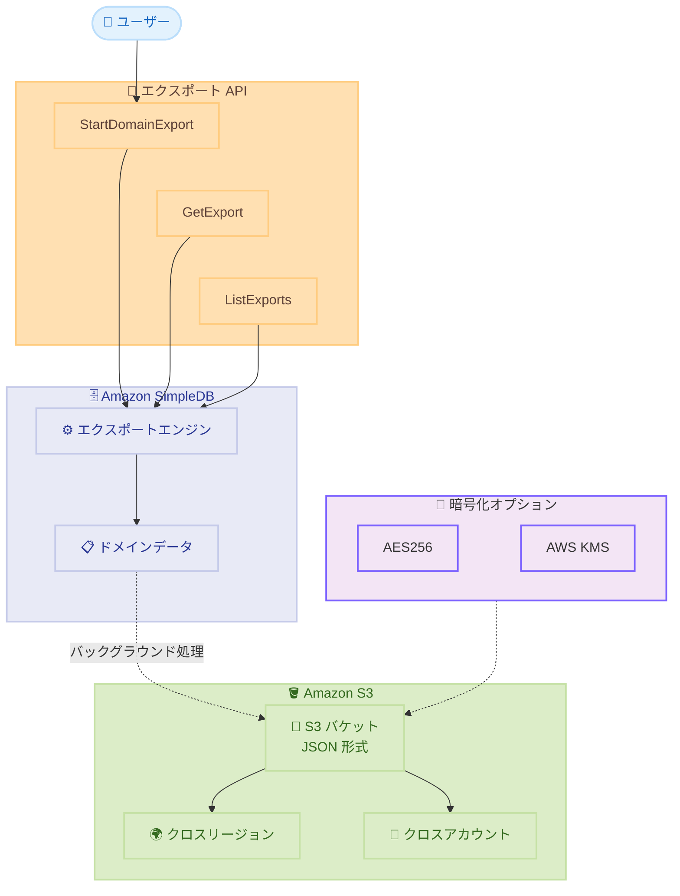

# Amazon SimpleDB - ドメインデータの Amazon S3 エクスポート機能

**リリース日**: 2026 年 03 月 16 日
**サービス**: Amazon SimpleDB
**機能**: Domain Export to Amazon S3

📊 [このアップデートのインフォグラフィックを見る](https://takech9203.github.io/aws-news-summary/20260316-amazon-simpledb-domain-export-to-amazon-s3.html)

## 概要

Amazon SimpleDB が、ドメインデータを Amazon S3 バケットに直接エクスポートする機能をサポート開始しました。エクスポートされたデータは標準 JSON 形式で出力され、バックグラウンドで実行されるためデータベースのパフォーマンスに影響を与えません。この機能により、データの移行、アーカイブ、コンプライアンス対応が大幅に簡素化されます。

エクスポートツールは、クロスリージョンおよびクロスアカウントサポート、複数の暗号化オプション、柔軟な S3 バケット設定などの機能を提供します。新たに 3 つの API (StartDomainExport、GetExport、ListExports) が追加され、SimpleDBv2 サービスとして利用可能です。このツールの使用自体は無料ですが、標準のデータ転送料金が適用されます。

**アップデート前の課題**

- SimpleDB のドメインデータを S3 にエクスポートするには、カスタムスクリプトを開発して手動でデータを抽出する必要があった
- 大量のデータを移行する際にデータベースのパフォーマンスに影響を与える可能性があった
- クロスリージョンやクロスアカウントへのデータ移行には複雑な設定が必要だった
- データのアーカイブやコンプライアンス対応のための標準的なエクスポート手段が提供されていなかった

**アップデート後の改善**

- ネイティブ API を使用してドメインデータを S3 に直接エクスポート可能
- バックグラウンドで実行されるため、データベースのパフォーマンスに影響なし
- クロスリージョン・クロスアカウントエクスポートが標準でサポート
- AES256 および KMS 暗号化オプションによるセキュアなエクスポートが可能
- 標準 JSON 形式での出力により、他のシステムへのデータ移行が容易

## アーキテクチャ図



この図は SimpleDB ドメインデータのエクスポートフローを示しています。ユーザーは StartDomainExport API を呼び出してエクスポートを開始し、データはバックグラウンドで S3 バケットに JSON 形式で出力されます。クロスリージョン・クロスアカウント転送や暗号化オプションがサポートされています。

## サービスアップデートの詳細

### 主要機能

1. **ドメインデータの S3 直接エクスポート**
   - ドメインデータを標準 JSON 形式で S3 バケットに直接エクスポート
   - バックグラウンドで実行されるため、データベースのパフォーマンスに影響なし
   - エクスポートのステータスは PENDING、IN_PROGRESS、SUCCEEDED、FAILED で追跡可能

2. **クロスリージョン・クロスアカウントサポート**
   - 異なるリージョンの S3 バケットへのエクスポートをサポート
   - `s3BucketOwner` パラメータにより、別の AWS アカウントの S3 バケットへのエクスポートが可能
   - 柔軟な S3 バケット設定 (バケット名、キープレフィックスの指定)

3. **複数の暗号化オプション**
   - AES256 (Amazon S3 マネージド暗号化) をサポート
   - AWS KMS キーによる暗号化をサポート (`s3SseKmsKeyId` で KMS キーを指定)
   - `s3SseAlgorithm` パラメータで暗号化方式を選択

4. **3 つの新しい API**
   - **StartDomainExport**: ドメインデータのエクスポートを開始
   - **GetExport**: エクスポートの詳細ステータスを取得 (アイテム数、マニフェスト、エラー情報など)
   - **ListExports**: ドメインごとのエクスポート一覧をページネーション付きで取得

## 技術仕様

### エクスポートパラメータ

| 項目 | 詳細 |
|------|------|
| 出力形式 | 標準 JSON 形式 |
| エクスポート実行方法 | バックグラウンド処理 |
| レート制限 | ドメインあたり 5 エクスポート / 24 時間 |
| アカウント制限 | アカウントあたり 25 エクスポート / 24 時間 |
| 暗号化オプション | AES256、KMS |
| クロスリージョン | サポート |
| クロスアカウント | サポート |

### API 変更履歴

| 日付 | サービス | 変更内容 |
|------|----------|----------|
| 2026/03/11 | [Amazon SimpleDB v2](https://awsapichanges.com/archive/changes/537c33-sdb.html) | 3 new api methods - StartDomainExport、GetExport、ListExports を追加 |

### StartDomainExport API

```python
client.start_domain_export(
    clientToken='string',
    domainName='string',
    s3Bucket='string',
    s3KeyPrefix='string',
    s3SseAlgorithm='AES256'|'KMS',
    s3SseKmsKeyId='string',
    s3BucketOwner='string'
)
```

**レスポンス**:

```python
{
    'clientToken': 'string',
    'exportArn': 'string',
    'requestedAt': datetime(2026, 1, 1)
}
```

### GetExport API

```python
client.get_export(
    exportArn='string'
)
```

**レスポンス**:

```python
{
    'exportArn': 'string',
    'clientToken': 'string',
    'exportStatus': 'PENDING'|'IN_PROGRESS'|'SUCCEEDED'|'FAILED',
    'domainName': 'string',
    'requestedAt': datetime(2026, 1, 1),
    's3Bucket': 'string',
    's3KeyPrefix': 'string',
    's3SseAlgorithm': 'AES256'|'KMS',
    's3SseKmsKeyId': 'string',
    's3BucketOwner': 'string',
    'failureCode': 'string',
    'failureMessage': 'string',
    'exportManifest': 'string',
    'itemsCount': 123,
    'exportDataCutoffTime': datetime(2026, 1, 1)
}
```

## 設定方法

### 前提条件

1. AWS CLI がインストールされ、設定されていること
2. SimpleDB ドメインが存在すること
3. エクスポート先の S3 バケットが作成されていること
4. 必要な IAM 権限が付与されていること (SimpleDB エクスポート API および S3 への書き込み権限)

### 手順

#### ステップ 1: ドメインデータのエクスポートを開始

```bash
aws sdb start-domain-export \
    --domain-name my-domain \
    --s3-bucket my-export-bucket \
    --s3-key-prefix exports/my-domain/ \
    --s3-sse-algorithm AES256 \
    --client-token unique-token-001
```

このコマンドは、指定した SimpleDB ドメインのデータを S3 バケットにエクスポートするジョブを開始します。`clientToken` は冪等性を保証するためのトークンです。レスポンスで返される `exportArn` を使用して、エクスポートの進捗を確認できます。

#### ステップ 2: エクスポートの進捗を確認

```bash
aws sdb get-export \
    --export-arn arn:aws:sdb:us-east-1:123456789012:export/my-domain/export-id
```

このコマンドは、エクスポートの現在のステータス、エクスポートされたアイテム数、エラー情報などの詳細を取得します。`exportStatus` が `SUCCEEDED` になればエクスポートが完了しています。

#### ステップ 3: エクスポート一覧を確認

```bash
aws sdb list-exports \
    --domain-name my-domain \
    --max-results 10
```

このコマンドは、指定したドメインのエクスポート一覧を取得します。各エクスポートのステータスとリクエスト日時を確認できます。

#### ステップ 4: KMS 暗号化を使用したクロスアカウントエクスポート

```bash
aws sdb start-domain-export \
    --domain-name my-domain \
    --s3-bucket partner-account-bucket \
    --s3-key-prefix shared-data/my-domain/ \
    --s3-sse-algorithm KMS \
    --s3-sse-kms-key-id arn:aws:kms:us-east-1:987654321098:key/01234567-89ab-cdef-0123-456789abcdef \
    --s3-bucket-owner 987654321098 \
    --client-token unique-token-002
```

このコマンドは、別の AWS アカウントの S3 バケットに KMS 暗号化を使用してドメインデータをエクスポートします。`s3BucketOwner` で宛先アカウント ID を指定し、`s3SseKmsKeyId` で暗号化に使用する KMS キーの ARN を指定します。

## メリット

### ビジネス面

- **データ移行の簡素化**: カスタムスクリプトを開発する必要がなくなり、ネイティブ API でデータ移行が可能
- **コンプライアンス対応**: データアーカイブ要件や長期保存要件を標準機能で実現
- **コスト削減**: エクスポートツールの使用自体は無料で、標準のデータ転送料金のみが発生

### 技術面

- **パフォーマンスへの影響なし**: バックグラウンドで実行されるため、データベースのパフォーマンスに影響を与えない
- **セキュリティ**: AES256 および KMS 暗号化オプションにより、エクスポートデータのセキュリティを確保
- **柔軟性**: クロスリージョン・クロスアカウントサポートにより、様々なアーキテクチャに対応可能
- **冪等性**: `clientToken` により、同一リクエストの重複実行を防止

## デメリット・制約事項

### 制限事項

- ドメインあたり 24 時間以内に 5 エクスポートまでのレート制限がある
- アカウントあたり 24 時間以内に 25 エクスポートまでのレート制限がある
- エクスポート形式は JSON のみで、CSV や Parquet などの他の形式は選択できない
- エクスポートはバックグラウンドで実行されるため、リアルタイムのデータ同期には適さない

### 考慮すべき点

- クロスアカウントエクスポートを使用する場合、宛先 S3 バケットに適切なバケットポリシーを設定する必要がある
- KMS 暗号化を使用する場合、エクスポート元のアカウントから KMS キーへのアクセス権限が必要
- エクスポートツール自体は無料だが、データ転送料金 (特にクロスリージョン転送) に注意が必要
- `exportDataCutoffTime` により、エクスポートのデータカットオフタイムが決定されるため、エクスポート中のデータ変更に注意が必要

## ユースケース

### ユースケース 1: データの長期アーカイブ

**シナリオ**: SimpleDB に保存されている過去のトランザクションデータを、コンプライアンス要件に基づいて S3 Glacier にアーカイブする必要がある。

**実装例**:
```bash
# ドメインデータを S3 にエクスポート
aws sdb start-domain-export \
    --domain-name transaction-history \
    --s3-bucket archive-bucket \
    --s3-key-prefix archive/transactions/2025/ \
    --s3-sse-algorithm KMS \
    --s3-sse-kms-key-id arn:aws:kms:us-east-1:123456789012:key/archive-key \
    --client-token archive-2025-001

# エクスポート完了後、S3 ライフサイクルポリシーで Glacier に移行
```

**効果**: SimpleDB のドメインデータをネイティブ API で S3 にエクスポートし、S3 ライフサイクルポリシーと組み合わせることで、コスト効率の高い長期アーカイブを実現できる。

### ユースケース 2: 他のデータベースサービスへの移行

**シナリオ**: SimpleDB に保存されているデータを DynamoDB や RDS などの他の AWS データベースサービスに移行するため、まず S3 にエクスポートする。

**実装例**:
```bash
# SimpleDB のドメインデータを S3 にエクスポート
aws sdb start-domain-export \
    --domain-name user-profiles \
    --s3-bucket migration-bucket \
    --s3-key-prefix migration/user-profiles/ \
    --s3-sse-algorithm AES256 \
    --client-token migration-001

# エクスポート完了後、AWS Glue や Lambda を使用して DynamoDB にインポート
```

**効果**: JSON 形式でエクスポートされるため、AWS Glue や Lambda を使用した変換処理と他のデータベースへのインポートが容易になる。

### ユースケース 3: クロスアカウントでのデータ共有

**シナリオ**: 開発アカウントの SimpleDB データを、本番アカウントの S3 バケットに直接エクスポートして、データ分析チームがアクセスできるようにする。

**実装例**:
```bash
# 開発アカウントから本番アカウントの S3 バケットにエクスポート
aws sdb start-domain-export \
    --domain-name analytics-data \
    --s3-bucket prod-analytics-bucket \
    --s3-key-prefix shared/dev-data/ \
    --s3-sse-algorithm KMS \
    --s3-sse-kms-key-id arn:aws:kms:us-east-1:987654321098:key/shared-analytics-key \
    --s3-bucket-owner 987654321098 \
    --client-token cross-account-001
```

**効果**: 中間ステップなしで、直接クロスアカウントの S3 バケットにデータをエクスポートでき、データ共有のワークフローが大幅に簡素化される。

## 料金

エクスポートツールの使用自体は無料です。ただし、以下の標準料金が適用されます。

### 料金体系

- **データ転送料金**: クロスリージョンエクスポートの場合、標準のデータ転送料金が適用
- **S3 ストレージ料金**: エクスポートされた JSON データの S3 ストレージ料金が適用
- **KMS 料金**: KMS 暗号化を使用する場合、KMS API リクエスト料金が適用

### 料金例

| 使用量 | 月額料金 (概算) |
|--------|------------------|
| 同一リージョン 10 GB エクスポート | S3 ストレージ料金のみ (約 $0.23) |
| クロスリージョン 10 GB エクスポート | データ転送料金 (約 $0.20) + S3 ストレージ料金 |

## 利用可能リージョン

この機能は、Amazon SimpleDB が利用可能な全てのリージョンで利用できます。

## 関連サービス・機能

- **Amazon S3**: エクスポートデータの保存先として使用
- **AWS KMS**: エクスポートデータの暗号化に使用
- **Amazon DynamoDB**: SimpleDB からのデータ移行先として一般的な選択肢
- **AWS Glue**: エクスポートされた JSON データの変換・ETL 処理に使用
- **Amazon Athena**: S3 にエクスポートされた JSON データの直接クエリに使用

## 参考リンク

- 📊 [インフォグラフィック](https://takech9203.github.io/aws-news-summary/20260316-amazon-simpledb-domain-export-to-amazon-s3.html)
- [公式発表 (What's New)](https://aws.amazon.com/about-aws/whats-new/2026/03/amazon-simpledb-domain-export-to-amazon-s3/)
- [API 変更履歴](https://awsapichanges.com/archive/changes/537c33-sdb.html)

## まとめ

Amazon SimpleDB のドメインデータ S3 エクスポート機能は、データの移行、アーカイブ、共有を大幅に簡素化する重要なアップデートです。バックグラウンドで実行されるため、データベースのパフォーマンスに影響を与えることなく、クロスリージョン・クロスアカウントサポートや複数の暗号化オプションにより、様々なユースケースに対応できます。SimpleDB のデータ移行やアーカイブを検討している場合は、この新機能の活用を推奨します。
