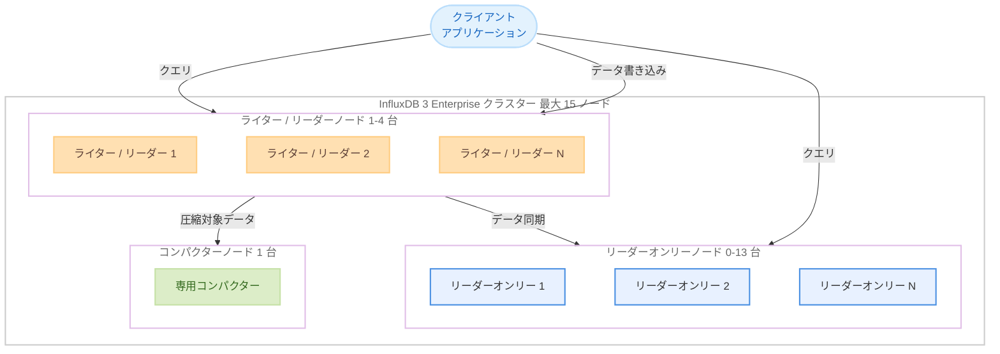

# Amazon Timestream for InfluxDB - InfluxDB 3 マルチノードクラスター構成の拡張

**リリース日**: 2026 年 3 月 16 日
**サービス**: Amazon Timestream for InfluxDB
**機能**: InfluxDB 3 Enterprise エディションにおけるマルチノードクラスター構成の拡張

[このアップデートのインフォグラフィックを見る](https://takech9203.github.io/aws-news-summary/20260316-amazon-timestream-for-influxdb-3-multi-node-cluster.html)

## 概要

Amazon Timestream for InfluxDB が、InfluxDB 3 Enterprise エディションにおけるマルチノードクラスター構成の拡張をサポートした。これにより、最大 15 ノードまでクラスターをスケールアップでき、高い読み取りスループットと高可用性を必要とする本番ワークロードに対応できるようになった。

今回のアップデートでは、1 から 4 台のライター / リーダーノード、0 から 13 台の専用リーダーオンリーノード、および 1 台の専用コンパクターノードで構成されるクラスターを設定できる。これにより、データ取り込みとクエリ処理、クエリパフォーマンスのスケーリング、データ圧縮をそれぞれ最適化でき、特定のワークロードパターンに合わせた柔軟な構成が可能となった。また、Core エディションから Enterprise エディションへのアップグレードも可能である。

**アップデート前の課題**

- マルチノードクラスターのノード数に制限があり、大規模な本番ワークロードへの対応が困難だった
- 読み取りスループットのスケーリングに限界があり、クエリパフォーマンスの向上が難しかった
- ワークロードパターンに応じたノード構成の最適化が制限されていた

**アップデート後の改善**

- 最大 15 ノードまでクラスターをスケールアップできるようになった
- ライター / リーダーノードとリーダーオンリーノードを分離して、ワークロードに最適化された構成が可能になった
- Core エディションから Enterprise エディションへのアップグレードパスが提供され、段階的なスケールアップが可能になった

## アーキテクチャ図



この図は、InfluxDB 3 Enterprise クラスターのノード構成を示している。クライアントからの書き込みはライター / リーダーノードが処理し、読み取りクエリはライター / リーダーノードとリーダーオンリーノードの両方で処理できる。

## サービスアップデートの詳細

### 主要機能

1. **最大 15 ノードへのクラスタースケーリング**
   - 従来の制限を超え、最大 15 ノードまでクラスターを構成できる
   - 高い読み取りスループットと高可用性を必要とする本番ワークロードに対応
   - ノード数の拡張により、処理能力を柔軟にスケールアップ可能

2. **ノードロールの分離による最適化**
   - ライター / リーダーノード: 1 から 4 台で、データ取り込みとクエリ処理を担当
   - リーダーオンリーノード: 0 から 13 台で、クエリパフォーマンスのスケーリングに特化
   - 専用コンパクターノード: 1 台で、データ圧縮処理を専用に実行

3. **Core から Enterprise へのアップグレード**
   - Core エディションから Enterprise エディションへのインプレースアップグレードが可能
   - ワークロードの成長に応じて段階的にスケールアップできる
   - 既存のデータを維持したまま上位エディションに移行可能

## 技術仕様

### クラスター構成の詳細

| ノードタイプ | 台数 | 役割 |
|-------------|------|------|
| ライター / リーダーノード | 1-4 台 | データ取り込みとクエリ処理 |
| リーダーオンリーノード | 0-13 台 | 読み取りクエリの処理に特化 |
| コンパクターノード | 1 台 | データ圧縮処理を専用で実行 |
| 合計最大ノード数 | 15 台 | - |

### エディション比較

| 項目 | Core エディション | Enterprise エディション |
|------|-------------------|------------------------|
| クラスター構成 | シングルノード | マルチノード 最大 15 台 |
| 高可用性 | 限定的 | ノード冗長化による高可用性 |
| 読み取りスケーリング | 単一ノードの性能に依存 | リーダーオンリーノードによる水平スケーリング |
| アップグレードパス | - | Core からアップグレード可能 |

### API 変更履歴

直近 7 日間で Timestream に関連する API 変更は確認されなかった。

## 設定方法

### 前提条件

1. AWS アカウントを持ち、Amazon Timestream for InfluxDB へのアクセス権限があること
2. InfluxDB 3 Enterprise エディションのクラスターを使用すること
3. 必要なノード数に応じた AWS サービスクォータが確保されていること

### 手順

#### ステップ 1: 既存クラスターの確認

```bash
aws timestream-influxdb list-db-instances \
  --query "items[*].{Name:name,Status:status,DbInstanceType:dbInstanceType}"
```

現在のクラスター構成と各ノードの状態を確認するコマンド。Enterprise エディションのインスタンスであることを確認する。

#### ステップ 2: クラスターノードの追加

```bash
aws timestream-influxdb update-db-instance \
  --db-instance-identifier my-influxdb-cluster \
  --db-instance-type db.influx.xlarge \
  --deployment-type MULTI_NODE_READ_REPLICAS
```

クラスターにリーダーオンリーノードを追加してクエリパフォーマンスをスケールアウトするコマンド。ノード数やインスタンスタイプは要件に応じて変更する。

#### ステップ 3: Core から Enterprise へのアップグレード

```bash
aws timestream-influxdb update-db-instance \
  --db-instance-identifier my-influxdb-core \
  --deployment-type MULTI_NODE_READ_REPLICAS
```

Core エディションから Enterprise エディションへアップグレードするコマンド。既存のデータを維持したまま、マルチノードクラスター構成に移行できる。

## メリット

### ビジネス面

- **本番ワークロードへの対応力向上**: 最大 15 ノードまでスケールアップすることで、大規模な時系列データ処理の要件に対応できる
- **段階的なスケーリング**: Core エディションから開始し、ワークロードの成長に合わせて Enterprise エディションにアップグレードすることで、初期コストを抑えた運用が可能
- **運用効率の向上**: ノードロールの分離により、書き込みと読み取りのリソースを独立して最適化でき、コスト効率の高い運用が可能

### 技術面

- **読み取りスループットの水平スケーリング**: リーダーオンリーノードを最大 13 台まで追加することで、クエリパフォーマンスを大幅に向上させられる
- **高可用性の実現**: 複数のライター / リーダーノードにより、ノード障害時のフェイルオーバーが可能
- **ワークロードの分離**: データ取り込み、クエリ処理、データ圧縮をそれぞれ専用ノードに分離することで、相互の影響を最小化できる

## デメリット・制約事項

### 制限事項

- Enterprise エディションのみでマルチノード構成が利用可能であり、Core エディションではシングルノード構成に限定される
- ノード数の増加に伴いインフラストラクチャコストが増加する
- クラスター全体のノード数は最大 15 台に制限される

### 考慮すべき点

- ワークロードパターンを事前に分析し、適切なライター / リーダーノードとリーダーオンリーノードの比率を検討する必要がある
- Core エディションから Enterprise エディションへのアップグレード時にはダウンタイムが発生する可能性があるため、計画的な移行を推奨する

## ユースケース

### ユースケース 1: IoT デバイスモニタリング基盤

**シナリオ**: 数万台の IoT デバイスからの時系列データを収集しつつ、複数のダッシュボードからのリアルタイムクエリに対応する必要がある場合。

**実装例**:
```
クラスター構成:
- ライター / リーダーノード: 4 台 (高頻度データ取り込み)
- リーダーオンリーノード: 10 台 (複数ダッシュボード対応)
- コンパクターノード: 1 台
合計: 15 ノード
```

**効果**: データ取り込みとクエリ処理を分離することで、大量のデバイスデータの書き込みがダッシュボードのクエリパフォーマンスに影響を与えることなく、安定した監視基盤を実現できる。

### ユースケース 2: アプリケーションパフォーマンスモニタリング

**シナリオ**: マイクロサービスアーキテクチャのアプリケーションにおいて、メトリクスの収集とアラート用クエリを同時に処理する必要がある場合。

**実装例**:
```
クラスター構成:
- ライター / リーダーノード: 2 台 (メトリクス取り込みとアラートクエリ)
- リーダーオンリーノード: 5 台 (分析クエリとダッシュボード)
- コンパクターノード: 1 台
合計: 8 ノード
```

**効果**: アラート用の低レイテンシクエリと分析用の重いクエリを異なるノードで処理でき、アラートの遅延なく詳細な分析も実行できる。

### ユースケース 3: Core エディションからの段階的移行

**シナリオ**: 現在 Core エディションで運用しているが、データ量の増加に伴い読み取りパフォーマンスが低下してきたため、Enterprise エディションへの移行を検討している場合。

**実装例**:
```bash
# Phase 1: Core から Enterprise にアップグレード
aws timestream-influxdb update-db-instance \
  --db-instance-identifier my-influxdb-instance \
  --deployment-type MULTI_NODE_READ_REPLICAS

# Phase 2: リーダーオンリーノードを段階的に追加
# ワークロードの状況を監視しながら必要に応じてノードを追加
```

**効果**: 既存のデータを維持したまま Enterprise エディションに移行し、段階的にノードを追加することで、コストを抑えながらパフォーマンスを向上させられる。

## 料金

Amazon Timestream for InfluxDB の料金は、選択したインスタンスタイプとノード数に基づいて課金される。Enterprise エディションのマルチノード構成では、各ノードのインスタンス料金に加えてストレージ料金が発生する。ノード数の増加に応じて料金が比例して増加するため、ワークロードに適したノード数の選定が重要である。詳細な料金については AWS 料金ページを参照すること。

## 利用可能リージョン

Timestream for InfluxDB が利用可能なすべての AWS リージョンで利用可能。

## 関連サービス・機能

- **Amazon Timestream for InfluxDB Core エディション**: シングルノード構成の InfluxDB 3 サービス。小規模なワークロードに適しており、Enterprise エディションへのアップグレードが可能
- **Amazon Timestream for LiveAnalytics**: AWS のサーバーレス時系列データベースサービス。InfluxDB 互換ではなく、独自の SQL ライクなクエリインターフェースを提供
- **Amazon Managed Service for Prometheus**: メトリクス収集と監視に特化したマネージドサービス。時系列データの収集と可視化において Timestream for InfluxDB と補完的に利用可能

## 参考リンク

- [インフォグラフィック](https://takech9203.github.io/aws-news-summary/20260316-amazon-timestream-for-influxdb-3-multi-node-cluster.html)
- [公式発表 (What's New)](https://aws.amazon.com/about-aws/whats-new/2026/03/amazon-timestream-for-influxdb-3-multi-node-cluster/)
- [ドキュメント](https://docs.aws.amazon.com/timestream/latest/developerguide/timestream-influxdb.html)
- [料金ページ](https://aws.amazon.com/timestream/pricing/)

## まとめ

Amazon Timestream for InfluxDB が InfluxDB 3 Enterprise エディションで最大 15 ノードのマルチノードクラスター構成をサポートした。ライター / リーダーノード、リーダーオンリーノード、コンパクターノードのロール分離により、ワークロードに最適化されたクラスター構成が可能である。大規模な時系列データ処理を行っているお客様は、読み取りスループットと高可用性の要件に応じてクラスター構成を見直し、Enterprise エディションへのアップグレードを検討することを推奨する。
