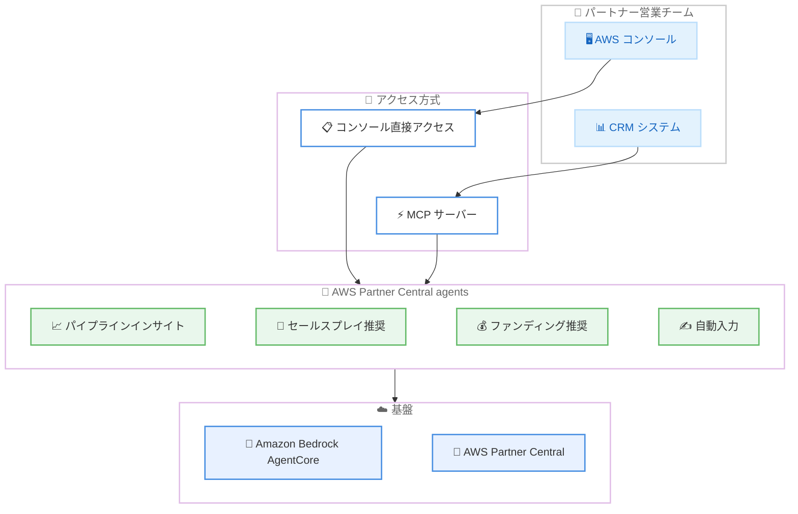

# AWS Partner Central - AI エージェントによる共同販売の加速

**リリース日**: 2026 年 3 月 16 日
**サービス**: AWS Partner Central
**機能**: AWS Partner Central agents

📊 [このアップデートのインフォグラフィックを見る](https://takech9203.github.io/aws-news-summary/20260316-aws-partner-central-agents-accelerate-co-sell.html)

## 概要

AWS は AWS Partner Central agents の一般提供開始を発表した。これは Amazon Bedrock AgentCore 上に構築された AI 搭載の新機能であり、AWS パートナーの共同販売 (co-sell) を加速するために設計されている。パートナーの営業チームと連携して販売サイクルの短縮とファンディングアクセスの簡素化を実現する。

AWS パートナーはこれらのエージェント機能をコンソールから直接利用するか、Model Context Protocol (MCP) を通じてプログラマティックに利用できる。MCP 連携により、パートナーの営業チームは自社の顧客関係管理 (CRM) システムからエージェントにアクセスすることが可能となる。パイプラインインサイト、カスタマイズされたセールスプレイ、次のステップの推奨をオンデマンドで取得でき、営業チームがどこに注力すべきか、次に何をすべきかを把握できるようになる。

**アップデート前の課題**

- パートナーの営業チームが AWS との共同販売案件を管理する際、手動でのデータ入力や案件情報の更新に多くの時間を費やしていた
- ファンディングの適格性確認や申請書の作成を手作業で行う必要があり、利用可能な資金を迅速に獲得することが困難だった
- パイプラインの分析やセールス戦略の立案を個別に行う必要があり、営業活動に集中する時間が限られていた

**アップデート後の改善**

- 会議のトランスクリプト、メモ、メールをエージェントに共有するだけで、フィールドの自動入力と案件の進行が可能になった
- エージェントが案件レベルでファンディングを推奨し、適格性のギャップを指摘し、事前入力済みのファンド申請を作成するようになった
- MCP を通じて既存の CRM システムからエージェントにアクセスでき、営業ワークフローを中断せずに AI 機能を活用できるようになった

## アーキテクチャ図



パートナー営業チームが AWS コンソールまたは CRM システムから MCP 経由で AWS Partner Central agents にアクセスし、Amazon Bedrock AgentCore を基盤とした AI エージェントがパイプラインインサイト、セールスプレイ推奨、ファンディング推奨、自動入力の各機能を提供する全体像を示している。

## サービスアップデートの詳細

### 主要機能

1. **パイプラインインサイトと次のステップ推奨**
   - パートナーの営業チームにパイプラインの状況を可視化したインサイトを提供
   - カスタマイズされたセールスプレイと次のステップの推奨をオンデマンドで取得可能
   - どの案件に注力すべきか、次に何をすべきかを AI が分析して提示

2. **営業データの自動入力と案件進行**
   - 会議のトランスクリプト、メモ、メールをエージェントに共有可能
   - エージェントが内容を解析してフィールドを自動入力し、案件を進行
   - 営業チームがデータ入力ではなく販売活動に集中できる環境を提供

3. **ファンディング推奨と申請支援**
   - 案件レベルでのファンディング推奨を提供
   - 適格性のギャップを特定して通知
   - 事前入力済みのファンド申請書を自動作成し、利用可能な資金の迅速な獲得を支援

4. **MCP によるプログラマティックアクセス**
   - Model Context Protocol (MCP) を通じた API アクセスを提供
   - パートナーの CRM システムからエージェント機能に直接アクセス可能
   - 既存の営業ワークフローを中断せずに AI 機能を活用

## 技術仕様

### 基盤技術

| 項目 | 詳細 |
|------|------|
| AI 基盤 | Amazon Bedrock AgentCore |
| アクセス方式 | AWS コンソール (直接)、MCP (プログラマティック) |
| 統合プロトコル | Model Context Protocol (MCP) |
| 対象プラットフォーム | AWS Partner Central |
| CRM 連携 | MCP サーバー経由で任意の CRM システムと統合可能 |

### エージェント機能一覧

| 機能 | 説明 |
|------|------|
| パイプラインインサイト | 案件パイプラインの分析と可視化 |
| セールスプレイ推奨 | カスタマイズされた営業戦略の提案 |
| 次のステップ推奨 | 案件ごとの最適な次のアクションの提示 |
| 自動入力 | トランスクリプト等からのフィールド自動入力 |
| ファンディング推奨 | 案件レベルでの資金プログラム推奨 |
| 適格性分析 | ファンディング適格性のギャップ特定 |
| ファンド申請作成 | 事前入力済みのファンド申請書の自動生成 |

## 設定方法

### 前提条件

1. AWS パートナーとして登録済みであること
2. AWS Partner Central へのアクセス権限があること
3. CRM 連携を行う場合は MCP サーバーガイドを参照済みであること

### 手順

#### ステップ 1: エージェントガイドの確認

AWS Partner Central agents の利用を開始する前に、エージェントガイドを確認し、機能と利用方法を把握する。

#### ステップ 2: コンソールからのエージェント利用

AWS コンソールで AWS Partner Central にアクセスし、Opportunities セクションからエージェント機能を利用開始する。パイプラインインサイトの確認やセールスプレイの取得が可能となる。

#### ステップ 3: CRM システムとの MCP 連携

自社の CRM システムからエージェントにアクセスする場合は、Partner Central agents MCP サーバーガイドに従って MCP 連携を設定する。営業チームが CRM から直接エージェント機能を利用できるようになる。

## メリット

### ビジネス面

- **販売サイクルの短縮**: AI エージェントがパイプラインインサイトと次のステップ推奨を提供することで、案件の進行速度を向上
- **ファンディング獲得の迅速化**: 適格性の自動分析と事前入力済み申請書の生成により、利用可能な資金を迅速に獲得
- **営業チームの生産性向上**: データ入力の自動化により、営業チームが販売活動に集中できる時間を拡大

### 技術面

- **MCP による柔軟な統合**: Model Context Protocol を通じて既存の CRM システムとシームレスに統合可能
- **Amazon Bedrock AgentCore 基盤**: エンタープライズグレードの AI 基盤上に構築されており、信頼性とスケーラビリティを確保
- **マルチアクセス方式**: コンソール直接アクセスと MCP プログラマティックアクセスの両方をサポートし、利用シーンに応じた柔軟な選択が可能

## デメリット・制約事項

### 制限事項

- AWS パートナーとして登録済みのユーザーのみが利用可能
- エージェントが提供する推奨事項は AI による分析結果であり、最終的な営業判断は人間が行う必要がある
- CRM 連携には MCP サーバーの設定が必要であり、初期導入に一定の技術的作業が発生する

### 考慮すべき点

- 会議のトランスクリプトやメールなど、機密性の高いデータをエージェントに共有する際のデータガバナンスポリシーの確認が必要
- エージェントの推奨精度は入力データの質と量に依存するため、継続的なデータ入力が重要

## ユースケース

### ユースケース 1: 案件パイプラインの最適化

**シナリオ**: パートナーの営業マネージャーが複数の共同販売案件を管理しており、どの案件に優先的にリソースを割り当てるべきか判断が必要な場合

**実装例**:
```
AWS Partner Central コンソール > Opportunities > エージェントにパイプライン分析を依頼
エージェントがパイプラインインサイトを提供し、優先度の高い案件とその理由を提示
```

**効果**: データに基づいた案件優先度の判断が可能になり、営業リソースの最適配分を実現

### ユースケース 2: 営業活動のデータ入力自動化

**シナリオ**: 営業担当者が顧客との会議後、会議内容を Partner Central に記録する必要がある場合

**実装例**:
```
会議のトランスクリプトまたはメモをエージェントに共有
エージェントが内容を解析し、案件の各フィールドを自動入力
営業担当者は内容を確認して承認するだけで案件が進行
```

**効果**: データ入力の作業時間を大幅に削減し、営業担当者が次の顧客対応に集中できる環境を実現

### ユースケース 3: ファンディングプログラムの活用最大化

**シナリオ**: パートナーが AWS のファンディングプログラムを活用したいが、適格性の確認や申請書の作成に時間がかかっている場合

**実装例**:
```
エージェントが案件レベルで利用可能なファンディングプログラムを自動推奨
適格性のギャップがある場合はその内容と解消方法を提示
事前入力済みのファンド申請書を自動生成し、パートナーは確認と送信のみで完了
```

**効果**: ファンディングの機会損失を防止し、利用可能な資金を最大限に活用

## 料金

AWS Partner Central agents の利用に関する追加料金は発表時点では明示されていない。AWS Partner Central は AWS パートナー向けのプラットフォームとして提供されており、エージェント機能の料金詳細については AWS の公式ドキュメントまたはパートナーチームに確認することを推奨する。

## 利用可能リージョン

AWS Partner Central agents は全てのコマーシャル AWS リージョンで利用可能である。

## 関連サービス・機能

- **Amazon Bedrock AgentCore**: AWS Partner Central agents の AI 基盤として使用されているエージェント構築フレームワーク
- **AWS Partner Central**: AWS パートナー向けの共同販売管理プラットフォームで、今回のエージェント機能が統合された対象サービス
- **Model Context Protocol (MCP)**: エージェントとの プログラマティックなやり取りを実現するオープンプロトコルで、CRM 連携を可能にする
- **AWS Marketplace**: AWS パートナーが自社ソリューションを販売するマーケットプレイスで、共同販売と連携する関連サービス

## 参考リンク

- 📊 [インフォグラフィック](https://takech9203.github.io/aws-news-summary/20260316-aws-partner-central-agents-accelerate-co-sell.html)
- [公式発表 (What's New)](https://aws.amazon.com/about-aws/whats-new/2026/03/aws-partner-central-agents-accelerate-co-sell/)
- [AWS Partner Central ドキュメント](https://docs.aws.amazon.com/partner-central/latest/getting-started/what-is-partner-central.html)
- [Amazon Bedrock AgentCore ドキュメント](https://docs.aws.amazon.com/bedrock/latest/userguide/agentcore.html)

## まとめ

AWS Partner Central agents は、Amazon Bedrock AgentCore を基盤とした AI エージェントにより、パートナーの共同販売プロセスを大幅に効率化する新機能である。パイプラインインサイト、営業データの自動入力、ファンディング推奨など包括的な支援を提供し、MCP を通じた CRM 連携により既存の営業ワークフローへのシームレスな統合が可能となる。AWS パートナーは AWS Partner Central コンソールからエージェント機能の利用を開始し、CRM 連携を検討する場合は MCP サーバーガイドを参照することを推奨する。
