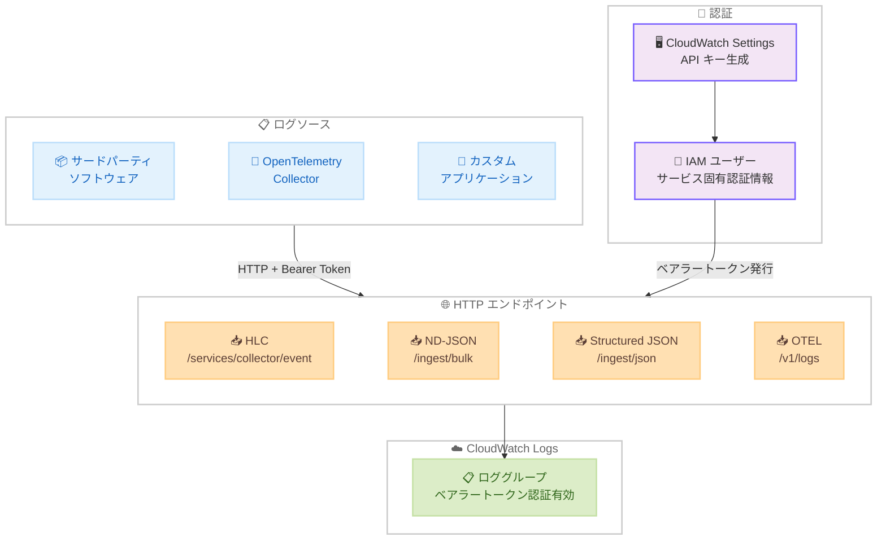

# Amazon CloudWatch Logs - HTTP ベースプロトコルによるログ取り込みサポート

**リリース日**: 2026年3月16日
**サービス**: Amazon CloudWatch Logs
**機能**: HTTP Log Collector (HLC)、ND-JSON、Structured JSON、OpenTelemetry ログエンドポイント

:bar_chart: [このアップデートのインフォグラフィックを見る](https://takech9203.github.io/aws-news-summary/20260316-cloudwatch-http-log-collector.html)

## 概要

Amazon CloudWatch Logs が HTTP ベースプロトコルによるログ取り込みをサポートしました。新たに HTTP Log Collector (HLC)、ND-JSON、Structured JSON、OpenTelemetry (OTEL) の 4 つのエンドポイントが追加され、ベアラートークン認証を使用してログを送信できるようになります。

この機能により、AWS SDK の統合が困難なサードパーティソフトウェアやパッケージソフトウェアからも、標準的な HTTP リクエストで CloudWatch Logs にログを取り込めるようになります。API キーは AWS コンソールの CloudWatch Settings から生成でき、有効期限を 1、5、30、90、365 日から選択して設定できます。

**アップデート前の課題**

- AWS SDK や CloudWatch エージェントの統合が困難なサードパーティソフトウェアからのログ取り込みが難しかった
- パッケージソフトウェアのログを CloudWatch Logs に送信するには、中間的なログ転送レイヤーが必要だった
- OpenTelemetry 形式のログを直接 CloudWatch Logs に送信する標準的な手段がなかった

**アップデート後の改善**

- HTTP ベースの標準プロトコルにより、SDK 統合なしでログを直接送信可能になった
- HLC、ND-JSON、Structured JSON、OTEL の 4 つの形式に対応し、様々なログソースに対応可能になった
- ベアラートークン認証により、AWS 署名 v4 を使わずにシンプルにログを送信できるようになった

## アーキテクチャ図



各種ログソースから HTTP ベースのエンドポイントを経由して CloudWatch Logs にログを取り込む全体的なデータフローを示しています。API キーによるベアラートークン認証を通じて、AWS SDK を使用せずにログを送信できます。

## サービスアップデートの詳細

### 主要機能

1. **HTTP Log Collector (HLC) エンドポイント**
   - エンドポイント: `https://logs.<region>.amazonaws.com/services/collector/event`
   - JSON イベント形式でのログ送信に対応
   - 既存のログパイプラインからの移行に最適

2. **ND-JSON エンドポイント**
   - エンドポイント: `https://logs.<region>.amazonaws.com/ingest/bulk`
   - 改行区切り JSON 形式で、各行が独立したログイベント
   - 大量ログのストリーミングやバルク取り込みに最適

3. **Structured JSON エンドポイント**
   - エンドポイント: `https://logs.<region>.amazonaws.com/ingest/json`
   - 単一の JSON オブジェクトまたは JSON 配列での送信に対応
   - 構造化されたログデータの送信に適している

4. **OpenTelemetry ログエンドポイント**
   - エンドポイント: `https://logs.<region>.amazonaws.com/v1/logs`
   - OTLP 形式のログを JSON または Protobuf エンコーディングで送信
   - OpenTelemetry エコシステムとのネイティブ統合を実現

## 技術仕様

### エンドポイント一覧

| エンドポイント | パス | 形式 | 用途 |
|---------------|------|------|------|
| HLC | `/services/collector/event` | JSON | 既存パイプライン移行 |
| ND-JSON | `/ingest/bulk` | 改行区切り JSON | 大量ログのバルク取り込み |
| Structured JSON | `/ingest/json` | JSON オブジェクト/配列 | 構造化ログ |
| OpenTelemetry | `/v1/logs` | OTLP JSON/Protobuf | OTEL 統合 |

### API キー設定

| 項目 | 詳細 |
|------|------|
| 認証方式 | ベアラートークン |
| API キー生成 | AWS コンソール CloudWatch Settings |
| 有効期限 | 1、5、30、90、365 日 |
| IAM ユーザー | CloudWatch が自動作成 (サービス固有認証情報) |
| ロググループ設定 | ベアラートークン認証の有効化が必要 |
| セキュリティ制御 | サービスコントロールポリシーでサービス固有認証情報の作成をブロック可能 |

### API 変更履歴

直近 7 日間において、awsapichanges.com で [CloudWatch Logs](https://awsapichanges.com/archive/changes/search/?q=CloudWatch+Logs) に関連する API 変更は確認されませんでした。HTTP ベースのエンドポイントは既存の CloudWatch Logs API とは独立したインターフェースとして提供されているため、SDK レベルの API 変更を伴わない可能性があります。

### 認証フロー

```bash
# ベアラートークンを使用した HLC エンドポイントへのログ送信例
curl -X POST "https://logs.us-east-1.amazonaws.com/services/collector/event" \
  -H "Authorization: Bearer <API_KEY>" \
  -H "Content-Type: application/json" \
  -d '{
    "logGroup": "/my/log-group",
    "logEvents": [
      {
        "timestamp": 1710590400000,
        "message": "Application started successfully"
      }
    ]
  }'
```

## 設定方法

### 前提条件

1. AWS アカウントと CloudWatch Logs へのアクセス権限
2. サポート対象リージョンでの利用
3. ログを送信するロググループが作成済みであること

### 手順

#### ステップ 1: API キーの生成

AWS コンソールで CloudWatch Settings に移動し、API キーを生成します。

1. AWS マネジメントコンソールで CloudWatch を開く
2. 左メニューから Settings を選択
3. API キー生成セクションで有効期限 (1、5、30、90、365 日) を選択
4. API キーを生成

CloudWatch が必要な IAM ユーザーとサービス固有の認証情報を自動的に作成します。

#### ステップ 2: ロググループでベアラートークン認証を有効化

```bash
# ロググループの作成 (未作成の場合)
aws logs create-log-group --log-group-name /my/app-logs

# ベアラートークン認証の有効化
# AWS コンソールでロググループの設定からベアラートークン認証を有効にする
```

ログを受信する各ロググループで、ベアラートークン認証を有効にする必要があります。これにより、意図しないログ取り込みを防止できます。

#### ステップ 3: ログの送信

```bash
# ND-JSON 形式でのログ送信例
curl -X POST "https://logs.us-east-1.amazonaws.com/ingest/bulk" \
  -H "Authorization: Bearer <API_KEY>" \
  -H "Content-Type: application/x-ndjson" \
  -d '{"logGroup":"/my/app-logs","message":"First log event","timestamp":1710590400000}
{"logGroup":"/my/app-logs","message":"Second log event","timestamp":1710590401000}'
```

ND-JSON エンドポイントを使用して、改行区切りの JSON 形式で複数のログイベントを一括送信します。

#### ステップ 4: OpenTelemetry Collector からの送信

```yaml
# OpenTelemetry Collector の設定例 (otel-collector-config.yaml)
exporters:
  otlphttp:
    endpoint: "https://logs.us-east-1.amazonaws.com"
    headers:
      Authorization: "Bearer <API_KEY>"
    compression: gzip

service:
  pipelines:
    logs:
      receivers: [filelog]
      processors: [batch]
      exporters: [otlphttp]
```

OpenTelemetry Collector を使用して、OTLP 形式でログを CloudWatch Logs に送信する設定例です。

## メリット

### ビジネス面

- **サードパーティソフトウェアの統合**: AWS SDK の統合が困難なパッケージソフトウェアからのログ収集が可能になり、可観測性の範囲が拡大
- **移行コストの削減**: 既存の HTTP ベースのログパイプラインを大きく変更せずに CloudWatch Logs に移行可能
- **運用の簡素化**: API キーの自動管理と IAM ユーザーの自動作成により、セットアップの手間を削減

### 技術面

- **プロトコルの柔軟性**: HLC、ND-JSON、Structured JSON、OTEL の 4 つの形式に対応し、様々なユースケースをカバー
- **OpenTelemetry ネイティブ統合**: OTLP 形式でのログ送信により、OpenTelemetry エコシステムとシームレスに統合
- **シンプルな認証**: ベアラートークン認証により、AWS 署名 v4 の実装が不要

## デメリット・制約事項

### 制限事項

- 利用可能リージョンが US East (N. Virginia)、US West (N. California)、US West (Oregon)、US East (Ohio) の 4 リージョンに限定
- API キーの最大有効期限が 365 日であり、定期的なローテーションが必要
- 各ロググループで個別にベアラートークン認証を有効化する必要がある

### 考慮すべき点

- API キーの管理とローテーション運用を計画する必要がある
- サービスコントロールポリシーによるサービス固有認証情報の作成制御を検討する
- ベアラートークン認証は AWS 署名 v4 と比較してセキュリティモデルが異なるため、セキュリティ要件に応じた評価が必要

## ユースケース

### ユースケース 1: サードパーティソフトウェアのログ収集

**シナリオ**: 商用パッケージソフトウェア (ERP、CRM など) が AWS SDK をサポートしていないが、HTTP ベースのログ転送機能を持っている場合。

**実装例**:
```bash
# パッケージソフトウェアの HTTP ログ転送設定
# 送信先 URL: https://logs.us-east-1.amazonaws.com/services/collector/event
# 認証ヘッダー: Authorization: Bearer <API_KEY>
# Content-Type: application/json

curl -X POST "https://logs.us-east-1.amazonaws.com/services/collector/event" \
  -H "Authorization: Bearer <API_KEY>" \
  -H "Content-Type: application/json" \
  -d '{
    "logGroup": "/third-party/erp-system",
    "logEvents": [
      {
        "timestamp": 1710590400000,
        "message": "{\"level\":\"INFO\",\"module\":\"order\",\"msg\":\"Order processed\"}"
      }
    ]
  }'
```

**効果**: AWS SDK の統合が不要なため、パッケージソフトウェアの設定変更のみでログ収集を開始できます。

### ユースケース 2: OpenTelemetry 統合による統一的な可観測性

**シナリオ**: 既に OpenTelemetry Collector を使用してトレースやメトリクスを収集しており、ログも同じパイプラインで CloudWatch に送信したい場合。

**実装例**:
```yaml
# OpenTelemetry Collector 設定
receivers:
  filelog:
    include: [/var/log/app/*.log]
    start_at: beginning

processors:
  batch:
    timeout: 5s
    send_batch_size: 100

exporters:
  otlphttp:
    endpoint: "https://logs.us-east-1.amazonaws.com"
    headers:
      Authorization: "Bearer <API_KEY>"

service:
  pipelines:
    logs:
      receivers: [filelog]
      processors: [batch]
      exporters: [otlphttp]
```

**効果**: OpenTelemetry の統一パイプラインでログ、メトリクス、トレースを一元管理できます。

### ユースケース 3: 大量ログのバルク取り込み

**シナリオ**: バッチ処理やデータパイプラインから大量のログイベントを効率的に CloudWatch Logs に送信したい場合。

**実装例**:
```python
import requests

api_key = "<API_KEY>"
endpoint = "https://logs.us-east-1.amazonaws.com/ingest/bulk"

# ND-JSON 形式で複数のログイベントを一括送信
log_events = []
for i in range(1000):
    log_events.append(
        f'{{"logGroup":"/batch/processing","message":"Processed record {i}","timestamp":{1710590400000 + i * 1000}}}'
    )

ndjson_payload = "\n".join(log_events)

response = requests.post(
    endpoint,
    headers={
        "Authorization": f"Bearer {api_key}",
        "Content-Type": "application/x-ndjson"
    },
    data=ndjson_payload
)
print(f"Status: {response.status_code}")
```

**効果**: ND-JSON 形式による効率的なバルク取り込みにより、大量ログの送信パフォーマンスが向上します。

## 料金

HTTP ベースのログ取り込み機能自体に追加料金はかかりません。CloudWatch Logs の標準料金 (ログ取り込み、ストレージ、分析) が適用されます。

### 料金例

| 使用量 | 月額料金 (概算) |
|--------|-----------------|
| ログ取り込み 10 GB/月 | 約 $5.03 |
| ログ取り込み 100 GB/月 | 約 $50.30 |
| ログ取り込み 1 TB/月 | 約 $503.00 |

料金はリージョンにより異なります。詳細は [CloudWatch 料金ページ](https://aws.amazon.com/cloudwatch/pricing/) をご参照ください。

## 利用可能リージョン

現時点では以下の 4 リージョンで利用可能です。

- US East (N. Virginia) - us-east-1
- US East (Ohio) - us-east-2
- US West (N. California) - us-west-1
- US West (Oregon) - us-west-2

今後、他のリージョンへの展開が期待されます。

## 関連サービス・機能

- **Amazon CloudWatch Agent**: EC2 インスタンスやオンプレミスサーバーからのログ収集エージェント。SDK 統合が可能な環境では引き続き推奨
- **AWS Distro for OpenTelemetry (ADOT)**: AWS がサポートする OpenTelemetry ディストリビューション。OTEL エンドポイントとの組み合わせに最適
- **Amazon CloudWatch Logs Insights**: 取り込んだログの分析とクエリに使用

## 参考リンク

- :bar_chart: [インフォグラフィック](https://takech9203.github.io/aws-news-summary/20260316-cloudwatch-http-log-collector.html)
- [公式発表 (What's New)](https://aws.amazon.com/about-aws/whats-new/2026/03/cloudwatch-http-log-collector/)
- [CloudWatch Logs ドキュメント](https://docs.aws.amazon.com/AmazonCloudWatch/latest/logs/)
- [CloudWatch 料金ページ](https://aws.amazon.com/cloudwatch/pricing/)

## まとめ

Amazon CloudWatch Logs が HTTP ベースプロトコルによるログ取り込みをサポートしたことで、AWS SDK の統合が困難なサードパーティソフトウェアやパッケージソフトウェアからのログ収集が大幅に簡素化されました。HLC、ND-JSON、Structured JSON、OpenTelemetry の 4 つのエンドポイントにより、様々なログ形式とユースケースに対応できます。現時点では米国の 4 リージョンに限定されていますが、HTTP ベースのログ取り込みが必要な環境では、早期に検証を開始することをお勧めします。
