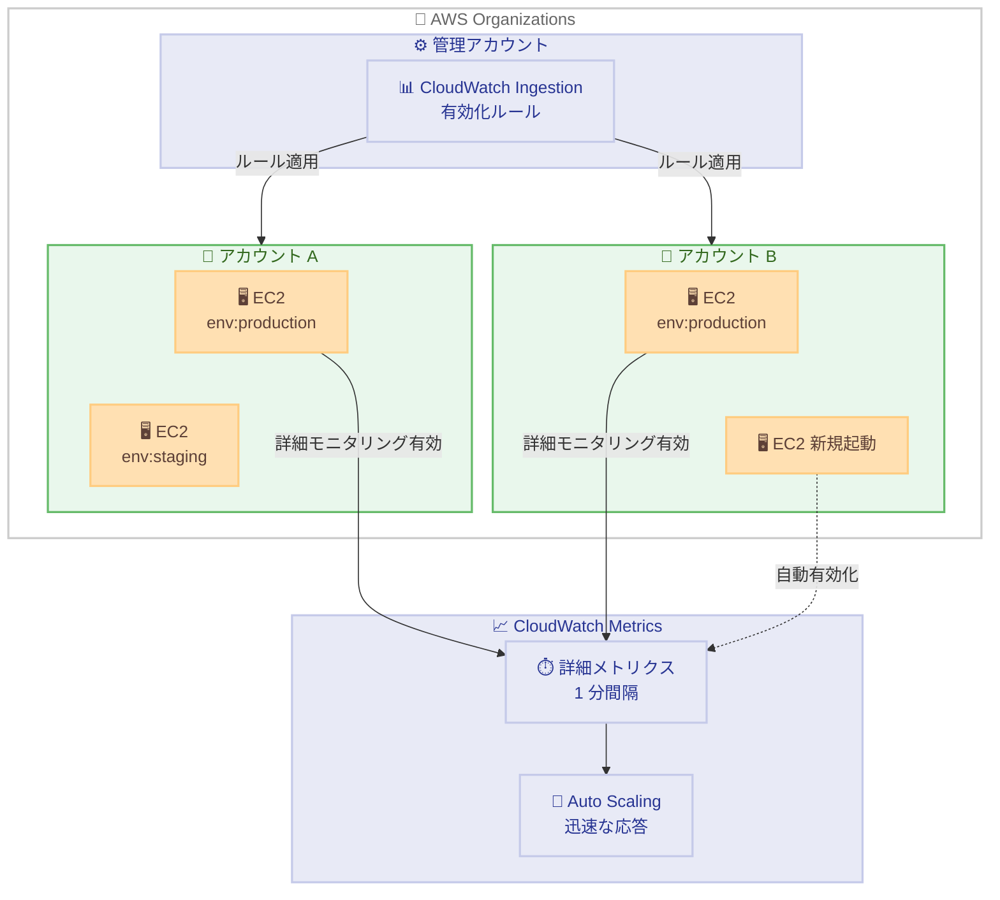

# Amazon CloudWatch - 組織全体の EC2 詳細モニタリング自動有効化

**リリース日**: 2026 年 03 月 16 日
**サービス**: Amazon CloudWatch
**機能**: Organization-wide EC2 Detailed Monitoring Enablement

📊 [このアップデートのインフォグラフィックを見る](https://takech9203.github.io/aws-news-summary/20260316-cloudwatch-org-enablement-ec2-metrics.html)

## 概要

Amazon CloudWatch に、AWS Organizations 全体で Amazon EC2 の詳細モニタリングを自動的に有効化する機能が追加されました。CloudWatch Ingestion に「有効化ルール」を作成することで、既存および新規に起動される EC2 インスタンスに対して詳細モニタリングを自動的にオンにし、1 分間隔でのメトリクス収集を組織全体で統一的に実現できます。

有効化ルールは、組織全体、特定のアカウント、またはリソースタグに基づく特定のリソースにスコープを設定可能です。例えば、中央の DevOps チームが `env:production` タグを持つ EC2 インスタンスに対して詳細モニタリングを自動有効化するルールを作成し、Auto Scaling ポリシーがインスタンス使用率の変化に迅速に対応できるようにすることが可能です。

この機能はすべての AWS 商用リージョンで利用可能です。

**アップデート前の課題**

- EC2 の詳細モニタリングを有効にするには、各アカウント・各インスタンスで個別に設定する必要があった
- 新規に起動される EC2 インスタンスに対して詳細モニタリングを自動的に有効化する仕組みがなく、設定漏れが発生しやすかった
- 組織全体で統一的なモニタリング設定を維持するために、カスタムスクリプトや AWS Config ルールなどの追加の仕組みが必要だった
- 基本モニタリング (5 分間隔) のままのインスタンスでは、Auto Scaling の応答性が低下する可能性があった

**アップデート後の改善**

- CloudWatch Ingestion の有効化ルールにより、組織全体で EC2 詳細モニタリングを一元的に管理可能
- 新規起動インスタンスにも自動的にルールが適用され、設定漏れを防止
- タグベースのスコープ設定により、環境やワークロードに応じた柔軟な制御が可能
- 1 分間隔のメトリクス収集により、Auto Scaling や障害検知の応答性が向上

## アーキテクチャ図



管理アカウントの CloudWatch Ingestion で作成した有効化ルールが、組織内の各アカウントの EC2 インスタンスに自動的に適用され、1 分間隔の詳細メトリクスを CloudWatch に送信する仕組みを示しています。

## サービスアップデートの詳細

### 主要機能

1. **CloudWatch Ingestion 有効化ルール**
   - CloudWatch Ingestion に EC2 詳細モニタリングの有効化ルールを作成可能
   - ルールに一致する既存および新規 EC2 インスタンスに対して自動的に詳細モニタリングを有効化
   - 1 分間隔でのメトリクス収集を組織全体で統一的に実現

2. **柔軟なスコープ設定**
   - 組織全体へのルール適用
   - 特定のアカウントを指定したルール適用
   - リソースタグに基づく特定リソースへのルール適用

3. **自動適用メカニズム**
   - 既存の EC2 インスタンスに対してルール作成時に自動適用
   - 新規起動される EC2 インスタンスにも自動的にルールを適用
   - 設定漏れを防止し、一貫したモニタリング構成を維持

## 技術仕様

### 詳細モニタリングとベーシックモニタリングの比較

| 項目 | ベーシックモニタリング | 詳細モニタリング |
|------|----------------------|------------------|
| メトリクス収集間隔 | 5 分 | 1 分 |
| 料金 | 無料 | 有料 |
| Auto Scaling 応答性 | 標準 | 高速 |
| 設定方法 | デフォルトで有効 | 手動またはルールで有効化 |

### スコープ設定オプション

| スコープ | 説明 | ユースケース |
|----------|------|-------------|
| 組織全体 | AWS Organizations 配下の全アカウント | 全社的なモニタリング標準化 |
| 特定アカウント | 指定したアカウントのみ | 本番アカウントのみ対象 |
| リソースタグ | 特定タグを持つリソースのみ | 環境別・プロジェクト別の制御 |

### API 変更履歴

直近 7 日間で [CloudWatch](https://awsapichanges.com/archive/changes/?title=CloudWatch) に関連する API 変更は確認されませんでした。今後、CloudWatch Ingestion の有効化ルールに関連する API が公開される可能性があります。

### IAM ポリシー例

```json
{
  "Version": "2012-10-17",
  "Statement": [
    {
      "Effect": "Allow",
      "Action": [
        "cloudwatch:PutManagedInsightRules",
        "ec2:MonitorInstances",
        "ec2:DescribeInstances",
        "organizations:ListAccounts",
        "organizations:DescribeOrganization"
      ],
      "Resource": "*"
    }
  ]
}
```

上記は、組織全体の EC2 詳細モニタリング有効化ルールを管理するために必要と想定される IAM 権限の例です。実際の権限要件については、公式ドキュメントを確認してください。

## 設定方法

### 前提条件

1. AWS Organizations が有効化されていること
2. 管理アカウントまたは委任管理者アカウントへのアクセス権限
3. CloudWatch および EC2 に対する適切な IAM 権限

### 手順

#### ステップ 1: CloudWatch Ingestion で有効化ルールを作成

```bash
# 組織全体に対して EC2 詳細モニタリングを有効化するルールの例
aws cloudwatch put-managed-insight-rules \
  --managed-rules '[{
    "TemplateName": "EC2DetailedMonitoring",
    "ResourceARN": "arn:aws:organizations::123456789012:organization/o-example",
    "Tags": []
  }]'
```

CloudWatch Ingestion に有効化ルールを作成します。組織全体をスコープに設定する場合は、Organizations の ARN を指定します。

#### ステップ 2: タグベースのスコープ設定

```bash
# 特定タグを持つ EC2 インスタンスのみを対象とする例
aws cloudwatch put-managed-insight-rules \
  --managed-rules '[{
    "TemplateName": "EC2DetailedMonitoring",
    "ResourceARN": "arn:aws:organizations::123456789012:organization/o-example",
    "Tags": [{"Key": "env", "Value": "production"}]
  }]'
```

`env:production` タグを持つ EC2 インスタンスのみを対象として詳細モニタリングを有効化します。

#### ステップ 3: 有効化状態の確認

```bash
# EC2 インスタンスの詳細モニタリング状態を確認
aws ec2 describe-instances \
  --query "Reservations[].Instances[].{ID:InstanceId,Monitoring:Monitoring.State}" \
  --output table
```

対象のインスタンスで詳細モニタリングが有効 (`enabled`) になっていることを確認します。

## メリット

### ビジネス面

- **運用コスト削減**: 個別設定の手間がなくなり、運用チームの工数を大幅に削減
- **コンプライアンス強化**: 組織全体で統一的なモニタリングポリシーを適用し、監査要件への対応を簡素化
- **障害対応の迅速化**: 1 分間隔のメトリクスにより、問題の早期検知と迅速な対応が可能

### 技術面

- **Auto Scaling の応答性向上**: 1 分間隔のメトリクスにより、Auto Scaling ポリシーがインスタンス使用率の変化に迅速に対応
- **設定ドリフトの防止**: 新規インスタンスにも自動適用されるため、設定漏れや不整合を防止
- **タグベースの柔軟な制御**: 環境やワークロードに応じた詳細モニタリングの適用範囲を柔軟にコントロール可能

## デメリット・制約事項

### 制限事項

- 詳細モニタリングのメトリクスは有料であり、大量のインスタンスに適用するとコストが増加する
- 現時点では EC2 インスタンスのみが対象であり、他のリソースタイプへの自動有効化は対象外
- AWS 商用リージョンのみで利用可能であり、GovCloud や中国リージョンでの利用可否は確認が必要

### 考慮すべき点

- 組織全体に適用する前に、詳細モニタリングの追加コストを見積もることを推奨
- タグベースのスコープを活用して、本番環境や重要なワークロードから段階的に導入することが効果的

## ユースケース

### ユースケース 1: 本番環境の統一モニタリング

**シナリオ**: 大規模な組織で複数のアカウントにまたがる本番 EC2 インスタンスのモニタリングを統一したい

**実装例**:
```bash
# env:production タグを持つ全インスタンスに詳細モニタリングを自動有効化
aws cloudwatch put-managed-insight-rules \
  --managed-rules '[{
    "TemplateName": "EC2DetailedMonitoring",
    "ResourceARN": "arn:aws:organizations::123456789012:organization/o-example",
    "Tags": [{"Key": "env", "Value": "production"}]
  }]'
```

**効果**: 全アカウントの本番インスタンスで 1 分間隔のメトリクス収集が保証され、SLA 遵守の監視体制を確立

### ユースケース 2: Auto Scaling の精度向上

**シナリオ**: EC2 Auto Scaling グループで、負荷変動に対する応答速度を改善したい

**実装例**:
```bash
# Auto Scaling グループに属するインスタンスに詳細モニタリングを適用
aws cloudwatch put-managed-insight-rules \
  --managed-rules '[{
    "TemplateName": "EC2DetailedMonitoring",
    "ResourceARN": "arn:aws:organizations::123456789012:organization/o-example",
    "Tags": [{"Key": "aws:autoscaling:groupName", "Value": "my-asg"}]
  }]'
```

**効果**: 1 分間隔のメトリクスにより、Auto Scaling ポリシーが負荷変動に 5 倍速く対応可能

### ユースケース 3: マルチアカウント環境のセキュリティ監視

**シナリオ**: セキュリティチームが組織内の全 EC2 インスタンスの CPU・ネットワークメトリクスを 1 分間隔で監視し、異常検知を行いたい

**実装例**:
```bash
# 組織全体のインスタンスに詳細モニタリングを適用
aws cloudwatch put-managed-insight-rules \
  --managed-rules '[{
    "TemplateName": "EC2DetailedMonitoring",
    "ResourceARN": "arn:aws:organizations::123456789012:organization/o-example",
    "Tags": []
  }]'

# CloudWatch Anomaly Detection と組み合わせて異常検知
aws cloudwatch put-anomaly-detector \
  --namespace "AWS/EC2" \
  --metric-name "CPUUtilization" \
  --stat "Average"
```

**効果**: 高頻度のメトリクスデータにより、異常検知の精度が向上し、セキュリティインシデントの早期発見が可能

## 料金

EC2 詳細モニタリングの有効化ルール自体の作成は無料ですが、詳細モニタリングによるメトリクス収集は CloudWatch の標準料金に従って課金されます。

### 料金例

| 使用量 | 月額料金 (概算、us-east-1) |
|--------|---------------------------|
| EC2 インスタンス 10 台 (7 メトリクス/台) | 約 $21.00 |
| EC2 インスタンス 100 台 (7 メトリクス/台) | 約 $210.00 |
| EC2 インスタンス 1,000 台 (7 メトリクス/台) | 約 $2,100.00 |

詳細モニタリングメトリクスの料金は 1 メトリクスあたり月額 $0.30 です。各 EC2 インスタンスはデフォルトで 7 つのメトリクス (CPUUtilization、DiskReadOps、DiskWriteOps、DiskReadBytes、DiskWriteBytes、NetworkIn、NetworkOut) を送信します。最新の料金は [CloudWatch の料金ページ](https://aws.amazon.com/cloudwatch/pricing/)を確認してください。

## 利用可能リージョン

すべての AWS 商用リージョンで利用可能です。

## 関連サービス・機能

- **Amazon EC2 Auto Scaling**: 詳細モニタリングにより、Auto Scaling ポリシーの応答性が向上
- **AWS Organizations**: 組織全体でのルール適用の基盤として必要
- **CloudWatch Alarms**: 1 分間隔のメトリクスを活用した、より精密なアラーム設定が可能
- **AWS Config**: EC2 インスタンスの詳細モニタリング設定状態の継続的な監査に活用可能

## 参考リンク

- 📊 [インフォグラフィック](https://takech9203.github.io/aws-news-summary/20260316-cloudwatch-org-enablement-ec2-metrics.html)
- [公式発表 (What's New)](https://aws.amazon.com/about-aws/whats-new/2026/03/cloudwatch-org-enablement-ec2-metrics/)
- [Amazon CloudWatch ドキュメント](https://docs.aws.amazon.com/AmazonCloudWatch/latest/monitoring/)
- [CloudWatch 料金ページ](https://aws.amazon.com/cloudwatch/pricing/)
- [EC2 詳細モニタリングドキュメント](https://docs.aws.amazon.com/AWSEC2/latest/UserGuide/using-cloudwatch-new.html)

## まとめ

Amazon CloudWatch の組織全体 EC2 詳細モニタリング自動有効化機能は、マルチアカウント環境におけるモニタリングの一貫性と運用効率を大幅に向上させるアップデートです。特に大規模な組織では、設定漏れの防止と Auto Scaling の応答性向上に大きな効果が期待できます。AWS Organizations を利用している環境では、まず本番環境のインスタンスを対象にタグベースのルールから導入を開始し、段階的に適用範囲を拡大することを推奨します。
