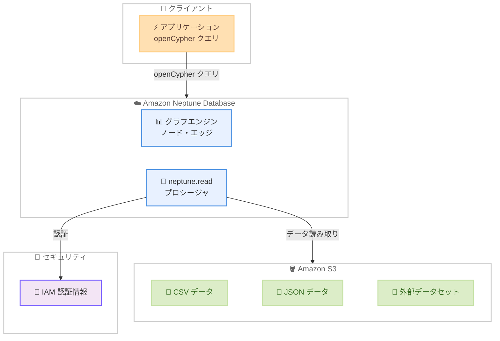

# Amazon Neptune - openCypher クエリによる S3 データ読み取りサポート

**リリース日**: 2026 年 03 月 16 日
**サービス**: Amazon Neptune Database
**機能**: openCypher クエリでの S3 データ読み取り (neptune.read() プロシージャ)

📊 [このアップデートのインフォグラフィックを見る](https://takech9203.github.io/aws-news-summary/20260316-neptune-read-s3-opencypher.html)

## 概要

Amazon Neptune Database が、openCypher クエリ内で Amazon S3 に保存されたデータを直接読み取る機能をサポート開始した。新しい `neptune.read()` プロシージャにより、S3 に保存された外部データを Neptune にロードすることなく、グラフクエリの中でフェデレーションして利用できるようになる。

この機能は、グラフ分析において S3 に格納された外部データを動的に取り込むユースケースに対応する。リアルタイムのグラフ分析で S3 データと既存のグラフ構造を組み合わせたり、外部データセットからノードやエッジを動的に作成したり、外部参照データを必要とする複雑なグラフクエリを実行したりすることが可能になる。標準データ型に加えて geometry や datetime などの Neptune 固有のデータ型もサポートし、呼び出し元の IAM 認証情報を通じてセキュリティを維持する。

**アップデート前の課題**

- S3 に保存された外部データをグラフクエリで利用するには、事前に Neptune にデータをロードする必要があった
- データロードには複数のステップ (S3 からのデータ取得、フォーマット変換、バルクロード実行) が必要で、ワークフローが複雑だった
- 外部データが頻繁に更新される場合、ロード処理を繰り返し実行する運用負荷が発生していた
- リアルタイムに外部データを参照するグラフ分析が困難だった

**アップデート後の改善**

- `neptune.read()` プロシージャにより、openCypher クエリ内で S3 データを直接読み取り可能になった
- データを Neptune にロードする必要がなくなり、従来のマルチステップワークフローが不要になった
- S3 上のデータをリアルタイムに参照するグラフ分析が可能になった
- IAM 認証情報によるセキュアなアクセスが標準で提供される

## アーキテクチャ図



Amazon Neptune Database の S3 データ読み取り機能のアーキテクチャを示す。アプリケーションから openCypher クエリを実行すると、`neptune.read()` プロシージャが IAM 認証情報を使用して S3 上のデータを直接読み取り、グラフエンジンのデータと組み合わせて結果を返す。

## サービスアップデートの詳細

### 主要機能

1. **neptune.read() プロシージャ**
   - openCypher クエリ内で S3 に保存されたデータを直接読み取るための新しいプロシージャ
   - Neptune にデータをロードせずにフェデレーションクエリを実現
   - 既存のグラフ構造と S3 データを組み合わせたクエリが可能

2. **包括的なデータ型サポート**
   - 標準データ型 (String、Integer、Float、Boolean など) をサポート
   - Neptune 固有のデータ型 (geometry、datetime) もサポート
   - 外部データを Neptune のグラフデータと型互換性を保ちながら利用可能

3. **IAM ベースのセキュリティ**
   - 呼び出し元の IAM 認証情報を使用して S3 へのアクセスを制御
   - 既存の IAM ポリシーとロールベースのアクセス制御を活用
   - 追加の認証設定が不要

4. **動的データ統合**
   - リアルタイムのグラフ分析で S3 データを動的に参照
   - 外部データセットからノードやエッジを動的に作成
   - 外部参照データを必要とする複雑なグラフクエリに対応

## 技術仕様

### サポートされるデータ型

| カテゴリ | データ型 |
|------|------|
| 標準データ型 | String、Integer、Float、Boolean |
| Neptune 固有型 | geometry、datetime |
| データソース | Amazon S3 |
| クエリ言語 | openCypher |

### API 変更履歴

直近 7 日間で Neptune に関連する API 変更は検出されなかった。

| 日付 | サービス | 変更内容 |
|------|----------|----------|
| - | [Neptune](https://awsapichanges.com/archive/changes/neptune.html) | 直近 7 日間の API 変更なし |

### IAM ポリシー設定例

```json
{
  "Version": "2012-10-17",
  "Statement": [
    {
      "Effect": "Allow",
      "Action": [
        "s3:GetObject",
        "s3:ListBucket"
      ],
      "Resource": [
        "arn:aws:s3:::example-bucket",
        "arn:aws:s3:::example-bucket/*"
      ]
    }
  ]
}
```

Neptune から S3 データを読み取るために、Neptune クラスターに関連付けられた IAM ロールに S3 の読み取り権限を付与する必要がある。

## 設定方法

### 前提条件

1. Amazon Neptune Database クラスターが作成済みであること
2. openCypher クエリエンドポイントにアクセス可能であること
3. 読み取り対象の S3 バケットとデータが準備されていること
4. Neptune クラスターの IAM ロールに S3 への読み取り権限が付与されていること

### 手順

#### ステップ 1: IAM ロールの設定

Neptune クラスターに関連付けられた IAM ロールに、対象 S3 バケットへの読み取り権限を付与する。

```bash
aws iam attach-role-policy \
  --role-name NeptuneClusterRole \
  --policy-arn arn:aws:iam::123456789012:policy/NeptuneS3ReadPolicy
```

Neptune クラスターの IAM ロールに S3 読み取りポリシーをアタッチする。

#### ステップ 2: S3 データの読み取りクエリを実行

```cypher
CALL neptune.read({
  source: 's3://example-bucket/data/customers.csv'
})
YIELD node
RETURN node
```

`neptune.read()` プロシージャを使用して、S3 上の CSV ファイルからデータを読み取る。

#### ステップ 3: グラフデータとの結合クエリ

```cypher
CALL neptune.read({
  source: 's3://example-bucket/data/external-attributes.csv'
})
YIELD row
MATCH (p:Person {id: row.person_id})
SET p.external_score = row.score
RETURN p
```

S3 から読み取った外部データを既存のグラフノードと結合し、プロパティを更新する。

## メリット

### ビジネス面

- **運用効率の向上**: データロードの複数ステップが不要になり、データパイプラインの管理コストが削減される
- **リアルタイム分析**: S3 上の最新データをリアルタイムにグラフ分析に組み込めるため、意思決定の迅速化に寄与する
- **ストレージコスト最適化**: 全データを Neptune にロードする必要がなくなり、参照頻度の低いデータは S3 に保持したまま利用可能

### 技術面

- **シンプルなアーキテクチャ**: ETL パイプラインの構築が不要になり、システム構成が簡素化される
- **IAM 統合**: 既存の AWS IAM ポリシーをそのまま活用でき、追加のセキュリティ設定が不要
- **データ型の互換性**: geometry や datetime を含む包括的なデータ型サポートにより、データ変換の手間が軽減される

## デメリット・制約事項

### 制限事項

- openCypher クエリ言語でのみ利用可能 (Gremlin や SPARQL での対応状況は要確認)
- S3 からのデータ読み取りはクエリ実行時にネットワーク通信が発生するため、大量データの場合はレイテンシーへの影響を考慮する必要がある
- S3 データのスキーマや形式に関する制約事項については公式ドキュメントでの確認が必要

### 考慮すべき点

- 頻繁にアクセスする大量データについては、Neptune へのロードとフェデレーションクエリのパフォーマンスを比較検証することを推奨
- S3 バケットのアクセス権限設定を適切に管理し、意図しないデータへのアクセスを防止する必要がある

## ユースケース

### ユースケース 1: リアルタイムグラフ分析での外部データ統合

**シナリオ**: 金融機関が取引関係のグラフデータを Neptune で管理しつつ、S3 に保存された最新の市場データや信用スコアを組み合わせて不正検知分析を行いたい。

**実装例**:
```cypher
CALL neptune.read({
  source: 's3://market-data/daily/risk-scores.csv'
})
YIELD row
MATCH (account:Account {id: row.account_id})-[:TRANSACTS_WITH]->(counterparty:Account)
WHERE row.risk_score > 0.8
RETURN account.name, counterparty.name, row.risk_score
ORDER BY row.risk_score DESC
```

**効果**: S3 上の最新リスクスコアとグラフの取引関係を組み合わせることで、リアルタイムの不正検知精度が向上する。

### ユースケース 2: 外部データセットからの動的なグラフ構築

**シナリオ**: EC サイトが商品カタログを S3 に保存しており、ユーザーの行動グラフと組み合わせてレコメンデーションエンジンを構築したい。

**実装例**:
```cypher
CALL neptune.read({
  source: 's3://product-catalog/latest/products.csv'
})
YIELD row
MATCH (u:User)-[:VIEWED]->(p:Product {sku: row.sku})
WHERE row.category = 'electronics'
RETURN u.name, collect(p.name) AS viewed_products, row.price
```

**効果**: 商品カタログの更新を Neptune へのロードなしに即座にレコメンデーションに反映でき、データ鮮度が向上する。

### ユースケース 3: 外部参照データを用いた複雑なグラフクエリ

**シナリオ**: 物流企業がサプライチェーンのグラフを Neptune で管理し、S3 に保存された地理情報や配送コストデータを参照して最適なルートを分析したい。

**実装例**:
```cypher
CALL neptune.read({
  source: 's3://logistics-data/shipping-costs.csv'
})
YIELD row
MATCH path = (origin:Warehouse)-[:SHIPS_TO*1..5]->(dest:Customer)
WHERE origin.region = row.region
RETURN origin.name, dest.name, row.cost_per_km,
       length(path) AS hops
ORDER BY row.cost_per_km ASC
```

**効果**: 外部の配送コストデータとグラフのルート情報を組み合わせることで、コスト最適化されたサプライチェーンルートを動的に分析できる。

## 料金

`neptune.read()` プロシージャの利用に追加料金は発生しない。ただし、以下の標準的な料金が適用される。

| 項目 | 説明 |
|------|------|
| Neptune Database | インスタンス時間、ストレージ、I/O リクエストの標準料金 |
| Amazon S3 | GET リクエストおよびデータ転送の標準料金 |
| データ転送 | Neptune と S3 間のデータ転送料金 (同一リージョン内は無料) |

## 利用可能リージョン

Amazon Neptune Database が提供されている全てのリージョンで利用可能。

## 関連サービス・機能

- **Amazon Neptune Database 空間データサポート**: 2026 年 3 月に追加されたネイティブ空間データ機能。`neptune.read()` と組み合わせて S3 上の地理データをグラフ分析に活用可能
- **Amazon Neptune Analytics**: グラフ分析に特化したサーバーレスサービス。Neptune Database と補完的な関係にある
- **Amazon S3**: `neptune.read()` のデータソースとなるオブジェクトストレージサービス
- **AWS IAM**: `neptune.read()` の S3 アクセスにおける認証・認可を制御

## 参考リンク

- 📊 [インフォグラフィック](https://takech9203.github.io/aws-news-summary/20260316-neptune-read-s3-opencypher.html)
- [公式発表 (What's New)](https://aws.amazon.com/about-aws/whats-new/2026/03/neptune-read-s3-opencypher/)
- [Neptune Database ドキュメント](https://docs.aws.amazon.com/neptune/latest/userguide/intro.html)
- [Amazon Neptune 料金ページ](https://aws.amazon.com/neptune/pricing/)

## まとめ

Amazon Neptune Database の `neptune.read()` プロシージャは、S3 に保存された外部データをグラフクエリ内で直接参照できるようにする実用的なアップデートである。従来のマルチステップのデータロードワークフローが不要になり、リアルタイムのグラフ分析において外部データの統合が大幅に簡素化される。Neptune Database を利用してグラフ分析を行っている場合は、S3 上の外部データとのフェデレーションクエリを検討し、データパイプラインの簡素化を図ることを推奨する。
