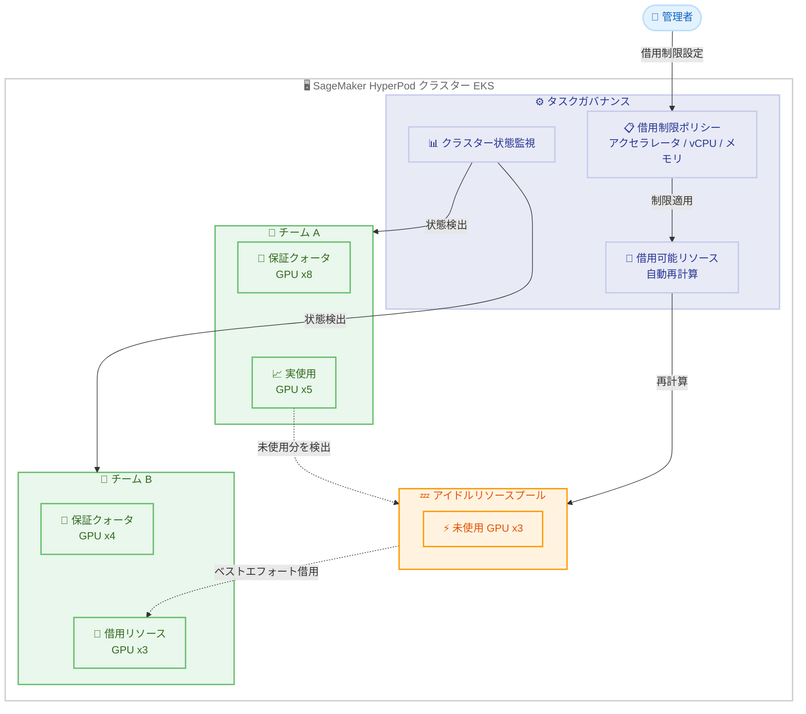

# Amazon SageMaker HyperPod - アイドルリソース共有による動的クラスター活用

**リリース日**: 2026 年 03 月 16 日
**サービス**: Amazon SageMaker HyperPod
**機能**: Idle Resource Sharing for Dynamic Cluster Utilization

📊 [このアップデートのインフォグラフィックを見る](https://takech9203.github.io/aws-news-summary/20260316-sagemaker-hyperpod-idle-resource-sharing.html)

## 概要

Amazon SageMaker HyperPod のタスクガバナンスに、動的リソース共有機能が追加されました。この機能により、HyperPod クラスター内で未割り当てのコンピューティング容量を自動的に検出し、保証されたクォータを超えてチーム間で借用可能にすることで、クラスター全体の利用効率を大幅に向上させます。

管理者は、アクセラレータ、vCPU、メモリなどのリソースタイプごとに借用制限を設定でき、チーム間の公平なリソース配分を確保できます。HyperPod タスクガバナンスはクラスターの状態を継続的に監視し、インスタンスやコンピューティングクォータポリシーの変更に応じて借用可能なリソースを自動的に再計算します。

この機能は EKS オーケストレータを使用する HyperPod クラスターで利用可能であり、東京リージョンを含む 15 の AWS リージョンで提供されています。

**アップデート前の課題**

- データサイエンティストが割り当てられたクォータを完全に消費しない場合、高価なコンピューティングインスタンスがアイドル状態のまま放置されていた
- チームごとに固定のリソースクォータが設定されており、未使用リソースを他のチームが活用する仕組みがなかった
- クラスター全体のリソース利用率が低下し、GPU やアクセラレータなどの高価なリソースのコスト効率が悪化していた
- リソースの再配分には管理者による手動介入が必要で、迅速な対応が困難だった

**アップデート後の改善**

- 未割り当てのクラスター容量を自動検出し、ベストエフォートベースで他チームに借用可能に
- リソースタイプ別の借用制限設定により、管理者が公平な配分を制御可能
- クラスター状態の変更に応じた借用可能リソースの自動再計算
- チーム間のリソース共有が自動化され、クラスター全体の利用効率が向上

## アーキテクチャ図



チーム A が保証クォータの一部しか使用していない場合、タスクガバナンスが未使用リソースを自動検出してアイドルリソースプールに集約し、チーム B がベストエフォートベースで借用できる仕組みを示しています。

## サービスアップデートの詳細

### 主要機能

1. **動的リソース共有**
   - HyperPod クラスター内の未割り当てコンピューティング容量を自動的に検出
   - 保証クォータを超えたリソースをベストエフォートベースで他チームに提供
   - チームが自身のクォータを必要とした場合、借用リソースは自動的に回収

2. **リソースタイプ別借用制限**
   - アクセラレータ (GPU など) の借用制限を設定可能
   - vCPU の借用制限を設定可能
   - メモリの借用制限を設定可能
   - リソースタイプごとにきめ細かな制御が可能

3. **自動再計算メカニズム**
   - クラスター状態の変更をリアルタイムで監視
   - インスタンスの追加・削除に応じて借用可能リソースを再計算
   - コンピューティングクォータポリシーの変更を自動的に反映

## 技術仕様

### リソース共有の仕組み

| 項目 | 詳細 |
|------|------|
| 対象オーケストレータ | Amazon EKS |
| 共有方式 | ベストエフォート |
| 対象リソースタイプ | アクセラレータ、vCPU、メモリ |
| 再計算トリガー | インスタンス変更、クォータポリシー変更 |
| リソース回収 | クォータ所有チームが必要時に自動回収 |

### 借用制限の設定項目

| リソースタイプ | 説明 | ユースケース |
|----------------|------|-------------|
| アクセラレータ | GPU 等のアクセラレータ数の借用上限 | ML トレーニングジョブの負荷分散 |
| vCPU | 仮想 CPU コア数の借用上限 | データ前処理タスクの分散 |
| メモリ | メモリ容量の借用上限 | 大規模モデルのロードに対応 |

### API 変更履歴

直近 7 日間で確認された [SageMaker](https://awsapichanges.com/archive/changes/?title=SageMaker) 関連の API 変更は以下のとおりです。アイドルリソース共有に直接関連する API 変更は確認されませんでしたが、HyperPod 関連のトレーニングプラン拡張 API が追加されています。

| 日付 | サービス | 変更内容 |
|------|----------|----------|
| 2026/03/11 | [Amazon SageMaker Service](https://awsapichanges.com/archive/changes/537c33-api.sagemaker.html) | 2 new 1 updated api methods - トレーニングプランの延長機能。ExtendTrainingPlan、DescribeTrainingPlanExtensionHistory の追加、SearchTrainingPlanOfferings の更新 |

### IAM ポリシー例

```json
{
  "Version": "2012-10-17",
  "Statement": [
    {
      "Effect": "Allow",
      "Action": [
        "sagemaker:UpdateCluster",
        "sagemaker:DescribeCluster",
        "sagemaker:ListClusters",
        "sagemaker:UpdateComputeQuota",
        "sagemaker:DescribeComputeQuota",
        "sagemaker:ListComputeQuotas"
      ],
      "Resource": "arn:aws:sagemaker:*:*:cluster/*"
    }
  ]
}
```

上記は、HyperPod クラスターのリソース共有設定を管理するために必要と想定される IAM 権限の例です。実際の権限要件については、公式ドキュメントを確認してください。

## 設定方法

### 前提条件

1. Amazon SageMaker HyperPod クラスターが EKS オーケストレータで構成されていること
2. タスクガバナンスが有効化されていること
3. チームごとのコンピューティングクォータポリシーが設定済みであること

### 手順

#### ステップ 1: コンピューティングクォータの確認

```bash
# 既存のコンピューティングクォータを確認
aws sagemaker list-compute-quotas \
  --cluster-arn arn:aws:sagemaker:ap-northeast-1:123456789012:cluster/my-hyperpod-cluster
```

現在のチームごとのクォータ設定を確認し、リソース共有の基盤となる保証クォータが正しく設定されていることを確認します。

#### ステップ 2: 借用制限の設定

```bash
# チームのコンピューティングクォータに借用制限を設定
aws sagemaker update-compute-quota \
  --compute-quota-id quota-team-b \
  --compute-quota-config '{
    "BorrowLimit": {
      "MaxAccelerators": 4,
      "MaxVCPUs": 32,
      "MaxMemoryInMB": 131072
    }
  }'
```

チームごとに借用可能なリソースの上限を設定します。アクセラレータ、vCPU、メモリの各リソースタイプに対して個別に制限値を指定できます。

#### ステップ 3: リソース共有の動作確認

```bash
# クラスターの現在のリソース使用状況を確認
aws sagemaker describe-cluster \
  --cluster-name my-hyperpod-cluster \
  --query "ClusterArn"
```

クラスターのリソース使用状況を確認し、アイドルリソースが正しく検出され、借用可能な状態になっていることを確認します。

## メリット

### ビジネス面

- **コスト効率の向上**: アイドル状態の高価な GPU インスタンスを他チームが活用することで、クラスター全体の投資対効果を最大化
- **プロジェクト推進の加速**: リソース待ちによるプロジェクト遅延を削減し、データサイエンスチームの生産性を向上
- **運用コストの削減**: リソース再配分の手動作業が不要になり、管理者の運用負荷を軽減

### 技術面

- **クラスター利用率の向上**: 未使用リソースの自動検出と共有により、GPU やアクセラレータの実効利用率を改善
- **自動再計算**: インスタンスやポリシーの変更に応じてリアルタイムで借用可能リソースが更新される
- **きめ細かなリソース制御**: アクセラレータ、vCPU、メモリごとの借用制限により、ワークロード特性に応じた最適な配分が可能

## デメリット・制約事項

### 制限事項

- EKS オーケストレータを使用する HyperPod クラスターのみが対象であり、他のオーケストレータでは利用不可
- 借用リソースはベストエフォートベースで提供されるため、可用性が保証されない
- クォータ所有チームがリソースを必要とした場合、借用リソースは回収されるため、実行中のワークロードに影響が出る可能性がある

### 考慮すべき点

- 借用制限を適切に設定しないと、特定チームがアイドルリソースを独占する可能性がある
- ベストエフォートベースの借用であるため、借用リソースに依存したワークロード設計は避けることが推奨される
- リソース回収時のワークロードへの影響を考慮し、チェックポイント機能との組み合わせが有効

## ユースケース

### ユースケース 1: 大規模 ML トレーニングの効率化

**シナリオ**: 複数のデータサイエンスチームが共有 HyperPod クラスターを使用しており、チーム A が夜間にトレーニングジョブを実行しないため GPU リソースがアイドル状態になっている

**実装例**:
```bash
# チーム B に夜間のアイドル GPU を借用可能に設定
aws sagemaker update-compute-quota \
  --compute-quota-id quota-team-b \
  --compute-quota-config '{
    "BorrowLimit": {
      "MaxAccelerators": 8
    }
  }'
```

**効果**: チーム B が夜間バッチ処理で追加の GPU を活用し、トレーニング時間を短縮しつつクラスター利用率を向上

### ユースケース 2: ピーク時のリソース融通

**シナリオ**: 研究チームが一時的に大規模な実験を実行する必要があるが、専用のクォータでは GPU が不足している

**実装例**:
```bash
# 研究チームに一時的な借用制限を拡大
aws sagemaker update-compute-quota \
  --compute-quota-id quota-research-team \
  --compute-quota-config '{
    "BorrowLimit": {
      "MaxAccelerators": 16,
      "MaxMemoryInMB": 524288
    }
  }'
```

**効果**: 追加のクラスター容量を購入することなく、他チームのアイドルリソースを活用して大規模実験を実行可能

### ユースケース 3: データ前処理パイプラインの並列化

**シナリオ**: データエンジニアリングチームが大量のデータ前処理を行う際に vCPU とメモリが不足するが、同時間帯に ML トレーニングチームのリソースが未使用

**実装例**:
```bash
# データエンジニアリングチームに vCPU とメモリの借用を許可
aws sagemaker update-compute-quota \
  --compute-quota-id quota-data-engineering \
  --compute-quota-config '{
    "BorrowLimit": {
      "MaxVCPUs": 64,
      "MaxMemoryInMB": 262144
    }
  }'
```

**効果**: アイドル状態の vCPU とメモリを活用してデータ前処理パイプラインを並列化し、処理時間を大幅に短縮

## 料金

アイドルリソース共有機能自体の追加料金は発生しません。SageMaker HyperPod の料金は、クラスターで使用するインスタンスタイプと実行時間に基づいて課金されます。借用リソースを使用した場合も、基盤となるインスタンスの料金体系に変更はありません。

### 料金例

| インスタンスタイプ | オンデマンド料金 (1 時間あたり、us-east-1) |
|--------------------|--------------------------------------------|
| ml.p4d.24xlarge (A100 GPU x8) | $32.77 |
| ml.p5.48xlarge (H100 GPU x8) | $98.32 |
| ml.trn1.32xlarge (Trainium x16) | $21.50 |

リソース共有による追加課金はないため、アイドルリソースを活用することで実質的なコスト効率が向上します。最新の料金は [SageMaker の料金ページ](https://aws.amazon.com/sagemaker/pricing/)を確認してください。

## 利用可能リージョン

EKS オーケストレータを使用する HyperPod クラスターで、東京リージョン (ap-northeast-1) を含む 15 の AWS リージョンで利用可能です。

## 関連サービス・機能

- **Amazon SageMaker HyperPod タスクガバナンス**: リソース共有の基盤となるクォータ管理とタスクスケジューリング機能
- **Amazon EKS**: HyperPod クラスターのオーケストレーション基盤として必要
- **SageMaker Training Plans**: トレーニングプランの延長機能と組み合わせることで、長期的なリソース計画を最適化
- **Amazon CloudWatch**: クラスターのリソース使用率モニタリングと借用状況の可視化に活用可能

## 参考リンク

- 📊 [インフォグラフィック](https://takech9203.github.io/aws-news-summary/20260316-sagemaker-hyperpod-idle-resource-sharing.html)
- [公式発表 (What's New)](https://aws.amazon.com/about-aws/whats-new/2026/03/sagemaker-hyperpod-idle-resource-sharing/)
- [SageMaker HyperPod ドキュメント](https://docs.aws.amazon.com/sagemaker/latest/dg/sagemaker-hyperpod.html)
- [SageMaker 料金ページ](https://aws.amazon.com/sagemaker/pricing/)

## まとめ

Amazon SageMaker HyperPod のアイドルリソース共有機能は、マルチチーム環境における高価な ML コンピューティングリソースの利用効率を大幅に向上させるアップデートです。ベストエフォートベースのリソース借用と、リソースタイプ別の借用制限により、公平性を保ちながらクラスター全体の稼働率を最大化できます。HyperPod クラスターを複数チームで共有している環境では、各チームのワークロードパターンを分析した上で適切な借用制限を設定し、段階的に導入を進めることを推奨します。
