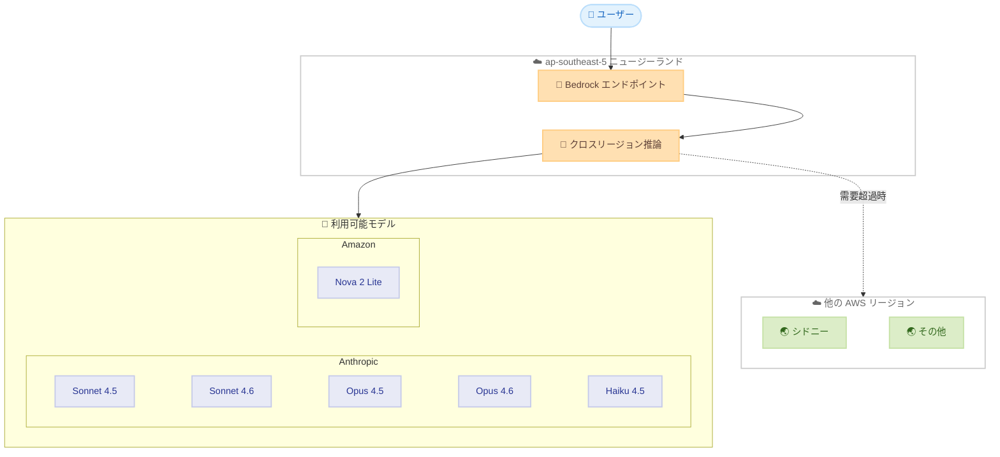

# Amazon Bedrock - アジアパシフィック (ニュージーランド) リージョンでの提供開始

**リリース日**: 2026年3月17日
**サービス**: Amazon Bedrock
**機能**: アジアパシフィック (ニュージーランド) リージョンでの利用可能化

[このアップデートのインフォグラフィックを見る](https://takech9203.github.io/aws-news-summary/20260317-amazon-bedrock-asia-pacific-new-zealand.html)

## 概要

Amazon Bedrock がアジアパシフィック (ニュージーランド) リージョン (ap-southeast-5) で利用可能になりました。これにより、ニュージーランドおよびオセアニア地域のユーザーは、より低レイテンシーで生成 AI アプリケーションを構築・スケーリングできるようになります。

今回のリリースでは、クロスリージョン推論を通じて、Anthropic のモデル (Sonnet 4.5、Sonnet 4.6、Opus 4.5、Opus 4.6、Haiku 4.5) および Amazon のモデル (Nova 2 Lite) が利用可能です。クロスリージョン推論により、需要が高い時間帯でもリクエストが他のリージョンにルーティングされ、安定したパフォーマンスが提供されます。

この拡張は、AWS がオセアニア地域での生成 AI サービスの可用性を強化する取り組みの一環であり、データレジデンシー要件を持つ企業にとって重要なアップデートです。

**アップデート前の課題**

- ニュージーランドのユーザーは Amazon Bedrock を利用する際、シドニーなど他のリージョンを使用する必要があり、レイテンシーが高くなる場合があった
- ニュージーランド国内にデータレジデンシー要件がある場合、Amazon Bedrock の利用が制限されていた
- オセアニア地域での生成 AI アプリケーションの構築において、リージョン選択肢が限られていた

**アップデート後の改善**

- ニュージーランドリージョンから直接 Amazon Bedrock を利用でき、レイテンシーが改善された
- クロスリージョン推論により、複数の基盤モデルを安定的に利用可能になった
- ニュージーランド国内でのデータレジデンシー要件に対応しやすくなった

## アーキテクチャ図



この図は、ニュージーランドリージョンの Amazon Bedrock エンドポイントがクロスリージョン推論を通じて各基盤モデルにアクセスする構成を示しています。需要が高い場合は他の AWS リージョンにリクエストがルーティングされます。

## サービスアップデートの詳細

### 主要機能

1. **クロスリージョン推論**
   - ニュージーランドリージョンをエンドポイントとして利用しつつ、複数リージョンの推論リソースを活用可能
   - 需要が集中した場合でもリクエストが自動的に他リージョンへルーティングされ、可用性が向上
   - ユーザー側の設定変更は不要で、API エンドポイントをニュージーランドリージョンに指定するだけで利用可能

2. **Anthropic モデルの提供**
   - Sonnet 4.5 / Sonnet 4.6: 高性能かつコスト効率の良い汎用モデル
   - Opus 4.5 / Opus 4.6: 最高精度のフラッグシップモデル
   - Haiku 4.5: 高速・低コストの軽量モデル

3. **Amazon モデルの提供**
   - Nova 2 Lite: Amazon が開発した軽量基盤モデル
   - コスト効率が高く、低レイテンシーでの推論に適している

## 技術仕様

### 利用可能モデル一覧

| モデルプロバイダー | モデル名 | 特徴 |
|------|------|------|
| Anthropic | Sonnet 4.5 | 高性能汎用モデル |
| Anthropic | Sonnet 4.6 | 最新の高性能汎用モデル |
| Anthropic | Opus 4.5 | フラッグシップ高精度モデル |
| Anthropic | Opus 4.6 | 最新のフラッグシップモデル |
| Anthropic | Haiku 4.5 | 高速・低コスト軽量モデル |
| Amazon | Nova 2 Lite | 軽量・コスト効率モデル |

### API 変更履歴

| 日付 | サービス | 変更内容 |
|------|----------|----------|
| 2026/03/17 | [Amazon Bedrock AgentCore Control](https://awsapichanges.com/archive/changes/bda7d0-bedrock-agentcore-control.html) | 3 updated methods - namespaces フィールドの非推奨化と namespaceTemplates の追加 |
| 2026/03/16 | [Amazon Bedrock AgentCore](https://awsapichanges.com/archive/changes/dac0d1-bedrock-agentcore.html) | 1 new method - InvokeAgentRuntimeCommand API の追加 |
| 2026/03/16 | [Amazon Bedrock](https://awsapichanges.com/archive/changes/dac0d1-bedrock.html) | 3 updated methods - GENERATE_POLICY_SCENARIOS ワークフロータイプの追加 |

### リージョン情報

| 項目 | 詳細 |
|------|------|
| リージョン名 | アジアパシフィック (ニュージーランド) |
| リージョンコード | ap-southeast-5 |
| 推論方式 | クロスリージョン推論 |

## 設定方法

### 前提条件

1. AWS アカウントを持っていること
2. Amazon Bedrock へのアクセス権限が設定されていること
3. 利用したいモデルへのアクセスが承認されていること

### 手順

#### ステップ 1: リージョンの選択

```bash
export AWS_DEFAULT_REGION=ap-southeast-5
```

AWS CLI の環境変数でニュージーランドリージョンを指定します。

#### ステップ 2: モデルアクセスの有効化

AWS マネジメントコンソールで Amazon Bedrock のモデルアクセスページに移動し、利用したいモデルへのアクセスをリクエストします。クロスリージョン推論を利用する場合は、推論プロファイルを使用してモデルを呼び出します。

#### ステップ 3: API 呼び出しの実行

```bash
aws bedrock-runtime invoke-model \
  --model-id ap.anthropic.claude-sonnet-4-5-20250514-v1:0 \
  --region ap-southeast-5 \
  --content-type application/json \
  --body '{"anthropic_version":"bedrock-2023-05-31","max_tokens":1024,"messages":[{"role":"user","content":"Hello"}]}' \
  output.json
```

クロスリージョン推論を利用する場合、モデル ID に `ap.` プレフィックスを付与してアジアパシフィックリージョンの推論プロファイルを指定します。

## メリット

### ビジネス面

- **データレジデンシー対応**: ニュージーランド国内でのデータ処理要件を満たしやすくなり、規制対応が容易になる
- **オセアニア市場への対応**: ニュージーランドおよび近隣地域の顧客向けサービスを低レイテンシーで提供可能
- **マルチモデル戦略**: 6 つの基盤モデルから用途に応じて最適なモデルを選択でき、コスト最適化が可能

### 技術面

- **低レイテンシー**: ニュージーランドリージョンに直接アクセスすることで、他リージョンを経由する場合と比較してレイテンシーが改善
- **高可用性**: クロスリージョン推論により、単一リージョンの容量制限を超えたリクエストにも対応可能
- **既存コードの互換性**: エンドポイントのリージョンを変更するだけで利用可能で、API の互換性が維持される

## デメリット・制約事項

### 制限事項

- クロスリージョン推論のみの提供であり、オンデマンド推論やプロビジョンドスループットの直接的な利用可否は公式ドキュメントでの確認が必要
- 利用可能なモデルは現時点で Anthropic の 5 モデルと Amazon Nova 2 Lite の計 6 モデルに限定される
- 他のリージョンで利用可能な一部のモデル (Meta Llama、Mistral 等) はまだ提供されていない可能性がある

### 考慮すべき点

- クロスリージョン推論ではリクエストが他リージョンにルーティングされる場合があるため、厳密なデータレジデンシー要件がある場合は、ルーティング先リージョンの確認が必要
- 新リージョンのため、サービスクォータがデフォルト値のままである場合がある。大規模利用の場合は事前にクォータの引き上げを申請することを推奨

## ユースケース

### ユースケース 1: ニュージーランドの金融機関での AI チャットボット

**シナリオ**: ニュージーランドの銀行が、顧客サポート用の AI チャットボットを構築する場合。データレジデンシー要件により、ニュージーランド国内でのデータ処理が求められている。

**実装例**:
```python
import boto3

client = boto3.client('bedrock-runtime', region_name='ap-southeast-5')

response = client.converse(
    modelId='ap.anthropic.claude-haiku-4-5-20251001-v1:0',
    messages=[
        {
            'role': 'user',
            'content': [{'text': 'What are the current mortgage rates?'}]
        }
    ]
)
```

**効果**: ニュージーランドリージョンを利用することで、データレジデンシー要件を満たしつつ、低レイテンシーで顧客に応答を提供できる

### ユースケース 2: オセアニア地域向け多言語コンテンツ生成

**シナリオ**: ニュージーランドおよびオーストラリア向けのマーケティングチームが、英語とマオリ語の両方でコンテンツを生成する場合。

**実装例**:
```python
import boto3

client = boto3.client('bedrock-runtime', region_name='ap-southeast-5')

response = client.converse(
    modelId='ap.anthropic.claude-sonnet-4-6-20260215-v1:0',
    messages=[
        {
            'role': 'user',
            'content': [{'text': 'Translate the following marketing copy to Te Reo Maori: ...'}]
        }
    ]
)
```

**効果**: 高性能な Sonnet 4.6 モデルを活用して、ニュージーランドの公用語に対応した高品質なコンテンツを低レイテンシーで生成できる

### ユースケース 3: 軽量モデルによる大量ドキュメント処理

**シナリオ**: ニュージーランドの法律事務所が、大量の法的文書を分類・要約する場合。コスト効率を重視して Nova 2 Lite を使用。

**実装例**:
```python
import boto3

client = boto3.client('bedrock-runtime', region_name='ap-southeast-5')

response = client.converse(
    modelId='ap.amazon.nova-2-lite-v1:0',
    messages=[
        {
            'role': 'user',
            'content': [{'text': 'Classify and summarize the following legal document: ...'}]
        }
    ]
)
```

**効果**: Nova 2 Lite のコスト効率を活用して、大量のドキュメント処理を低コストで実行できる

## 料金

Amazon Bedrock の料金はモデルおよび利用方法によって異なります。クロスリージョン推論を利用する場合、料金は通常のオンデマンド推論と同等です。詳細は Amazon Bedrock の料金ページを参照してください。

### 料金例

| モデル | 入力トークン | 出力トークン |
|--------|------------------|------------------|
| Haiku 4.5 | 低コスト | 低コスト |
| Sonnet 4.6 | 中程度 | 中程度 |
| Opus 4.6 | 高コスト | 高コスト |
| Nova 2 Lite | 最低コスト | 最低コスト |

※ 正確な料金は [Amazon Bedrock 料金ページ](https://aws.amazon.com/bedrock/pricing/) を参照してください。

## 利用可能リージョン

今回のアップデートにより、Amazon Bedrock はアジアパシフィック (ニュージーランド) リージョン (ap-southeast-5) で利用可能になりました。クロスリージョン推論を通じて、Anthropic (Sonnet 4.5、Sonnet 4.6、Opus 4.5、Opus 4.6、Haiku 4.5) および Amazon (Nova 2 Lite) のモデルが利用できます。

## 関連サービス・機能

- **Amazon Bedrock クロスリージョン推論**: 複数リージョンにまたがる推論リソースを活用して可用性とパフォーマンスを向上させる機能
- **Amazon Bedrock Agents**: 基盤モデルを活用した自律的なエージェントの構築機能
- **Amazon Bedrock Knowledge Bases**: RAG パターンを使用して基盤モデルに組織固有の知識を提供する機能

## 参考リンク

- [インフォグラフィック](https://takech9203.github.io/aws-news-summary/20260317-amazon-bedrock-asia-pacific-new-zealand.html)
- [公式発表 (What's New)](https://aws.amazon.com/about-aws/whats-new/2026/03/amazon-bedrock-asia-pacific-new-zealand/)
- [Amazon Bedrock ドキュメント](https://docs.aws.amazon.com/bedrock/latest/userguide/)
- [Amazon Bedrock 料金ページ](https://aws.amazon.com/bedrock/pricing/)
- [クロスリージョン推論ドキュメント](https://docs.aws.amazon.com/bedrock/latest/userguide/cross-region-inference.html)

## まとめ

Amazon Bedrock がアジアパシフィック (ニュージーランド) リージョンで利用可能になったことで、オセアニア地域のユーザーはより低レイテンシーで生成 AI アプリケーションを構築できるようになりました。クロスリージョン推論を通じて 6 つの基盤モデルが利用可能であり、データレジデンシー要件への対応も容易になります。ニュージーランドリージョンで生成 AI ワークロードを計画している場合は、早期にモデルアクセスの有効化とサービスクォータの確認を行うことを推奨します。
