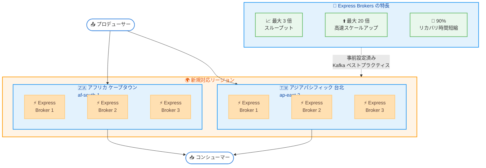

# Amazon MSK - Express Brokers がアフリカ (ケープタウン) およびアジアパシフィック (台北) リージョンに拡大

**リリース日**: 2026 年 3 月 17 日
**サービス**: Amazon Managed Streaming for Apache Kafka (Amazon MSK)
**機能**: Express Brokers のリージョン拡張

📊 [このアップデートのインフォグラフィックを見る](https://takech9203.github.io/aws-news-summary/20260317-amazon-msk-express-2-new-aws-regions.html)

## 概要

AWS は 2026 年 3 月 17 日、Amazon MSK Provisioned の Express Brokers がアフリカ (ケープタウン) およびアジアパシフィック (台北) リージョンで利用可能になったことを発表しました。

Express Brokers は Amazon MSK Provisioned 向けの新しいブローカータイプで、標準的な Apache Kafka ブローカーと比較して、ブローカーあたり最大 3 倍のスループット、最大 20 倍高速なスケールアップ、90% のリカバリ時間短縮を実現します。Kafka ベストプラクティスがデフォルトで事前設定されており、すべての Kafka API をサポートし、既存のクライアントアプリケーションを変更することなく利用できます。

**アップデート前の課題**

- アフリカ (ケープタウン) およびアジアパシフィック (台北) リージョンでは Express Brokers を使用した MSK Provisioned クラスターを作成できなかった
- これらのリージョンのユーザーは Standard ブローカーのみ利用可能であり、Express Brokers の高スループット・高速スケーリングの恩恵を受けられなかった
- 地理的に近いリージョンで Express Brokers を利用できないため、低レイテンシーな高性能ストリーミング基盤の構築に制約があった

**アップデート後の改善**

- アフリカ (ケープタウン) およびアジアパシフィック (台北) リージョンで Express Brokers を使用した MSK Provisioned クラスターを作成可能になった
- これらのリージョンで Standard ブローカー比最大 3 倍のスループットと最大 20 倍高速なスケーリングを活用できるようになった
- Express Brokers のリージョンカバレッジが拡大し、グローバルなストリーミングアーキテクチャの選択肢が増えた

## アーキテクチャ図



この図は、新たに Express Brokers が利用可能になったアフリカ (ケープタウン) とアジアパシフィック (台北) リージョンにおける MSK クラスターの構成と、Express Brokers の主な特長を示しています。

## サービスアップデートの詳細

### 主要機能

1. **Express Brokers の 2 リージョン追加**
   - アフリカ (ケープタウン) リージョンで Express Brokers を使用した MSK Provisioned クラスターを作成可能
   - アジアパシフィック (台北) リージョンで Express Brokers を使用した MSK Provisioned クラスターを作成可能
   - Amazon MSK コンソールまたは AWS CLI から新規クラスターを作成可能

2. **高スループット・高速スケーリング**
   - Standard ブローカー比で最大 3 倍のスループットを実現
   - 最大 20 倍高速なスケールアップにより需要変動に迅速に対応
   - リカバリ時間を 90% 短縮し、障害からの復旧を高速化

3. **Kafka ベストプラクティスの事前設定**
   - Express Brokers はデフォルトで Kafka ベストプラクティスが適用済み
   - すべての Kafka API をサポートし、既存クライアントアプリケーションとの互換性を維持
   - 低レイテンシーなパフォーマンスを提供

## 技術仕様

### Express Brokers と Standard Brokers の比較

| 項目 | Express Brokers | Standard Brokers |
|------|----------------|-----------------|
| スループット | 最大 3 倍 | ベースライン |
| スケールアップ速度 | 最大 20 倍高速 | ベースライン |
| リカバリ時間 | 90% 短縮 | ベースライン |
| ストレージ | フルマネージド | ユーザー設定 |
| Kafka ベストプラクティス | デフォルトで事前設定 | 手動設定が必要 |
| Kafka API 互換性 | 完全互換 | 完全互換 |

### 新規対応リージョン

| リージョン名 | リージョンコード | 備考 |
|-------------|----------------|------|
| アフリカ (ケープタウン) | af-south-1 | オプトインリージョン |
| アジアパシフィック (台北) | ap-east-2 | オプトインリージョン |

### API 変更履歴

直近 7 日間で [Kafka](https://awsapichanges.com/archive/changes/kafka.html) に関連する API 変更は確認されませんでした。今回のアップデートはリージョン拡張であり、新規 API の追加は伴いません。

## 設定方法

### 前提条件

1. AWS アカウントと Amazon MSK に対する適切な IAM 権限
2. 対象リージョン (af-south-1 または ap-east-2) が AWS アカウントで有効化されていること
3. MSK クラスター用の VPC、サブネット、セキュリティグループが対象リージョンに設定済みであること

### 手順

#### ステップ 1: オプトインリージョンの有効化

```bash
# アフリカ (ケープタウン) リージョンの有効化状況を確認
aws account get-region-opt-status --region-name af-south-1

# アジアパシフィック (台北) リージョンの有効化状況を確認
aws account get-region-opt-status --region-name ap-east-2
```

対象リージョンがオプトインリージョンのため、未有効化の場合は AWS アカウント設定から有効化する必要があります。

#### ステップ 2: Express Brokers を使用した MSK クラスターの作成

```bash
# アフリカ (ケープタウン) リージョンで Express Brokers クラスターを作成
aws kafka create-cluster-v2 \
  --cluster-name my-express-cluster \
  --provisioned '{
    "brokerNodeGroupInfo": {
      "instanceType": "kafka.m7g.xlarge",
      "clientSubnets": ["subnet-xxxxxxxxx", "subnet-yyyyyyyyy", "subnet-zzzzzzzzz"],
      "securityGroups": ["sg-xxxxxxxxx"]
    },
    "kafkaVersion": "3.6.0",
    "numberOfBrokerNodes": 3,
    "clusterType": "EXPRESS"
  }' \
  --region af-south-1
```

Express Brokers を使用した MSK Provisioned クラスターを作成します。`clusterType` に `EXPRESS` を指定することで Express Brokers が選択されます。

#### ステップ 3: クラスターの状態確認

```bash
# クラスターの作成状態を確認
aws kafka describe-cluster-v2 \
  --cluster-arn <cluster-arn> \
  --region af-south-1 \
  --query "ClusterInfo.{State:State,ClusterType:Provisioned.ClusterType}"
```

クラスターの作成が完了し、状態が `ACTIVE` になったことを確認します。

## メリット

### ビジネス面

- **グローバルカバレッジの拡大**: アフリカおよび台北リージョンのユーザーが Express Brokers の高性能なストリーミング基盤を地理的に近い場所で利用可能に
- **レイテンシーの最適化**: エンドユーザーに近いリージョンで Express Brokers を運用することで、データストリーミングのレイテンシーを短縮
- **運用効率の向上**: Kafka ベストプラクティスの事前設定により、クラスター構築・運用にかかる時間と労力を削減

### 技術面

- **高スループット**: Standard ブローカー比最大 3 倍のスループットにより、大量のストリーミングデータを効率的に処理
- **高速スケーリング**: 最大 20 倍高速なスケールアップにより、トラフィックの急増に迅速に対応可能
- **高速リカバリ**: 90% のリカバリ時間短縮により、障害発生時のダウンタイムを最小化
- **シームレスな移行**: すべての Kafka API をサポートしているため、既存のクライアントアプリケーションを変更せずに Express Brokers を利用可能

## デメリット・制約事項

### 制限事項

- 今回のアップデートはアフリカ (ケープタウン) およびアジアパシフィック (台北) リージョンへの拡張であり、新しい機能の追加ではない
- 両リージョンはオプトインリージョンであり、利用前にアカウントでリージョンの有効化が必要
- Express Brokers はプロビジョニングクラスターでのみ利用可能であり、MSK Serverless では利用できない

### 考慮すべき点

- オプトインリージョンでは一部の AWS サービスや機能が他のリージョンと比較して制限される場合がある
- Express Brokers の料金は Standard ブローカーと異なるため、事前にコスト試算を行うことを推奨
- クロスリージョンでの MSK クラスター間連携が必要な場合は、Amazon MSK Replicator の利用を検討

## ユースケース

### ユースケース 1: アフリカ向けリアルタイムイベント処理

**シナリオ**: 南アフリカの金融機関が、取引イベントをリアルタイムで処理し、不正検知システムに低レイテンシーでデータを供給したい

**実装例**:
```bash
# ケープタウンリージョンで高スループット Express Brokers クラスターを作成
aws kafka create-cluster-v2 \
  --cluster-name trading-events-express \
  --provisioned '{
    "brokerNodeGroupInfo": {
      "instanceType": "kafka.m7g.2xlarge",
      "clientSubnets": ["subnet-aaa", "subnet-bbb", "subnet-ccc"],
      "securityGroups": ["sg-xxx"]
    },
    "kafkaVersion": "3.6.0",
    "numberOfBrokerNodes": 3,
    "clusterType": "EXPRESS"
  }' \
  --region af-south-1
```

**効果**: Express Brokers の最大 3 倍のスループットにより、大量の取引イベントをリアルタイムで処理。90% のリカバリ時間短縮により、金融取引における高可用性を実現

### ユースケース 2: 台北リージョンでの IoT データストリーミング

**シナリオ**: 台湾の製造業企業が、工場の IoT デバイスから生成される大量のテレメトリデータを収集・分析するストリーミング基盤を構築したい

**実装例**:
```bash
# 台北リージョンで Express Brokers クラスターを作成
aws kafka create-cluster-v2 \
  --cluster-name iot-telemetry-express \
  --provisioned '{
    "brokerNodeGroupInfo": {
      "instanceType": "kafka.m7g.xlarge",
      "clientSubnets": ["subnet-aaa", "subnet-bbb", "subnet-ccc"],
      "securityGroups": ["sg-xxx"]
    },
    "kafkaVersion": "3.6.0",
    "numberOfBrokerNodes": 3,
    "clusterType": "EXPRESS"
  }' \
  --region ap-east-2
```

**効果**: 最大 20 倍高速なスケールアップにより、工場の稼働状況に応じたデータ量の変動に迅速に対応。台北リージョンでの低レイテンシーなデータ収集を実現

### ユースケース 3: グローバルストリーミングアーキテクチャの拡張

**シナリオ**: グローバルに展開する企業が、各リージョンで Express Brokers を使用した MSK クラスターを運用し、MSK Replicator でクロスリージョンレプリケーションを行いたい

**実装例**:
```bash
# 既存リージョンと新規リージョン間でレプリケーションを設定
aws kafka create-replicator \
  --replicator-name global-replication \
  --kafka-clusters '[
    {
      "amazonMskCluster": {
        "mskClusterArn": "arn:aws:kafka:ap-northeast-1:123456789012:cluster/source-cluster/xxx"
      },
      "vpcConfig": {
        "subnetIds": ["subnet-aaa"],
        "securityGroupIds": ["sg-xxx"]
      }
    },
    {
      "amazonMskCluster": {
        "mskClusterArn": "arn:aws:kafka:af-south-1:123456789012:cluster/target-cluster/yyy"
      },
      "vpcConfig": {
        "subnetIds": ["subnet-bbb"],
        "securityGroupIds": ["sg-yyy"]
      }
    }
  ]' \
  --replication-info-list '[{
    "sourceKafkaClusterArn": "arn:aws:kafka:ap-northeast-1:123456789012:cluster/source-cluster/xxx",
    "targetKafkaClusterArn": "arn:aws:kafka:af-south-1:123456789012:cluster/target-cluster/yyy",
    "topicReplication": {
      "topicsToReplicate": [".*"]
    },
    "targetCompressionType": "NONE"
  }]'
```

**効果**: アフリカおよびアジアパシフィックの新規リージョンを含むグローバルなストリーミングアーキテクチャを構築し、各リージョンで Express Brokers の高パフォーマンスを活用

## 料金

Amazon MSK Express Brokers の料金は、ブローカーインスタンスタイプ、ブローカー数、データ転送量によって異なります。Express Brokers はストレージがフルマネージドで提供されるため、EBS ボリュームのプロビジョニングは不要です。

詳細な料金については、[Amazon MSK 料金ページ](https://aws.amazon.com/msk/pricing/)をご確認ください。

## 利用可能リージョン

今回のアップデートにより、Express Brokers は以下の 2 リージョンで新たに利用可能になりました。

- アフリカ (ケープタウン) - af-south-1
- アジアパシフィック (台北) - ap-east-2

Express Brokers がサポートされているすべてのリージョンの一覧については、[Amazon MSK デベロッパーガイド](https://docs.aws.amazon.com/msk/latest/developerguide/)をご確認ください。

## 関連サービス・機能

- **Amazon MSK Serverless**: プロビジョニング不要でオートスケーリングする MSK オプション。インスタンスタイプの管理が不要な場合に適している
- **Amazon MSK Replicator**: MSK クラスター間のクロスリージョンレプリケーションを提供し、グローバルなストリーミングアーキテクチャの構築を支援
- **Amazon MSK Connect**: Apache Kafka Connect と互換性のあるフルマネージドコネクターサービス。MSK クラスターとデータソース間のデータ連携を簡素化
- **Amazon CloudWatch**: MSK クラスターのモニタリングに使用。ブローカーの CPU 使用率、ネットワークスループットなどのメトリクスを監視

## 参考リンク

- 📊 [インフォグラフィック](https://takech9203.github.io/aws-news-summary/20260317-amazon-msk-express-2-new-aws-regions.html)
- [公式発表 (What's New)](https://aws.amazon.com/about-aws/whats-new/2026/03/amazon-msk-express-2-new-aws-regions/)
- [Amazon MSK デベロッパーガイド](https://docs.aws.amazon.com/msk/latest/developerguide/)
- [Express Brokers 製品ページ](https://aws.amazon.com/msk/features/express-brokers-for-amazon-msk/)
- [Amazon MSK 料金ページ](https://aws.amazon.com/msk/pricing/)

## まとめ

Amazon MSK の Express Brokers がアフリカ (ケープタウン) およびアジアパシフィック (台北) リージョンに拡大しました。Express Brokers は Standard ブローカー比で最大 3 倍のスループット、最大 20 倍高速なスケーリング、90% のリカバリ時間短縮を実現するブローカータイプです。これらのリージョンでストリーミングワークロードを運用しているユーザーは、Amazon MSK コンソールまたは AWS CLI から Express Brokers を使用した新規クラスターを作成することで、高パフォーマンスなストリーミング基盤を構築できます。
