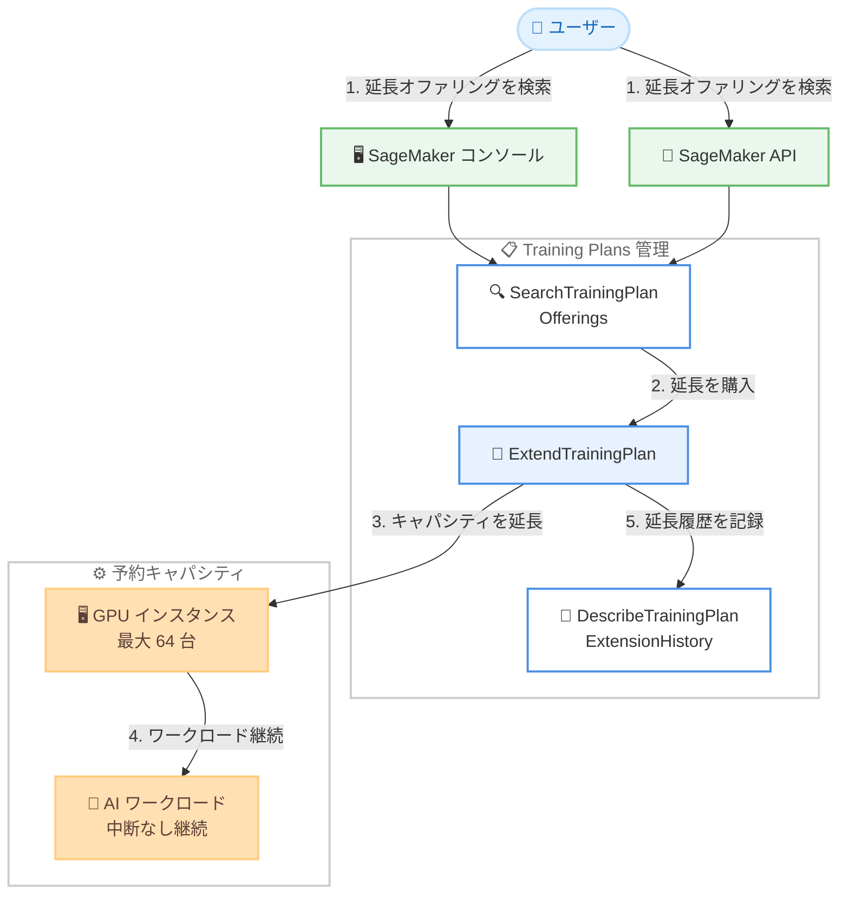

# Amazon SageMaker AI - Training Plans 延長機能

**リリース日**: 2026年03月17日
**サービス**: Amazon SageMaker AI
**機能**: Training Plans の既存キャパシティコミットメント延長

📊 [このアップデートのインフォグラフィックを見る](https://takech9203.github.io/aws-news-summary/20260317-amazon-sagemaker-training-plan-extension.html)

## 概要

Amazon SageMaker AI は、Training Plans の延長機能を発表しました。Training Plans は、指定された時間枠内で最大 64 インスタンスのクラスターサイズで GPU キャパシティを予約できる機能です。今回のアップデートにより、AI ワークロードが予定よりも長くかかる場合に、既存の Training Plans を延長して中断のないキャパシティアクセスを確保できるようになりました。

延長は 1 日単位で最大 14 日間、または 7 日単位で最大 182 日間 (26 週間) まで設定可能です。延長は API または SageMaker コンソールから開始でき、延長が購入されるとワークロードは中断なく継続して実行され、ワークロードの再構成は不要です。

**アップデート前の課題**

- Training Plans の期限が近づいた場合、新しいプランを別途購入して移行する必要があった
- ワークロードが予定よりも長くかかった場合、キャパシティの中断リスクがあった
- プラン変更時にワークロードの再構成が必要で、ダウンタイムが発生していた
- 延長のための柔軟なオプションがなく、事前に正確な期間を見積もる必要があった

**アップデート後の改善**

- 既存の Training Plans を直接延長でき、キャパシティへの中断のないアクセスが保証される
- 1 日単位 (最大 14 日) または 7 日単位 (最大 182 日) の柔軟な延長オプションが利用可能
- ワークロードの再構成が不要で、延長購入後もシームレスに処理が継続される
- API およびコンソールの両方から延長を開始可能

## アーキテクチャ図



ユーザーは SageMaker コンソールまたは API を通じて延長オファリングを検索し、ExtendTrainingPlan API で延長を購入します。延長が適用されると、GPU キャパシティは途切れることなく確保され、AI ワークロードは再構成なしで継続実行されます。

## サービスアップデートの詳細

### 主要機能

1. **Training Plans の直接延長**
   - 既存の Training Plans の有効期限を直接延長可能
   - 延長は即座に適用され、ワークロードの中断なし
   - ワークロードの再構成や再デプロイが不要

2. **柔軟な延長期間**
   - 短期延長: 1 日単位で最大 14 日間
   - 長期延長: 7 日単位で最大 182 日間 (26 週間)
   - ワークロードの要件に応じて適切な延長期間を選択可能

3. **複数の操作インターフェース**
   - SageMaker AI コンソールから GUI で延長を実行可能
   - API (ExtendTrainingPlan) を使用してプログラム的に延長可能
   - AWS CLI からも延長操作を実行可能

## 技術仕様

### 延長パラメータ

| 項目 | 詳細 |
|------|------|
| 短期延長単位 | 1 日単位 |
| 短期延長上限 | 最大 14 日間 |
| 長期延長単位 | 7 日単位 |
| 長期延長上限 | 最大 182 日間 (26 週間) |
| 最大クラスターサイズ | 64 インスタンス |
| 操作方法 | API、コンソール、AWS CLI |

### API 変更履歴

| 日付 | サービス | 変更内容 |
|------|----------|----------|
| 2026/03/11 | [Amazon SageMaker Service](https://awsapichanges.com/archive/changes/537c33-api.sagemaker.html) | 2 new 1 updated api methods - Training Plans 延長機能の API 追加 |

### 新規・更新 API メソッド

```python
# 新規 API: Training Plans の延長を実行
client.extend_training_plan(
    TrainingPlanExtensionOfferingId='string'
)

# 新規 API: Training Plans の延長履歴を取得
client.describe_training_plan_extension_history(
    TrainingPlanArn='string',
    NextToken='string',
    MaxResults=123
)

# 更新 API: Training Plans オファリング検索に延長オファリング検索を追加
client.search_training_plan_offerings(
    InstanceType='ml.p4d.24xlarge'|'ml.p5.48xlarge'|...,
    InstanceCount=123,
    TrainingPlanArn='string'  # 延長オファリング検索用に追加
)
```

### ExtendTrainingPlan レスポンス

```json
{
    "TrainingPlanExtensions": [
        {
            "TrainingPlanExtensionOfferingId": "string",
            "ExtendedAt": "2026-03-17T00:00:00Z",
            "StartDate": "2026-03-17T00:00:00Z",
            "EndDate": "2026-03-31T00:00:00Z",
            "Status": "string",
            "PaymentStatus": "string",
            "AvailabilityZone": "string",
            "AvailabilityZoneId": "string",
            "DurationHours": 336,
            "UpfrontFee": "string",
            "CurrencyCode": "string"
        }
    ]
}
```

## 設定方法

### 前提条件

1. 有効な SageMaker Training Plans が存在すること
2. SageMaker API へのアクセス権限を持つ IAM ロールまたはユーザーがあること
3. Training Plans の延長に必要な IAM ポリシー (sagemaker:ExtendTrainingPlan、sagemaker:SearchTrainingPlanOfferings) が付与されていること

### 手順

#### ステップ 1: 延長オファリングの検索

```bash
aws sagemaker search-training-plan-offerings \
    --instance-type ml.p5.48xlarge \
    --instance-count 16 \
    --training-plan-arn "arn:aws:sagemaker:us-east-1:123456789012:training-plan/my-plan"
```

既存の Training Plan ARN を指定して、利用可能な延長オファリングを検索します。レスポンスの `TrainingPlanExtensionOfferings` に延長可能なオプションが返されます。

#### ステップ 2: Training Plans の延長を実行

```bash
aws sagemaker extend-training-plan \
    --training-plan-extension-offering-id "offering-id-from-step-1"
```

ステップ 1 で取得した延長オファリング ID を使用して、Training Plans の延長を購入します。延長が適用されると、ワークロードは中断なく継続します。

#### ステップ 3: 延長履歴の確認

```bash
aws sagemaker describe-training-plan-extension-history \
    --training-plan-arn "arn:aws:sagemaker:us-east-1:123456789012:training-plan/my-plan"
```

Training Plans の延長履歴を確認し、延長のステータスや支払い状況を把握します。

## メリット

### ビジネス面

- **ワークロードの継続性**: AI トレーニングジョブが予定より長くかかっても、中断なくキャパシティを確保できる
- **運用コストの削減**: ワークロードの再構成やデータの再配置が不要となり、運用負荷を軽減
- **柔軟な予算管理**: 1 日単位から 26 週間単位まで柔軟に延長でき、必要な分だけコストを負担

### 技術面

- **ゼロダウンタイム延長**: 延長購入後にワークロードの再構成が不要で、処理がシームレスに継続
- **API 対応**: プログラム的に延長を実行できるため、自動化ワークフローに組み込み可能
- **延長履歴の追跡**: DescribeTrainingPlanExtensionHistory API で延長履歴を一元管理

## デメリット・制約事項

### 制限事項

- 短期延長は最大 14 日間、長期延長は最大 182 日間 (26 週間) まで
- クラスターサイズは最大 64 インスタンスまでの制限が適用される
- 延長オファリングの可用性はリージョンやインスタンスタイプに依存する

### 考慮すべき点

- 延長は前払い料金が発生するため、延長期間の見積もりを慎重に行う必要がある
- 延長オファリングの価格は需要と供給に基づいて変動する可能性がある
- 延長を購入する前に、SearchTrainingPlanOfferings API で利用可能なオプションを確認することを推奨

## ユースケース

### ユースケース 1: 大規模 LLM トレーニングの延長

**シナリオ**: 大規模言語モデルのトレーニングを 2 週間の Training Plan で開始したが、モデルの収束に予想より時間がかかり、追加で 5 日間のキャパシティが必要になった。

**実装例**:
```bash
# 延長オファリングを検索
aws sagemaker search-training-plan-offerings \
    --instance-type ml.p5.48xlarge \
    --instance-count 32 \
    --training-plan-arn "arn:aws:sagemaker:us-east-1:123456789012:training-plan/llm-training"

# 5 日間の延長を購入
aws sagemaker extend-training-plan \
    --training-plan-extension-offering-id "ext-offering-5days"
```

**効果**: トレーニングジョブを中断することなく、追加の 5 日間でモデルを収束させることができる。チェックポイントからの再開やデータの再配置が不要。

### ユースケース 2: ハイパーパラメータチューニングの追加実行

**シナリオ**: 基盤モデルのファインチューニングを行っており、初期の Training Plan 期間内にハイパーパラメータの最適な組み合わせが見つからなかった。追加で 7 日間の延長が必要。

**実装例**:
```bash
# 7 日間の延長オファリングを検索・購入
aws sagemaker search-training-plan-offerings \
    --training-plan-arn "arn:aws:sagemaker:us-west-2:123456789012:training-plan/finetuning"

aws sagemaker extend-training-plan \
    --training-plan-extension-offering-id "ext-offering-7days"
```

**効果**: 追加のチューニング実験を中断なく実行でき、最適なモデルパフォーマンスを達成できる。

### ユースケース 3: マルチフェーズトレーニングパイプライン

**シナリオ**: 事前学習、ファインチューニング、評価の 3 フェーズで構成されるトレーニングパイプラインを実行中。事前学習フェーズが予定より長くかかり、パイプライン全体のスケジュールが遅延。

**実装例**:
```python
import boto3

client = boto3.client('sagemaker')

# 延長オファリングを検索
offerings = client.search_training_plan_offerings(
    InstanceType='ml.p5.48xlarge',
    InstanceCount=64,
    TrainingPlanArn='arn:aws:sagemaker:us-east-1:123456789012:training-plan/pipeline'
)

# 適切な延長オファリングを選択して購入
extension_id = offerings['TrainingPlanExtensionOfferings'][0]['TrainingPlanExtensionOfferingId']
client.extend_training_plan(
    TrainingPlanExtensionOfferingId=extension_id
)
```

**効果**: パイプライン全体を再構築することなく、キャパシティを延長して残りのフェーズを完了できる。

## 料金

Training Plans の延長は前払い料金 (UpfrontFee) が発生します。延長の料金は、インスタンスタイプ、インスタンス数、延長期間に基づいて計算されます。具体的な料金は SearchTrainingPlanOfferings API の `TrainingPlanExtensionOfferings` レスポンスで確認できます。

### 料金例

延長オファリングの料金は動的に決定されるため、実際の料金は API レスポンスの `UpfrontFee` フィールドで確認してください。詳細は [Amazon SageMaker 料金ページ](https://aws.amazon.com/sagemaker/pricing/) を参照してください。

## 利用可能リージョン

SageMaker Training Plans が利用可能なすべての AWS リージョンでこの延長機能を利用できます。対応インスタンスタイプには ml.p4d.24xlarge、ml.p4de.24xlarge、ml.p5.48xlarge、ml.p5.4xlarge、ml.p5e.48xlarge、ml.p5en.48xlarge、ml.p6-b200.48xlarge、ml.p6-b300.48xlarge、ml.p6e-gb200.36xlarge、ml.trn1.32xlarge、ml.trn2.48xlarge が含まれます。

## 関連サービス・機能

- **Amazon SageMaker Training Plans**: GPU キャパシティを予約して AI/ML トレーニングジョブを実行するための基盤機能
- **Amazon SageMaker HyperPod**: 大規模な AI/ML ワークロードを実行するための耐障害性クラスター管理サービス
- **Amazon SageMaker Training Jobs**: モデルトレーニングジョブの実行と管理を行うサービス

## 参考リンク

- 📊 [インフォグラフィック](https://takech9203.github.io/aws-news-summary/20260317-amazon-sagemaker-training-plan-extension.html)
- [公式発表 (What's New)](https://aws.amazon.com/about-aws/whats-new/2026/03/amazon-sagemaker-training-plan-extension/)
- [ドキュメント - SageMaker Training Plans](https://docs.aws.amazon.com/sagemaker/latest/dg/training-plan.html)
- [Amazon SageMaker 料金ページ](https://aws.amazon.com/sagemaker/pricing/)

## まとめ

Amazon SageMaker AI の Training Plans 延長機能は、AI ワークロードが予定より長くかかった場合にキャパシティを中断なく延長できる実用的なアップデートです。ワークロードの再構成が不要でゼロダウンタイムの延長が可能なため、大規模なモデルトレーニングを行う組織にとって運用効率の大幅な改善が期待できます。Training Plans を使用している組織は、延長オファリングの検索を自動化ワークフローに組み込み、キャパシティ管理の柔軟性を向上させることを推奨します。
