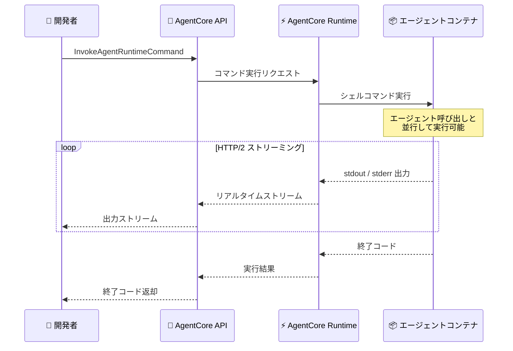

# Amazon Bedrock AgentCore Runtime - シェルコマンド実行サポート

**リリース日**: 2026 年 3 月 17 日
**サービス**: Amazon Bedrock AgentCore Runtime
**機能**: InvokeAgentRuntimeCommand API

[このアップデートのインフォグラフィックを見る](https://takech9203.github.io/aws-news-summary/20260317-bedrock-agentcore-runtime-shell-command.html)

## 概要

Amazon Bedrock AgentCore Runtime が InvokeAgentRuntimeCommand という新しい API をサポートした。この API により、実行中の AgentCore Runtime セッション内でシェルコマンドを直接実行できるようになった。開発者はコマンドを送信し、HTTP/2 経由でリアルタイムに出力をストリーミング受信し、終了コードを取得できる。

AI エージェントは、テストの実行、依存関係のインストール、git コマンドの実行など、LLM による推論と並行して決定論的な操作を実行するワークフローで動作することが多い。今回のアップデートにより、コンテナ内にカスタムのコマンド実行ロジックを構築する必要がなくなり、プラットフォームレベルの API として提供されるようになった。

**アップデート前の課題**

- エージェント呼び出しとシェルコマンドを区別するカスタムロジックをコンテナ内に構築する必要があった
- 子プロセスの生成、stdout/stderr のキャプチャ、タイムアウト処理を開発者が独自に実装する必要があった
- コマンド実行のための差別化されない作業に開発リソースを費やしていた
- エージェントの推論処理中にシェルコマンドを並行実行する仕組みを独自に構築する必要があった

**アップデート後の改善**

- InvokeAgentRuntimeCommand API により、プラットフォームレベルでシェルコマンドを実行できるようになった
- HTTP/2 経由でコマンド出力をリアルタイムにストリーミング受信できるようになった
- コマンドはエージェントセッションと同じコンテナ、ファイルシステム、環境内で実行され、エージェント呼び出しをブロックせずに並行実行が可能になった
- カスタムのコマンド実行ロジックが不要になり、開発者はエージェントのコアロジックに集中できるようになった

## アーキテクチャ図



InvokeAgentRuntimeCommand API によるシェルコマンド実行のフローを示す。開発者が API を呼び出すと、エージェントと同じコンテナ内でコマンドが実行され、出力が HTTP/2 経由でリアルタイムにストリーミングされる。

## サービスアップデートの詳細

### 主要機能

1. **InvokeAgentRuntimeCommand API**
   - 実行中の AgentCore Runtime セッション内でシェルコマンドを直接実行する新しい API
   - エージェント呼び出しとは独立して動作し、ブロッキングなしで並行実行が可能
   - コマンドの終了コードを返却し、成功・失敗の判定が容易

2. **HTTP/2 リアルタイムストリーミング**
   - コマンドの stdout および stderr 出力を HTTP/2 経由でリアルタイムにストリーミング
   - 長時間実行されるコマンドの進捗をリアルタイムに監視可能
   - ストリーミングにより、コマンド完了を待たずに出力を逐次確認できる

3. **同一環境での実行**
   - コマンドはエージェントセッションと同じコンテナ、ファイルシステム、環境で実行
   - エージェントが生成したファイルやインストールしたパッケージに直接アクセス可能
   - 環境変数やワーキングディレクトリを共有するため、追加の設定が不要

## 技術仕様

### API 仕様

| 項目 | 詳細 |
|------|------|
| API 名 | InvokeAgentRuntimeCommand |
| プロトコル | HTTP/2 |
| 出力形式 | リアルタイムストリーミング |
| 返却値 | stdout/stderr ストリーム、終了コード |
| 実行環境 | エージェントセッションと同一コンテナ |
| 並行実行 | エージェント呼び出しと並行可能 |

### API 変更履歴

| 日付 | サービス | 変更内容 |
|------|----------|----------|
| 2026/03/16 | [Amazon Bedrock AgentCore](https://awsapichanges.com/archive/changes/dac0d1-bedrock-agentcore.html) | 1 new api method - InvokeAgentRuntimeCommand API の追加。エージェントランタイムでのシェルコマンド実行をサポート |
| 2026/03/17 | [Amazon Bedrock AgentCore Control](https://awsapichanges.com/archive/changes/bda7d0-bedrock-agentcore-control.html) | 3 updated api methods - namespaces フィールドの非推奨化と namespaceTemplates の追加 (CreateMemory, GetMemory, UpdateMemory) |

### IAM ポリシー例

```json
{
  "Version": "2012-10-17",
  "Statement": [
    {
      "Effect": "Allow",
      "Action": [
        "bedrock:InvokeAgentRuntimeCommand"
      ],
      "Resource": "arn:aws:bedrock:*:*:agent-runtime/*"
    }
  ]
}
```

## 設定方法

### 前提条件

1. AWS アカウントと AgentCore Runtime へのアクセス権限
2. 実行中の AgentCore Runtime セッション
3. InvokeAgentRuntimeCommand に対する IAM 権限

### 手順

#### ステップ 1: AgentCore Runtime セッションの起動

```bash
# AgentCore Runtime を作成
aws bedrock-agentcore-control create-agent-runtime \
  --agent-runtime-name my-agent \
  --agent-runtime-artifact '{"containerConfiguration":{"containerUri":"123456789012.dkr.ecr.us-east-1.amazonaws.com/my-agent:latest"}}' \
  --role-arn arn:aws:iam::123456789012:role/AgentCoreRuntimeRole
```

AgentCore Runtime を作成し、エージェントコンテナをデプロイする。

#### ステップ 2: シェルコマンドの実行

```python
import boto3

client = boto3.client('bedrock-agentcore')

# シェルコマンドを実行し、出力をストリーミング受信
response = client.invoke_agent_runtime_command(
    agentRuntimeId='my-agent-runtime-id',
    sessionId='my-session-id',
    command='pip install pandas && python run_analysis.py'
)

# ストリーミング出力の処理
for event in response['outputStream']:
    if 'stdout' in event:
        print(event['stdout'])
    if 'stderr' in event:
        print(f"ERROR: {event['stderr']}")

print(f"Exit code: {response['exitCode']}")
```

InvokeAgentRuntimeCommand API を使用してシェルコマンドを実行し、ストリーミング出力を受信する例を示している。

#### ステップ 3: エージェントワークフローへの統合

```python
# エージェントの推論とシェルコマンドを組み合わせたワークフロー例
import asyncio

async def agent_workflow(client, runtime_id, session_id):
    # エージェント呼び出し (LLM 推論)
    agent_task = asyncio.create_task(
        client.invoke_agent_runtime(
            agentRuntimeId=runtime_id,
            sessionId=session_id,
            inputText='テストコードを生成してください'
        )
    )

    # シェルコマンド (並行実行)
    command_task = asyncio.create_task(
        client.invoke_agent_runtime_command(
            agentRuntimeId=runtime_id,
            sessionId=session_id,
            command='git status'
        )
    )

    # 両方の結果を待機
    agent_result, command_result = await asyncio.gather(
        agent_task, command_task
    )
```

エージェントの LLM 推論とシェルコマンドを並行して実行するワークフローの例を示している。

## メリット

### ビジネス面

- **開発工数の削減**: コマンド実行ロジックの自前実装が不要になり、エージェント開発に集中できる
- **市場投入の加速**: プラットフォームレベルの API を利用することで、エージェントの機能拡張が迅速に行える
- **運用コストの削減**: カスタムのプロセス管理やエラーハンドリングのメンテナンスが不要になる

### 技術面

- **アーキテクチャの簡素化**: コンテナ内にカスタムのコマンド実行レイヤーを構築する必要がなくなり、コンテナイメージが軽量化される
- **信頼性の向上**: プラットフォームレベルで標準化されたコマンド実行により、プロセス管理やタイムアウト処理が安定する
- **並行処理の実現**: エージェント呼び出しとシェルコマンドをブロッキングなしで並行実行できるため、ワークフロー全体のスループットが向上する

## デメリット・制約事項

### 制限事項

- コマンドはエージェントセッションと同じコンテナ内で実行されるため、コンテナに含まれていないツールやコマンドは使用できない
- セキュリティの観点から、実行可能なコマンドの範囲はコンテナの権限と設定に依存する
- HTTP/2 ストリーミングを利用するため、クライアント側で HTTP/2 をサポートする必要がある

### 考慮すべき点

- シェルコマンドの実行権限はコンテナの IAM ロールとセキュリティ設定に基づくため、適切な権限設計が必要
- 長時間実行されるコマンドについては、タイムアウトの設定とエラーハンドリングを考慮する必要がある
- コマンドの実行結果がエージェントの推論に影響する場合、実行順序の制御を適切に設計する必要がある

## ユースケース

### ユースケース 1: 自動テスト実行エージェント

**シナリオ**: AI エージェントがコードを生成した後、InvokeAgentRuntimeCommand を使用してテストを実行し、結果に基づいてコードを修正するワークフロー。

**実装例**:
```python
# エージェントがコードを生成
code = await invoke_agent("ユーザー認証の API を実装してください")

# 生成したコードのテストを実行
test_result = client.invoke_agent_runtime_command(
    agentRuntimeId=runtime_id,
    sessionId=session_id,
    command='python -m pytest tests/ -v'
)

# テスト失敗時にエージェントにフィードバック
if test_result['exitCode'] != 0:
    fix = await invoke_agent(f"テストが失敗しました: {test_result['output']}")
```

**効果**: エージェントの推論とテスト実行を同一セッション内でシームレスに連携でき、コード品質の自動検証ループを構築できる。

### ユースケース 2: 依存関係管理とビルド自動化

**シナリオ**: エージェントがプロジェクトの依存関係を分析し、必要なパッケージのインストールやビルドプロセスを自動的に実行する。

**実装例**:
```python
# 依存関係のインストール
install_result = client.invoke_agent_runtime_command(
    agentRuntimeId=runtime_id,
    sessionId=session_id,
    command='pip install -r requirements.txt'
)

# ビルドの実行
build_result = client.invoke_agent_runtime_command(
    agentRuntimeId=runtime_id,
    sessionId=session_id,
    command='python setup.py build'
)

# ストリーミングで進捗を監視
for event in build_result['outputStream']:
    print(event.get('stdout', ''))
```

**効果**: エージェントが推論した依存関係情報に基づいて、パッケージのインストールからビルドまでを一貫して自動化できる。

### ユースケース 3: Git 操作を含むコード管理エージェント

**シナリオ**: エージェントがコード変更を行った後、git コマンドを使用してブランチ作成、コミット、プッシュを自動的に実行する。

**実装例**:
```python
# ブランチの作成とチェックアウト
client.invoke_agent_runtime_command(
    agentRuntimeId=runtime_id,
    sessionId=session_id,
    command='git checkout -b feature/auto-fix-123'
)

# 変更のステージングとコミット
client.invoke_agent_runtime_command(
    agentRuntimeId=runtime_id,
    sessionId=session_id,
    command='git add -A && git commit -m "fix: auto-generated bug fix"'
)

# リモートへのプッシュ
client.invoke_agent_runtime_command(
    agentRuntimeId=runtime_id,
    sessionId=session_id,
    command='git push origin feature/auto-fix-123'
)
```

**効果**: エージェントによるコード変更からバージョン管理までを一連のワークフローとして自動化でき、開発プロセスの効率化を実現できる。

## 料金

AgentCore Runtime の料金は、microVM の実行時間とリソース使用量に基づく。InvokeAgentRuntimeCommand API の利用は AgentCore Runtime のセッション内で実行されるため、追加の API 呼び出し料金は発生せず、既存のランタイム料金に含まれる。詳細な料金情報は Amazon Bedrock の料金ページを参照のこと。

## 利用可能リージョン

以下の 14 リージョンで利用可能。

| リージョン | コード |
|-----------|--------|
| 米国東部 (バージニア北部) | us-east-1 |
| 米国東部 (オハイオ) | us-east-2 |
| 米国西部 (オレゴン) | us-west-2 |
| アジアパシフィック (ムンバイ) | ap-south-1 |
| カナダ (中部) | ca-central-1 |
| アジアパシフィック (ソウル) | ap-northeast-2 |
| アジアパシフィック (シンガポール) | ap-southeast-1 |
| アジアパシフィック (シドニー) | ap-southeast-2 |
| アジアパシフィック (東京) | ap-northeast-1 |
| 欧州 (フランクフルト) | eu-central-1 |
| 欧州 (アイルランド) | eu-west-1 |
| 欧州 (ロンドン) | eu-west-2 |
| 欧州 (パリ) | eu-west-3 |
| 欧州 (ストックホルム) | eu-north-1 |

## 関連サービス・機能

- **Amazon Bedrock AgentCore Runtime**: エージェントのホスティング基盤で、認証、セッション分離、スケーリングを自動管理。今回の InvokeAgentRuntimeCommand はこのランタイム上で動作する
- **Model Context Protocol (MCP)**: エージェントにツールやコンテキストを提供するプロトコル。シェルコマンド実行と組み合わせて、ツール連携と決定論的操作の両方を実現可能
- **Agent-to-Agent (A2A) Protocol**: エージェント間通信を実現するプロトコル。複数エージェントが連携するワークフローでシェルコマンドを共有環境で実行可能

## 参考リンク

- [インフォグラフィック](https://takech9203.github.io/aws-news-summary/20260317-bedrock-agentcore-runtime-shell-command.html)
- [公式発表 (What's New)](https://aws.amazon.com/about-aws/whats-new/2026/03/bedrock-agentcore-runtime-shell-command/)
- [Amazon Bedrock AgentCore ドキュメント](https://docs.aws.amazon.com/bedrock/latest/userguide/agentcore.html)
- [Amazon Bedrock 料金ページ](https://aws.amazon.com/bedrock/pricing/)

## まとめ

Amazon Bedrock AgentCore Runtime の InvokeAgentRuntimeCommand API により、エージェントセッション内でシェルコマンドをプラットフォームレベルで実行できるようになった。テスト実行、依存関係のインストール、git 操作などの決定論的な操作を、カスタムロジックを構築することなく API 経由で実行でき、HTTP/2 による出力のリアルタイムストリーミングも提供される。14 リージョン (東京リージョンを含む) で利用可能であり、AI エージェントの開発効率を大幅に向上させるアップデートである。
