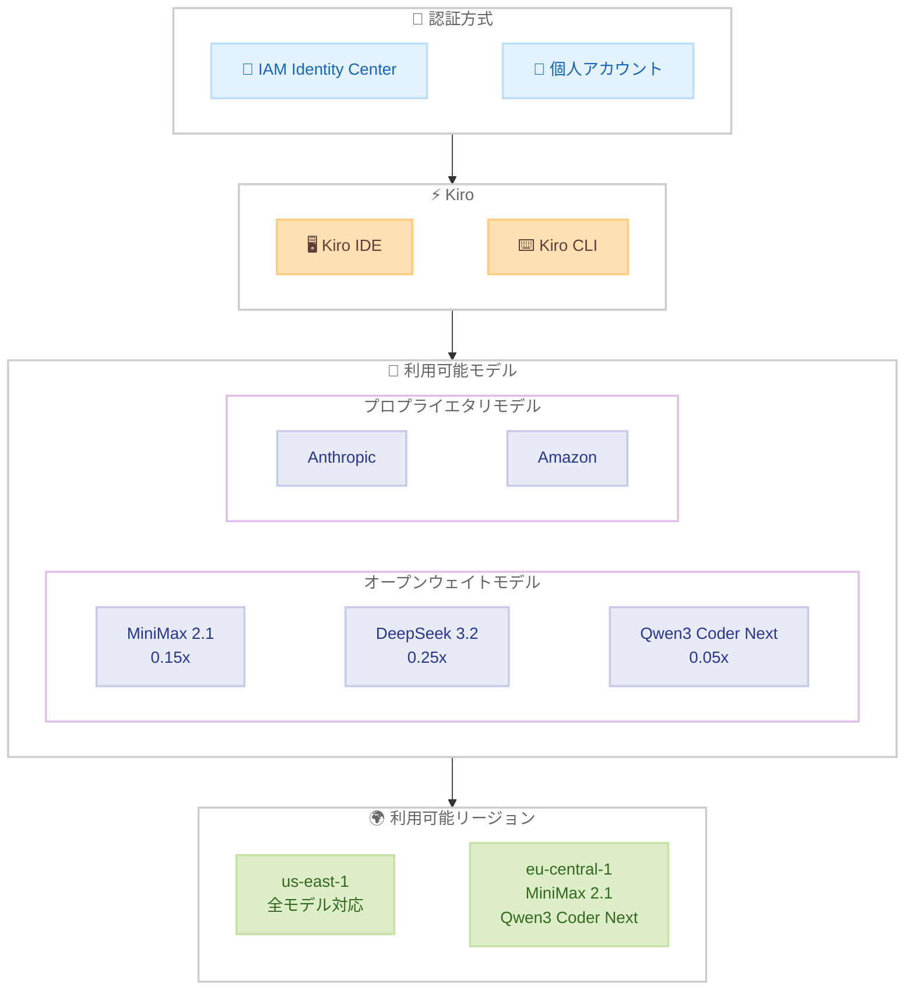

# Kiro - オープンウェイトモデルが IAM Identity Center ユーザーに提供開始

**リリース日**: 2026年3月17日
**サービス**: Kiro
**機能**: オープンウェイトモデルの IAM Identity Center ユーザーへの提供拡大

[このアップデートのインフォグラフィックを見る](https://takech9203.github.io/aws-news-summary/20260317-kiro-changelog-2026-03-17.html)

## 概要

Kiro (AWS が提供する AI 搭載 IDE) において、オープンウェイトモデルである MiniMax 2.1、DeepSeek 3.2、Qwen3 Coder Next が AWS IAM Identity Center ユーザーでも利用可能になりました。これにより、企業の SSO 認証を利用している組織のユーザーも、これらのモデルを Kiro IDE および CLI の両方で活用できるようになります。

3 つのオープンウェイトモデルはすべてのプランで利用可能であり、クレジット倍率もそれぞれ異なるため、コストとパフォーマンスのバランスに応じたモデル選択が可能です。DeepSeek 3.2 は 0.25 倍、MiniMax 2.1 は 0.15 倍、Qwen3 Coder Next は 0.05 倍のクレジット消費で利用でき、Anthropic や Amazon のモデルと比較して低コストでの運用が可能です。

このアップデートは、2026年2月にリリースされたオープンウェイトモデル対応の拡張であり、IAM Identity Center を利用する企業ユーザーへのアクセスを追加することで、エンタープライズ環境でのモデル選択の幅が広がります。

**アップデート前の課題**

- IAM Identity Center で認証しているユーザーはオープンウェイトモデルを利用できず、Anthropic や Amazon のモデルのみ選択可能だった
- 企業ユーザーは低コストのオープンウェイトモデルを活用できず、クレジット消費の最適化が制限されていた
- IAM Identity Center 環境と個人アカウント環境でモデルの利用可能範囲に差異があった

**アップデート後の改善**

- IAM Identity Center ユーザーが MiniMax 2.1、DeepSeek 3.2、Qwen3 Coder Next を利用可能になった
- 全プランで利用でき、IDE と CLI の両方で使用できる
- 低クレジット倍率のモデルを活用することで、企業ユーザーもコスト効率の高い AI 支援コーディングが可能になった

## アーキテクチャ図

この図は、IAM Identity Center および個人アカウントの両方の認証方式から Kiro IDE/CLI を通じてオープンウェイトモデルおよびプロプライエタリモデルにアクセスする構成を示しています。モデルごとに利用可能なリージョンが異なります。

## サービスアップデートの詳細

### 主要機能

1. **IAM Identity Center ユーザーへのオープンウェイトモデル提供**
   - AWS IAM Identity Center (旧 AWS SSO) で認証するユーザーがオープンウェイトモデルを利用可能に
   - 企業の一元管理された認証基盤を利用しながら、モデル選択の幅が拡大
   - 全プラン (Free、Pro、Pro+) で利用可能

2. **3 つのオープンウェイトモデル**
   - MiniMax 2.1: 汎用的なコーディング支援に対応、0.15 倍のクレジット倍率で利用可能
   - DeepSeek 3.2: コード生成・理解に強みを持つモデル、0.25 倍のクレジット倍率
   - Qwen3 Coder Next: 最もコスト効率の高い選択肢、0.05 倍のクレジット倍率

3. **IDE と CLI の両方で利用可能**
   - Kiro IDE (デスクトップアプリケーション) でのモデル選択に対応
   - Kiro CLI でも同様にモデルを切り替えて利用可能
   - ユーザーのワークフローに応じた柔軟な利用形態を提供

## 技術仕様

### モデル比較

| モデル | クレジット倍率 | 利用可能リージョン | インターフェース |
|--------|---------------|-------------------|-----------------|
| MiniMax 2.1 | 0.15x | us-east-1, eu-central-1 | IDE, CLI |
| DeepSeek 3.2 | 0.25x | us-east-1 | IDE, CLI |
| Qwen3 Coder Next | 0.05x | us-east-1, eu-central-1 | IDE, CLI |

### 対応認証方式

| 認証方式 | オープンウェイトモデル対応 |
|----------|--------------------------|
| 個人アカウント (Builder ID) | 対応済み (2026年2月以降) |
| IAM Identity Center (SSO) | 今回のアップデートで対応 |

## 設定方法

### 前提条件

1. Kiro IDE または CLI がインストールされていること
2. AWS IAM Identity Center を通じた認証が設定済みであること
3. 有効な Kiro プラン (Free、Pro、または Pro+) を保有していること

### 手順

#### ステップ 1: Kiro でのモデル選択

Kiro IDE のモデルセレクターから、利用したいオープンウェイトモデルを選択します。モデルセレクターは IDE のチャットパネル上部に表示されます。

#### ステップ 2: CLI でのモデル指定

Kiro CLI を使用する場合は、設定またはコマンドオプションでモデルを指定します。利用可能なモデルの一覧は Kiro のドキュメントで確認できます。

#### ステップ 3: エンタープライズ管理者によるモデルガバナンス

IAM Identity Center 環境では、管理者が Kiro コンソールの Settings > Shared settings > Model availability からモデルの利用可否を制御できます。データレジデンシー要件がある場合は、利用可能なモデルを制限することも可能です。

## メリット

### ビジネス面

- **コスト削減**: オープンウェイトモデルは低いクレジット倍率で利用でき、特に Qwen3 Coder Next (0.05 倍) は大幅なコスト削減が可能
- **エンタープライズ対応の強化**: IAM Identity Center との統合により、企業のセキュリティポリシーに準拠した形でモデルを活用可能
- **モデル選択の柔軟性**: タスクの複雑さやコスト要件に応じて最適なモデルを選択可能

### 技術面

- **マルチリージョン対応**: MiniMax 2.1 と Qwen3 Coder Next は eu-central-1 でも利用可能であり、欧州のデータレジデンシー要件に対応
- **統一されたインターフェース**: IDE と CLI の両方で同じモデルを利用でき、開発ワークフローの一貫性を確保
- **モデルガバナンス連携**: 管理者がモデルの利用可否をコントロールでき、組織のポリシーに沿った運用が可能

## デメリット・制約事項

### 制限事項

- DeepSeek 3.2 は us-east-1 リージョンのみで利用可能であり、eu-central-1 では利用できない
- オープンウェイトモデルの性能は Anthropic のフラグシップモデルと比較すると限定的な場合がある
- リージョンによって利用可能なモデルが異なるため、データレジデンシー要件と合わせた検討が必要

### 考慮すべき点

- クレジット倍率が低いモデルはコスト効率が良い一方、複雑なタスクではより高性能なモデルが適している場合がある
- エンタープライズ管理者がモデルガバナンス機能を使用している場合、利用可能なモデルが制限されている可能性がある

## ユースケース

### ユースケース 1: コスト効率を重視した日常的なコーディング支援

**シナリオ**: 大規模な開発チームが日常的なコード補完やリファクタリングに Kiro を利用しており、コスト管理が重要な課題となっている。

**効果**: Qwen3 Coder Next (0.05 倍) を日常的なタスクに使用し、複雑な設計やデバッグには Anthropic モデルを使用することで、クレジット消費を大幅に削減しながら生産性を維持できる。

### ユースケース 2: 欧州データレジデンシー要件への対応

**シナリオ**: 欧州に拠点を持つ企業が、GDPR などのデータレジデンシー要件に準拠しながら AI コーディング支援を活用したい。

**効果**: MiniMax 2.1 または Qwen3 Coder Next を eu-central-1 (フランクフルト) リージョンで利用することで、データが欧州リージョン内で処理される構成を実現できる。

### ユースケース 3: エンタープライズでのモデルガバナンス

**シナリオ**: セキュリティ要件の厳しい企業で、IAM Identity Center を通じた認証管理と合わせて、利用可能な AI モデルを統制したい。

**効果**: 管理者がモデルガバナンス機能を使用して承認済みのオープンウェイトモデルのみを許可リストに登録し、組織全体で一貫したモデル利用ポリシーを適用できる。

## 料金

Kiro のオープンウェイトモデルは、各プランに含まれるクレジットを使用して利用します。クレジット倍率が低いほど、同じクレジット量でより多くのリクエストを処理できます。

### クレジット倍率比較

| モデル | クレジット倍率 | 特徴 |
|--------|---------------|------|
| Qwen3 Coder Next | 0.05x | 最もコスト効率が高い |
| MiniMax 2.1 | 0.15x | バランスの取れた選択肢 |
| DeepSeek 3.2 | 0.25x | コーディング性能重視 |

## 利用可能リージョン

グローバル (Kiro 自体はグローバルサービスとして提供)

モデルの推論リージョンは以下の通りです。

| リージョン | 対応モデル |
|-----------|-----------|
| us-east-1 (バージニア北部) | MiniMax 2.1, DeepSeek 3.2, Qwen3 Coder Next |
| eu-central-1 (フランクフルト) | MiniMax 2.1, Qwen3 Coder Next |

## 関連サービス・機能

- **IAM Identity Center**: 企業向け SSO 認証基盤。Kiro へのアクセス管理に使用
- **Kiro モデルガバナンス**: エンタープライズ管理者が利用可能なモデルを制御する機能 (2026年3月11日リリース)
- **Amazon Bedrock**: Kiro がバックエンドで利用する AI モデルの推論基盤

## 参考リンク

- [このアップデートのインフォグラフィック](https://takech9203.github.io/aws-news-summary/20260317-kiro-changelog-2026-03-17.html)
- [公式発表 (Kiro Changelog)](https://kiro.dev/changelog/)
- [Kiro モデルドキュメント](https://kiro.dev/docs/models/)
- [Kiro Blog - Open weight models are here](https://kiro.dev/blog/)
- [Kiro Blog - Enterprise governance: control your MCP servers and models](https://kiro.dev/blog/)

## まとめ

MiniMax 2.1、DeepSeek 3.2、Qwen3 Coder Next のオープンウェイトモデルが IAM Identity Center ユーザーに提供開始されたことで、企業環境でもコスト効率の高いモデル選択が可能になりました。特に Qwen3 Coder Next は 0.05 倍という低いクレジット倍率で利用できるため、日常的なコーディングタスクでのコスト最適化に有効です。IAM Identity Center を利用している組織は、モデルガバナンス機能と組み合わせることで、セキュリティポリシーに準拠しながら最適なモデル活用戦略を策定することを推奨します。
