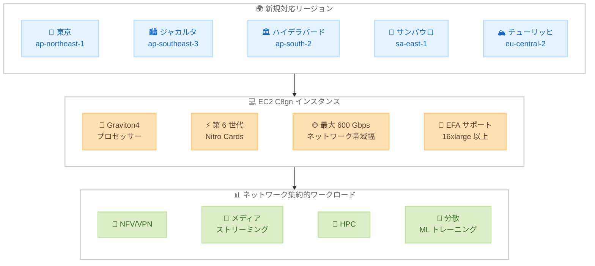

# Amazon EC2 - C8gn インスタンスが東京リージョンを含む追加リージョンで利用可能に

**リリース日**: 2026年03月19日
**サービス**: Amazon EC2
**機能**: C8gn ネットワーク最適化コンピューティングインスタンス

📊 [このアップデートのインフォグラフィックを見る](https://takech9203.github.io/aws-news-summary/20260319-amazon-ec2-c8gn-instances-additional-regions.html)

## 概要

AWS は 2026 年 3 月 19 日、Amazon EC2 C8gn インスタンスが、アジアパシフィック (ジャカルタ、ハイデラバード、東京)、南米 (サンパウロ)、欧州 (チューリッヒ) の 5 つの追加リージョンで利用可能になったことを発表しました。C8gn インスタンスは AWS Graviton4 プロセッサーを搭載し、前世代の C7gn インスタンスと比較して最大 30% 優れたコンピューティングパフォーマンスを提供します。

C8gn インスタンスは、第 6 世代の AWS Nitro Cards を搭載し、EC2 のネットワーク最適化インスタンスの中で最高となる最大 600 Gbps のネットワーク帯域幅を実現します。インスタンスサイズは最大 48xlarge で、最大 384 GiB のメモリと最大 60 Gbps の EBS 帯域幅を提供します。16xlarge 以上のサイズでは Elastic Fabric Adapter (EFA) をサポートし、高帯域幅・低レイテンシーのネットワーク通信を実現します。

東京リージョン (ap-northeast-1) での提供開始により、日本国内のお客様もネットワーク集約的なワークロードで C8gn インスタンスの高性能ネットワーキング機能を活用できるようになりました。

**アップデート前の課題**

- 東京リージョンでは C8gn インスタンスが利用できず、Graviton4 ベースのネットワーク最適化インスタンスを活用できなかった
- C7gn インスタンスでは最大 200 Gbps のネットワーク帯域幅に制限されており、超高帯域幅を必要とするワークロードに対応が難しかった
- ジャカルタ、ハイデラバード、サンパウロ、チューリッヒの各リージョンでもネットワーク最適化 Graviton インスタンスの選択肢が限られていた

**アップデート後の改善**

- 東京リージョンを含む 5 つの追加リージョンで C8gn インスタンスが利用可能になり、ネットワーク集約的ワークロードの選択肢が拡大
- 最大 600 Gbps のネットワーク帯域幅により、超高帯域幅を必要とするアプリケーションに対応可能
- Graviton4 プロセッサーにより C7gn 比で最大 30% のコンピューティングパフォーマンス向上を実現
- 第 6 世代 AWS Nitro Cards による最新のネットワーキングアクセラレーションを活用可能

## アーキテクチャ図



この図は、C8gn インスタンスが新たに利用可能になった 5 つのリージョンと、Graviton4 プロセッサー、第 6 世代 Nitro Cards、最大 600 Gbps ネットワーク帯域幅を備えたインスタンスの主要コンポーネント、および対象となるネットワーク集約的ワークロードの関係を示しています。

## サービスアップデートの詳細

### 主要機能

1. **Graviton4 プロセッサー搭載**
   - AWS 独自開発の Arm ベースプロセッサー Graviton4 を搭載
   - C7gn インスタンスと比較して最大 30% 優れたコンピューティングパフォーマンスを実現
   - 電力効率に優れ、同等の x86 ベースインスタンスと比較してコストパフォーマンスが向上

2. **最大 600 Gbps ネットワーク帯域幅**
   - EC2 のネットワーク最適化インスタンスの中で最高のネットワーク帯域幅を提供
   - 第 6 世代 AWS Nitro Cards によるハードウェアアクセラレーションを活用
   - ネットワーク集約的なワークロードで卓越したスループットを実現

3. **Elastic Fabric Adapter サポート**
   - 16xlarge 以上のインスタンスサイズで EFA をサポート
   - HPC や分散機械学習トレーニングなど、ノード間通信が重要なワークロードに最適
   - 低レイテンシー・高帯域幅のノード間通信を実現

## 技術仕様

### C8gn インスタンスの主要仕様

| 項目 | 詳細 |
|------|------|
| プロセッサー | AWS Graviton4 |
| Nitro Cards | 第 6 世代 |
| 最大インスタンスサイズ | 48xlarge |
| 最大メモリ | 384 GiB |
| 最大ネットワーク帯域幅 | 600 Gbps |
| 最大 EBS 帯域幅 | 60 Gbps |
| EFA サポート | 16xlarge 以上 |

### C7gn との比較

| 指標 | C8gn | C7gn |
|------|------|------|
| プロセッサー | Graviton4 | Graviton3 |
| コンピューティング性能 | 最大 30% 向上 | ベースライン |
| 最大ネットワーク帯域幅 | 600 Gbps | 200 Gbps |
| Nitro Cards 世代 | 第 6 世代 | 第 5 世代 |
| 最大インスタンスサイズ | 48xlarge | 16xlarge |
| 最大メモリ | 384 GiB | 128 GiB |

## 設定方法

### 前提条件

1. AWS アカウントと適切な IAM 権限
2. 対象リージョンへのアクセス (東京、ジャカルタ、ハイデラバード、サンパウロ、チューリッヒ)
3. Arm (aarch64/arm64) アーキテクチャ対応の AMI

### 手順

#### ステップ1: 利用可能なインスタンスタイプを確認

```bash
# 東京リージョンで利用可能な C8gn インスタンスタイプを確認
aws ec2 describe-instance-types \
  --filters "Name=instance-type,Values=c8gn.*" \
  --region ap-northeast-1 \
  --query "InstanceTypes[].{Type:InstanceType,vCPU:VCpuInfo.DefaultVCpus,Memory:MemoryInfo.SizeInMiB,Network:NetworkInfo.NetworkPerformance}" \
  --output table
```

このコマンドは、東京リージョンで利用可能な C8gn インスタンスタイプの一覧を、vCPU 数、メモリサイズ、ネットワーク性能とともに表示します。

#### ステップ2: C8gn インスタンスを起動

```bash
# Graviton4 対応 AMI で C8gn インスタンスを起動
aws ec2 run-instances \
  --image-id ami-xxxxxxxxxxxxxxxxx \
  --instance-type c8gn.16xlarge \
  --region ap-northeast-1 \
  --subnet-id subnet-xxxxxxxxxxxxxxxxx \
  --security-group-ids sg-xxxxxxxxxxxxxxxxx \
  --key-name my-key-pair
```

このコマンドは、東京リージョンで C8gn.16xlarge インスタンスを起動します。AMI は Arm (arm64) アーキテクチャ対応のものを指定してください。

#### ステップ3: EFA を有効にして起動 (16xlarge 以上)

```bash
# EFA 付きで C8gn インスタンスを起動
aws ec2 run-instances \
  --image-id ami-xxxxxxxxxxxxxxxxx \
  --instance-type c8gn.48xlarge \
  --region ap-northeast-1 \
  --network-interfaces "DeviceIndex=0,SubnetId=subnet-xxxxxxxxxxxxxxxxx,Groups=sg-xxxxxxxxxxxxxxxxx,InterfaceType=efa" \
  --key-name my-key-pair
```

このコマンドは、EFA を有効にした C8gn.48xlarge インスタンスを起動します。EFA は 16xlarge 以上のインスタンスサイズでサポートされます。

## メリット

### ビジネス面

- **東京リージョンでの低レイテンシー**: 日本国内のお客様がネットワーク集約的なワークロードを低レイテンシーで実行可能になり、データ主権要件にも対応
- **コスト効率の向上**: Graviton4 プロセッサーの電力効率により、同等の x86 ベースインスタンスと比較して優れたコストパフォーマンスを実現
- **グローバル展開の拡大**: 5 つの追加リージョンにより、グローバルに分散されたネットワーク集約的アプリケーションの展開が容易に

### 技術面

- **最高のネットワーク帯域幅**: EC2 ネットワーク最適化インスタンスの中で最高となる 600 Gbps のネットワーク帯域幅
- **30% のパフォーマンス向上**: Graviton4 により C7gn 比で最大 30% のコンピューティングパフォーマンスを改善
- **EFA による高性能通信**: 16xlarge 以上で EFA をサポートし、HPC や分散 ML トレーニングの通信効率を最大化
- **最新の Nitro アーキテクチャ**: 第 6 世代 AWS Nitro Cards により、ネットワーク処理のオフロードとアクセラレーションが向上

## デメリット・制約事項

### 制限事項

- Arm (arm64) アーキテクチャのため、x86 専用のソフトウェアは動作しない。Arm 対応の AMI とアプリケーションが必要
- EFA サポートは 16xlarge 以上のインスタンスサイズに限定される
- すべてのリージョンで利用可能ではない (今回のアップデートで 5 リージョンに拡大)

### 考慮すべき点

- 既存の x86 ベースのワークロードを移行する場合、Arm アーキテクチャへの対応 (コンパイル、依存関係の確認) が必要
- 600 Gbps の最大ネットワーク帯域幅を活用するには、48xlarge サイズのインスタンスが必要で、小さいサイズではネットワーク帯域幅も比例して小さくなる
- スポットインスタンスの可用性は新規リージョンでは安定するまで時間がかかる場合がある

## ユースケース

### ユースケース1: ネットワーク仮想アプライアンス

**シナリオ**: 通信事業者が日本国内でネットワーク機能仮想化 (NFV) 基盤を構築し、VPN ゲートウェイやファイアウォールを高スループットで運用したい

**実装例**:
```bash
# 東京リージョンで NFV 用の C8gn インスタンスを起動
aws ec2 run-instances \
  --image-id ami-xxxxxxxxxxxxxxxxx \
  --instance-type c8gn.16xlarge \
  --region ap-northeast-1 \
  --network-interfaces \
    "DeviceIndex=0,SubnetId=subnet-aaa,Groups=sg-xxx" \
    "DeviceIndex=1,SubnetId=subnet-bbb,Groups=sg-yyy"
```

**効果**: 最大 600 Gbps のネットワーク帯域幅と Graviton4 の高性能処理により、ハードウェアアプライアンスに匹敵するスループットを仮想環境で実現

### ユースケース2: 分散機械学習トレーニング

**シナリオ**: AI 企業が大規模言語モデルの分散トレーニングを、ノード間の高速通信を活用して実行したい

**実装例**:
```bash
# EFA 付きで複数の C8gn インスタンスを起動
aws ec2 run-instances \
  --image-id ami-xxxxxxxxxxxxxxxxx \
  --instance-type c8gn.48xlarge \
  --count 4 \
  --region ap-northeast-1 \
  --network-interfaces "DeviceIndex=0,SubnetId=subnet-xxxxxxxxxxxxxxxxx,Groups=sg-xxxxxxxxxxxxxxxxx,InterfaceType=efa" \
  --placement "GroupName=ml-cluster"
```

**効果**: EFA による低レイテンシー・高帯域幅のノード間通信と Graviton4 の高いコンピューティング性能により、分散トレーニングのスループットが大幅に向上

### ユースケース3: リアルタイムメディアストリーミング

**シナリオ**: 動画配信サービスが、東京リージョンからライブストリーミングコンテンツを大量の視聴者に配信したい

**実装例**:
```bash
# メディアストリーミング用の C8gn インスタンスを起動
aws ec2 run-instances \
  --image-id ami-xxxxxxxxxxxxxxxxx \
  --instance-type c8gn.8xlarge \
  --region ap-northeast-1 \
  --subnet-id subnet-xxxxxxxxxxxxxxxxx \
  --security-group-ids sg-xxxxxxxxxxxxxxxxx
```

**効果**: 高いネットワーク帯域幅により、同時接続数の多いライブストリーミングでも安定した配信を実現し、Graviton4 によるエンコーディング処理の効率化でコストを削減

## 料金

C8gn インスタンスの料金は、インスタンスサイズ、リージョン、購入オプションによって異なります。Graviton ベースのインスタンスは一般的に同等の x86 ベースインスタンスと比較して優れたコストパフォーマンスを提供します。詳細な料金については、[Amazon EC2 料金ページ](https://aws.amazon.com/ec2/pricing/) をご確認ください。

### 料金例

東京リージョン (ap-northeast-1) でのオンデマンド料金の例 (参考値):

| インスタンスタイプ | vCPU | メモリ (GiB) | 時間あたり料金 (概算) |
|-------------------|------|-------------|---------------------|
| c8gn.medium | 1 | 2 | 料金ページを参照 |
| c8gn.xlarge | 4 | 8 | 料金ページを参照 |
| c8gn.16xlarge | 64 | 128 | 料金ページを参照 |
| c8gn.48xlarge | 192 | 384 | 料金ページを参照 |

**注**: 最新の正確な料金については、公式料金ページをご確認ください。オンデマンド、Savings Plans、スポットインスタンスの購入オプションが利用可能です。

## 利用可能リージョン

今回のアップデートにより、C8gn インスタンスは以下のリージョンで新たに利用可能になりました。

**新規対応リージョン (2026年3月19日)**:
- アジアパシフィック (東京) - ap-northeast-1
- アジアパシフィック (ジャカルタ) - ap-southeast-3
- アジアパシフィック (ハイデラバード) - ap-south-2
- 南米 (サンパウロ) - sa-east-1
- 欧州 (チューリッヒ) - eu-central-2

## 関連サービス・機能

- **Elastic Fabric Adapter (EFA)**: C8gn 16xlarge 以上のインスタンスで利用可能な高性能ネットワークインターフェースで、HPC や分散 ML トレーニングに最適
- **Amazon EC2 Auto Scaling**: C8gn インスタンスを使用してネットワーク負荷に応じた自動スケーリングを実現
- **AWS Nitro System**: C8gn インスタンスの基盤となるハードウェアおよびソフトウェアプラットフォームで、セキュリティとパフォーマンスを提供
- **Elastic Load Balancing**: C8gn インスタンス間でネットワークトラフィックを効率的に分散

## 参考リンク

- 📊 [インフォグラフィック](https://takech9203.github.io/aws-news-summary/20260319-amazon-ec2-c8gn-instances-additional-regions.html)
- [公式発表 (What's New)](https://aws.amazon.com/about-aws/whats-new/2026/03/amazon-ec2-c8gn-instances-additional-regions/)
- [C8gn インスタンス製品ページ](https://aws.amazon.com/ec2/instance-types/c8gn/)
- [Amazon EC2 料金ページ](https://aws.amazon.com/ec2/pricing/)
- [Amazon EC2 ドキュメント](https://docs.aws.amazon.com/ec2/)
- [Elastic Fabric Adapter ドキュメント](https://docs.aws.amazon.com/AWSEC2/latest/UserGuide/efa.html)

## まとめ

Amazon EC2 C8gn インスタンスが東京リージョンを含む 5 つの追加リージョンで利用可能になったことにより、日本国内のお客様もネットワーク最適化インスタンスの中で最高となる 600 Gbps のネットワーク帯域幅と Graviton4 プロセッサーによる最大 30% のパフォーマンス向上を活用できるようになりました。NFV、分散 ML トレーニング、メディアストリーミングなどのネットワーク集約的ワークロードを東京リージョンで実行しているお客様は、C8gn インスタンスへの移行を検討し、ネットワークパフォーマンスとコスト効率の向上を実現してください。
