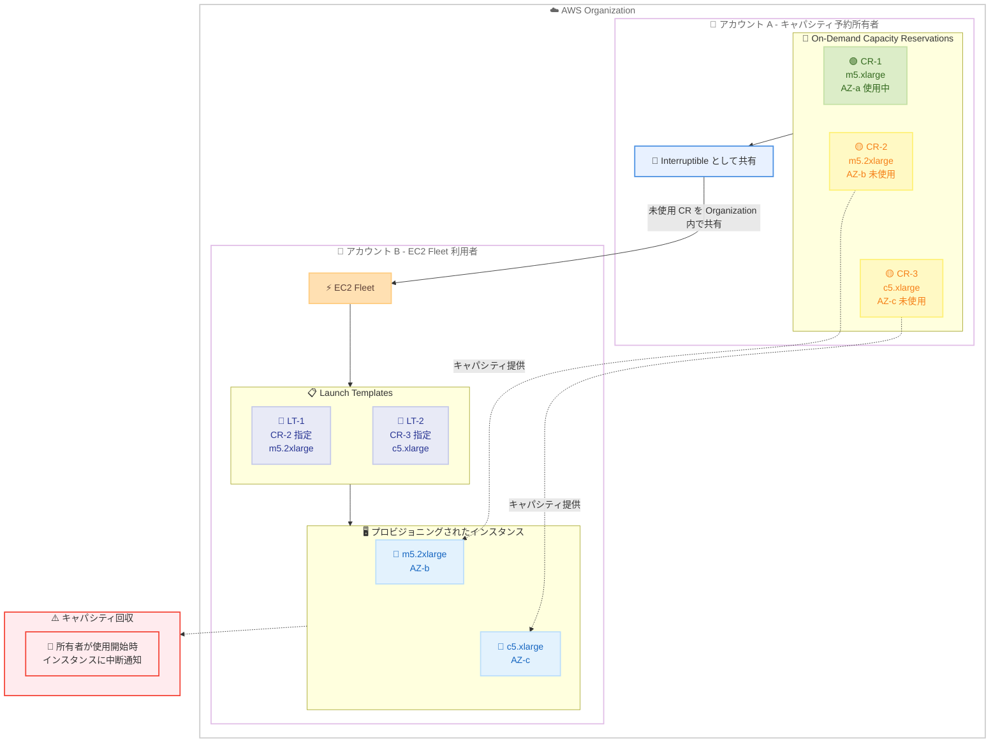

# Amazon EC2 Fleet - Interruptible Capacity Reservations のサポート

**リリース日**: 2026 年 3 月 19 日
**サービス**: Amazon Elastic Compute Cloud (EC2)
**機能**: EC2 Fleet での Interruptible Capacity Reservations サポート

📊 [このアップデートのインフォグラフィックを見る](https://takech9203.github.io/aws-news-summary/20260319-amazon-ec2-fleet-interruptible-capacity-reservations.html)

## 概要

Amazon EC2 Fleet が Interruptible Capacity Reservations をサポートしました。EC2 Fleet は複数のインスタンスタイプやアベイラビリティーゾーン (AZ) にまたがるインスタンスの起動を可能にするサービスです。今回のアップデートにより、Launch Template に Interruptible Capacity Reservation ID を指定し、1 回の EC2 Fleet API コールでインスタンスをプロビジョニングできるようになりました。

Interruptible Capacity Reservations は、オンデマンドキャパシティ予約が使用されていない場合に、AWS Organization 内の他のアカウントに一時的にキャパシティを提供する仕組みです。これにより、未使用のキャパシティ予約の利用率を向上させ、組織全体のコスト最適化を実現できます。

この機能はすべての AWS 商用リージョンで利用可能です。

**アップデート前の課題**

- EC2 Fleet から Interruptible Capacity Reservations を直接利用する手段がなく、未使用のキャパシティ予約を組織内で効率的に共有することが困難だった
- オンデマンドキャパシティ予約が未使用の時間帯に、そのキャパシティが無駄になっていた
- 組織内の複数アカウント間でキャパシティ予約を活用するために、個別のインスタンス起動が必要で運用が複雑だった

**アップデート後の改善**

- EC2 Fleet の Launch Template に Interruptible Capacity Reservation ID を指定するだけで、未使用のキャパシティ予約を活用できるようになった
- 1 回の EC2 Fleet API コールで複数のインスタンスタイプと AZ にまたがるプロビジョニングが可能になった
- AWS Organization 内で未使用のキャパシティ予約を自動的に共有し、利用率とコスト効率が向上した

## アーキテクチャ図



AWS Organization 内でのキャパシティ予約の共有と EC2 Fleet による活用の流れを示しています。アカウント A が所有する未使用のキャパシティ予約を Interruptible として Organization 内で共有し、アカウント B の EC2 Fleet がそのキャパシティを活用してインスタンスをプロビジョニングします。

## サービスアップデートの詳細

### 主要機能

1. **EC2 Fleet での Interruptible Capacity Reservation 指定**
   - Launch Template に Interruptible Capacity Reservation ID を指定可能
   - 複数の Launch Template にそれぞれ異なる Capacity Reservation を指定できる
   - 1 回の EC2 Fleet API コールで複数のインスタンスタイプと AZ にまたがるプロビジョニングが可能

2. **Organization 内でのキャパシティ共有**
   - 未使用のオンデマンドキャパシティ予約を Interruptible として AWS Organization 内に公開
   - 所有者アカウント以外のアカウントが一時的にキャパシティを利用可能
   - 所有者がキャパシティを必要とした場合、Interruptible インスタンスに中断通知が送信される

3. **コスト最適化と利用率向上**
   - 未使用のキャパシティ予約を組織内で活用し、投資対効果を最大化
   - スポットインスタンスに似た中断モデルだが、Organization 内の予約キャパシティを活用する点が異なる
   - キャパシティ予約の料金は所有者が引き続き負担し、利用者は使用分のインスタンス料金を支払う

## 技術仕様

### Interruptible Capacity Reservations の仕様

| 項目 | 詳細 |
|------|------|
| 対象サービス | Amazon EC2 Fleet |
| 共有範囲 | AWS Organization 内 |
| 中断通知 | 所有者がキャパシティを使用開始した場合に通知 |
| Launch Template 指定 | Capacity Reservation ID を Launch Template で指定 |
| 対応リージョン | すべての AWS 商用リージョン |
| API コール | 1 回の EC2 Fleet API コールで複数の Capacity Reservation を指定可能 |

### API 変更履歴

関連する API 変更は確認されていません。既存の EC2 Fleet API (`CreateFleet`) および Launch Template API の Capacity Reservation 指定パラメータを使用します。

### IAM ポリシー例

```json
{
    "Version": "2012-10-17",
    "Statement": [
        {
            "Effect": "Allow",
            "Action": [
                "ec2:CreateFleet",
                "ec2:CreateLaunchTemplate",
                "ec2:DescribeCapacityReservations",
                "ec2:RunInstances"
            ],
            "Resource": "*"
        }
    ]
}
```

## 設定方法

### 前提条件

1. AWS Organization が設定されており、キャパシティ予約の共有が有効化されていること
2. キャパシティ予約所有者がオンデマンドキャパシティ予約を Interruptible として設定していること
3. EC2 Fleet を利用するアカウントが同じ Organization に属していること

### 手順

#### ステップ 1: Interruptible Capacity Reservation の確認

```bash
# 利用可能な Interruptible Capacity Reservations を確認
aws ec2 describe-capacity-reservations \
    --filters "Name=state,Values=active" \
    --query "CapacityReservations[?OwnerType=='organization']"
```

Organization 内で共有されている利用可能な Interruptible Capacity Reservations の一覧を表示します。

#### ステップ 2: Launch Template の作成

```bash
# Interruptible Capacity Reservation を指定した Launch Template を作成
aws ec2 create-launch-template \
    --launch-template-name "fleet-with-interruptible-cr" \
    --launch-template-data '{
        "InstanceType": "m5.2xlarge",
        "ImageId": "ami-0abcdef1234567890",
        "CapacityReservationSpecification": {
            "CapacityReservationTarget": {
                "CapacityReservationId": "cr-0123456789abcdef0"
            }
        }
    }'
```

Interruptible Capacity Reservation ID を指定した Launch Template を作成します。

#### ステップ 3: EC2 Fleet の作成

```bash
# EC2 Fleet を作成して Interruptible Capacity Reservation を活用
aws ec2 create-fleet \
    --type "instant" \
    --launch-template-configs '[
        {
            "LaunchTemplateSpecification": {
                "LaunchTemplateName": "fleet-with-interruptible-cr",
                "Version": "$Latest"
            },
            "Overrides": [
                {
                    "InstanceType": "m5.2xlarge",
                    "AvailabilityZone": "us-east-1b"
                }
            ]
        }
    ]' \
    --target-capacity-specification '{
        "TotalTargetCapacity": 2,
        "DefaultTargetCapacityType": "on-demand"
    }'
```

EC2 Fleet を作成し、Launch Template で指定された Interruptible Capacity Reservation のキャパシティを使用してインスタンスをプロビジョニングします。

## メリット

### ビジネス面

- **コスト最適化**: 未使用のキャパシティ予約を組織内で共有することで、キャパシティ予約への投資対効果を最大化
- **リソース利用率の向上**: アイドル状態のキャパシティ予約を有効活用し、組織全体のリソース効率を改善
- **運用の簡素化**: 1 回の EC2 Fleet API コールで複数のインスタンスタイプと AZ にまたがるプロビジョニングが完了

### 技術面

- **柔軟なキャパシティ管理**: 複数の Launch Template で異なる Interruptible Capacity Reservations を指定し、多様なワークロードに対応
- **スケーラビリティ**: EC2 Fleet の既存機能を活用し、大規模なインスタンスプロビジョニングを効率化
- **Organization レベルの統合**: AWS Organizations との統合により、マルチアカウント環境でのキャパシティ管理が容易

## デメリット・制約事項

### 制限事項

- Interruptible インスタンスは所有者がキャパシティを使用する際に中断される可能性がある
- AWS Organization 内でのみ共有可能で、Organization 外のアカウントとは共有できない
- キャパシティ予約の料金は引き続き所有者アカウントに発生する

### 考慮すべき点

- 中断に対するアプリケーションの耐性を事前に検証する必要がある
- スポットインスタンスと同様に、中断に備えた適切なワークロード設計が重要
- キャパシティ予約所有者と利用者間でキャパシティ使用スケジュールの調整を検討すべき
- 中断通知からインスタンス停止までの猶予期間を考慮したアプリケーション設計が必要

## ユースケース

### ユースケース 1: 開発・テスト環境での活用

**シナリオ**: 本番環境用のキャパシティ予約がピーク時間以外に未使用となっている場合、開発・テスト用アカウントが EC2 Fleet を使用してそのキャパシティを活用する。

**実装例**:
```bash
# 開発アカウントから EC2 Fleet を作成
aws ec2 create-fleet \
    --type "instant" \
    --launch-template-configs '[
        {
            "LaunchTemplateSpecification": {
                "LaunchTemplateName": "dev-test-interruptible",
                "Version": "$Latest"
            },
            "Overrides": [
                {"InstanceType": "m5.xlarge", "AvailabilityZone": "us-east-1a"},
                {"InstanceType": "m5.2xlarge", "AvailabilityZone": "us-east-1b"}
            ]
        }
    ]' \
    --target-capacity-specification '{
        "TotalTargetCapacity": 5,
        "DefaultTargetCapacityType": "on-demand"
    }'
```

**効果**: 本番用キャパシティ予約の未使用時間を活用し、開発・テスト環境のコストを削減。

### ユースケース 2: バッチ処理ワークロード

**シナリオ**: 夜間や週末に未使用となるキャパシティ予約を、バッチ処理やデータ分析ワークロードに活用する。

**実装例**:
```bash
# バッチ処理用の EC2 Fleet を作成
aws ec2 create-fleet \
    --type "instant" \
    --launch-template-configs '[
        {
            "LaunchTemplateSpecification": {
                "LaunchTemplateName": "batch-interruptible-cr",
                "Version": "$Latest"
            },
            "Overrides": [
                {"InstanceType": "c5.2xlarge", "AvailabilityZone": "us-west-2a"},
                {"InstanceType": "c5.4xlarge", "AvailabilityZone": "us-west-2b"}
            ]
        }
    ]' \
    --target-capacity-specification '{
        "TotalTargetCapacity": 10,
        "DefaultTargetCapacityType": "on-demand"
    }'
```

**効果**: 夜間や週末の未使用キャパシティを活用し、バッチ処理のコスト効率を向上。中断が発生してもチェックポイントから再開可能な設計とする。

### ユースケース 3: マルチアカウント環境でのキャパシティ最適化

**シナリオ**: 大規模な Organization で複数の事業部門がそれぞれキャパシティ予約を保有しており、部門間で未使用キャパシティを相互に活用する。

**実装例**:
```bash
# 複数の Interruptible CR を指定した EC2 Fleet
aws ec2 create-fleet \
    --type "instant" \
    --launch-template-configs '[
        {
            "LaunchTemplateSpecification": {
                "LaunchTemplateName": "dept-a-cr-template",
                "Version": "$Latest"
            },
            "Overrides": [
                {"InstanceType": "m5.xlarge", "AvailabilityZone": "ap-northeast-1a"}
            ]
        },
        {
            "LaunchTemplateSpecification": {
                "LaunchTemplateName": "dept-b-cr-template",
                "Version": "$Latest"
            },
            "Overrides": [
                {"InstanceType": "r5.xlarge", "AvailabilityZone": "ap-northeast-1c"}
            ]
        }
    ]' \
    --target-capacity-specification '{
        "TotalTargetCapacity": 4,
        "DefaultTargetCapacityType": "on-demand"
    }'
```

**効果**: 部門間の未使用キャパシティを相互活用し、Organization 全体のキャパシティ利用率を最大化。

## 料金

Interruptible Capacity Reservations の利用自体に追加料金はかかりません。料金構造は以下の通りです。

### 料金例

| 項目 | 詳細 |
|------|------|
| キャパシティ予約料金 | 所有者アカウントが予約の全期間に対して支払い (使用の有無に関わらず) |
| Interruptible インスタンス料金 | 利用者アカウントがインスタンス使用時間に応じてオンデマンド料金を支払い |
| EC2 Fleet 利用料金 | EC2 Fleet の利用自体に追加料金は発生しない |

詳細な料金情報は [Amazon EC2 料金ページ](https://aws.amazon.com/ec2/pricing/) を参照してください。

## 利用可能リージョン

この機能はすべての AWS 商用リージョンで利用可能です。

## 関連サービス・機能

- **Amazon EC2 Capacity Reservations**: オンデマンドキャパシティを特定の AZ に予約するサービス
- **AWS Organizations**: マルチアカウント環境の管理とキャパシティ予約の共有に使用
- **Amazon EC2 Auto Scaling**: EC2 Fleet と連携したスケーリング管理
- **AWS Resource Access Manager (RAM)**: Organization 内でのリソース共有を管理

## 参考リンク

- 📊 [インフォグラフィック](https://takech9203.github.io/aws-news-summary/20260319-amazon-ec2-fleet-interruptible-capacity-reservations.html)
- [公式発表 (What's New)](https://aws.amazon.com/about-aws/whats-new/2026/03/amazon-ec2-fleet-interruptible-capacity-reservations/)
- [ドキュメント: Amazon EC2 Fleet](https://docs.aws.amazon.com/AWSEC2/latest/UserGuide/ec2-fleet.html)
- [ドキュメント: Capacity Reservations](https://docs.aws.amazon.com/AWSEC2/latest/UserGuide/ec2-capacity-reservations.html)
- [Amazon EC2 料金ページ](https://aws.amazon.com/ec2/pricing/)

## まとめ

Amazon EC2 Fleet が Interruptible Capacity Reservations をサポートしたことで、AWS Organization 内で未使用のオンデマンドキャパシティ予約を効率的に共有・活用できるようになりました。1 回の EC2 Fleet API コールで複数のインスタンスタイプと AZ にまたがるプロビジョニングが可能になり、運用の簡素化とコスト最適化を同時に実現します。キャパシティ予約を保有する組織では、この機能を活用して未使用キャパシティの利用率を向上させ、投資対効果を最大化することを推奨します。
