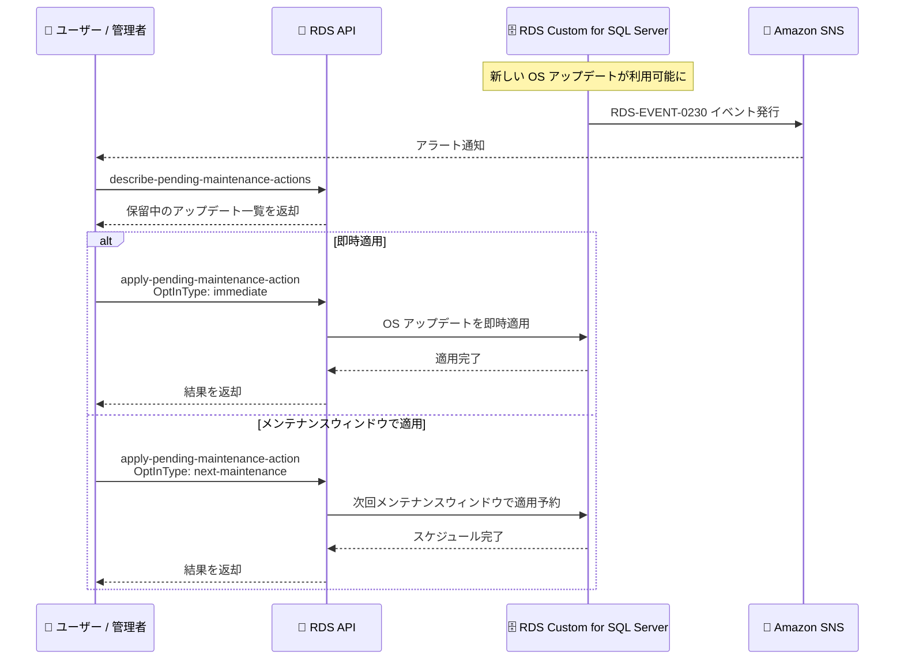

# Amazon RDS Custom for SQL Server - OS アップデートの表示とスケジュール機能

**リリース日**: 2026年3月19日
**サービス**: Amazon RDS Custom for SQL Server
**機能**: RDS 提供エンジンバージョン (RPEV) の OS アップデート表示・スケジュール機能

[このアップデートのインフォグラフィックを見る](https://takech9203.github.io/aws-news-summary/20260319-amazon-rds-custom-sql-server-operating-system-updates.html)

## 概要

Amazon RDS Custom for SQL Server に、RDS 提供エンジンバージョン (RPEV: RDS Provided Engine Versions) に対する新しい OS アップデートを表示およびスケジュールする機能が追加されました。これにより、ユーザーは保留中の OS アップデートを事前に確認し、適用タイミングを柔軟にコントロールできるようになります。

具体的には、`describe-pending-maintenance-actions` API を使用して保留中のアップデートを確認し、`RDS-EVENT-0230` イベントを購読してアラート通知を受け取り、`apply-pending-maintenance-action` API を使用してアップデートを即座に適用するか次回のメンテナンスウィンドウでスケジュールすることが可能です。

このアップデートは、RDS Custom for SQL Server で RPEV を使用しているすべてのユーザーにとって、OS パッチ管理の可視性と制御性を大幅に向上させる重要な機能強化です。

**アップデート前の課題**

- RDS Custom for SQL Server の RPEV に対する OS アップデートの状況を事前に把握する標準的な方法が限られていた
- OS アップデートの適用タイミングを柔軟にコントロールすることが困難だった
- 保留中のメンテナンスアクションに関するプロアクティブな通知を受け取る仕組みが不十分だった

**アップデート後の改善**

- API を通じて保留中の OS アップデートを事前に確認できるようになった
- イベント通知により、新しい OS アップデートが利用可能になった際にアラートを受け取れるようになった
- アップデートの即時適用またはメンテナンスウィンドウでのスケジュール適用を選択できるようになった

## アーキテクチャ図



この図は、OS アップデートが利用可能になった際のイベント通知フロー、保留中アクションの確認、および即時適用またはメンテナンスウィンドウでのスケジュール適用の流れを示しています。

## サービスアップデートの詳細

### 主要機能

1. **保留中の OS アップデートの表示**
   - `describe-pending-maintenance-actions` API を使用して、RPEV に対する保留中の OS アップデートを一覧表示可能
   - アップデートの種類、適用期限、影響範囲などの詳細情報を取得可能
   - AWS CLI またはマネジメントコンソールからも確認可能

2. **イベント通知によるアラート**
   - `RDS-EVENT-0230` イベントを Amazon SNS トピックにサブスクライブして通知を受信
   - 新しい OS アップデートが利用可能になった際にプロアクティブにアラートを受け取れる
   - 既存の RDS イベント通知の仕組みと統合されている

3. **柔軟なアップデート適用スケジュール**
   - `apply-pending-maintenance-action` API を使用してアップデートの適用タイミングを制御
   - 即時適用 (immediate) または次回メンテナンスウィンドウでの適用 (next-maintenance) を選択可能
   - ビジネス要件に合わせたダウンタイムの最小化が可能

## 技術仕様

### API 一覧

| API | 用途 | 説明 |
|------|------|------|
| `describe-pending-maintenance-actions` | アップデート確認 | 保留中の OS メンテナンスアクションを一覧表示 |
| `apply-pending-maintenance-action` | アップデート適用 | 保留中のメンテナンスアクションを適用またはスケジュール |

### イベント通知

| イベント ID | 説明 |
|------|------|
| `RDS-EVENT-0230` | 新しい OS アップデートが利用可能になった際に発行されるイベント |

### 対象

| 項目 | 詳細 |
|------|------|
| 対象サービス | Amazon RDS Custom for SQL Server |
| 対象バージョン | RDS 提供エンジンバージョン (RPEV) |
| 適用タイプ | OS アップデート |

## 設定方法

### 前提条件

1. Amazon RDS Custom for SQL Server の DB インスタンスが稼働中であること
2. RPEV (RDS 提供エンジンバージョン) を使用していること
3. 適切な IAM 権限 (`rds:DescribePendingMaintenanceActions`、`rds:ApplyPendingMaintenanceAction`) が付与されていること

### 手順

#### ステップ 1: イベント通知の設定

```bash
aws rds create-event-subscription \
  --subscription-name os-update-alerts \
  --sns-topic-arn arn:aws:sns:us-east-1:123456789012:rds-os-updates \
  --source-type db-instance \
  --event-categories "maintenance"
```

RDS のメンテナンスイベントを SNS トピックにサブスクライブし、`RDS-EVENT-0230` を含むメンテナンス関連のイベント通知を有効化します。

#### ステップ 2: 保留中のアップデートを確認

```bash
aws rds describe-pending-maintenance-actions \
  --resource-identifier arn:aws:rds:us-east-1:123456789012:db:my-rds-custom-instance
```

指定した RDS Custom for SQL Server インスタンスに対する保留中の OS アップデートの一覧を取得します。アップデートの内容、適用期限、推奨適用日などの情報が返却されます。

#### ステップ 3: アップデートの適用

```bash
# 即時適用する場合
aws rds apply-pending-maintenance-action \
  --resource-identifier arn:aws:rds:us-east-1:123456789012:db:my-rds-custom-instance \
  --apply-action system-update \
  --opt-in-type immediate
```

保留中の OS アップデートを即座に適用します。`--opt-in-type` を `next-maintenance` に変更すると、次回のメンテナンスウィンドウで自動適用されるようにスケジュールできます。

```bash
# 次回メンテナンスウィンドウでスケジュールする場合
aws rds apply-pending-maintenance-action \
  --resource-identifier arn:aws:rds:us-east-1:123456789012:db:my-rds-custom-instance \
  --apply-action system-update \
  --opt-in-type next-maintenance
```

次回のメンテナンスウィンドウで OS アップデートが自動的に適用されるようにスケジュールします。

## メリット

### ビジネス面

- **計画的なメンテナンス**: OS アップデートのスケジュールを事前に把握し、ビジネスへの影響を最小化した計画的なメンテナンスが可能
- **ダウンタイムの制御**: アップデート適用タイミングを柔軟に選択できるため、業務時間外やトラフィックの少ない時間帯に適用可能
- **コンプライアンス対応**: OS パッチの適用状況を可視化することで、セキュリティコンプライアンス要件への対応が容易に

### 技術面

- **API による自動化**: API を通じたアップデート管理により、既存の運用自動化パイプラインとの統合が可能
- **プロアクティブな監視**: イベント通知により、手動での確認作業を削減し、アップデート適用漏れを防止
- **標準的な RDS ワークフローとの統合**: 既存の RDS メンテナンスウィンドウの仕組みを活用するため、追加の学習コストが低い

## デメリット・制約事項

### 制限事項

- 本機能は RPEV (RDS 提供エンジンバージョン) を使用している場合のみ利用可能であり、カスタム AMI を使用している場合は OS パッチの管理をユーザー自身で行う必要がある
- OS アップデートの適用にはインスタンスの再起動が伴う場合があり、一時的なダウンタイムが発生する可能性がある
- アップデートの適用期限が設定されている場合、期限を過ぎると自動的に適用される場合がある

### 考慮すべき点

- OS アップデート適用前にデータベースのバックアップを取得し、ロールバック計画を準備することを推奨
- マルチ AZ 構成の場合、フェイルオーバーの動作を事前に確認しておくことが望ましい
- 本番環境への適用前に、テスト環境でアップデートの影響を検証することを推奨

## ユースケース

### ユースケース 1: セキュリティパッチの計画的適用

**シナリオ**: 金融機関が RDS Custom for SQL Server を使用しており、セキュリティコンプライアンスの要件として OS パッチを 30 日以内に適用する必要がある。

**実装例**:
```bash
# 保留中のアップデートを定期的に確認するスクリプト
aws rds describe-pending-maintenance-actions \
  --filters "Name=db-instance-id,Values=my-rds-custom-instance" \
  --query "PendingMaintenanceActions[].PendingMaintenanceActionDetails[]"

# コンプライアンス期限内のメンテナンスウィンドウで適用をスケジュール
aws rds apply-pending-maintenance-action \
  --resource-identifier arn:aws:rds:us-east-1:123456789012:db:my-rds-custom-instance \
  --apply-action system-update \
  --opt-in-type next-maintenance
```

**効果**: OS パッチの適用状況を可視化し、コンプライアンス期限内に計画的にパッチを適用できる

### ユースケース 2: 自動化された運用パイプラインとの統合

**シナリオ**: DevOps チームが複数の RDS Custom for SQL Server インスタンスを管理しており、OS アップデートの検知から適用までを自動化したい。

**実装例**:
```bash
# EventBridge ルールで RDS-EVENT-0230 を検知し Lambda を起動
# Lambda 関数内で以下を実行

# 全インスタンスの保留中アクションを取得
aws rds describe-pending-maintenance-actions \
  --query "PendingMaintenanceActions[*].[ResourceIdentifier,PendingMaintenanceActionDetails[*].Action]"

# テスト環境に即時適用
aws rds apply-pending-maintenance-action \
  --resource-identifier arn:aws:rds:us-east-1:123456789012:db:test-instance \
  --apply-action system-update \
  --opt-in-type immediate

# 本番環境は次回メンテナンスウィンドウで適用
aws rds apply-pending-maintenance-action \
  --resource-identifier arn:aws:rds:us-east-1:123456789012:db:prod-instance \
  --apply-action system-update \
  --opt-in-type next-maintenance
```

**効果**: テスト環境で先行適用して検証した後、本番環境への適用をスケジュールすることで、安全かつ効率的な運用が実現できる

### ユースケース 3: マルチリージョン環境でのローリングアップデート

**シナリオ**: グローバル展開している企業が複数リージョンの RDS Custom for SQL Server インスタンスに対して、段階的に OS アップデートを適用したい。

**実装例**:
```bash
# リージョンごとに保留中のアップデートを確認
for region in us-east-1 eu-west-1 ap-northeast-1; do
  echo "=== $region ==="
  aws rds describe-pending-maintenance-actions \
    --region $region \
    --query "PendingMaintenanceActions[].{Instance:ResourceIdentifier,Actions:PendingMaintenanceActionDetails[].Action}"
done

# DR リージョンから先に適用し、プライマリリージョンは最後に適用
aws rds apply-pending-maintenance-action \
  --region eu-west-1 \
  --resource-identifier arn:aws:rds:eu-west-1:123456789012:db:dr-instance \
  --apply-action system-update \
  --opt-in-type immediate
```

**効果**: リージョンごとに段階的にアップデートを適用することで、グローバルサービスの可用性を維持しながら OS パッチ管理が行える

## 料金

RDS Custom for SQL Server の OS アップデート管理機能自体に追加料金は発生しません。通常の RDS Custom for SQL Server インスタンスの料金が適用されます。イベント通知に Amazon SNS を使用する場合は、SNS の標準料金が適用されます。

### 料金例

| 項目 | 料金 |
|--------|------------------|
| OS アップデート管理機能 | 追加料金なし |
| Amazon SNS 通知 | SNS 標準料金 |
| RDS Custom for SQL Server | インスタンスタイプに応じた標準料金 |

※ 正確な料金は [Amazon RDS 料金ページ](https://aws.amazon.com/rds/pricing/) を参照してください。

## 利用可能リージョン

Amazon RDS Custom for SQL Server が利用可能なすべてのリージョンで利用できます。

## 関連サービス・機能

- **Amazon RDS Custom for SQL Server**: SQL Server のカスタマイズが必要なワークロード向けに、OS およびデータベースへの管理者アクセスを提供する RDS のマネージドサービス
- **Amazon RDS メンテナンスウィンドウ**: RDS インスタンスに対するメンテナンスアクションの適用タイミングを制御する機能
- **Amazon EventBridge**: RDS イベントをトリガーとして自動化ワークフローを構築するためのサーバーレスイベントバスサービス
- **Amazon SNS**: RDS イベント通知を配信するためのメッセージングサービス

## 参考リンク

- [インフォグラフィック](https://takech9203.github.io/aws-news-summary/20260319-amazon-rds-custom-sql-server-operating-system-updates.html)
- [公式発表 (What's New)](https://aws.amazon.com/about-aws/whats-new/2026/03/amazon-rds-custom-sql-server-operating-system-updates/)
- [Amazon RDS Custom for SQL Server ドキュメント](https://docs.aws.amazon.com/AmazonRDS/latest/UserGuide/rds-custom-sqlserver.html)
- [RDS メンテナンスに関するドキュメント](https://docs.aws.amazon.com/AmazonRDS/latest/UserGuide/USER_UpgradeDBInstance.Maintenance.html)
- [Amazon RDS 料金ページ](https://aws.amazon.com/rds/pricing/)

## まとめ

Amazon RDS Custom for SQL Server に OS アップデートの表示およびスケジュール機能が追加されたことで、RPEV を使用しているユーザーは OS パッチ管理の可視性と制御性が大幅に向上しました。`describe-pending-maintenance-actions` API による事前確認、`RDS-EVENT-0230` によるプロアクティブな通知、`apply-pending-maintenance-action` API による柔軟な適用スケジュールを活用して、セキュリティとビジネス継続性を両立した運用を構築することを推奨します。
