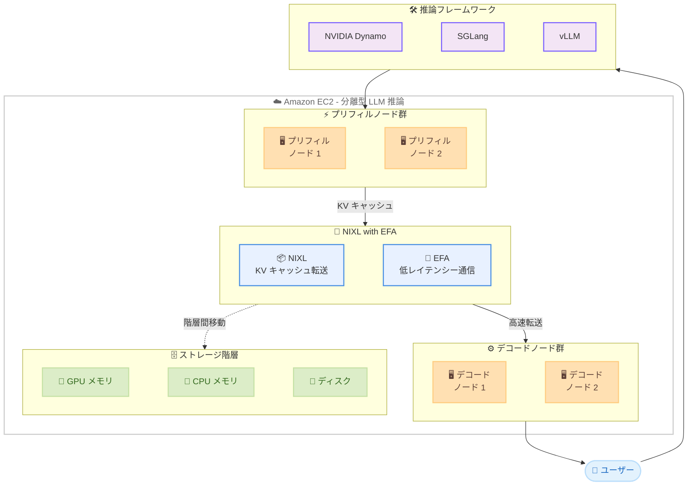

# Amazon EC2 - NIXL with EFA による LLM 推論の高速化

**リリース日**: 2026年3月19日
**サービス**: Amazon EC2 (Elastic Fabric Adapter)
**機能**: NVIDIA Inference Xfer Library (NIXL) と EFA の統合サポート

[このアップデートのインフォグラフィックを見る](https://takech9203.github.io/aws-news-summary/20260319-aws-support-nixl-with-efa.html)

## 概要

AWS は、NVIDIA Inference Xfer Library (NIXL) と Elastic Fabric Adapter (EFA) の統合サポートを発表しました。この統合により、Amazon EC2 上での分離型 (disaggregated) 大規模言語モデル (LLM) 推論が大幅に高速化されます。NIXL は NVIDIA が開発した推論用データ転送ライブラリであり、EFA は AWS が提供する低レイテンシーネットワークアダプターです。

分離型推論アーキテクチャでは、LLM の推論処理をプリフィル (prefill) フェーズとデコード (decode) フェーズに分離し、それぞれを専用のノードで実行します。NIXL with EFA は、これらのノード間での KV キャッシュ転送を高スループット・低レイテンシーで実現し、トークン間レイテンシーの削減と KV キャッシュメモリ使用率の最適化を可能にします。

このアップデートは、大規模な LLM 推論ワークロードを運用するユーザーを対象としており、NVIDIA Dynamo、SGLang、vLLM などの推論フレームワークとシームレスに統合できます。

**アップデート前の課題**

- 分離型推論において、プリフィルノードとデコードノード間の KV キャッシュ転送がボトルネックとなり、推論レイテンシーが増大していた
- KV キャッシュのストレージ階層間移動が効率的でなく、メモリ使用率の最適化が困難だった
- 高スループットな KV キャッシュ転送を実現するために、カスタムの通信ライブラリや複雑なネットワーク設定が必要だった

**アップデート後の改善**

- NIXL with EFA により、プリフィルノードとデコードノード間の KV キャッシュ転送が高スループット・低レイテンシーで実行可能になった
- ストレージ階層間の KV キャッシュ移動が効率化され、メモリ使用率が最適化された
- NVIDIA Dynamo、SGLang、vLLM との統合により、既存の推論フレームワーク上で追加コストなく利用可能になった

## アーキテクチャ図



この図は、分離型 LLM 推論における NIXL with EFA のアーキテクチャを示しています。プリフィルノードで生成された KV キャッシュが NIXL と EFA を通じてデコードノードへ高速転送され、ストレージ階層間の効率的な KV キャッシュ移動も実現されます。

## サービスアップデートの詳細

### 主要機能

1. **高スループット KV キャッシュ転送**
   - プリフィルノードとデコードノード間で KV キャッシュを高速に転送
   - EFA の低レイテンシーネットワーク機能を活用し、ノード間通信のボトルネックを解消
   - KV キャッシュスループットの向上により、分離型推論全体のパフォーマンスが改善

2. **KV キャッシュメモリ最適化**
   - GPU メモリ、CPU メモリ、ディスク間での効率的な KV キャッシュ移動をサポート
   - ストレージ階層間の自動的なデータ移動により、メモリ使用率を最適化
   - より多くのリクエストを同時に処理することが可能

3. **推論フレームワーク統合**
   - NVIDIA Dynamo とのネイティブ統合により、高度な推論オーケストレーションが可能
   - SGLang および vLLM との互換性により、既存のワークロードからの移行が容易
   - すべての EFA 対応 EC2 インスタンスタイプで利用可能

## 技術仕様

### 要件とバージョン

| 項目 | 詳細 |
|------|------|
| NIXL バージョン | 1.0.0 以上 |
| EFA インストーラー | 1.47.0 以上 |
| 対応インスタンス | すべての EFA 対応 EC2 インスタンスタイプ |
| 追加料金 | なし |

### NIXL と EFA の役割

| コンポーネント | 役割 |
|------|------|
| NIXL | KV キャッシュの転送プロトコルとデータ管理を担当。推論エンジンとネットワーク層の間の抽象化レイヤーとして機能 |
| EFA | OS バイパスによる低レイテンシー・高スループットのノード間通信を提供。RDMA ライクなアクセスにより CPU オーバーヘッドを最小化 |

### 対応推論フレームワーク

| フレームワーク | 統合方式 |
|------|------|
| NVIDIA Dynamo | ネイティブ統合。推論パイプラインのオーケストレーションとスケジューリングを提供 |
| SGLang | NIXL バックエンドとして EFA を利用。SGLang の分離型推論機能と連携 |
| vLLM | NIXL バックエンドとして EFA を利用。vLLM の分散推論機能と連携 |

## 設定方法

### 前提条件

1. EFA 対応の EC2 インスタンスタイプが利用可能であること (例: p5.48xlarge、p4d.24xlarge、trn1.32xlarge 等)
2. EFA インストーラー 1.47.0 以上がインストールされていること
3. NVIDIA ドライバーおよび CUDA ツールキットが適切にインストールされていること

### 手順

#### ステップ 1: EFA インストーラーのセットアップ

```bash
# EFA インストーラーのダウンロードとインストール
curl -O https://efa-installer.amazonaws.com/aws-efa-installer-1.47.0.tar.gz
tar -xf aws-efa-installer-1.47.0.tar.gz
cd aws-efa-installer
sudo ./efa_installer.sh -y
```

EFA インストーラー 1.47.0 以上をインストールし、EFA ドライバーとライブラリを EC2 インスタンスにセットアップします。

#### ステップ 2: NIXL のインストール

```bash
# NIXL 1.0.0 以上のインストール
pip install nixl>=1.0.0
```

NIXL ライブラリをインストールします。NIXL は NVIDIA が提供する推論用データ転送ライブラリで、EFA との統合が組み込まれています。

#### ステップ 3: 推論フレームワークでの設定

vLLM を使用する場合の設定例です。

```bash
# vLLM で分離型推論を NIXL with EFA で実行
vllm serve meta-llama/Llama-3-70b \
  --tensor-parallel-size 8 \
  --enable-disaggregated-prefill \
  --kv-transfer-backend nixl
```

推論フレームワーク側で分離型推論を有効化し、KV キャッシュ転送バックエンドとして NIXL を指定します。EFA は NIXL によって自動的に検出・利用されます。

## メリット

### ビジネス面

- **推論コストの削減**: 分離型推論によりプリフィルとデコードを独立してスケーリングでき、リソース利用効率が向上する
- **サービス品質の向上**: トークン間レイテンシーの削減により、エンドユーザーの体験が改善される
- **追加コスト不要**: NIXL with EFA は既存の EFA 対応インスタンスで追加料金なしに利用可能

### 技術面

- **高スループット転送**: EFA の OS バイパス技術により、KV キャッシュの転送スループットが大幅に向上
- **メモリ効率の向上**: ストレージ階層間の効率的な KV キャッシュ管理により、GPU メモリの有効活用が可能
- **フレームワーク互換性**: NVIDIA Dynamo、SGLang、vLLM との統合により、既存のワークロードに容易に導入可能

## デメリット・制約事項

### 制限事項

- EFA 対応の EC2 インスタンスタイプでのみ利用可能であり、EFA 非対応のインスタンスでは使用できない
- NIXL 1.0.0 以上および EFA インストーラー 1.47.0 以上のバージョン要件があり、既存環境のアップデートが必要な場合がある
- 分離型推論アーキテクチャ自体の設計・運用知識が必要であり、導入には一定の学習コストが伴う

### 考慮すべき点

- 分離型推論は大規模な LLM ワークロード向けの最適化であり、小規模な推論ワークロードでは効果が限定的な場合がある
- プリフィルノードとデコードノードの適切な比率やインスタンスタイプの選定には、ワークロードに応じたベンチマークとチューニングが必要
- 推論フレームワーク (Dynamo、SGLang、vLLM) のバージョンによっては NIXL with EFA のサポート状況が異なる場合がある

## ユースケース

### ユースケース 1: 大規模チャットボットサービスの推論最適化

**シナリオ**: 数百万ユーザーが利用するチャットボットサービスにおいて、長いコンテキストウィンドウを持つ LLM の推論レイテンシーを改善したい場合。プリフィルとデコードの処理負荷が異なるため、それぞれを独立してスケーリングしたい。

**実装例**:
```bash
# プリフィルノード (GPU 集約型インスタンス)
vllm serve meta-llama/Llama-3-70b \
  --tensor-parallel-size 8 \
  --role prefill \
  --kv-transfer-backend nixl

# デコードノード (メモリ最適化インスタンス)
vllm serve meta-llama/Llama-3-70b \
  --tensor-parallel-size 8 \
  --role decode \
  --kv-transfer-backend nixl
```

**効果**: プリフィルとデコードを分離してスケーリングすることで、リソース利用効率が向上し、トークン間レイテンシーが大幅に削減される

### ユースケース 2: RAG パイプラインにおける長文コンテキスト推論

**シナリオ**: RAG (Retrieval-Augmented Generation) パイプラインで、大量のドキュメントをコンテキストとして LLM に入力する場合。プリフィル処理に大きな計算リソースが必要となり、デコード処理とのリソースバランスが課題となっている。

**実装例**:
```python
# SGLang で NIXL with EFA を利用した分離型推論
import sglang as sgl

runtime = sgl.Runtime(
    model_path="meta-llama/Llama-3-70b",
    tp_size=8,
    disaggregated_prefill=True,
    kv_transfer_backend="nixl"
)
```

**効果**: 長いコンテキストのプリフィル処理を専用ノードで高速に実行し、KV キャッシュを NIXL with EFA 経由でデコードノードに転送することで、エンドツーエンドのレイテンシーを削減

### ユースケース 3: マルチテナント推論サービスの KV キャッシュ共有

**シナリオ**: 複数のテナントが共通のシステムプロンプトを使用する推論サービスにおいて、プリフィル結果の KV キャッシュを効率的に共有・再利用したい場合。

**実装例**:
```bash
# NVIDIA Dynamo を使用した分離型推論クラスター
dynamo serve \
  --model meta-llama/Llama-3-70b \
  --prefill-nodes 4 \
  --decode-nodes 8 \
  --kv-cache-backend nixl \
  --enable-kv-cache-sharing
```

**効果**: 共通のシステムプロンプトに対する KV キャッシュをストレージ階層に効率的に保存・共有し、重複計算を削減。NIXL with EFA によりキャッシュの読み出しも高速に実行される

## 料金

NIXL with EFA は、すべての EFA 対応 EC2 インスタンスタイプで追加料金なしに利用できます。料金は利用する EC2 インスタンスの通常料金のみが発生します。

### 料金例

| インスタンスタイプ | 主な用途 | オンデマンド料金 (概算) |
|--------|------------------|------------------|
| p5.48xlarge | 大規模 LLM 推論 | EC2 料金ページを参照 |
| p4d.24xlarge | LLM 推論 | EC2 料金ページを参照 |
| trn1.32xlarge | 推論・学習 | EC2 料金ページを参照 |

※ 正確な料金は [Amazon EC2 料金ページ](https://aws.amazon.com/ec2/pricing/) を参照してください。

## 利用可能リージョン

NIXL with EFA は、EFA 対応の EC2 インスタンスタイプが利用可能なすべての AWS リージョンで使用できます。EFA インストーラー 1.47.0 以上をインストールすることで、追加のリージョン制限なく利用可能です。

## 関連サービス・機能

- **Elastic Fabric Adapter (EFA)**: OS バイパスによる低レイテンシー・高スループットのインスタンス間通信を提供する AWS のネットワーク機能
- **Amazon EC2 P5 インスタンス**: NVIDIA H100 GPU を搭載した高性能コンピューティングインスタンス。大規模 LLM 推論に最適
- **Amazon EC2 Trn1 インスタンス**: AWS Trainium チップを搭載した機械学習向けインスタンス。推論と学習の両方に対応
- **NVIDIA Dynamo**: 分離型推論のオーケストレーションとスケジューリングを提供する NVIDIA の推論フレームワーク

## 参考リンク

- [インフォグラフィック](https://takech9203.github.io/aws-news-summary/20260319-aws-support-nixl-with-efa.html)
- [公式発表 (What's New)](https://aws.amazon.com/about-aws/whats-new/2026/03/aws-support-nixl-with-efa/)
- [EFA ドキュメント](https://docs.aws.amazon.com/AWSEC2/latest/UserGuide/efa.html)
- [Amazon EC2 料金ページ](https://aws.amazon.com/ec2/pricing/)

## まとめ

NIXL with EFA のサポートにより、Amazon EC2 上での分離型 LLM 推論が大幅に高速化されます。プリフィルノードとデコードノード間の KV キャッシュ転送がボトルネックとなっていた課題が解消され、トークン間レイテンシーの削減とメモリ使用率の最適化が実現されます。大規模な LLM 推論ワークロードを運用している場合は、EFA インストーラーを 1.47.0 以上にアップデートし、NIXL 1.0.0 以上を導入することで、追加コストなしにパフォーマンスの改善が期待できます。
